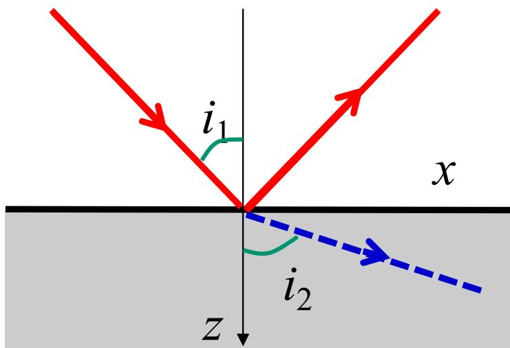

# 3.4.1 隐失波(Evanescent Wave)的产生

### 一、 边界条件对透射场的连续性要求
在发生全反射时，几何光学的折射定律认为没有光线进入第二介质。但是在电磁理论中，由麦克斯韦方程组导出的电磁场边界条件要求：在两种介质的交界面上，电场强度的切向分量必须连续（即 $E_{1t} = E_{2t}$）。
当入射光在第一介质中发生全反射时，界面上的入射场和反射场叠加，形成一个非零的切向电场。为了满足交界面上切向电场连续的条件，交界面的第二介质一侧（即透射侧）必须存在一个非零的电磁场。这个存在于透射侧的场就是隐失波。

### 二、 隐失波的数学推导与物理意义
在全反射条件下，入射角 $i_1$ 大于临界角 $i_c$。此时应用折射定律 $\sin i_2 = \frac{n_1}{n_2} \sin i_1$，可以发现 $\sin i_2 > 1$。
在推导第二介质中折射波的波矢沿 $z$ 轴（垂直界面的方向）分量 $k_{2z}$ 时：
$$ k_{2z} = k_2 \cos i_2 = k_2 \sqrt{1 - \sin^2 i_2} $$
因为 $\sin i_2 > 1$，根号内的数值变为负数。此时 $k_{2z}$ 成为一个纯虚数。我们令 $k_{2z} = i k_{2z}'$，其中 $k_{2z}'$ 为实数：
$$ k_{2z}' = k_2 \sqrt{\left(\frac{n_1}{n_2} \sin i_1\right)^2 - 1} $$

### 三、 隐失波函数表达
将纯虚数 $k_{2z} = i k_{2z}'$ 代入透射波的复振幅表达式，原本在 $z$ 方向传播的相位因子 $e^{i k_{2z} z}$ 变为 $e^{-k_{2z}' z}$，得到透射波的表达式为：
$$ \tilde{E}_2(\vec{r}, t) = \tilde{E}_{20} e^{- k_{2z}' z} e^{i (k_{2x} x - \omega t)} $$

> **结论与特性**：
> 1. **振幅衰减**：公式中的 $e^{- k_{2z}' z}$ 表明，透射波的振幅随着深入第二介质的深度 $z$ 增加，呈指数规律衰减。这说明该场只存在于极其靠近界面的薄层内（通常在几个波长范围内）。
> 2. **传播方向**：公式中的相位项为 $e^{i (k_{2x} x - \omega t)}$，这说明该波的相位仅沿界面的切向（$x$ 轴方向）传播，而在垂直界面方向（$z$ 轴方向）没有相位的传播。
> 这种仅局限在界面表层且沿界面方向传播的波，称为**隐失波（Evanescent Wave）**或**表面波**。