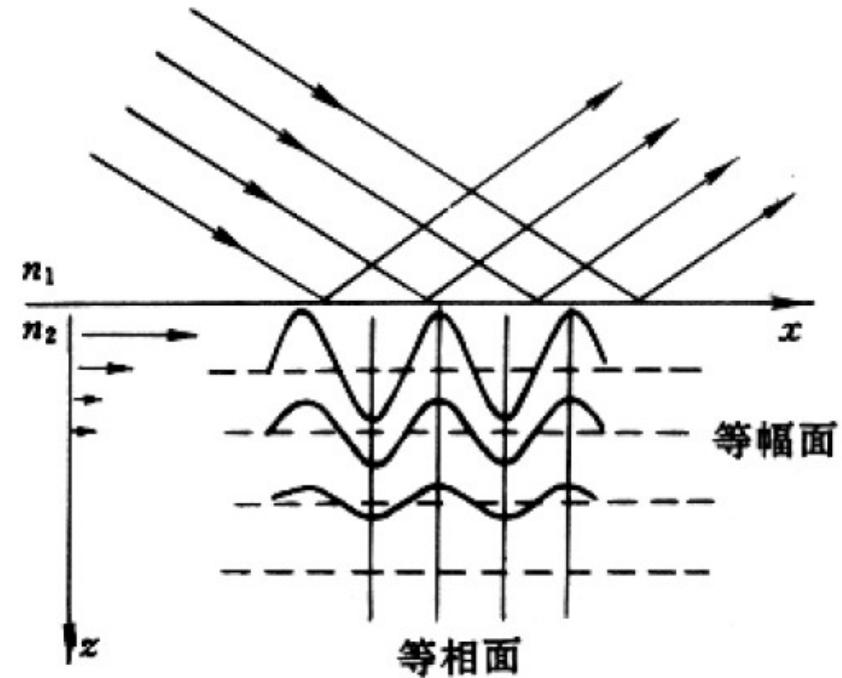
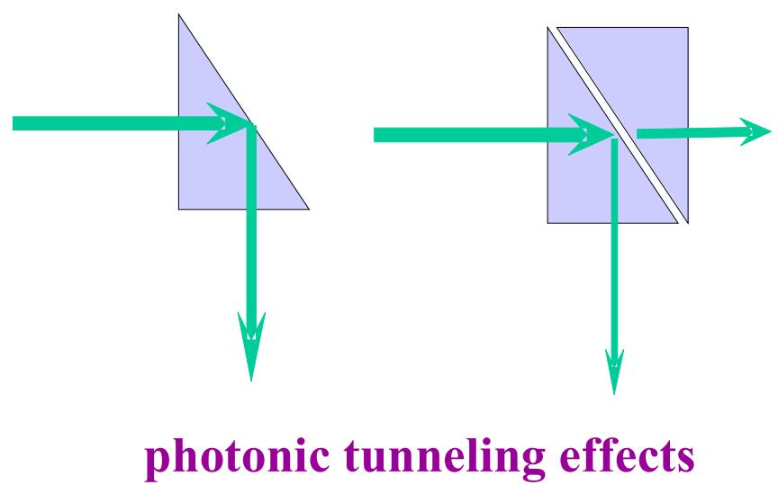
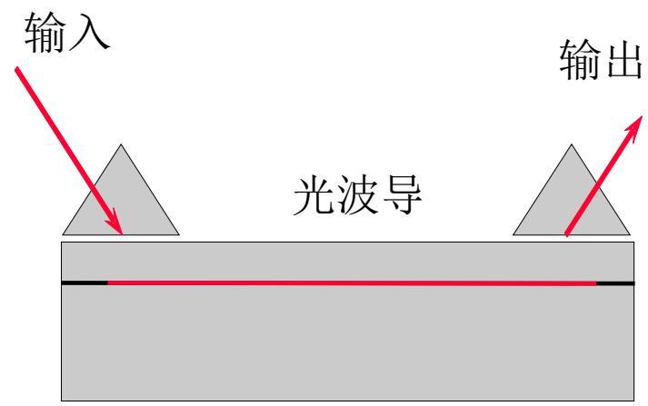

# 3.4.2 隐失波的三大特性与隧道效应

（背诵特性和隧道效应）

### 一、 隐失波的三大物理特性
在全反射条件下，存在于第二介质表层的隐失波具有以下三个重要物理特性：

1. **穿透深度极浅**：
   隐失波的振幅沿垂直于界面的 $z$ 轴方向呈指数衰减（$e^{- k_{2z}' z}$）。我们定义振幅衰减为界面处初始振幅的 $1/e$（约 36.8%）时所深入的距离为**穿透深度 $d$**。
   $$ d = \frac{1}{k_{2z}'} = \frac{\lambda_0}{2\pi \sqrt{n_1^2 \sin^2 i_1 - n_2^2}} $$
   其中 $\lambda_0$ 为真空中的波长。根据公式可知，穿透深度通常只有光波长的量级（约零点几到几个微米）。入射角 $i_1$ 越大于临界角 $i_c$，穿透深度越小。
   **（教材数值举例，以光从玻璃射入空气为例）：**
   - 当 $n_1=1.5, n_2=1.0$，临界角 $i_c \approx 42^\circ$。
   - 当入射角逐渐增大为 $i_1=45^\circ$ 时，计算可得 $d \approx \lambda_0 / 2$。
   - 当入射角继续增大为 $i_1=60^\circ$ 时，计算可得 $d \approx \lambda_0 / 5$。
   - 当趋近掠入射 $i_1 \approx 90^\circ$ 时，穿透深度最小，极限约为 $d \approx \lambda_0 / 7$。

2. **等相面与等幅面相互垂直（非均匀波）**：
   常规平面波的等相面与等幅面是重合的。但在隐失波中：
   - **等相面**：由相位项 $e^{i (k_{2x} x - \omega t)}$ 决定，相位的变化仅依靠沿界面切向（$x$ 轴）的坐标 $x$。因此，等相面是垂直于界面（平行于 $yz$ 平面）的平面。
   - **等幅面**：由振幅项 $e^{- k_{2z}' z}$ 决定，振幅的变化仅依靠垂直于界面的坐标 $z$。因此，同一深度 $z$ 处振幅相等，等幅面是平行于界面（平行于 $xy$ 平面）的平面。
   ==隐失波的等相面和等幅面互相正交（垂直）==，这种结构称为**非均匀波 (Inhomogeneous Wave)**。
   
   **（相速度与空间周期的奇特依属性）：**
   对于这个仅沿界面 $x$ 方向滑行的行波，它的传播相速度 $v_{2x}$ 和波长 $\lambda_{2x}$ 可由波矢的 $x$ 分量得出：
   $$ v_{2x} = \frac{\omega}{k_{2x}} = \frac{\omega}{k_1 \sin i_1} = \frac{v_1}{\sin i_1} $$
   $$ \lambda_{2x} = \frac{2\pi}{k_{2x}} = \frac{\lambda_1}{\sin i_1} $$
   这揭示了一个违反直觉的物理事实：**存在于介质2中的隐失波，其传播速度和波长竟然不取决于介质2本身的性质，而是完全由介质1中的行波速度和入射角 $i_1$ 所唯一决定！** 为了时刻保持界面上的相位连续同步，它变成了依附在入射波上滑行的“影子”。

3. **平均能流为零（无功功率）**：
   在发生全反射时，虽然第二介质中存在电磁场，但可以通过求解麦克斯韦方程（$\nabla \times \vec{E} = -\mu\mu_0 \frac{\partial \vec{H}}{\partial t}$）发现，隐失波的电场矢量和磁场强度在垂直于界面的 $z$ 方向上存在 $\pi/2$ 的相位差（如 $E_{2y}$ 与 $H_{2x}$ 相位差为该值）。
   当计算时间平均能流密度矢量（平均坡印廷矢量 $\langle \vec{S} \rangle$）的法向分量 $\langle S_{2z} \rangle$ 时，涉及对周期的积分：
   $$ \langle S_{2z} \rangle \propto \frac{1}{T} \int_0^T \cos(\omega t) \cos\left(\omega t + \frac{\pi}{2}\right) dt = 0 $$
   这意味着在垂直于界面的方向上，隐失波在一个时间周期内的宏观平均能量净传输严格为零。电磁能量仅在半个周期内通过界面进入极表浅的透射区，在下一个半周期又全部退回入射区。这是一种**局域性的波场**，类似于电路中的纯电感或纯电容表现出的**无功功率**，从而完美解释了**“光强100%全反射”**的能量守恒要求。

### 二、 受抑全反射（光学隧道效应）
既然隐失波的振幅随着深入第二介质而指数衰减，那么如果在第二介质（通常为空气或真空，厚度极薄）的几微米范围内（即隐失波尚未完全衰减的区域），放置第三种介质（折射率 $n_3 > n_2$，如另一块玻璃），会发生什么现象？

当第三介质非常靠近第一介质表面时，隐失波的电磁场会延伸并作用到第三介质的边界上。此时，隐失波在第三介质中会重新激发出普通的、沿该介质传播的**折射行波**（透射波）。这就导致原本应在第一介质内发生 100% 全反射的光束，有一部分能量穿越了极薄的第二介质层，进入了第三介质。

> **结论与应用**：
> 这种由于隐失波场与另一靠近界面的介质发生耦合，使得全反射被破坏、部分光能透射穿过薄势垒层的现象，称为**受抑全反射 (Frustrated Total Internal Reflection, FTIR)**。
> 在物理机制上，这种现象与量子力学中的**隧道效应**完全等价，因此也被称为**光学隧道效应**。
> **应用**：这类通过物理势垒层使隐失场直接耦合提取能量的过程，被广泛运用于下面几种光波导中：
> - **两平行光波导间的能量耦合器**（改变间距即可调节透射分流比）。
> - **指纹高分辨传感器**（利用皮肤脊线的折射率引发受抑全反射以读取指纹起伏）。
> - **近场光学显微技术 (SNOM)**。

