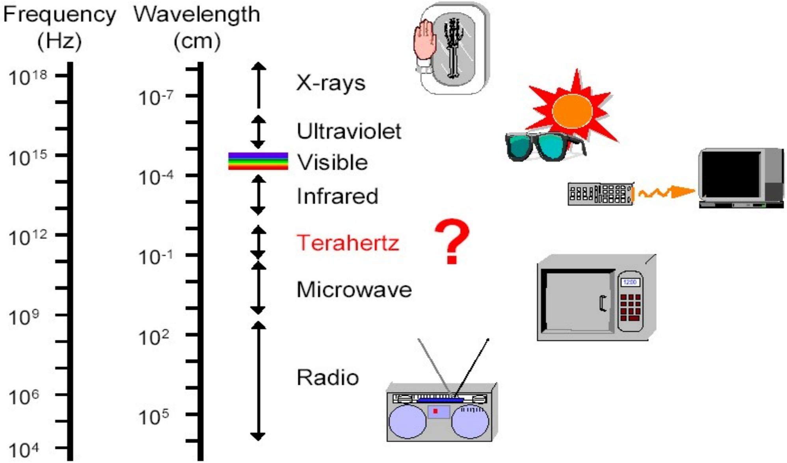
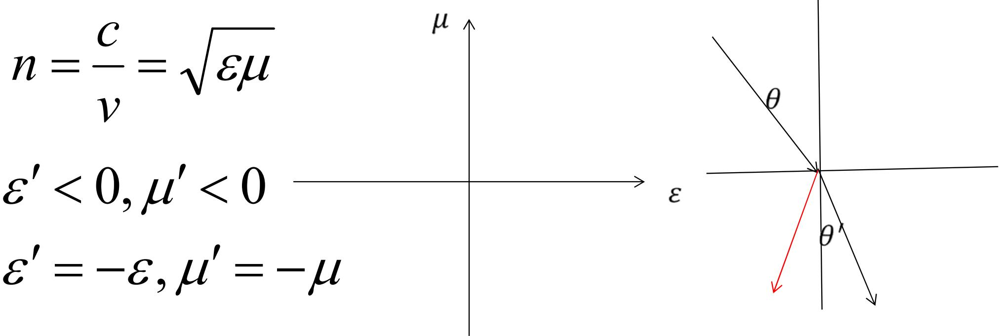

### 一、 麦克斯韦方程组与波动方程
**麦克斯韦方程组**揭示了交变电场与磁场相互激发，能够形成连续不断的==电磁波==。

自由空间中的标准波动方程为：
$$ \nabla^2 \vec{E} - \varepsilon \varepsilon_0 \mu \mu_0 \frac{\partial^2 \vec{E}}{\partial t^2} = 0 $$
$$ \nabla^2 \vec{H} - \varepsilon \varepsilon_0 \mu \mu_0 \frac{\partial^2 \vec{H}}{\partial t^2} = 0 $$

- 在真空中，对比标准波动形式推导出电磁波的速度：
  $$ c = \frac{1}{\sqrt{\varepsilon_0 \mu_0}} \approx 3 \times 10^8 m/s $$

> **结论**：真空中电磁波的传播速度等于光速，证明了==光波就是电磁波==（可见光波段：380-760nm）。

### 二、 介质中的折射率
**折射率**定义：
$$ n = \frac{c}{\nu} = \sqrt{\varepsilon \mu} $$
- **负折射率特例**：当介质为特定超材料时（左手材料），可能满足 $\varepsilon < 0$ 且 $\mu < 0$，此时电磁波传播发生反向偏折，出现负折射率现象。

