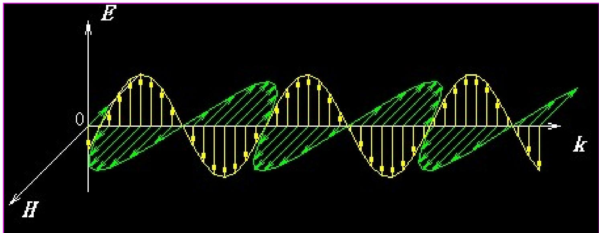

### 一、 平面电磁波是空间电磁波的基本成分

研究光的波动性时，最基础的模型不是“任意形状的空间波”，而是==平面电磁波==。很多更复杂的空间电磁场，都可以近似看成许多平面电磁波的组合。

平面电磁波中的电场和磁场，通常写成：

$$\vec{E}(\vec{r},t)=\vec{E}_0\cos(\omega t-\vec{k}\cdot\vec{r}+\varphi_E)$$

$$\vec{H}(\vec{r},t)=\vec{H}_0\cos(\omega t-\vec{k}\cdot\vec{r}+\varphi_H)$$

其中：

- $\vec{k}$ 叫做==波矢==，方向就是波面的法向，也就是传播方向（垂直于E和H）。
- 它的大小 $k$ 是波数，满足：

$$k^2=\varepsilon\varepsilon_0\mu\mu_0\omega^2$$

$$k=\sqrt{\varepsilon\varepsilon_0\mu\mu_0}\,\omega=\frac{n\omega}{c}=\frac{2\pi}{\lambda}$$

- 在空间中，一束平面电磁波总可以分解为一个 ==E 面== 和一个 ==H 面== 的振荡，它们再和传播方向一起构成完整的三维电磁波结构。

### 二、 横波特性
将平面电磁波本征函数分别代入 $\nabla \cdot \vec{E} = 0$ 和 $\nabla \cdot \vec{H} = 0$ 中，解得：
$$ \vec{E}_0 \cdot \vec{k} = 0, \quad \vec{H}_0 \cdot \vec{k} = 0 $$
- $\vec{k}$ 为波矢，方向与等相面的正交一致（即波面的法线方向）。 ^952b54

> **结论**：电场 $\vec{E}$ 和磁场 $\vec{H}$ 的振荡方向均严格垂直于波矢 $\vec{k}$。因此在与波矢正交的横剖面内振荡的自由空间光波是==横波==。

### 三、 电场与磁场的正交与同步
将其代入旋度方程 $\nabla \times \vec{E} = -\mu \mu_0 \frac{\partial \vec{H}}{\partial t}$ 中，整理可得：
$$ \mu \mu_0 \vec{H} = \frac{1}{\omega} \vec{k} \times \vec{E} $$

由此导出它具备如下三个重要几何特征：
1. **正交性**：$\vec{E} \perp \vec{H}$，且 $\vec{E}, \vec{H}, \vec{k}$ 构成相互正交的右手螺旋系统。
2. **同步性**：电和磁场的振荡初相位严格相同 $\varphi_H = \varphi_E$。
3. **幅值关系**：$\sqrt{\mu \mu_0} H_0 = \sqrt{\varepsilon \varepsilon_0} E_0$。 （k/ω）的幅值可以先算出来就是 1/c，或者说 1/v。然后把c（v）用几个常数带掉，就可以出这个式子

