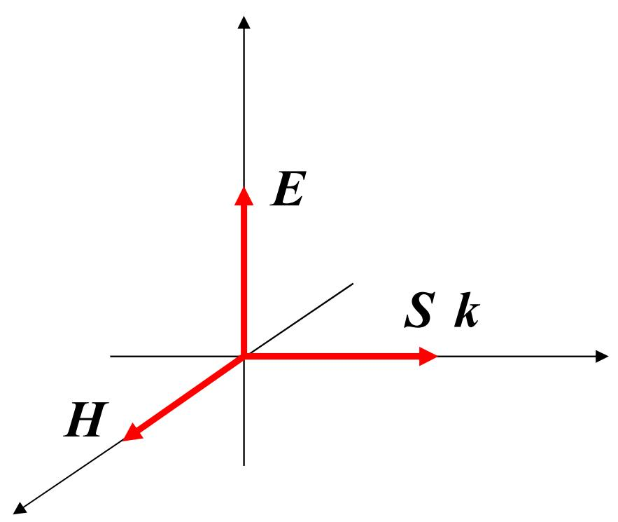

### 一、 能流密度与坡印亭矢量
**坡印亭矢量**（$\vec{S}$）用于描述电磁波传播过程中的电磁能流密度：
$$ \vec{S} = \vec{E} \times \vec{H} $$
- 其方向代表了电磁波==能量传播的方向==。

### 二、 光强 (Intensity)
光强 ($I$)在物理学上被定义为**一段时间内的**平均电磁能流密度：
$$ I = \bar{S} = \frac{1}{T} \int_0^T |\vec{E} \times \vec{H}| dt = \frac{1}{2} E_0 H_0 $$

考虑到可见光波段绝大部分介质材料 $\mu \approx 1$，$n \approx \sqrt{\varepsilon}$，可作进一步简化：
$$ I = \frac{1}{2} \sqrt{\frac{\varepsilon_0}{\mu_0}} n E_0^2 \propto n E_0^2 $$
> **结论**：在常规计算中，光强==正比于电场振幅的平方及其折射率== $I \propto n E_0^2$ (简化后常写作 $I=n E_0^2$)。

### 三、 光的偏振特性
空间光波中电矢量 $\vec{E}$ 随时间进行有规律或无规律的振动，其振动状态及方位决定了光波的==偏振态==。
- 习惯上将 $\vec{E}$ 所处的振动平面（由 $\vec{E}$ 和传播方向 $\vec{k}$ 所张成的平面）称为由于光的**偏振面**。