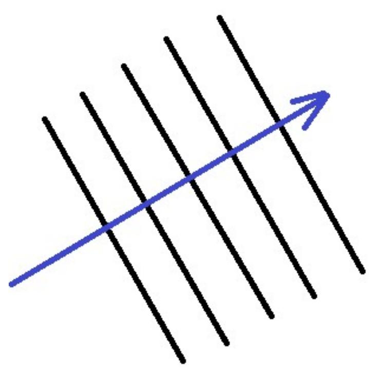
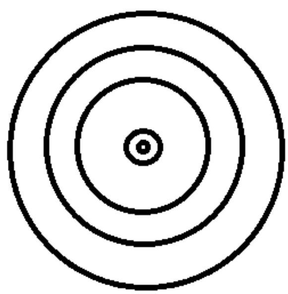
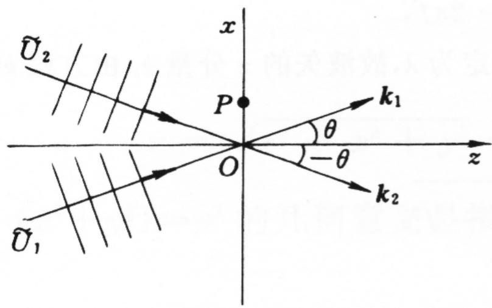
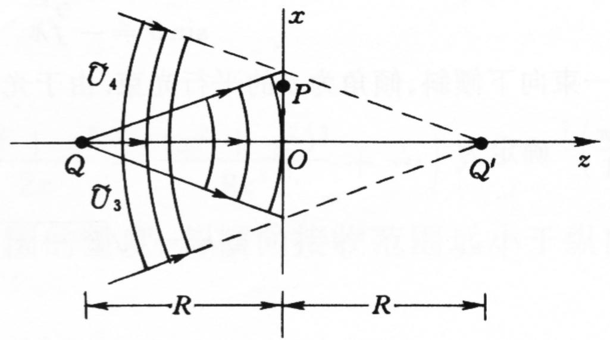

### 一、 波前的概念
- **波前 (Wavefront)**：在波场空间内，所有振动相位相同的点的集合所构成的等相曲面。
- 大量光学测量及分析多直接取某单一观测截面（如接收介质板、光刻平面等 $z=0$）。在此平面上复振幅分布即等效表征出该==广义波前== $\tilde{U}(x, y)$。

> **课程主脉络**：一切经典波光学的推演均可凝练为——波前的==描述和识别== $\rightarrow$ 波前的==叠加与干涉== $\rightarrow$ 波前的==变换分析== $\rightarrow$ 波前的==记录与再现==。

### 二、 典型波前与其共轭波前示例
假设原点所在的 $z=0$ 面为观测面，波前即把 $z=0$ 代入三维场函数。
对波前复振幅**取复共轭**（如 $+i \rightarrow -i$），在物理空间往往意味着==逆着原本时间与传播路径的对偶衍化==。

#### 1. 单列斜射平面波的共轭
平面光波斜向入射于 $z=0$ 观测面上：
$$ \tilde{U}_1(x, y) = A e^{i k x \sin\theta} $$
> **对应共轭波前**：$\tilde{U}_2 = \tilde{U}_1^* = A e^{-i k x \sin\theta}$。表现为与之成相对称负角度入射的等势平逆向波面。

#### 2. 定点发散球面波的共轭
一点光源从原点底后方 $-R$ 处放射球面波，到达 $z=0$ 波前上的接收分布为：
$$ \tilde{U}_3(x, y) = \frac{A}{r} e^{ikr} \quad (\text{其中} r = \sqrt{x^2 + y^2 + R^2}) $$
> **对应共轭波前**：$\tilde{U}_4 = \tilde{U}_3^* = \frac{A}{r} e^{-ikr}$。这正反映了一列汇合至观测面背侧 $+R$ 同等镜像点的==聚焦会聚球面波==。

