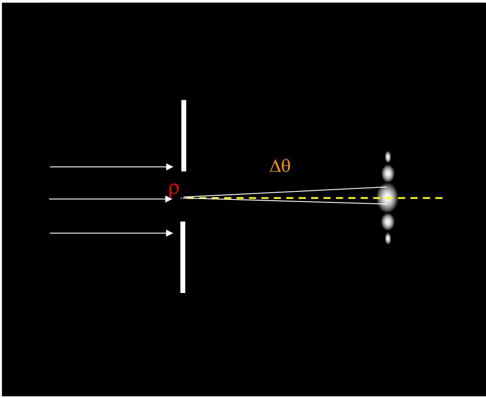
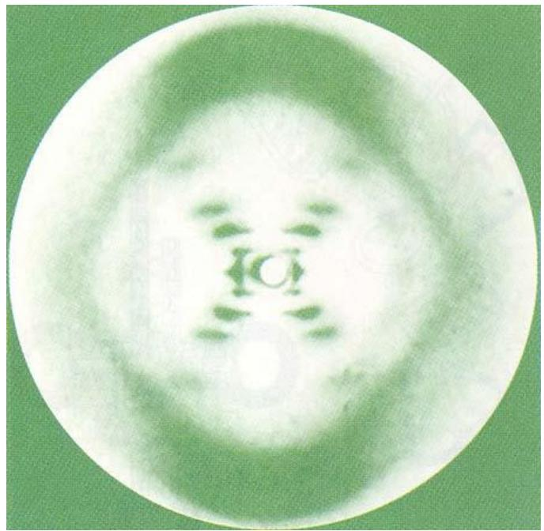

# 5.1.1 ==光的衍射现象==与限制展宽规律

> **脉络**：前面在[[4.2.1 光强的定义与双光束叠加后的合成光强公式|干涉]]中，我们主要研究少数几束相干光叠加后怎样形成明暗条纹。本章开始研究==衍射==：光波遇到孔、缝、屏、边缘、周期结构以后，原来的[[2.3.1 波前的概念与共轭波前|波前]]被空间结构限制，后方光场不再只是几何光学给出的直线投影，而是由被保留下来的波前部分重新传播和相干叠加得到。

---

### 一、 什么是光的衍射
 
**光的衍射**：当光波遇到障碍物或有限孔径时，光会偏离几何光学中的直线传播方向，在障碍物边缘附近或几何阴影区附近出现绕行、展宽和明暗分布的现象。

这句话里有三个需要分清的对象：

- **入射光波**：原来可以近似看成平面波、球面波或其他已知波前。
- **衍射屏或孔径**：它决定哪些位置的波前可以继续传播，哪些位置被遮挡。
- **接收面上的光强图样**：它不是单纯由几何投影决定，而是由通过孔径后的各部分波前在接收点处相干叠加得到。

从波动光学角度看，衍射不是额外添加的一种特殊现象，而是光的波动性在有限空间结构下的直接表现。只要波前被限制，后方光场就需要重新计算。

---

### 二、 ==限制与展宽==：孔越小，衍射角越大

教材用单缝说明衍射的第一条基本规律：当光通过有限宽度的缝时，出射光不再严格沿一个方向传播，而是在角度范围内展开。这个展开角记作 $\Delta \theta$，教材中用 $\rho$ 表示限制光束的横向尺寸。

教材给出的经验关系是：

$$
\rho \downarrow \quad \Delta \theta \uparrow ; \qquad \lambda \uparrow \quad \Delta \theta \uparrow .
$$

意思是：

- $\rho$ 越小，光波被限制得越强，后方光场展开得越宽；
- $\lambda$ 越大，波动性在同样尺寸结构上越容易表现出来，衍射展开角越大；
- 这两个影响可以合并成一个常用数量级公式：（背诵）

$$
\boxed{\rho \cdot \Delta \theta \approx \lambda}
$$

这个公式不是精确到每一个系数的公式，而是判断衍射强弱的数量级关系。它说明：==空间范围被压窄，角度范围就会变宽==。后面学习单缝、方孔、圆孔、光栅时，很多公式都会回到这个关系上。

例如单缝夫琅禾费衍射中，第一暗纹满足 $a\sin\theta=\lambda$；圆孔夫琅禾费衍射中，艾里斑半角宽度满足 $\Delta\theta\approx 1.22\lambda/D$。==这些后续公式只是把这里的粗略关系加上了具体孔径形状带来的系数。==

---

### 三、 衍射显著程度的三档判断

教材把衍射程度按 $\rho$ 与 $\lambda$ 的相对大小粗分为三档：

#### 1. $\rho > 10^3\lambda$

此时孔径或障碍物尺寸远大于波长。衍射现象不明显，整体上接近几何光学的直线传播。

但这不表示边缘处没有衍射。只是在大多数宏观观察条件下，衍射角很小，几何光学近似已经足够好。

#### 2. $10^3\lambda > \rho > \lambda$

此时衍射现象明显，可以观察到较清楚的衍射花样。

普通可见光波长约为几百纳米，所以毫米级、微米级孔径都可能在合适距离和装置下表现出明显衍射。这一档是本章大部分实验和计算讨论的主要范围。

#### 3. $\rho \le \lambda$

此时结构尺寸已经接近或小于波长。光不再只是形成常规意义上的衍射图样，而会逐渐向更强的散射问题过渡。 光与微观结构（粒子、表面粗糙度、原子团簇）相互作用，结构本身成为次级辐射源，向四面八方重发光。光可能被吸收、再辐射、改变偏振，甚至激发结构内部的电磁模式。
也有说法是，当 a < λ 时，sin θ = kλ/a > 1，这意味着不存在任何暗纹（因为 sin θ 最大为1）。

这里的关键判断是：当结构尺度与波长同量级时，光波能明显“感受到”结构的细节，几何光学近似不再适用。

---

### 四、 衍射屏结构与衍射图样的对应关系

教材强调第二条基本规律：==衍射图样和衍射屏的结构一一对应，结构越细微，相应的衍射图样越展开==。

这句话可以分成两层理解：

- 如果两个孔径或屏的形状不同，它们后方的衍射强度分布通常也不同。
- 如果结构中的特征尺寸越小，衍射图样在角度空间中越宽；如果结构越大，衍射图样越集中。

教材展示了各种光孔的衍射图样：单狭缝、矩形孔、圆孔、多边孔、圆屏、刀片边缘等。它们共同说明一件事：接收屏上看到的明暗分布，记录了前方结构的空间信息。

更重要的例子是 DNA 的 X 射线衍射图样：

这张图的意义不在于直接“看见”DNA 分子，而在于：X 射线通过微观结构后形成的衍射斑点，包含了结构的周期性、对称性和空间尺度信息。后面学习[[5.7.1 三维光栅、X 射线衍射与布拉格公式|三维光栅与 X 射线衍射]]时，会把这种思想写成布拉格公式。

---

### 五、 与前面知识的联系

#### 1. 与波前的联系

在[[2.3.1 波前的概念与共轭波前|波前]]中，我们把同相位点构成的面称为波前。衍射问题中，孔径或障碍物相当于对波前做了一次空间筛选：

- 通过孔径的部分继续传播；
- 被遮挡的部分不再直接贡献后方光场；
- 后方任一点的复振幅由剩下的波前部分共同决定。

所以衍射的本质不是光线单独弯折，而是波前被截断后，新的空间光场重新形成。

#### 2. 与相干叠加的联系

在[[4.2.1 光强的定义与双光束叠加后的合成光强公式|光强与相干叠加]]中，两束光叠加时有：

$$
I(P)=I_1(P)+I_2(P)+2\sqrt{I_1I_2}\cos\delta(P)
$$

衍射可以看成这个思想的连续版本：不是两束光相加，而是孔径上大量微小面元发出的次波在场点 $P$ 相加。每一个面元贡献一个复振幅，这些复振幅有不同的相位，最后共同决定 $P$ 点光强。

因此，衍射图样中的亮区和暗区，仍然来自相位关系：

- 许多贡献在某一点同相叠加，该点较亮；
- 许多贡献在某一点互相抵消，该点较暗。

---

### 六、本节需要记住的核心结论

> **结论一**：光的衍射是有限孔径、障碍物或微结构对波前进行空间限制后，后方光场重新分布的结果。

> **结论二**：衍射的基本数量级关系为
> $$
> \rho \cdot \Delta \theta \approx \lambda
> $$
> 其中 $\rho$ 是限制光束的横向尺寸，$\Delta\theta$ 是衍射展开角，$\lambda$ 是波长。

> **结论三**：结构越细，衍射图样越展开；衍射图样中包含了衍射屏或微结构的空间信息。这个思想会一直延伸到光栅衍射和 X 射线晶体衍射。
