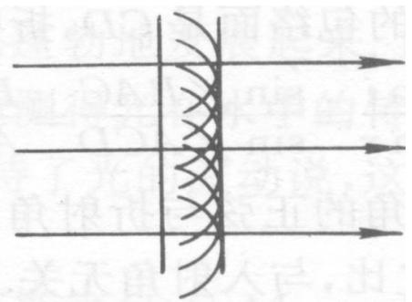
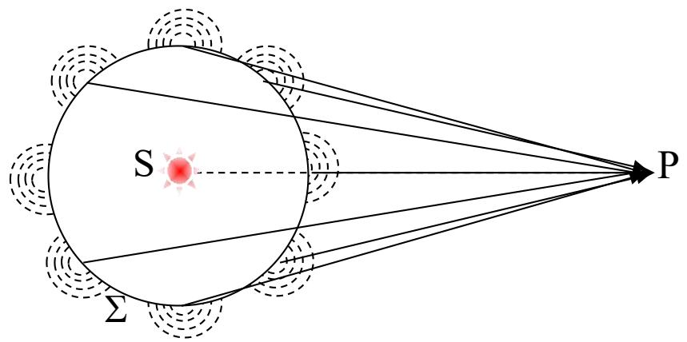

# 5.1.2 ==惠更斯原理==与==惠更斯-菲涅耳原理==

> **脉络**：上一节已经知道，衍射来自波前被有限孔径或障碍物限制后的重新传播。现在要回答一个更具体的问题：如果已知某一波前上的光场，怎样求后方某一点 $P$ 的复振幅？惠更斯原理给出几何作图思想，惠更斯-菲涅耳原理进一步把这个思想写成“所有次波源对场点的复振幅相干叠加”。这一步直接连接到[[4.2.1 光强的定义与双光束叠加后的合成光强公式|相干叠加]]和[[2.2.2 典型光波的复振幅|复振幅表示]]。

---

### 一、 惠更斯原理的内容

**惠更斯原理**：光扰动同时到达的空间曲面称为**波面**或**波前**。波前上的每一点都可以看成一个新的扰动中心，称为**子波源**或**次波源**。这些次波源向四周发出次波，下一时刻的新波前是这些大量次波面的公切面，也称为包络面。

这个原理的用途是：如果已经知道某一时刻的波前位置，就可以用几何作图方法推出下一时刻的波前位置。

它在第一章中已经出现过，那里主要用它解释反射和折射定律，可回看[[1.1 几何光学定律与惠更斯原理的几何证明|惠更斯原理的几何证明]]。当时关注的是波前如何推进，结论主要仍然服务于几何光学。

---

### 二、 惠更斯原理的不足

教材明确指出，单纯的惠更斯原理有两个不足：

- 没有回答光振幅怎样传播。
- 没有回答光相位怎样传播。

这两个问题在衍射中不能回避。原因是：衍射图样中的亮暗分布不是只由波前位置决定，而是由场点 $P$ 处的复振幅决定。复振幅包括两个部分：

$$
\widetilde U(P)=A(P)e^{i\varphi(P)}
$$

- $A(P)$ 是振幅，决定该点光强的大小；
- $\varphi(P)$ 是相位，决定不同贡献在该点是加强还是抵消；
- 光强通常与复振幅模平方成正比，即 $I(P)\propto |\widetilde U(P)|^2$。

所以，只知道“下一波前在哪里”是不够的。要得到衍射图样，必须知道每个次波源到场点 $P$ 的振幅贡献和相位贡献。

---

### 三、 惠更斯-菲涅耳原理的核心表述

**惠更斯-菲涅耳原理**：波前上的每个面元都可以看成次波源。它们向四周发出次波；波场中任意场点 $P$ 的扰动，是所有次波源对该点所贡献的次级扰动的相干叠加。

教材先把这个思想写成形式表达：

$$
\widetilde {U} (P) = \oiint_{\Sigma} d\widetilde U(P)
$$

其中：

- $\Sigma$ 表示选定的波前或积分面；
- $d\widetilde U(P)$ 表示波前上一个微小面元对场点 $P$ 的复振幅贡献；
- 对整个 $\Sigma$ 积分，就是把全部面元的贡献相干相加。

这里要注意，积分不是在加光强，而是在加复振幅。复振幅相加以后，再取模平方才得到光强。这一点与前面学过的双光束干涉一致：先求合成场，再求光强。

---

### 四、 一个面元的贡献由哪些因素决定

教材说明，波前上一个面元对场点 $P$ 的贡献 $d\widetilde U(P)$ 主要取决于以下几个因素。

#### 1. 面元本身的复振幅

波前上一点 $Q$ 处原本就有复振幅，记作 $\widetilde U_0(Q)$。如果 $Q$ 处入射光本来较强，它作为次波源的贡献也较强。

#### 2. 面元大小

一个微小面元的面积为 $dS$。面积越大，参与发出次波的波前部分越多，对场点的贡献越大。

#### 3. 从面元到场点的传播因子

从 $Q$ 到 $P$ 的距离记作 $r$。球面次波传播时有两个基本因素：

$$
\frac{e^{ikr}}{r}
$$

- $e^{ikr}$ 表示传播距离 $r$ 带来的相位积累；
- $1/r$ 表示球面波传播时振幅随距离增大而减小。

这与[[2.2.2 典型光波的复振幅|球面简谐波]]的形式一致：

$$
\widetilde U(P)=\frac{A}{r}e^{ikr}
$$

#### 4. 倾斜因子

次波源不是向所有方向等强发射。教材用 $f(\theta_0,\theta)$ 表示方向有关的修正因子，称为**倾斜因子**。

- $\theta_0$ 表示入射波对面元法线方向的角度关系；
- $\theta$ 表示面元到场点方向与面元法线方向的角度关系；
- 倾斜因子用来描述不同方向上的发射强弱并不完全相同。

---

### 五、 惠更斯-菲涅耳原理的积分表达式

把上述因素合在一起，教材给出惠更斯-菲涅耳原理的积分形式：

$$
\widetilde {U} (P)
= K\oiint_{\Sigma} f(\theta_0,\theta)\widetilde U_0(Q)\frac{e^{ikr}}{r}dS
$$

各符号的意义是：

- $\widetilde U(P)$：场点 $P$ 处的复振幅；
- $K$：比例常数，后面基尔霍夫理论会给出更明确的形式；
- $\Sigma$：选定的积分面或波前；
- $Q$：积分面上的面元位置；
- $\widetilde U_0(Q)$：面元 $Q$ 处原有复振幅；
- $f(\theta_0,\theta)$：倾斜因子；
- $e^{ikr}/r$：从 $Q$ 到 $P$ 的球面次波传播因子；
- $dS$：面元面积。

这个公式的重点不是立即计算复杂积分，而是建立一个判断框架：==后方任一点的光场，来自孔径或波前上所有面元的复振幅相干叠加==。

---

### 六、 “波前决定观测结果”的含义

教材强调，惠更斯-菲涅耳原理的实质是**无源空间边值定解**：如果在一个没有新光源的区域中，某个边界面上的波前复振幅已经确定，那么后方空间的光场就由这个边界波前决定。

这句话可以平实地理解为：

- 如果两个实验装置在某一平面上给出了相同的复振幅分布 $\widetilde U_0(Q)$；
- 并且后方传播条件相同；
- 那么后方观察到的光场分布也相同。

因此，本章后面很多问题都会转化成：先写出孔径面或光栅面上的复振幅分布，再用衍射积分或等价方法求后方光场。

---

### 七、本节需要记住的核心结论

> **结论一**：惠更斯原理只能说明波前怎样由包络面推进，不能直接给出衍射光强分布。

> **结论二**：惠更斯-菲涅耳原理把波前上的每个面元看成次波源，场点 $P$ 的复振幅等于所有面元贡献的相干叠加：
> $$
> \widetilde {U} (P)
> = K\oiint_{\Sigma} f(\theta_0,\theta)\widetilde U_0(Q)\frac{e^{ikr}}{r}dS
> $$

> **结论三**：衍射计算的基本对象是复振幅，不是直接相加光强。只有先完成复振幅叠加，再取模平方，才能得到观察屏上的明暗图样。
