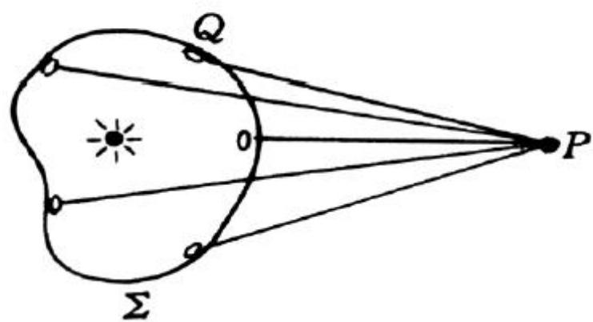
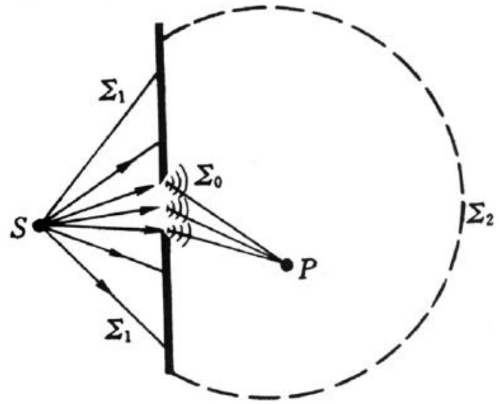
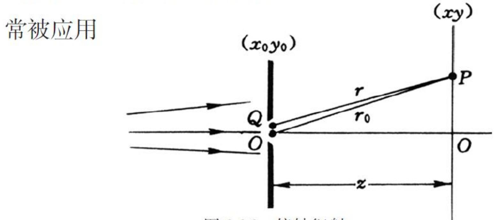
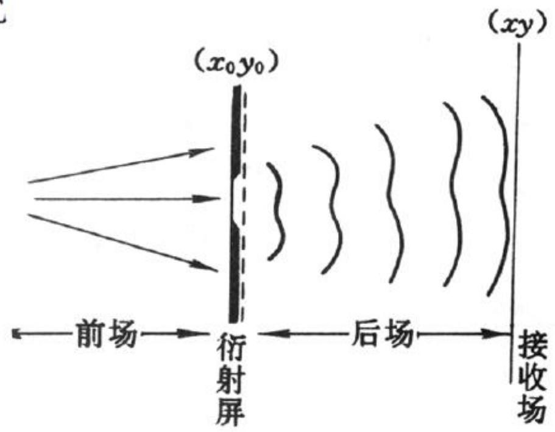
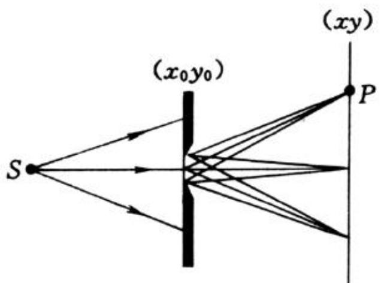
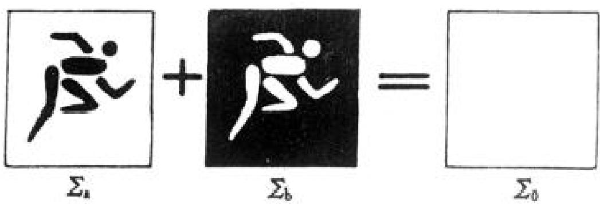
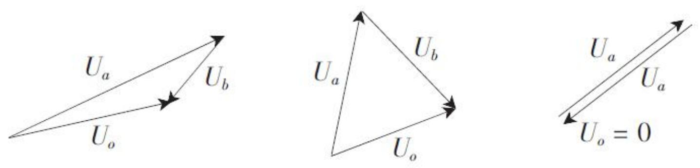

# 5.1.3 ==基尔霍夫衍射积分==、衍射分类与巴比涅原理

> **脉络**：[[5.1.2 惠更斯原理与惠更斯-菲涅耳原理（期末重点）|惠更斯-菲涅耳原理]]说明了“场点复振幅来自波前面元的相干叠加”。本节进一步把这个思想具体化：基尔霍夫理论给出明确的比例系数和倾斜因子；傍轴近似把公式化简成常用衍射积分；衍射问题再按源、屏、接收面的距离分为菲涅耳衍射和夫琅禾费衍射；最后，巴比涅原理说明互补屏的衍射场可以由复振幅相加关系联系起来。

---

### 一、 基尔霍夫衍射积分公式

基尔霍夫从定态亥姆霍兹方程出发，利用格林函数和边值问题的方法，给出更明确的衍射积分形式。教材写为：

$$
\widetilde {U} (P)
= \frac {- i}{\lambda}
\oint_{\Sigma}
\frac {\cos \theta_0 + \cos \theta}{2}
\widetilde {U}_0(Q)
\frac {e^{ikr}}{r}dS
$$

这个公式与惠更斯-菲涅耳原理的主体结构相同：

$$
\widetilde {U} (P)
= K\oint_{\Sigma} f(\theta_0,\theta)\widetilde U_0(Q)\frac{e^{ikr}}{r}dS
$$

基尔霍夫理论不是另起一个完全不同的衍射理论，而是把惠更斯-菲涅耳原理中原来较模糊的量写得更明确。教材这里要记住三点。

#### 1. 明确了比例系数

$$
\boxed{K=\frac{-i}{\lambda}=\frac{1}{\lambda}e^{-i\frac{\pi}{2}}}
$$

这个系数说明每个面元发出的次波相对于面元处原有复振幅会多出一个相位因子 $e^{-i\pi/2}$，也就是相位滞后 $\pi/2$。在普通计算中，常常不单独讨论这个整体相位；但在理解公式来源时，它说明基尔霍夫理论已经把比例常数定下来了。

#### 2. 明确了倾斜因子

$$
\boxed{f(\theta_0,\theta)=\frac{\cos\theta_0+\cos\theta}{2}}
$$

这表示面元对不同方向的贡献不完全一样。$\theta_0$ 与入射方向有关，$\theta$ 与从面元 $Q$ 指向场点 $P$ 的方向有关。若在傍轴条件下，二者都很小，则 $\cos\theta_0$ 和 $\cos\theta$ 都接近 $1$，倾斜因子就近似为 $1$。

#### 3. 明确了积分面可以是闭合面

惠更斯原理常从“某个波前”出发，但基尔霍夫积分中的 $\Sigma$ 不一定必须是等相面。教材强调：只要它是把光源和场点隔开的合适闭合曲面，就可以作为积分面。

这句话的实际意义是：衍射问题可以转化成边值问题。只要知道闭合面上合适的边界场，就可以求出闭合面内部或外部某个场点的复振幅。

各符号的物理含义是：

- $\widetilde U(P)$：接收点 $P$ 处的复振幅；
- $\Sigma$：隔离光源和场点的积分面；
- $Q$：积分面上的一个面元；
- $\widetilde U_0(Q)$：面元 $Q$ 处的复振幅；
- $r$：从 $Q$ 到 $P$ 的距离；
- $e^{ikr}/r$：球面次波传播因子；
- $(\cos\theta_0+\cos\theta)/2$：倾斜因子，表示次波源向不同方向的贡献并不相同。

这里要特别注意：公式加的是复振幅。不同面元的贡献带有不同相位，积分结果可能加强，也可能抵消。最后的光强要由 $I(P)\propto |\widetilde U(P)|^2$ 得到。

---

### 二、 基尔霍夫边界条件与光孔积分

实际衍射屏通常由不透明屏和开孔组成。教材把闭合面分成三部分：

$$
\Sigma=\Sigma_0+\Sigma_1+\Sigma_2
$$

- $\Sigma_0$：光孔面，即允许光通过的区域；
- $\Sigma_1$：光屏不透明部分；
- $\Sigma_2$：无穷远面。

基尔霍夫边界条件的近似思想是：

- 无穷远面 $\Sigma_2$ 对场点贡献近似为零；
- 不透明光屏面 $\Sigma_1$ 对场点贡献近似为零；
- 光孔面 $\Sigma_0$ 上的场近似等于没有屏时的入射场。

用教材的语言说，就是闭合面积分中三部分贡献可以近似处理为：

$$
\Sigma_2\longrightarrow \widetilde U_2(P)\approx 0
$$

$$
\Sigma_1\longrightarrow \widetilde U_1(P)\approx 0
$$

$$
\Sigma_0\longrightarrow \widetilde U(Q)=\widetilde U_0(Q)
$$

第三个式子的意思是：在光孔开口处，直接把孔面上的场看成“没有遮挡时本来会到达这里的入射场”。这个假设忽略了孔边缘附近更复杂的电磁边界变化，但它能给出与实验符合很好的衍射图样。

因此常用公式可写成只对光孔积分：

$$
\widetilde {U} (P)
= \frac {- i}{\lambda}
\iint_{\Sigma_0}
\frac {\cos \theta_0 + \cos \theta}{2}
\widetilde {U}_0(Q)
\frac {e^{ikr}}{r}dS
$$

这个近似不是从光屏边缘的微观电磁边界条件严格推出的完整结果，而是一个物理上合理、计算上可用、并且与实验符合很好的近似模型。教材称它为**菲涅耳-基尔霍夫衍射积分**。

---

### 三、 傍轴条件下的常用衍射积分

在很多光学实验中，源、孔径和观察点都靠近光轴。此时满足傍轴条件，教材给出：

$$
\theta_0,\theta < 0.4\ \mathrm{rad}
$$

图中 $Q(x_0,y_0)$ 是孔径面上的次波源，$P(x,y)$ 是观察面上的场点。傍轴近似要求 $Q$ 和 $P$ 都不要离光轴太远，这样传播方向与光轴夹角较小，倾斜因子和振幅因子才可以进一步简化。

在傍轴条件下有：

$$
\frac{1}{2}(\cos\theta_0+\cos\theta)\approx 1
$$

并且振幅因子可近似为：

$$
\frac{1}{r}e^{ikr}\approx \frac{1}{z}e^{ikr}
$$

于是衍射积分化简为：

$$
\boxed{
\widetilde {U}(P)
\approx
\frac{-i}{\lambda z}
\iint_{\Sigma_0}\widetilde U_0(Q)e^{ikr}dS
}
$$

这个式子说明一个重要事实：在同样的传播距离和同样的近似条件下，不同衍射问题的共同部分是传播核 $e^{ikr}$；真正区分不同衍射图样的是：

- 光孔形状 $\Sigma_0$；
- 孔径面上的复振幅分布 $\widetilde U_0(Q)$，也叫瞳函数或孔径函数。

教材用衍射系统图说明前场和后场的关系：

理论目标可以写成：

$$
\widetilde U(x_0,y_0)\longrightarrow \widetilde U(x,y)
$$

也就是由孔径面上的复振幅分布，计算接收面上的复振幅分布。

---

### 四、 菲涅耳衍射与夫琅禾费衍射

教材把衍射按源、衍射屏、接收面之间的距离分成两类。

#### 1. 菲涅耳衍射

**菲涅耳衍射**：源或接收面之一与衍射屏的距离为有限远。

在这种情况下，到达孔径面的波前可能是弯曲的；孔径面到接收点的距离变化也不能简单忽略。因此计算中通常要保留二次相位项。后面学习圆孔和圆屏菲涅耳衍射时，会经常讨论轴上点的明暗变化。

#### 2. 夫琅禾费衍射

**夫琅禾费衍射**：在无透镜条件下，源和接收面都距离衍射屏无限远。

实际实验中常用透镜把无限远条件等效实现：用平行光照明衍射屏，再在透镜后焦面上观察衍射图样。后面学习单缝、方孔、圆孔和光栅时，主要使用夫琅禾费衍射。

两者可以这样区分：

| 项目 | 菲涅耳衍射 | 夫琅禾费衍射 |
|---|---|---|
| 距离条件 | 有限远条件重要 | 等效远场条件 |
| 波前曲率 | 通常不能忽略 | 常可化为角度分布 |
| 图样变化 | 随观察距离明显变化 | 主要随观察角度变化 |
| 后续典型内容 | 圆孔、圆屏、半波带 | 单缝、方孔、圆孔、光栅 |

---

### 五、 巴比涅原理：互补屏的复振幅关系

两个衍射屏如果互补，意思是一个屏上透光的地方，另一个屏上正好不透光；两个屏叠加起来等于完全开通的自由孔径。之前基尔霍夫已经说过，衍射积分对透光区域积分，对不透光区域积分为零。教材写为：

$$
\Sigma_a+\Sigma_b=\Sigma_0
$$

由于衍射积分对孔径区域是线性的，所以自由开通区域的复振幅可以写成两块互补区域贡献之和：

$$
\boxed{
\widetilde U_a(P)+\widetilde U_b(P)=\widetilde U_0(P)
}
$$

因此，如果已知其中一个互补屏的衍射场，就可以得到另一个：

$$
\boxed{
\widetilde U_b(P)=\widetilde U_0(P)-\widetilde U_a(P)
}
$$

这里必须注意：巴比涅原理是复振幅关系，不是一般意义下的光强直接相加关系。也就是说，通常不能直接写成 $I_a+I_b=I_0$，因为光强与复振幅的模平方有关，而模平方不是线性运算。

圆孔和圆屏就是后面马上要用到的一对互补结构：

- 圆孔屏：圆形区域透光，外部遮挡；
- 圆屏：圆形区域遮挡，外部透光。

因此二者在同一点 $P$ 的复振幅满足：

$$
\widetilde U_{\text{圆孔}}(P)+\widetilde U_{\text{圆屏}}(P)=\widetilde U_0(P)
$$

这条关系是理解[[5.2.1 圆孔和圆屏菲涅耳衍射的图样特征|圆孔和圆屏菲涅耳衍射]]的准备。尤其是圆屏中心的泊松亮斑，不能用几何阴影判断，而要用互补屏复振幅关系和半波带相干叠加共同理解。

教材用矢量图说明三者是“三角关系”：

### 六、在夫琅禾费衍射中
![[Pasted image 20260520110641.jpg]]

除后焦点外，轴外自由光场常可看成：

$$
\widetilde U_0(P)=0
$$

于是轴外有：

$$
\widetilde U_a(P)=-\widetilde U_b(P)
$$

取模平方后得到：

$$
I_a(P)=I_b(P)
$$

这就是教材中“互补屏在轴外夫琅禾费衍射图样强度相同”的来源。注意这个结论有条件：它依赖于轴外自由场为零，不是巴比涅原理在所有位置都直接给出的光强等式。
![[Pasted image 20260520111133.jpg]]
因此要把巴比涅原理分成两层记忆：

- 一般情况下：互补屏满足复振幅相加关系 $\widetilde U_a+\widetilde U_b=\widetilde U_0$；
- 特殊情况下：若某些观察点处自由场 $\widetilde U_0=0$，才可以推出 $\widetilde U_a=-\widetilde U_b$，从而得到 $I_a=I_b$。

---

### 六、 与前后知识的联系

#### 1. 与复振幅叠加的联系

本节所有公式都建立在复振幅线性叠加上。这个思想与[[4.2.1 光强的定义与双光束叠加后的合成光强公式|双光束干涉的合成光强]]一致，只是这里把两束光推广成孔径面上连续分布的无穷多个面元贡献。

#### 2. 与后续单缝、圆孔和光栅的联系

后面每一种衍射图样，本质上都是在改变孔径函数：

- 单缝：$\Sigma_0$ 是一条有限宽狭缝；
- 方孔：$\Sigma_0$ 是矩形区域；
- 圆孔：$\Sigma_0$ 是圆形区域；
- 光栅：$\Sigma_0$ 是许多周期排列的全同透光单元。

因此后面所有公式都可以看成同一个衍射积分在不同孔径条件下的具体结果。

---

### 七、本节需要记住的核心结论

> **结论一**：基尔霍夫衍射积分把惠更斯-菲涅耳原理具体化为
> $$
> \widetilde {U} (P)
> = \frac {- i}{\lambda}
> \oiint_{\Sigma}
> \frac {\cos \theta_0 + \cos \theta}{2}
> \widetilde {U}_0(Q)
> \frac {e^{ikr}}{r}dS
> $$

> **结论二**：傍轴条件下，常用衍射积分为
> $$
> \widetilde {U}(P)
> \approx
> \frac{-i}{\lambda z}
> \iint_{\Sigma_0}\widetilde U_0(Q)e^{ikr}dS
> $$
> 不同孔径形状和不同孔径面复振幅分布，会产生不同衍射场。

> **结论三**：巴比涅原理的基本形式是复振幅关系
> $$
> \widetilde U_a(P)+\widetilde U_b(P)=\widetilde U_0(P)
> $$
> 只有在特定条件下，才能进一步推出互补屏对应位置的光强相等。
