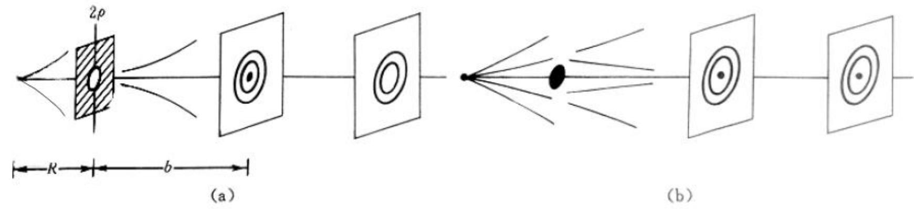

# 5.2.1 ==圆孔和圆屏菲涅耳衍射==的图样特征

> **脉络**：上一节已经把衍射问题写成了[[5.1.3 基尔霍夫衍射积分、衍射分类与巴比涅原理|孔径面复振幅到接收面复振幅的积分变换]]。现在进入第一类具体衍射：==圆孔和圆屏的菲涅耳衍射==。这里的重点不是先做完整积分，而是先弄清楚实验图样的基本特征：为什么是同心环，为什么轴上光强会随圆孔半径和观察距离变化，为什么圆屏中心会出现泊松亮斑。

---

### 一、圆孔与圆屏菲涅耳衍射的装置特征

教材讨论的是有限距离条件下的圆孔和圆屏衍射。光源、衍射屏、接收面之间的距离都不是无限远，因此属于[[5.1.3 基尔霍夫衍射积分、衍射分类与巴比涅原理#四、 菲涅耳衍射与夫琅禾费衍射|菲涅耳衍射]]。

图中常用符号为：

- $R$：点光源到衍射屏的距离；
- $b$：衍射屏到观察点或接收面的距离；
- $\rho$：圆孔半径或圆屏半径；
- $\lambda$：光波波长；
- $P$：接收面上的观察点，尤其关注轴上点。

可见光条件下，教材给出一个典型量级：

$$
\lambda \sim 600\ \mathrm{nm}, \qquad \rho \sim \mathrm{mm}, \qquad R,b\sim 1\text{ m}-10\text{ m}
$$

这说明圆孔半径虽然远大于波长，但因为传播距离达到米级，菲涅耳衍射仍然可以很明显。这一点和[[5.1.1 光的衍射现象与限制展宽规律|限制与展宽规律]]并不矛盾：衍射强弱不只看孔径和波长，还要看观察距离。

---

### 二、为什么图样具有轴对称性

圆孔和圆屏都是绕光轴旋转对称的结构。如果入射光源也在光轴上，那么整个系统没有某一个横向方向比另一个横向方向特殊。

因此，接收面上的光强只能依赖于点到光轴的距离，而不能依赖于方位角。于是图样表现为：

- 中心亮斑或暗斑；
- 围绕中心的一系列同心亮环和暗环；
- 环纹的具体明暗取决于 $\rho$、$R$、$b$ 和 $\lambda$。

这类“同心环”不是几何光学的成像结果，而是圆形波前区域内不同部分到达观察点后的相干叠加结果。

---

### 三、==圆孔==衍射的轴上光强变化

教材指出，圆孔菲涅耳衍射的轴上光强 $I(P)$ 有明显的周期性变化。

#### 1. 固定观察距离 $b$，改变圆孔半径 $\rho$

当 $b$ 不变而 $\rho$ 改变时，轴上光强会周期性变亮、变暗，而且反应比较敏感。

原因是：圆孔半径稍微改变，就会让更多或更少的波前环带参与叠加。由于相邻环带到轴上点的光程差接近半波长，它们的贡献常常一正一负地抵消。因此多放进一圈或少放进一圈，轴上结果可能从亮变暗，或从暗变亮。

这为下一节[[5.2.2 半波带方法与轴上明暗判断|半波带方法]]做铺垫。

#### 2. 固定圆孔半径 $\rho$，改变观察距离 $b$

当 $\rho$ 不变而 $b$ 改变时，轴上光强也会周期性变化，但反应相对迟钝。

原因是：改变 $b$ 会改变圆孔边缘到观察点的光程差，也会改变圆孔中包含的有效半波带数目。但在一般实验尺度下，移动接收面需要一定距离，才会使光程差改变到足以引起明显明暗变化。

#### 3. 当 $b$ 很大时

当接收面离衍射屏很远时，轴上光强的起伏会变得不明显。此时圆孔衍射逐渐接近远场情况，图样分析会转向角度分布，也就是后面要学的夫琅禾费圆孔衍射。

---

### 四、==圆屏==衍射中的泊松亮斑

圆屏衍射最重要、也最容易让人困惑的现象是：==圆屏几何阴影的中心可以出现亮斑==。教材称它为泊松亮斑。

从几何光学看，圆屏正后方的轴上点应该被挡住，中心似乎应该是暗的。但从波动光学看，圆屏边缘之外的波前仍然可以向轴上点传播。由于圆屏具有圆对称性，来自边缘外各个方向的贡献在轴上点相位关系相同，可以相干叠加出亮斑。

教材给出的历史背景是：

- 1818 年，法兰西科学院悬赏征文，主题是解释光的衍射现象；
- 菲涅耳用光波动说和次波相干叠加解释衍射；
- 泊松根据菲涅耳理论推算出圆屏中心会有亮斑，并认为这很难接受；
- 阿拉果做实验验证了这个中心亮斑；
- 这个结果反而支持了菲涅耳的波动理论。

因此，泊松亮斑的重要性不只是“有一个亮点”，而是它清楚说明：光场不能只按直线遮挡判断，必须按波前上各部分复振幅的相干叠加来判断。

---

### 五、圆孔与圆屏的互补关系

圆孔和圆屏在一定意义上是互补屏：

- 圆孔：中心区域透光，外部遮挡；
- 圆屏：中心区域遮挡，外部透光。

这与[[5.1.3 基尔霍夫衍射积分、衍射分类与巴比涅原理#五、 巴比涅原理：互补屏的复振幅关系|巴比涅原理]]有关。互补屏的复振幅满足：

$$
\widetilde U_{\text{hole}}(P)+\widetilde U_{\text{disk}}(P)=\widetilde U_0(P)
$$

这里的 $\widetilde U_0(P)$ 是没有遮挡时的自由传播场。

注意，这个关系仍然是复振幅关系，不是光强直接相加。圆屏中心为什么会亮，后面会用半波带和巴比涅原理共同解释。

---

### 六、本节需要记住的核心结论

> **结论一**：圆孔和圆屏的菲涅耳衍射图样具有轴对称性，通常表现为中心斑点和同心明暗环。

> **结论二**：圆孔衍射的轴上光强会随圆孔半径 $\rho$ 和观察距离 $b$ 周期性变化，这是因为参与相干叠加的有效波前环带数目发生变化。

> **结论三**：圆屏几何阴影中心可以出现泊松亮斑。这是波动光学和复振幅相干叠加的直接证据，不能用单纯几何光线遮挡来解释。
