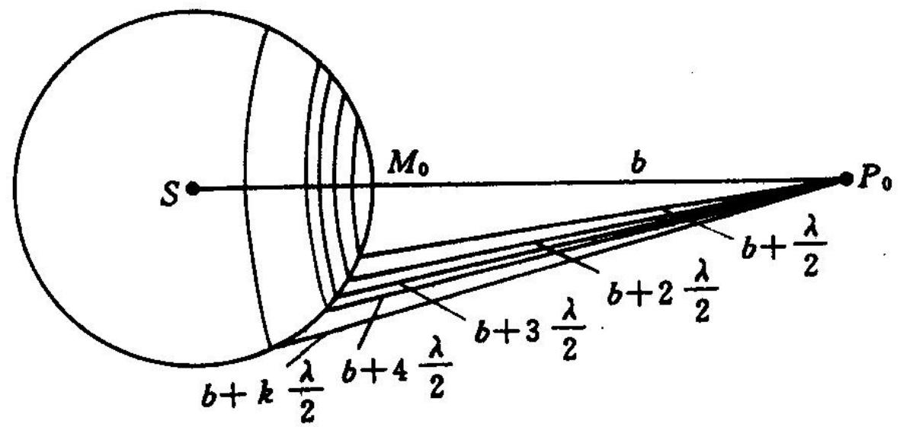
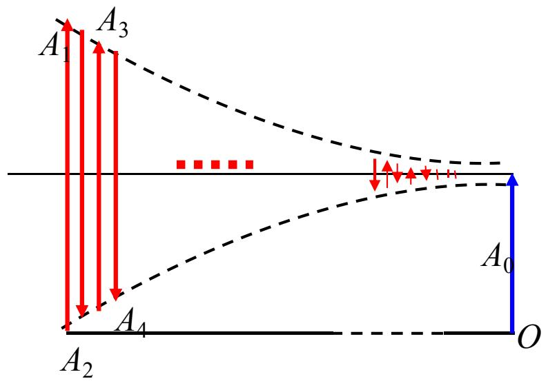
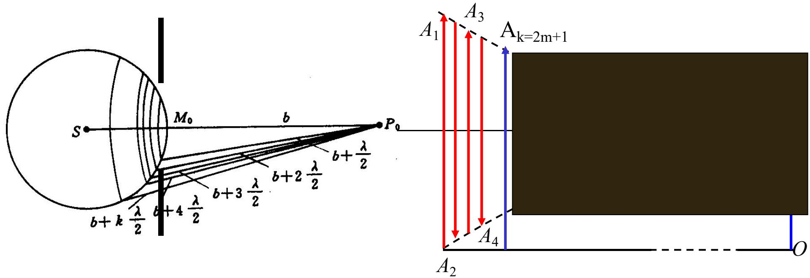
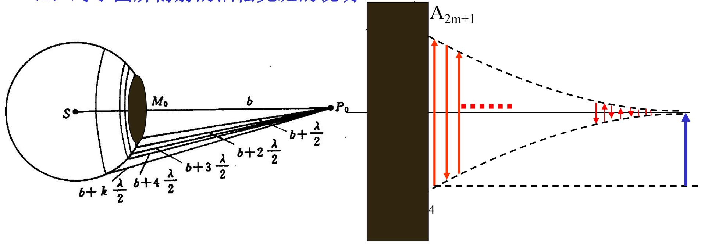
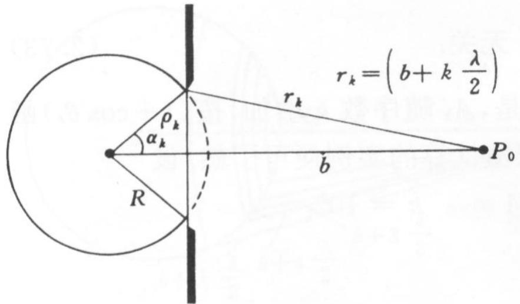
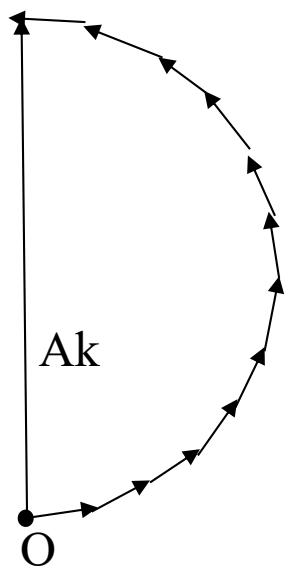
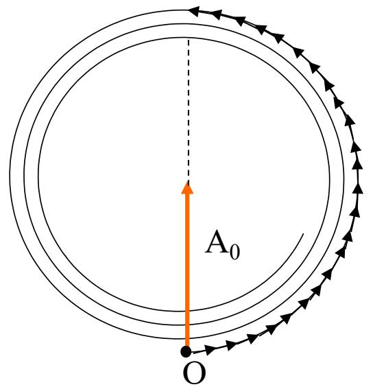
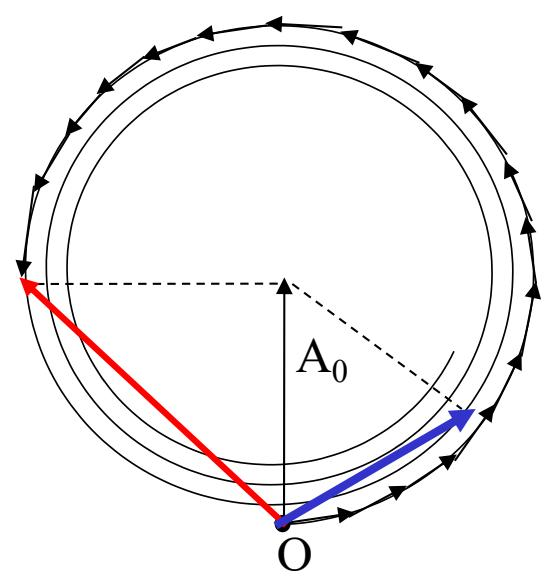

# 5.2.2 ==半波带方法==与轴上明暗判断

> **脉络**：[[5.2.1 圆孔和圆屏菲涅耳衍射的图样特征|圆孔和圆屏菲涅耳衍射]]的核心问题是：轴上点为什么有时亮、有时暗，圆屏中心为什么会出现泊松亮斑。半波带方法就是为了解决这个问题而引入的。它不直接做完整二维积分，而是把波前按到轴上点的光程差分成一圈一圈的环带，再把这些环带的复振幅贡献相加。

---

### 一、半波带方法的基本构造

设点光源为 $S$，以 $S$ 为球心作半径为 $R$ 的球面波前 $\Sigma$。观察轴上点为 $P_0$，点 $M_0$ 是波前上最靠近 $P_0$ 的点，并满足：

$$
M_0P_0=b
$$

现在以 $P_0$ 为球心，用下面这些半径去切割波前：

$$
b,\quad b+\frac{\lambda}{2},\quad b+2\frac{\lambda}{2},\quad b+3\frac{\lambda}{2},\cdots
$$

这样得到的一圈一圈环带，就叫**半波带**。

每相邻两个半波带到 $P_0$ 的光程差为：

$$
\Delta r=\frac{\lambda}{2}
$$

对应的相位差为：

$$
\Delta\varphi=k\Delta r=\frac{2\pi}{\lambda}\cdot \frac{\lambda}{2}=\pi
$$

所以相邻半波带对 $P_0$ 的复振幅贡献方向相反。若第 $k$ 个半波带对 $P_0$ 的振幅大小记作 $A_k$，则有：

$$
\Delta\widetilde U_1=A_1,\quad
\Delta\widetilde U_2=-A_2,\quad
\Delta\widetilde U_3=A_3,\quad \cdots
$$

总复振幅可写成：

$$
\boxed{
\widetilde U(P_0)=\sum_k(-1)^{k+1}A_k
}
$$

这个式子是半波带方法的核心。它把一个连续积分问题，转化成了“正、负、正、负”交替相加的问题。

---

### 二、为什么各半波带振幅近似相等并缓慢减小

接下来计算振幅Ak

根据[[5.1.3 基尔霍夫衍射积分、衍射分类与巴比涅原理|基尔霍夫衍射积分]]，第 $k$ 个半波带对 $P_0$ 的振幅大小大致正比于：

$$
A_k\propto f(\theta_0,\theta_k)\frac{\Delta\Sigma_k}{r_k}
$$

其中：

- $f(\theta_0,\theta_k)$ 是倾斜因子；
- $\Delta\Sigma_k$ 是第 $k$ 个半波带面积；
- $r_k$ 是第 $k$ 个半波带到 $P_0$ 的距离。

教材通过球冠面积推导出：（推导过程太长了）

$$
\frac{\Delta\Sigma_k}{r_k}\approx \frac{\pi R\lambda}{R+b}
$$

这个结果与 $k$ 近似无关。也就是说，虽然后面的环带离 $P_0$ 更远，但它的面积也更大，两者在 $\Delta\Sigma_k/r_k$ 中基本抵消。

真正使 $A_k$ 缓慢减小的主要因素是倾斜因子：越远离轴线的环带，向 $P_0$ 方向的贡献略弱。所以可以近似认为：

$$
A_1>A_2>A_3>\cdots
$$

但在普通实验尺度下，这个减小很慢。正因为各项大小接近，交替相加时才会出现明显抵消。

---

### 三、自由传播时的轴上振幅

如果没有任何屏障，整个波前都参与叠加。教材用矢量图说明：完整波前对应的自由光场振幅约为第一半波带贡献的一半：

$$
\boxed{A_0=\frac{1}{2}A_1}\qquad \text{或}\qquad \boxed{A_1=2A_0}
$$

这里的 $A_0$ 是没有任何遮挡（比如小孔）时轴上点的==自由传播振幅==。这个关系后面判断圆孔亮暗时很重要。

---

### 四、圆孔轴上明暗：看包含半波带数 $k$ 的奇偶

圆孔的作用是只让中心附近的若干个半波带通过。设圆孔刚好包含 $k$ 个半波带。

#### 1. $k=2m$ 为偶数

此时通过的半波带数为偶数，总复振幅为：

$$
\widetilde U(P_0)=A_1-A_2+A_3-A_4+\cdots-A_{2m}\approx 0
$$

因为相邻半波带振幅大小接近、方向相反，所以基本抵消。轴上点为暗斑。

> **结论**：圆孔包含偶数个半波带时，轴上中心近似为暗。

#### 2. $k=2m+1$ 为奇数

此时通过的半波带数为奇数，总复振幅为：

$$
\widetilde U(P_0)=A_1-A_2+A_3-A_4+\cdots+A_{2m+1}\approx A_1=2A_0
$$

于是轴上光强为：

$$
I(P_0)\approx (2A_0)^2=4A_0^2=4I_0
$$

> **结论**：圆孔包含奇数个半波带时，轴上中心近似为亮，且中心光强可接近自由光强的 $4$ 倍。

这里的 $4I_0$ 不是凭空增加能量，而是能量在空间中重新分布。某些位置变亮，其他位置会相应变暗。

---

### 五、圆屏轴上为什么总是亮：泊松亮斑

圆屏的作用与圆孔相反：它挡住中心若干半波带，只让外侧半波带通过。

如果圆屏挡住的是前 $2m+1$ 个半波带，则剩余部分从第 $2m+2$ 个附近开始贡献。教材写出的等价形式为：

$$
\widetilde U(P_0)=A_{2m+1}-A_{2m+2}+A_{2m+3}-\cdots\approx A_0
$$

如果圆屏挡住的是前 $2m$ 个半波带，则剩余贡献近似为：

$$
\widetilde U(P_0)=-A_{2m}+A_{2m+1}-A_{2m+2}+A_{2m+3}-\cdots\approx -A_0
$$

无论结果是 $A_0$ 还是 $-A_0$，光强都是：

$$
I(P_0)=|\widetilde U(P_0)|^2\approx I_0
$$

这就是圆屏中心会出现泊松亮斑的半波带解释。它也可以与[[5.1.3 基尔霍夫衍射积分、衍射分类与巴比涅原理#五、 巴比涅原理：互补屏的复振幅关系|巴比涅原理]]联系起来理解：圆屏与圆孔互补，两者复振幅之和等于自由传播场。

---

### 六、半波带半径公式：从几何关系到傍轴近似

第 $k$ 个半波带边界的半径记作 $\rho_k$。它不是随 $k$ 等间隔增加，而是由“第 $k$ 个边界到轴上点 $P_0$ 的光程比最近点多出 $k\lambda/2$”决定。

由图可知：

$$
r_k=b+k\frac{\lambda}{2}
$$

波前半径为 $R$，点 $P_0$ 到球心所在轴线的距离为 $R+b$。由余弦定理，教材给出：

$$
\rho_k=R\sin\alpha_k=R\sqrt{1-\cos^2\alpha_k}
$$

其中：

$$
\cos\alpha_k=\frac{R^2+(R+b)^2-\left(b+k\frac{\lambda}{2}\right)^2}{2R(R+b)}
$$

所以精确几何表达式可以写成：

$$
\rho_k=R\sqrt{1-\left[\frac{R^2+(R+b)^2-\left(b+k\frac{\lambda}{2}\right)^2}{2R(R+b)}\right]^2}
$$

这个式子看起来较复杂，但它的物理意思很直接：第 $k$ 个边界是所有满足 $QP_0=b+k\lambda/2$ 的点在波前上的交线。

在普通光学条件下，$k\lambda\ll R,b$，可以忽略 $(k\lambda)^2$ 和更高阶小量，于是得到常用近似式：

$$
\boxed{
\rho_k=\sqrt{k\frac{Rb\lambda}{R+b}}=\sqrt{k}\,\rho_1
}
$$

其中第一半波带半径为：

$$
\boxed{
\rho_1=\sqrt{\frac{Rb\lambda}{R+b}}
}
$$

这说明：

- $\rho_k$ 与 $\sqrt{k}$ 成正比；
- 半波带边界半径不是 $\rho_1,2\rho_1,3\rho_1$ 这样线性增加；
- 越靠外，相邻边界之间的间隔越小。

相邻两个半波带边界之间的径向宽度为：

$$
\Delta\rho_k=\rho_{k+1}-\rho_k=(\sqrt{k+1}-\sqrt{k})\rho_1
$$

当 $k$ 较大时：

$$
\boxed{
\Delta\rho_k\approx \frac{1}{2\sqrt{k}}\rho_1
}
$$

所以教材说“半波带越来越密集”，指的是外侧半波带的径向宽度越来越窄。

---

### 七、给定圆孔半径时如何求半波带数

如果圆孔半径 $\rho$ 已知，就可以反过来用半波带半径公式求它包含的半波带数 $k$。由

$$
\rho^2=k\frac{Rb\lambda}{R+b}
$$

得到：

$$
\boxed{
k=\left(\frac{1}{R}+\frac{1}{b}\right)\frac{\rho^2}{\lambda}
}
$$

这个公式在判断圆孔轴上明暗时很常用：

- $k$ 接近偶数时，轴上接近暗；
- $k$ 接近奇数时，轴上接近亮；
- $k$ 不是整数时，不能只用“奇偶”判断，需要用螺旋式矢量曲线或基尔霍夫积分求具体光强。

也可以把公式改写成：

$$
\frac{1}{R}+\frac{1}{b}=k\frac{\lambda}{\rho^2}
$$

若希望圆孔刚好包含奇数个半波带，取 $k=2m+1$，则有：

$$
\frac{1}{R}+\frac{1}{b}=(2m+1)\frac{\lambda}{\rho^2}
$$

教材把右边进一步写成等效焦距形式：

$$
\frac{1}{R}+\frac{1}{b}=\frac{1}{f_k},\qquad
f_k=\frac{\rho^2}{k\lambda}
$$

这个形式后面学习[[5.2.3 基尔霍夫积分求轴上光强与波带片|菲涅耳波带片]]时很重要。它说明：若人为选择某些半波带透光，就可以让波前在某些轴上位置加强，好像形成一个聚焦元件。

还要注意 $b$ 对 $k$ 的影响。固定 $R$、$\rho$ 和 $\lambda$ 时，$b$ 增大，$1/b$ 减小，所以 $k$ 减小。也就是说，屏幕由近处移向远处时，圆孔所包含的有效半波带数会逐渐减少，轴上光强就会在亮、暗之间变化。

教材例子：若 $\lambda=600\ \mathrm{nm}$，$\rho=2\ \mathrm{mm}$，$R=1\ \mathrm{m}$，当 $b\to\infty$ 时，半波带数最少：

$$
k_{\min}=\frac{1}{R}\frac{\rho^2}{\lambda}
=\frac{(2\times 10^{-3})^2}{1\times 600\times 10^{-9}}
\approx 6.7
$$

$6.7$ 不是整数，只能说它接近 $7$，所以轴上结果接近奇数半波带情形，倾向于亮。若要严格求光强，就必须进入下一节的螺旋式矢量图解或使用[[5.2.3 基尔霍夫积分求轴上光强与波带片|基尔霍夫积分]]。

---

### 八、为什么要引入螺旋式曲线

前面把每个半波带看成一个整体矢量 $A_k$，并近似写成：

$$
\widetilde U(P_0)=A_1-A_2+A_3-A_4+\cdots
$$

这种写法适合 $k$ 为整数时判断亮暗。如果圆孔只包含 $1.5$ 个、$2.25$ 个半波带，就不能只说“多了一个半波带”或“少了一个半波带”。这时要把每个半波带再细分成许多更薄的环带。

设把一个半波带细分成 $N$ 个小环带。相邻小环带到 $P_0$ 的相位差约为：

$$
\Delta\varphi=\frac{\pi}{N}
$$

若每个小环带贡献近似等长，则一个半波带的复振幅可以看成许多小矢量首尾相接：

$$
\Delta\widetilde U_k
=\sum_{j=0}^{N-1}\Delta\widetilde U_{kj}
=\Delta\widetilde U_{k0}\sum_{j=0}^{N-1}e^{ij\pi/N}
$$

当 $N$ 很大时，这些小矢量不再是一条折线，而是趋近于一段平滑曲线。一个半波带对应的相位总变化是 $\pi$，所以它大致形成半圈；连续很多半波带首尾相接，就形成教材说的==螺旋式曲线==。

这里的“螺旋式曲线”不是空间中的光线轨迹，而是复平面中的振幅矢量端点轨迹。曲线上任意一点到起点的矢量，就是从中心开始到当前半径为止所有透过波前贡献的合振幅。

---

### 九、螺旋式曲线怎样读出非整数半波带的光强

完整波前没有遮挡时，所有半波带一直相加到很远处。因为后续半波带贡献逐渐变小，矢量端点会逐渐绕向一个极限点。教材用图表示自由场振幅：

图中 $A_0$ 表示自由传播振幅。前面得到的 $A_1=2A_0$，在螺旋图中可以理解为：第一半波带对应的半圈弧，其端点到起点的弦长约为自由场振幅的两倍。

对于圆孔衍射，如果圆孔包含非整数个半波带，就在螺旋线上走到对应位置，再从起点 $O$ 连到该点，这条矢量就是圆孔轴上点的振幅。

教材给出两个例子：

#### 1. $k=1.5$ 时

圆孔透过一个半半波带。由螺旋式曲线可读出：

$$
A_{1.5}=\sqrt{2}A_0
$$

所以光强为：

$$
I_{1.5}=A_{1.5}^2=2I_0
$$

这说明 $k=1.5$ 时既不是最亮，也不是最暗，而是介于 $I_0$ 和 $4I_0$ 等典型值之间。

#### 2. $k=2.25$ 时

圆孔透过 $2.25$ 个半波带。由矢量图可写成：

$$
A_{2.25}=2A_0\sin\frac{\pi}{8}
$$

所以：

$$
I_{2.25}=\left(2A_0\sin\frac{\pi}{8}\right)^2\approx0.6I_0
$$

这说明 $k=2.25$ 接近偶数 $2$，所以轴上光强较弱，但因为已经超过整二个半波带一部分，并不会严格等于零。

---

### 十、用螺旋式曲线再理解圆屏泊松亮斑

圆屏和圆孔互补。若圆孔场为 $\widetilde U_{\text{hole}}$，圆屏场为 $\widetilde U_{\text{disk}}$，自由场为 $\widetilde U_0$，根据[[5.1.3 基尔霍夫衍射积分、衍射分类与巴比涅原理#五、 巴比涅原理：互补屏的复振幅关系|巴比涅原理]]：

$$
\widetilde U_{\text{disk}}(P_0)+\widetilde U_{\text{hole}}(P_0)=\widetilde U_0(P_0)
$$

因此：

$$
\widetilde U_{\text{disk}}(P_0)=\widetilde U_0(P_0)-\widetilde U_{\text{hole}}(P_0)
$$

在螺旋式曲线上，圆孔场对应“从起点到某个端点”的矢量；自由场对应“从起点到螺旋中心附近极限点”的矢量。圆屏场就是这两个矢量的差，所以可以看成“从圆孔端点指向自由场端点”的矢量。

教材的结论是：当圆屏半径不是很大时，圆屏场矢量的长度通常仍接近 $A_0$，所以轴上光强近似为：

$$
I(P_0)\approx I_0
$$

这就是泊松亮斑的更细致解释。圆屏虽然挡住了几何光路中心区域，但外侧波前的贡献在轴上仍能合成接近自由传播强度的振幅。

---

### 十一、本节需要记住的核心结论

> **结论一**：半波带方法把波前按到轴上点的光程差每增加 $\lambda/2$ 分成一圈一圈环带，相邻半波带贡献相差 $\pi$，所以复振幅交替相加。

> **结论二**：圆孔包含偶数个半波带时，轴上近似为暗；包含奇数个半波带时，轴上近似为亮，且光强可接近 $4I_0$。

> **结论三**：圆屏挡住中心半波带后，外侧剩余半波带仍可在轴上合成接近自由传播的振幅，因此几何阴影中心出现泊松亮斑。

> **结论四**：半波带半径和半波带数的常用公式为
> $$
> \rho_k=\sqrt{k\frac{Rb\lambda}{R+b}},\qquad
> k=\left(\frac{1}{R}+\frac{1}{b}\right)\frac{\rho^2}{\lambda}
> $$

> **结论五**：当 $k$ 不是整数时，不能只用奇偶判断明暗。应把半波带继续细分，在复平面上用螺旋式曲线读取合振幅，再由 $I\propto |\widetilde U|^2$ 求光强。
