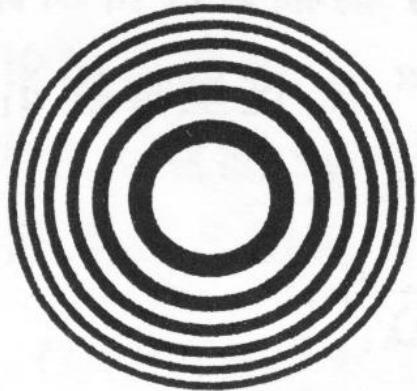
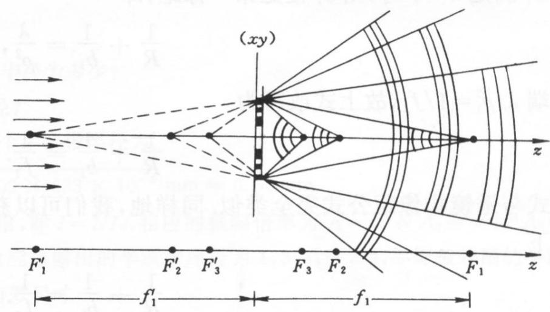

# 5.2.3 ==基尔霍夫积分求轴上光强==与==菲涅耳波带片==

> **脉络**：[[5.2.2 半波带方法与轴上明暗判断|半波带方法]]用环带分组解释了圆孔轴上明暗和圆屏泊松亮斑。本节进一步说明两件事：第一，基尔霍夫积分可以给出圆孔轴上光强的定量表达式；第二，如果人为遮挡一半半波带，让剩余半波带的贡献同相加强，就得到==菲涅耳波带片==，它能像透镜一样把光聚焦。

---

### 一、圆孔轴上光强的积分表达式

对圆孔菲涅耳衍射的轴上点 $P$，从[[5.1.3 基尔霍夫衍射积分、衍射分类与巴比涅原理|基尔霍夫衍射积分]]出发：

$$
\widetilde U(b)=\frac{-i}{\lambda}\iint_{\Sigma_0}
\frac{\cos\theta_0+\cos\theta}{2}\widetilde U_0(Q)\frac{e^{ikr}}{r}dS
$$

在傍轴条件下，倾斜因子近似为 $1$，且球面波前上的面积元满足：

$$
\frac{dS}{r}=\frac{2\pi R}{R+b}dr
$$

若入射球面波在波前上的复振幅写作：

$$
\widetilde U_0(Q)=\frac{a}{R}e^{ikR}
$$

则积分可化为：

$$
\widetilde U(b)
=\frac{-i}{\lambda}\frac{2\pi R}{R+b}\frac{a}{R}e^{ikR}\int_b^{r_k}e^{ikr}dr
$$

积分后得到：

$$
\widetilde U(b)=-\frac{a}{R+b}e^{ikR}\left(e^{ikr_k}-e^{ikb}\right)
$$

光强为：

$$
I(b)=\widetilde U(b)\widetilde U^*(b)
=4\left(\frac{a}{R+b}\right)^2\sin^2\left(k\frac{r_k-b}{2}\right)
$$

这个式子把轴上光强的明暗起伏写成了正弦平方。它说明：轴上点亮还是暗，取决于圆孔边缘到轴上点的额外光程 $r_k-b$。

---

### 二、傍轴近似下的明暗条件

圆孔边缘半径为 $\rho$，在傍轴条件 $\rho\ll R,b$ 下，教材给出：

$$
r_k=b+\frac{1}{2}\frac{(R+b)\rho^2}{Rb}
$$

代入光强公式：

$$
I(b)=4\left(\frac{a}{R+b}\right)^2
\sin^2\left[
\frac{\pi}{2}\cdot\frac{\rho^2}{\lambda}\left(\frac{1}{R}+\frac{1}{b}\right)
\right]
$$

因此：

- 当

$$
\frac{\pi}{2}\cdot\frac{\rho^2}{\lambda}\left(\frac{1}{R}+\frac{1}{b}\right)
=\left(k+\frac12\right)\pi
$$

时，$I(b)$ 取极大值，轴上为亮斑。

- 当

$$
\frac{\pi}{2}\cdot\frac{\rho^2}{\lambda}\left(\frac{1}{R}+\frac{1}{b}\right)=k\pi
$$

时，$I(b)=0$，轴上为暗斑。

这与半波带奇偶判断是一致的。前面写过半波带数：

$$
N=\left(\frac{1}{R}+\frac{1}{b}\right)\frac{\rho^2}{\lambda}
$$

当 $N$ 接近奇数时，轴上偏亮；当 $N$ 接近偶数时，轴上偏暗。

---

### 三、菲涅耳波带片的基本思想

半波带方法告诉我们：相邻半波带对轴上点的贡献相差 $\pi$，也就是方向相反。如果完整波前都通过，许多贡献会互相抵消。

**菲涅耳波带片**的做法是：有选择地遮挡一半半波带，只让同号的半波带通过。例如：

- 只开放奇数半波带：第 $1,3,5,\cdots$ 带通过；
- 或只开放偶数半波带：第 $2,4,6,\cdots$ 带通过。

这样，通过的各个半波带在焦点处近似同相相加，振幅明显增大，光强也明显增大。波带片并不是靠折射改变光线方向，而是靠衍射和相干叠加实现聚焦。

---

### 四、波带片的主焦距

半波带边界满足：

$$
\frac{1}{R}+\frac{1}{b}=k\frac{\lambda}{\rho^2}
$$

对第一半波带边界，有：

$$
\frac{1}{R}+\frac{1}{b}=\frac{\lambda}{\rho_1^2}
$$

当入射光为平行光时，$R\to\infty$，于是：

$$
\frac{1}{b}=\frac{\lambda}{\rho_1^2}
$$

所以主焦距为：

$$
\boxed{f_1=b=\frac{\rho_1^2}{\lambda}}
$$

这里的 $\rho_1$ 是波带片第一个半波带的半径。设计波带片时，如果指定波长 $\lambda$ 和主焦距 $f_1$，就能确定：

$$
\rho_1=\sqrt{f_1\lambda}
$$

---

### 五、波带片的多个焦点

菲涅耳波带片不只有一个焦点。教材给出：

$$
f_2=\frac{f_1}{3},\qquad f_3=\frac{f_1}{5}
$$

更一般地，经典波带片会出现奇数级焦点：

$$
f_m=\frac{f_1}{2m-1}\qquad (m=1,2,3,\cdots)
$$

这与普通薄透镜不同。普通薄透镜在理想情况下主要有一个焦距，而波带片来自周期性的半波带结构，因此会产生多个衍射级焦点。

---

### 六、波带片成像公式

当物点发出的球面波照明波带片时，波带片可以形成实像或虚像。教材给出类似透镜的成像公式：

$$
\boxed{\frac{1}{R}+\frac{1}{b}=\frac{1}{f_k}}
$$

其中：

$$
k=\pm1,\pm2,\pm3,\cdots
$$

这里 $R$ 是物点到波带片的距离，$b$ 是像点到波带片的距离，$f_k$ 是对应级次的焦距。正负号表示实焦点和虚焦点。形式上它类似薄透镜公式，但物理机制不同：

- 薄透镜主要依靠折射改变波前曲率；
- 波带片依靠遮挡或相位调制，使保留下来的半波带在像点处同相叠加。

这可以与[[1.4 费马原理的等光程成像定理与应用|等光程成像]]联系起来理解：聚焦点处，各开放区域到达该点的相位被安排为相互加强。

---

### 七、波带片设计例题的基本思路

若要求波长 $\lambda=633\ \mathrm{nm}$ 的光在主焦距 $f_1=400\ \mathrm{mm}$ 处聚焦，则第一个半波带半径为：

$$
\rho_1=\sqrt{f_1\lambda}
=\sqrt{400\times 633\times 10^{-6}}\ \mathrm{mm}
\approx 0.50\ \mathrm{mm}
$$

如果要求主焦点光强为自由光强的 $10^4$ 倍，则振幅需为自由振幅的 $100$ 倍。由于 $A_1=2A_0$，开放同号半波带后，每个半波带近似提供一个 $A_1$ 量级的贡献。要达到 $100A_0=50A_1$，大约需要开放 $50$ 个同号半波带。

因为开放的是奇数带或偶数带，所以最外层半波带序号约为 $99$ 或 $100$，有效半径为：

$$
\rho_{100}=\sqrt{100}\rho_1=10\rho_1\approx 5.0\ \mathrm{mm}
$$

---

### 八、现代波带片

经典波带片通过遮挡一半半波带来提高焦点光强，但被遮挡的光能没有利用。现代波带片常用相位调制来代替遮挡。

#### 1. 全透明浮雕型波带片

这种波带片不遮挡光，而是在相邻半波带上引入额外相位差，使原本相反的贡献变为同相。教材给出相位条件：

$$
(n-1)d=(2m+1)\frac{\lambda_0}{2}
$$

其中：

- $n$ 是浮雕材料折射率；
- $d$ 是浮雕厚度；
- $\lambda_0$ 是真空或空气中波长；
- 这个厚度使相邻区域产生半波长奇数倍的光程差，从而改变相位。

因为它不损失一半光通量，所以焦点振幅可比经典遮挡型波带片更大，光强也更高。

#### 2. 余弦式波带片

余弦式波带片可由球面波和平面波干涉制作，其透过函数呈正弦或余弦变化。它的优点是聚焦性能更好，主要形成一个实焦点和一个虚焦点，旁级焦点更少。

---

### 九、本节需要记住的核心结论

> **结论一**：圆孔菲涅耳衍射轴上光强可写成
> $$
> I(b)=4\left(\frac{a}{R+b}\right)^2
> \sin^2\left[\frac{\pi}{2}\cdot\frac{\rho^2}{\lambda}\left(\frac{1}{R}+\frac{1}{b}\right)\right]
> $$
> 它与半波带奇偶判断一致。

> **结论二**：菲涅耳波带片通过只开放同号半波带，减少相邻半波带抵消，使焦点处复振幅同相加强。

> **结论三**：波带片主焦距为
> $$
> f_1=\frac{\rho_1^2}{\lambda}
> $$
> 成像公式类似透镜：
> $$
> \frac{1}{R}+\frac{1}{b}=\frac{1}{f_k}
> $$
