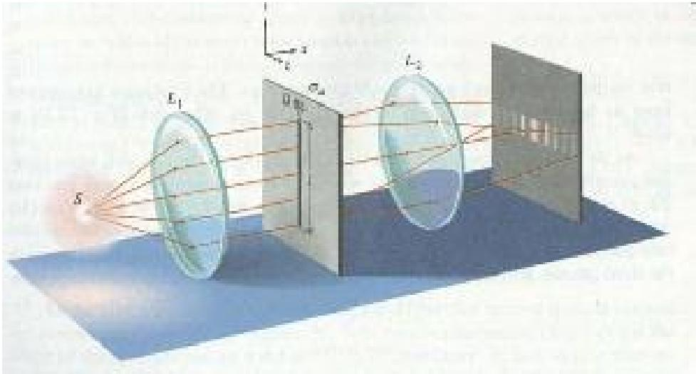
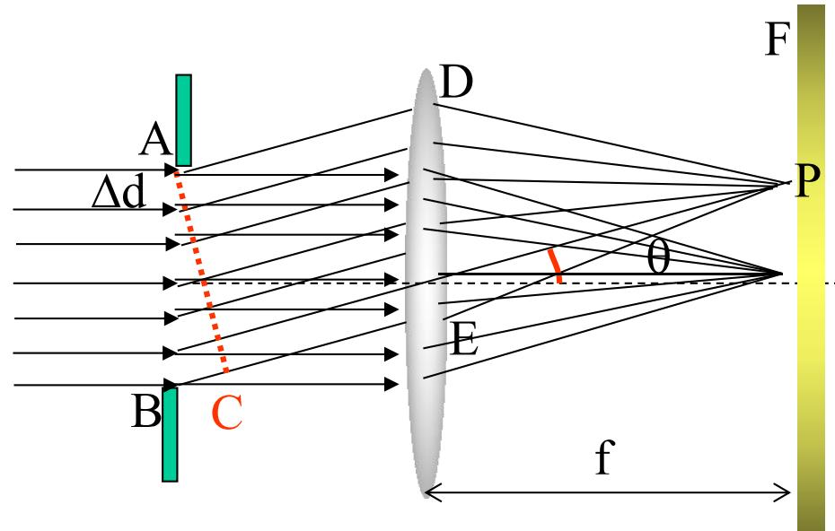

# 5.3.1 ==夫琅禾费单缝衍射==装置、振幅和强度公式

> **脉络**：前面学习的圆孔和圆屏属于[[5.1.3 基尔霍夫衍射积分、衍射分类与巴比涅原理#四、 菲涅耳衍射与夫琅禾费衍射|菲涅耳衍射]]，观察距离有限，轴上光强会随距离明显变化。现在进入==夫琅禾费衍射==，也就是远场衍射。单缝是最基本的远场衍射问题，它会直接给出一个重要函数：$\sin\alpha/\alpha$，后面方孔、圆孔和光栅都会以它为基础继续展开。

---

### 一、夫琅禾费衍射的实验装置

实际实验中不可能真的把光源和接收屏放到无限远，所以通常用透镜来实现远场条件：

- 前透镜把点光源发出的光变成近似平行光；
- 平行光照射宽度为 $a$ 的单缝；
- 后透镜把不同出射角 $\theta$ 的平行光会聚到后焦面上不同位置；
- 在后焦面上观察夫琅禾费衍射图样。

后焦面上的点 $P$ 对应一个衍射角 $\theta$。因此，研究屏上不同位置的光强，就等价于研究不同角度 $\theta$ 方向上的衍射光强。

实验现象是：

- 中央为最亮的亮条纹；
- 两侧有较暗的次级亮纹；
- 中央亮条纹宽度约为两侧亮条纹宽度的二倍；
- 狭缝越窄，中央亮斑越宽。

最后一条与[[5.1.1 光的衍射现象与限制展宽规律|限制与展宽规律]]一致：孔径宽度越小，角展宽越大。

---

### 二、把单缝分成许多小面元

设单缝宽度为 $a$。把单缝沿宽度方向分成 $N$ 个小段，每段宽度为 $\Delta d$，满足：

$$
N\Delta d=a
$$

观察方向为 $\theta$。相邻小段发出的光到达后焦面点 $P$ 时，会有一个附加光程差：

$$
\Delta l=\Delta d\sin\theta
$$

对应相位差为：

$$
\Delta\varphi=\frac{2\pi}{\lambda}\Delta d\sin\theta
$$

于是，$P$ 点的复振幅可以写成许多等振幅小矢量的和：

$$
\widetilde U(\theta)
=\Delta A e^{ikL_0}
\left(1+e^{i\Delta\varphi}+e^{i2\Delta\varphi}+\cdots+e^{iN\Delta\varphi}\right)
$$

这个式子本质上是等比数列求和，也可以用矢量首尾相接的方法理解。

---

### 三、总相位差与矢量圆弧

单缝两边缘之间的总光程差为：

$$
\Delta L=a\sin\theta
$$

对应总相位差为：

$$
\delta=\frac{2\pi}{\lambda}a\sin\theta
$$

当 $N$ 很大时，许多小矢量首尾相接，近似形成一段圆弧。设这段圆弧对应的半径为 $R_c$，圆弧长度等于零级方向的总振幅 $A_0$，则教材写成：

$$
R_c=\frac{A_0}{\delta}
$$

注意这里的 $R_c$ 只是矢量图中的圆弧半径，不是前面菲涅耳衍射中光源到屏的距离 $R$。

圆弧的弦长就是方向 $\theta$ 上的合振幅：

$$
A(\theta)=2R_c\sin\frac{\delta}{2}
$$

代入 $R_c=A_0/\delta$：

$$
A(\theta)=\frac{2A_0}{\delta}\sin\frac{\delta}{2}
$$

引入无量纲变量：

$$
\boxed{\alpha=\frac{\pi a\sin\theta}{\lambda}}
$$

由于 $\delta=2\alpha$，所以：

$$
\boxed{A(\theta)=A_0\frac{\sin\alpha}{\alpha}}
$$

---

### 四、单缝夫琅禾费衍射的光强公式

光强与振幅平方成正比，因此：

$$
I(\theta)=\left[A(\theta)\right]^2
$$

得到单缝夫琅禾费衍射强度公式：

$$
\boxed{
I(\theta)=I_0\left(\frac{\sin\alpha}{\alpha}\right)^2
}
$$

其中：

$$
\boxed{\alpha=\frac{\pi a\sin\theta}{\lambda}}
$$

各符号含义是：

- $I(\theta)$：衍射角为 $\theta$ 的方向上，在后焦面对应点的光强；
- $I_0$：中央方向 $\theta=0$ 的最大光强；
- $a$：单缝宽度；
- $\lambda$：光波波长；
- $\alpha$：把孔径宽度、波长和衍射角合并起来的无量纲变量。

当 $\theta=0$ 时，$\alpha=0$，虽然公式表面上出现 $0/0$，但极限为：

$$
\lim_{\alpha\to 0}\frac{\sin\alpha}{\alpha}=1
$$

所以中央方向光强为：

$$
I(0)=I_0
$$

---

### 五、用衍射积分得到同一结果

从傍轴衍射积分出发，也可以直接得到同样公式。设单缝在 $x_0$ 方向宽度为 $a$，在垂直方向高度为 $b$，孔径面上照明振幅为常数 $A$。

在后透镜后焦面上，方向 $\theta$ 对应的相因子为：

$$
e^{-ikx_0\sin\theta}
$$

于是复振幅为：

$$
\widetilde U(\theta)
=\frac{-i}{\lambda f}Abe^{ikL_0}
\int_{-a/2}^{a/2}e^{-ikx_0\sin\theta}dx_0
$$

积分后得到：

$$
\widetilde U(\theta)
=\frac{-i}{\lambda f}Aabe^{ikL_0}
\left(\frac{\sin\left(\frac{\pi a\sin\theta}{\lambda}\right)}{\frac{\pi a\sin\theta}{\lambda}}\right)
$$

也就是：

$$
\widetilde U(\theta)=\widetilde c\frac{\sin\alpha}{\alpha}
$$

其中：

$$
\widetilde c=\frac{-i}{\lambda f}Aabe^{ikL_0}
$$

取模平方后：

$$
I(\theta)=\widetilde U(\theta)\widetilde U^*(\theta)
=I_0\left(\frac{\sin\alpha}{\alpha}\right)^2
$$

这说明矢量图解法和衍射积分法得到的结果完全一致。矢量图解更直观，积分法更适合推广到方孔、圆孔和光栅。

---

### 六、关于透镜的作用

单缝到后焦面的空间中有透镜，因此严格说并不是单纯的自由空间传播。教材提醒：单缝发出的发散球面波经过透镜后变成会聚球面波，基尔霍夫积分中的自由传播距离 $r$ 在透镜内部不再有直接意义。

处理方法是：

- 在透镜前后的自由空间分别使用传播规律；
- 透镜的主要作用是把同一方向 $\theta$ 的平行光会聚到后焦面同一点；
- 振幅系数最终与焦距有关，典型结果是 $A_P\propto 1/f$。

这一点与[[1.2 光程的物理意义与相位差|透镜等光程聚焦]]有关：理想透镜把同方向或同物点来的波前调整到同相汇聚，从而让后焦面成为观察远场角谱的平面。

---

### 七、本节需要记住的核心结论

> **结论一**：夫琅禾费单缝衍射通常在透镜后焦面观察，后焦面位置对应衍射角 $\theta$。

> **结论二**：单缝两边缘到方向 $\theta$ 的总相位差为
> $$
> \delta=\frac{2\pi}{\lambda}a\sin\theta
> $$
> 引入
> $$
> \alpha=\frac{\pi a\sin\theta}{\lambda}
> $$
> 后，振幅为
> $$
> A(\theta)=A_0\frac{\sin\alpha}{\alpha}
> $$

> **结论三**：单缝夫琅禾费衍射强度公式为
> $$
> I(\theta)=I_0\left(\frac{\sin\alpha}{\alpha}\right)^2
> $$
> 它是后面分析暗纹、中央亮纹宽度和光栅单缝包络的基础。
