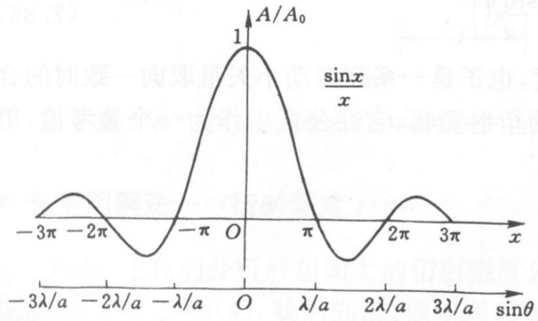
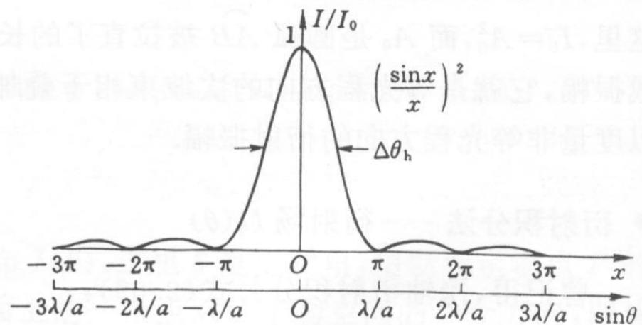
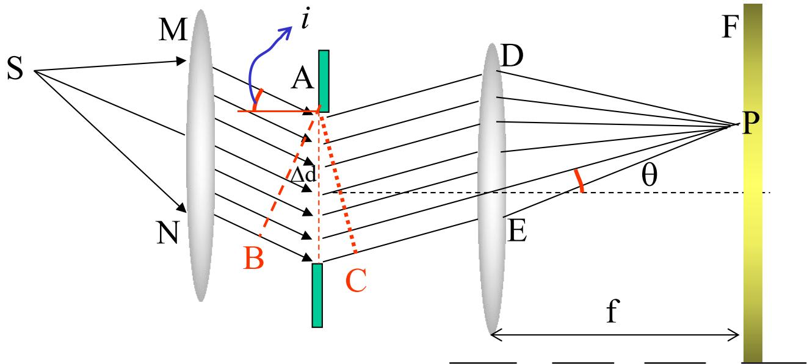

# 5.3.2 ==单缝衍射图样特点==与斜入射情况

> **脉络**：[[5.3.1 夫琅禾费单缝衍射装置、振幅和强度公式|上一节]]已经得到单缝夫琅禾费衍射强度公式
> $$
> I(\theta)=I_0\left(\frac{\sin\alpha}{\alpha}\right)^2,\qquad
> \alpha=\frac{\pi a\sin\theta}{\lambda}
> $$
> 本节只分析这个公式给出的图样特点：中央亮纹、暗纹位置、次极大、半角宽度、缝宽和波长的影响，以及斜入射时图样怎样变化。

---

### 一、中央主极大在几何光学像点

当 $\theta=0$ 时：

$$
\alpha=\frac{\pi a\sin0}{\lambda}=0
$$

由极限：

$$
\lim_{\alpha\to0}\frac{\sin\alpha}{\alpha}=1
$$

可得：

$$
I(0)=I_0
$$

所以中央方向是最大光强位置，也就是零级主极大。它位于几何光学像点附近。这里“几何光学像点”的意思是：如果完全不考虑衍射，平行光通过透镜后应当会聚到后焦面中央；波动光学告诉我们，实际不是一个无限小点，而是一个有宽度的中央亮纹。

---

### 二、暗纹位置

暗纹出现的条件是光强为零。因为：

$$
I(\theta)=I_0\left(\frac{\sin\alpha}{\alpha}\right)^2
$$

所以暗纹要求：

$$
\sin\alpha=0,\qquad \alpha\ne0
$$

即：

$$
\alpha=k\pi\qquad (k=\pm1,\pm2,\pm3,\cdots)
$$

代入 $\alpha=\frac{\pi a\sin\theta}{\lambda}$：

$$
\frac{\pi a\sin\theta}{\lambda}=k\pi
$$

得到暗纹位置：（背诵）

$$
\boxed{a\sin\theta=k\lambda\qquad (k=\pm1,\pm2,\pm3,\cdots)}
$$

这表示：单缝两边缘到该方向的光程差为整数倍波长时，整个单缝可以分成若干对相差半波长的小区域，它们两两抵消，形成暗纹。

---

### 三、次极大位置

次极大不是出现在 $\sin\alpha=\pm1$ 的简单位置，因为分母 $\alpha$ 也随角度增大而增大。要找次极大，需要对振幅因子求极值：

$$
\frac{d}{d\alpha}\left(\frac{\sin\alpha}{\alpha}\right)=0
$$

计算：

$$
\frac{d}{d\alpha}\left(\frac{\sin\alpha}{\alpha}\right)
=\frac{\alpha\cos\alpha-\sin\alpha}{\alpha^2}=0
$$

所以：

$$
\alpha\cos\alpha-\sin\alpha=0
$$

即：（背诵）

$$
\boxed{\tan\alpha=\alpha}
$$

这个方程没有简单初等解析解，通常查数值或画图求。物理上只需记住：次级亮纹位于相邻暗纹之间，并且亮度比中央亮纹小很多。

---

### 四、中央亮纹的半角宽度

中央亮纹从第一个暗纹到另一个第一个暗纹。教材定义**半角宽度** $\Delta\theta_0$ 为中央最大值方向到相邻第一个暗纹方向的角度。

第一个暗纹满足 $k=1$：

$$
a\sin\theta_1=\lambda
$$

小角度下 $\sin\theta_1\approx\theta_1$，所以：

$$
\theta_1\approx\frac{\lambda}{a}
$$

因此：

$$
\boxed{\Delta\theta_0\approx\frac{\lambda}{a}}
$$

也就是：（背诵）

$$
\boxed{a\Delta\theta_0\approx\lambda}
$$

这正是[[5.1.1 光的衍射现象与限制展宽规律|限制与展宽规律]]在单缝夫琅禾费衍射中的精确体现。

---

### 五、缝宽和波长对图样的影响

#### 1. 缝宽 $a$ 的影响

由：

$$
\Delta\theta_0\approx\frac{\lambda}{a}
$$

可知：

- $a$ 越小，中央亮纹越宽；
- $a$ 越大，中央亮纹越窄；
- 当 $a$ 远大于 $\lambda$ 时，衍射角很小，几何光学近似更好。

同时，孔径面积变大时，通过的光通量变大，中央峰值也会增大。教材写出数量关系：

$$
A_0\propto S,
\qquad I_0=A_0^2\propto S^2
$$

这里 $S$ 是有效透光面积。对同一高度的单缝来说，缝宽增大会让通过的振幅和峰值光强增加。

#### 2. 波长 $\lambda$ 的影响

由：

$$
\Delta\theta_0\approx\frac{\lambda}{a}
$$

可知：

- 波长越长，中央亮纹越宽；
- 波长越短，中央亮纹越窄。

教材还指出，从基尔霍夫积分公式的系数看，衍射峰值与波长也有关，常见趋势是短波长光对应更大的峰值系数。学习时最重要的是先掌握角宽度规律：长波长更容易展宽，短波长更接近几何光学集中。

---

### 六、屏幕上中央亮纹的几何宽度

如果透镜焦距为 $f$，小角度下后焦面上距离中心的线坐标近似为：

$$
x\approx f\theta
$$

中央亮纹半宽为：

$$
x_1\approx f\Delta\theta_0=f\frac{\lambda}{a}
$$

中央亮纹全宽约为：

$$
\boxed{2x_1\approx 2f\frac{\lambda}{a}}
$$

教材例题中：

$$
\lambda=600\ \mathrm{nm},\qquad f=200\ \mathrm{mm},\qquad a=15\ \mu\mathrm m
$$

半角宽度为：

$$
\Delta\theta_0=\frac{\lambda}{a}
=\frac{600\times10^{-9}}{15\times10^{-6}}
=0.04\ \mathrm{rad}
$$

半宽为：

$$
x_1\approx f\Delta\theta_0=200\times0.04=8\ \mathrm{mm}
$$

所以中央亮纹全宽约为 $16\ \mathrm{mm}$。如果教材所说“零级斑的几何宽度”指从中心到第一暗纹的半宽，则为 $8\ \mathrm{mm}$；如果指两个第一暗纹之间的全宽，则为 $16\ \mathrm{mm}$。做题时要看题目对“宽度”的定义。

---

### 七、斜入射单缝衍射

正入射时，单缝上各点的入射相位相同，宗量为：

$$
\alpha=\frac{\pi a\sin\theta}{\lambda}
$$

斜入射时，入射光在单缝面上已经带有线性相位差。设入射角为 $i$，教材给出每个小面元相邻贡献的附加光程差为：

$$
\Delta l=(\sin\theta+\sin i)\Delta d
$$

因此总相位差为：

$$
\delta=\frac{2\pi}{\lambda}a(\sin\theta+\sin i)
$$

引入新的宗量：

$$
\boxed{\alpha=\frac{\pi a(\sin\theta+\sin i)}{\lambda}}
$$

仍有：

$$
A(\theta)=A_0\frac{\sin\alpha}{\alpha}
$$

以及：

$$
I(\theta)=I_0\left(\frac{\sin\alpha}{\alpha}\right)^2
$$

所以，斜入射和正入射的函数形式相同，变化的是宗量。中央主极大条件为 $\alpha=0$，即：

$$
\sin\theta+\sin i=0
$$

得到：

$$
\sin\theta=-\sin i
$$

这表示衍射图样的中心不再位于 $\theta=0$，而是整体平移到满足上式的方向。图样形状仍然是 $\left(\sin\alpha/\alpha\right)^2$ 型。

---

### 八、本节需要记住的核心结论

> **结论一**：单缝夫琅禾费衍射的暗纹条件为
> $$
> a\sin\theta=k\lambda\qquad(k=\pm1,\pm2,\cdots)
> $$

> **结论二**：中央亮纹半角宽度为
> $$
> \Delta\theta_0\approx\frac{\lambda}{a}
> $$
> 所以缝越窄，图样越宽；波长越长，图样越宽。

> **结论三**：斜入射时强度公式形式不变，但宗量变为
> $$
> \alpha=\frac{\pi a(\sin\theta+\sin i)}{\lambda}
> $$
> 因此衍射图样整体发生角度平移。
