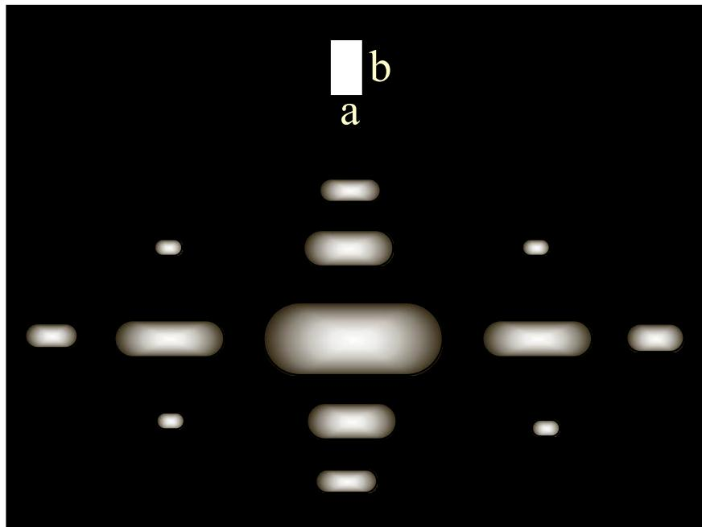
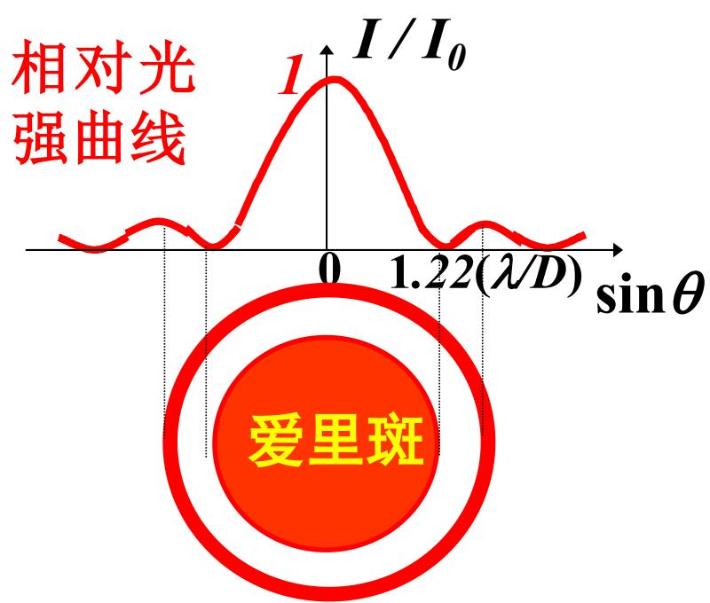

# 5.4.1 ==方孔与圆孔夫琅禾费衍射==

> **脉络**：[[5.3.1 夫琅禾费单缝衍射装置、振幅和强度公式|单缝夫琅禾费衍射]]只在一个方向上有有限宽度，所以只出现一个 $\sin\alpha/\alpha$ 因子。方孔在 $x$、$y$ 两个方向上都有有限尺寸，因此衍射场会变成两个单缝因子的乘积。圆孔没有直角方向的分离结构，积分结果改由一阶贝塞尔函数 $J_1(x)$ 表示，并形成后面讨论[[第五章光波衍射预习TODO|光学仪器分辨本领]]所需要的==艾里斑==。

---

### 一、方孔衍射为什么是两个单缝衍射相乘

设矩形孔在 $x_0$ 方向宽度为 $a$，在 $y_0$ 方向宽度为 $b$。后焦面上的场点用两个衍射角表示：

- $\theta_1$：沿 $x$ 方向的衍射角；
- $\theta_2$：沿 $y$ 方向的衍射角。

孔面上的面元为：

$$
dS=dx_0dy_0
$$

若孔面上照明振幅为常数 $A$，在夫琅禾费条件下，相因子可以写成：

$$
e^{-ikx_0\sin\theta_1}e^{-iky_0\sin\theta_2}
$$

所以复振幅积分分成两个一维积分：

$$
\widetilde U(\theta_1,\theta_2)
=\frac{-i}{\lambda f}Ae^{ikL_0}
\int_{-a/2}^{a/2}e^{-ikx_0\sin\theta_1}dx_0
\int_{-b/2}^{b/2}e^{-iky_0\sin\theta_2}dy_0
$$

积分后得到：

$$
\widetilde U(\theta_1,\theta_2)
=\widetilde c
\left(\frac{\sin\alpha}{\alpha}\right)
\left(\frac{\sin\beta}{\beta}\right)
$$

其中：

$$
\widetilde c=\frac{-i}{\lambda f}Aabe^{ikL_0}
$$

$$
\boxed{\alpha=\frac{\pi a\sin\theta_1}{\lambda}},
\qquad
\boxed{\beta=\frac{\pi b\sin\theta_2}{\lambda}}
$$

于是光强为：（背诵）

$$
\boxed{
I(\theta_1,\theta_2)
=I_0\left(\frac{\sin\alpha}{\alpha}\right)^2
\left(\frac{\sin\beta}{\beta}\right)^2
}
$$

这说明方孔图样可以看成==两个方向上的单缝衍射相乘==：一个方向决定横向展宽，另一个方向决定纵向展宽。

---

### 二、方孔衍射图样的暗区和中央亮斑

方孔光强是两个因子的乘积，所以只要其中一个方向的因子为零，整个光强就为零。

沿 $x$ 方向，暗纹条件为：

$$
\alpha=k_1\pi\qquad(k_1=\pm1,\pm2,\cdots)
$$

即：

$$
\boxed{a\sin\theta_1=k_1\lambda}
$$

沿 $y$ 方向，暗纹条件为：

$$
\beta=k_2\pi\qquad(k_2=\pm1,\pm2,\cdots)
$$

即：

$$
\boxed{b\sin\theta_2=k_2\lambda}
$$

因此，方孔衍射图样中会出现沿两个方向排列的暗线和亮斑。中央亮斑位于：

$$
(\theta_1,\theta_2)=(0,0)
$$

此时：

$$
I(0,0)=I_0
$$

如果 $a$ 比 $b$ 大，沿 $x$ 方向的衍射角宽度较小；如果 $b$ 比 $a$ 小，沿 $y$ 方向的衍射角宽度较大。也就是说，孔的某个方向越窄，图样在对应角方向上越宽。

---

### 三、方孔衍射的反比律

中央亮斑在 $x$ 方向的第一个暗纹满足：

$$
a\sin\theta_{1,0}=\lambda
$$

小角度下：

$$
\Delta\theta_1\approx\theta_{1,0}\approx\frac{\lambda}{a}
$$

因此：

$$
\boxed{a\Delta\theta_1\approx\lambda}
$$

同理，在 $y$ 方向：

$$
\boxed{b\Delta\theta_2\approx\lambda}
$$
（背诵）
这就是教材说的==衍射孔径线度与衍射发散角的反比律==。它和[[5.3.2 单缝衍射图样特点与斜入射情况#四、中央亮纹的半角宽度|单缝中央亮纹半角宽度]]是同一个规律的二维推广。

---

### 四、斜入射方孔衍射

如果入射光不是正入射，而是在两个方向上分别带有入射角分量 $i_1$、$i_2$，孔面上的入射场会带有线性相位：

$$
\widetilde U_0(Q)=A e^{-ik(x_0\sin i_1+y_0\sin i_2)}
$$

此时积分结果的形式不变，仍然是两个 sinc 因子相乘：

$$
\widetilde U(\theta_1,\theta_2)
=\widetilde c
\left(\frac{\sin\alpha}{\alpha}\right)
\left(\frac{\sin\beta}{\beta}\right)
$$

但宗量改为：

$$
\boxed{\alpha=\frac{\pi a(\sin\theta_1+\sin i_1)}{\lambda}}
$$

$$
\boxed{\beta=\frac{\pi b(\sin\theta_2+\sin i_2)}{\lambda}}
$$

所以斜入射方孔衍射与[[5.3.2 单缝衍射图样特点与斜入射情况#七、斜入射单缝衍射|斜入射单缝衍射]]相同：函数形式不变，图样中心发生平移。

---

### 五、圆孔衍射的积分结果

圆孔半径设为 $R$，直径为：

$$
D=2R
$$

圆孔具有旋转对称性，因此衍射图样不是横竖分离的亮斑，而是一组同心圆环。用极坐标 $\rho,\varphi$ 计算孔面积分，教材给出的结果为：

$$
\widetilde U(\theta)
=\frac{-i}{\lambda f}Ae^{ikL_0}
\pi R^2
\left[\frac{2J_1\left(\frac{2\pi R\sin\theta}{\lambda}\right)}{\frac{2\pi R\sin\theta}{\lambda}}
\right]
$$

令：

$$
\boxed{x=\frac{2\pi R\sin\theta}{\lambda}=\frac{\pi D\sin\theta}{\lambda}}
$$

则：

$$
\widetilde U(\theta)=\widetilde c\frac{2J_1(x)}{x}
$$

其中：

$$
\widetilde c=\frac{-i}{\lambda f}A\pi R^2e^{ikL_0}
$$

光强为：（背诵）

$$
\boxed{
I(\theta)=I_0\left(\frac{2J_1(x)}{x}\right)^2
}
$$

这里 $J_1(x)$ 是一阶贝塞尔函数。它的出现说明：圆孔不能简单拆成两个互相独立的一维单缝问题。

---

### 六、艾里斑和第一个暗环

圆孔衍射图样的中央亮斑叫做==艾里斑==。它周围有较弱的同心亮环和暗环。

教材列出的重要位置包括：

$$
\begin{array}{c|cccccc}
x & 0 & 1.22\pi & 1.64\pi & 2.23\pi & 2.68\pi & 3.24\pi \\
\hline
I/I_0 & 1 & 0 & 0.017 & 0 & 0.004 & 0
\end{array}
$$

第一个暗环满足：

$$
x=1.22\pi
$$

代入：

$$
x=\frac{\pi D\sin\theta_0}{\lambda}
$$

得到：

$$
\frac{\pi D\sin\theta_0}{\lambda}=1.22\pi
$$

所以：

$$
\boxed{\sin\theta_0=1.22\frac{\lambda}{D}}
$$

小角度下：

$$
\boxed{\Delta\theta_0\approx1.22\frac{\lambda}{D}}
$$

也就是：（背诵）

$$
\boxed{D\Delta\theta_0\approx1.22\lambda}
$$

这个式子和方孔、单缝的反比律一致，只是系数从 $1$ 变成 $1.22$。系数不同的原因是孔径形状不同：方孔的一维零点来自 $\sin x=0$，圆孔的零点来自贝塞尔函数组合 $2J_1(x)/x$ 的第一个零点。

---

### 七、本节需要记住的核心结论

> **结论一**：方孔夫琅禾费衍射是两个单缝衍射因子的乘积：
> $$
> I(\theta_1,\theta_2)=I_0
> \left(\frac{\sin\alpha}{\alpha}\right)^2
> \left(\frac{\sin\beta}{\beta}\right)^2
> $$
> 其中
> $$
> \alpha=\frac{\pi a\sin\theta_1}{\lambda},
> \qquad
> \beta=\frac{\pi b\sin\theta_2}{\lambda}
> $$

> **结论二**：方孔中央亮斑半角宽度满足
> $$
> a\Delta\theta_1\approx\lambda,
> \qquad
> b\Delta\theta_2\approx\lambda
> $$

> **结论三**：圆孔夫琅禾费衍射强度为
> $$
> I(\theta)=I_0\left(\frac{2J_1(x)}{x}\right)^2,
> \qquad
> x=\frac{\pi D\sin\theta}{\lambda}
> $$
> 第一个暗环给出艾里斑半角宽度：
> $$
> \Delta\theta_0\approx1.22\frac{\lambda}{D}
> $$
