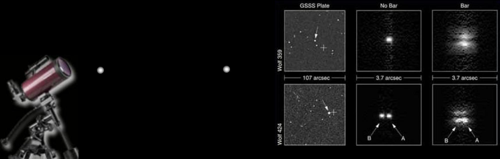
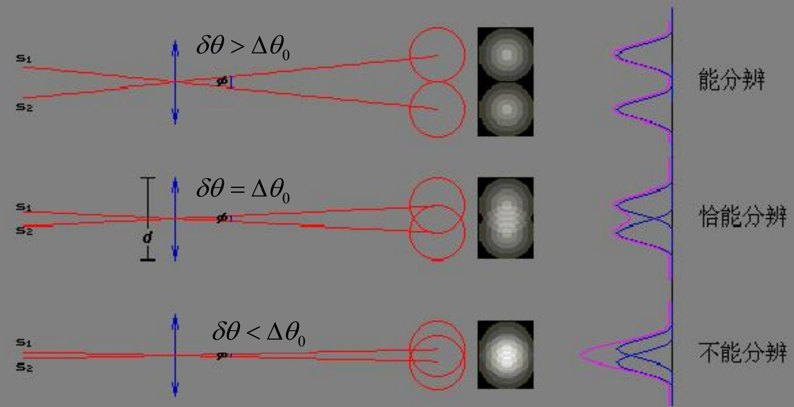
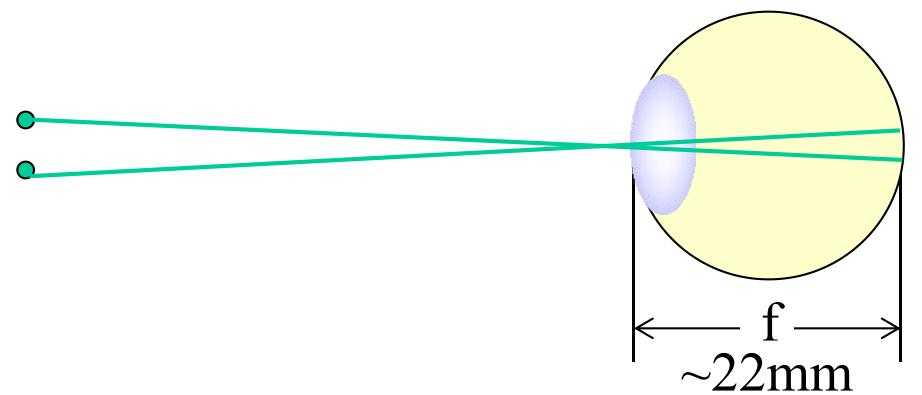
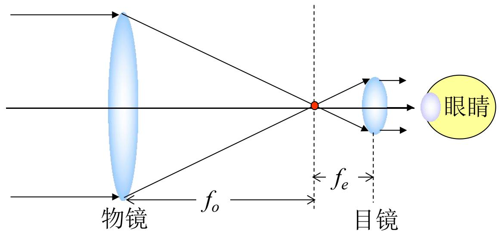
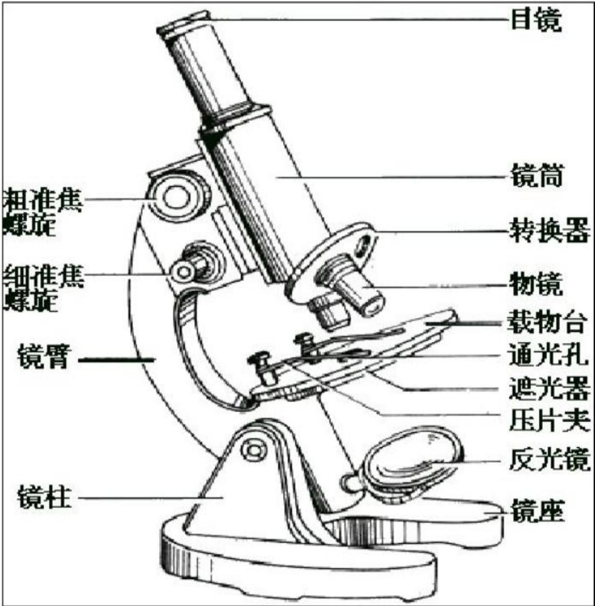
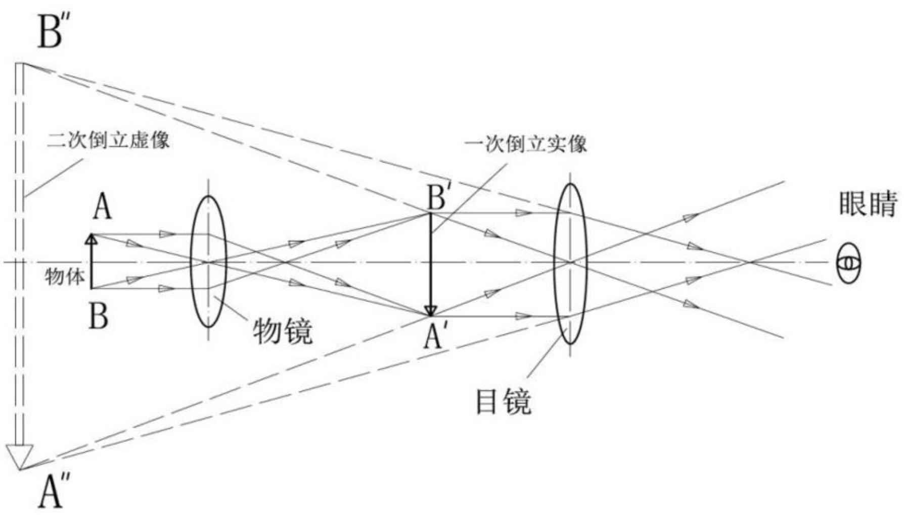

# 5.4.2 ==光学仪器分辨本领==与瑞利判据

> **脉络**：[[5.4.1 方孔与圆孔夫琅禾费衍射|圆孔夫琅禾费衍射]]说明，一个理想圆孔透镜不会把点物成成无限小的点，而是成成一个有有限角宽度的==艾里斑==。因此，光学仪器的分辨本领不是只由几何光学决定，还受到衍射限制。本节的核心问题是：两个很近的物点成像后对应两个艾里斑，怎样判断它们还能不能被分辨。

---

### 一、从几何光学像点到波动光学像斑

几何光学中常说：

- 一个物点对应一个像点；
- 一个物体可以看成许多物点的集合；
- 因此一个物体成像为许多像点的集合。

但波动光学中，透镜有有限口径。有限圆孔会产生圆孔夫琅禾费衍射，所以一个物点通过透镜后并不是严格的像点，而是一个艾里斑。

因此更准确的说法是：

- 物点 $\rightarrow$ 像斑；
- 物点集合 $\rightarrow$ 像斑集合。

这就是光学仪器分辨本领的根本来源：两个物点如果相距太近，它们对应的两个艾里斑会严重重叠，观察时就难以判断它们是两个独立物点。

---

### 二、瑞利判据

设两个亮度相同、波长相同、彼此独立的物点，对光学系统张开的角间隔为 $\delta\theta$。每个物点通过圆孔口径成像后，艾里斑的半角宽度为 $\Delta\theta_0$。

圆孔衍射给出：

$$
\Delta\theta_0\approx1.22\frac{\lambda}{D}
$$

其中：

- $\lambda$：光波波长；
- $D$：光学系统有效圆孔口径，常常就是物镜口径；
- $\Delta\theta_0$：从艾里斑中心到第一暗环的角距离。

**瑞利判据**规定：

$$
\delta\theta>\Delta\theta_0
\quad\Rightarrow\quad
\text{能分辨}
$$

$$
\delta\theta<\Delta\theta_0
\quad\Rightarrow\quad
\text{不能分辨}
$$

$$
\delta\theta=\Delta\theta_0
\quad\Rightarrow\quad
\text{恰能分辨}
$$

因此，理想圆孔光学仪器的最小可分辨角可以写成：

$$
\boxed{\delta\theta_m\approx1.22\frac{\lambda}{D}}
$$

这个式子非常重要。它说明：

- 口径 $D$ 越大，最小可分辨角越小，分辨本领越强；
- 波长 $\lambda$ 越短，最小可分辨角越小，分辨本领越强；
- 单纯增加放大倍数不能突破由口径和波长决定的衍射极限。

---

### 三、人眼的分辨本领

人眼也可以看作一个有限口径成像系统。白天瞳孔直径较小，教材取：

$$
D_e\sim2\ \mathrm{mm}
$$

人眼最敏感波长约为：

$$
\lambda\sim550\ \mathrm{nm}
$$

于是人眼的角分辨率约为：

$$
\delta\theta_e
=1.22\frac{\lambda}{D_e}
=1.22\times\frac{550\ \mathrm{nm}}{2\ \mathrm{mm}}
\approx3.3\times10^{-4}\ \mathrm{rad}
\approx1'
$$

正常明视距离取：

$$
l=25\ \mathrm{cm}
$$

对应的线分辨距离为：

$$
\delta y_e=l\cdot\delta\theta_e
=25\ \mathrm{cm}\times3.3\times10^{-4}
\approx0.08\ \mathrm{mm}
$$

在 $10\ \mathrm m$ 远处，人眼对应的可分辨线距离为：

$$
\delta y_e=10\ \mathrm m\times3.3\times10^{-4}
\approx3.3\ \mathrm{mm}
$$

这些估算说明，人眼的分辨本领数量级大约是 $1'$。实际视觉还会受视网膜感光细胞密度、照明条件、像差和对比度影响。

---

### 四、人眼感光细胞密度的估算

教材还用夜间瞳孔直径估算感光细胞大小。夜间取：

$$
D_e\sim8\ \mathrm{mm},\qquad \lambda\sim550\ \mathrm{nm}
$$

角分辨率约为：

$$
\delta\theta_e
=1.22\frac{\lambda}{D_e}
=1.22\times\frac{550\ \mathrm{nm}}{8\ \mathrm{mm}}
\approx0.8\times10^{-4}\ \mathrm{rad}
$$

人眼焦距取：

$$
f\approx22\ \mathrm{mm}
$$

教材估算视网膜上对应的细胞尺度为：

$$
d\approx\frac{1}{1.33}f\delta\theta_e\approx1.3\ \mu\mathrm m
$$

单个感光细胞面积约为：

$$
s\approx\frac{\pi}{4}d^2\approx1.3\times10^{-6}\ \mathrm{mm^2}
$$

面密度为：

$$
n\approx\frac{1}{s}\sim10^7\ \mathrm{个/mm^2}
$$

若视网膜面积取：

$$
S\approx200\ \mathrm{mm^2}
$$

感光细胞总数数量级为：

$$
N=nS\sim1\ \mathrm{亿个}
$$

这部分的意义是：光学衍射极限和生理结构尺度在数量级上要相互匹配。如果感光细胞远比光学像斑粗，就会浪费光学分辨能力；如果感光细胞远比光学像斑细，也不能从衍射受限的像中得到更多细节。

---

### 五、望远镜的分辨本领

望远镜观察远处物体时，真正决定衍射极限的是物镜口径 $D_o$。因为远处来的光首先经过物镜，物镜就是主要孔径光阑。

望远镜角放大倍数为：

$$
M=\frac{f_o}{f_e}
$$

其中：

- $f_o$：物镜焦距；
- $f_e$：目镜焦距。

望远镜的最小分辨角为：

$$
\boxed{\delta\theta_m\approx1.22\frac{\lambda}{D_o}}
$$

有效放大率的思想是：望远镜把物镜已经能分辨的最小角度放大到刚好等于人眼可分辨角。若人眼最小分辨角为 $\delta\theta_e$，则：

$$
\boxed{M_{\mathrm{eff}}\approx\frac{\delta\theta_e}{\delta\theta_m}}
$$

教材例题取：

$$
D_o=2000\ \mathrm{mm},\qquad \lambda=550\ \mathrm{nm}
$$

则：

$$
\delta\theta_m
\approx1.22\frac{550\ \mathrm{nm}}{2000\ \mathrm{mm}}
\approx3.3\times10^{-7}\ \mathrm{rad}
\approx0.001'
$$

若人眼：

$$
\delta\theta_e\approx3.3\times10^{-4}\ \mathrm{rad}
$$

则有效放大倍数为：

$$
M_{\mathrm{eff}}
\approx\frac{3.3\times10^{-4}}{3.3\times10^{-7}}
\approx10^3
$$

这里要注意：超过有效放大率后，图像会变大，但新细节不会增加。因为物镜口径已经决定了可分辨角。

---

### 六、显微镜的分辨本领和数值孔径

显微镜要分辨的是物面上相距很小的两个点。教材给出的最终结果为：

$$
\boxed{
\delta y_{0m}=0.61\frac{\lambda_0}{n_0\sin u_0}
}
$$

其中：

- $\delta y_{0m}$：物面上最小可分辨距离；
- $\lambda_0$：真空或空气中的波长；
- $n_0$：物方介质折射率；
- $u_0$：物方孔径角；
- $n_0\sin u_0$：显微镜物镜的数值孔径。

定义：

$$
\boxed{N.A.=n_0\sin u_0}
$$

所以：

$$
\boxed{
\delta y_{0m}=0.61\frac{\lambda_0}{N.A.}
}
$$

这个公式说明，提高显微镜分辨本领主要有两个途径：

- 减小波长 $\lambda_0$；
- 增大数值孔径 $N.A.$。

教材给出有效放大倍数：

$$
M_{\mathrm{eff}}=\frac{\delta y_e}{\delta y_{0m}}
$$

例如 $N.A.=1.5$、$\lambda_0=550\ \mathrm{nm}$，若取人眼线分辨距离 $\delta y_e\approx0.1\ \mathrm{mm}$，则：

$$
M_{\mathrm{eff}}
=\frac{0.1\ \mathrm{mm}}{0.61\times\frac{550\ \mathrm{nm}}{1.5}}
\approx450
$$

这说明传统光学显微镜不能只靠增加目镜放大率来提高分辨率。超过有效放大倍数后，只是把已经模糊的衍射受限图像放大。

---

### 七、电子显微镜为什么分辨率更高

传统光学显微镜受可见光波长限制。若改用运动电子的物质波，波长可以非常短，所以分辨本领可以显著提高。

电子德布罗意波长由动量决定：

$$
\lambda_e=\frac{h}{p}
$$

若电子由加速电压 $V$ 加速，在非相对论近似下：

$$
\frac{p^2}{2m}=eV
$$

所以：

$$
\boxed{\lambda_e=\frac{h}{\sqrt{2meV}}}
$$

教材给出电子显微镜的分辨本领数量级：

$$
\delta y_m^E\approx0.61\frac{\lambda_e}{N.A.}
$$

当电子束发散角较小，教材取 $N.A.\sim0.16$ 时：

$$
\delta y_m^E\approx0.61\frac{\lambda_e}{0.16}\approx4\lambda_e
$$

因此，加速电压越高，电子波长越短，理论分辨本领越强。实际电子显微镜还会受电子透镜像差、样品制备和探测器性能限制。

---

### 八、像记录介质的空间分辨率

光学系统形成的像最终还要被胶片、传感器或其他介质记录。记录介质的空间分辨率必须不低于光学系统提供的细节。

照相机光圈数为 $4.0$ 时：

$$
\frac{D}{f}=\frac{1}{4}
$$

像方最小可分辨距离约为：

$$
\delta y_m'
\approx f\Delta\theta_0
\approx f\cdot1.22\frac{\lambda}{D}
=1.22\frac{\lambda}{D/f}
$$

代入 $D/f=1/4$：

$$
\delta y_m'
\approx1.22\times4\lambda
$$

若取：

$$
\lambda\approx550\ \mathrm{nm}
$$

则：

$$
\delta y_m'\approx2.7\ \mu\mathrm m
$$

对应记录介质的空间分辨率应满足：

$$
N\ge\frac{1}{\delta y_m'}\approx370\ \text{线/mm}
$$

这说明，成像系统、放大系统和记录介质必须匹配。若记录介质分辨率不足，光学系统已经形成的细节也无法保存。

---

### 九、本节需要记住的核心结论

> **结论一**：圆孔口径使物点成像为艾里斑，理想光学仪器的最小可分辨角由瑞利判据给出：
> $$
> \delta\theta_m\approx1.22\frac{\lambda}{D}
> $$

> **结论二**：望远镜分辨本领主要由物镜口径决定：
> $$
> \delta\theta_m\approx1.22\frac{\lambda}{D_o}
> $$
> 口径越大，角分辨率越高。

> **结论三**：显微镜物面最小可分辨距离为：
> $$
> \delta y_{0m}=0.61\frac{\lambda_0}{N.A.},
> \qquad N.A.=n_0\sin u_0
> $$
> 要提高显微镜分辨本领，应减小波长或增大数值孔径。

> **结论四**：有效放大率不是越大越好。超过衍射极限决定的信息量后，继续放大只能放大像斑，不能产生新的细节。
