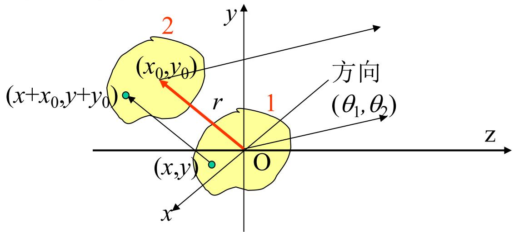
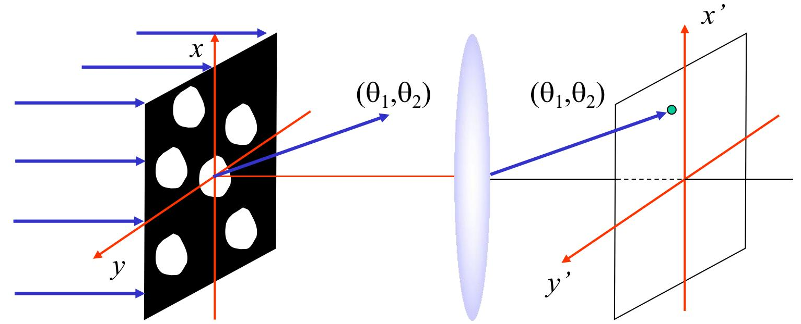
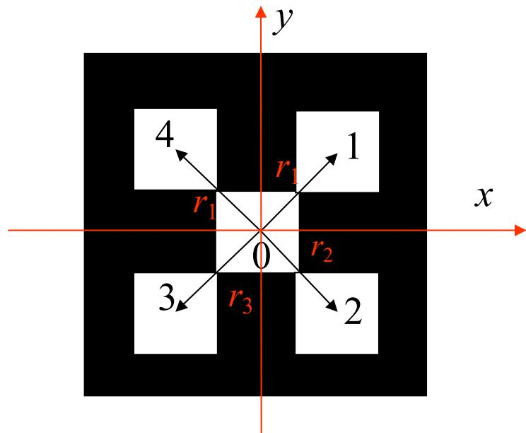

# 5.5.1 ==位移-相移定理==与全同结构衍射场

> **脉络**：[[5.4.1 方孔与圆孔夫琅禾费衍射|前面]]已经会求单个孔径的夫琅禾费衍射场。现在要处理多个相同孔径的组合。核心方法是==位移-相移定理==：如果孔径形状不变，只是整体平移，那么它的夫琅禾费衍射场振幅大小不变，只多出一个与观察方向有关的相位因子。后面学习[[第五章光波衍射预习TODO|光栅]]时，本节就是基础。

---

### 一、为什么孔径平移会变成衍射场相移

设原来的孔径复振幅分布为：

$$
\widetilde U_0(x,y)
$$

它在方向 $(\theta_1,\theta_2)$ 上的夫琅禾费衍射场为：

$$
\widetilde U_1(\theta_1,\theta_2)
$$

现在把整个孔径平移 $(x_0,y_0)$，孔径形状不变，只是位置改变。对于同一个观察方向 $(\theta_1,\theta_2)$，平移前后从孔径面到远场方向的相位会多出一项：

$$
kr_2-kr_1=-k(x_0\sin\theta_1+y_0\sin\theta_2)
$$

因此平移后的衍射场为：

$$
\boxed{
\widetilde U_2(\theta_1,\theta_2)
=e^{-ik(x_0\sin\theta_1+y_0\sin\theta_2)}
\widetilde U_1(\theta_1,\theta_2)
}
$$

这个结果的重点是：

- 孔径形状没有变，所以单个孔径自己的衍射包络没有变；
- 位置变了，所以到同一远场方向的附加光程变了；
- 附加光程只表现为复振幅前面的相位因子。

这和[[4.2.4 两平行平面波的叠加与干涉条纹空间频率（期末要考）|平面波叠加中的相位差]]是同一个思想：空间位置差通过光程差变成相位差，相位差再决定相干叠加结果。

---

### 二、位移-相移定理的标准写法（期末会用到）

把相位拆成两个方向的贡献：

$$
\delta_1=-kx_0\sin\theta_1
$$

$$
\delta_2=-ky_0\sin\theta_2
$$

则：

$$
\boxed{
\widetilde U'(\theta_1,\theta_2)
=e^{i(\delta_1+\delta_2)}\widetilde U(\theta_1,\theta_2)
}
$$

其中：

$$
\boxed{
\begin{cases}
\delta_1=-kx_0\sin\theta_1 \\
\delta_2=-ky_0\sin\theta_2
\end{cases}}
$$

这就是教材给出的==位移-相移定理==。

> **结论**：在夫琅禾费衍射系统中，孔径面上的空间位移 $(x_0,y_0)$，对应远场复振幅中的相位因子 $e^{-ik(x_0\sin\theta_1+y_0\sin\theta_2)}$。

这里隐含一个重要条件：系统要具有**空间不变性**。也就是说，同一个孔径放在不同横向位置时，除了由位置带来的光程相位差外，系统本身对它们的处理方式相同。

---

### 三、全同结构的夫琅禾费衍射场

所谓==全同结构==，是指多个孔径单元形状完全相同，只是位置不同。设第 $i$ 个单元相对中心单元的位移为：

$$
(x_i,y_i)
$$

若中心单元的夫琅禾费衍射场为：

$$
\widetilde U_0(\theta_1,\theta_2)
$$

则第 $i$ 个单元的衍射场为：

$$
\widetilde U_i(\theta_1,\theta_2)
=e^{i(\delta_{i1}+\delta_{i2})}\widetilde U_0(\theta_1,\theta_2)
$$

其中：

$$
\delta_{i1}=-kx_i\sin\theta_1,
\qquad
\delta_{i2}=-ky_i\sin\theta_2
$$

总衍射场是所有单元复振幅相加：

$$
\boxed{
\widetilde U(\theta_1,\theta_2)
=\sum_{i=0}^{N-1}\widetilde U_i(\theta_1,\theta_2)
=\widetilde U_0(\theta_1,\theta_2)
\sum_{i=0}^{N-1}e^{i(\delta_{i1}+\delta_{i2})}
}
$$

这个公式可以分成两部分理解：

- $\widetilde U_0(\theta_1,\theta_2)$：单个孔径单元的衍射包络；
- $\sum e^{i(\delta_{i1}+\delta_{i2})}$：多个全同单元之间的干涉因子。

所以，全同结构的衍射图样不是重新从头计算每一个孔。只要会算一个单元，再把所有位置带来的相位因子相加即可。

---

### 四、五方孔例题的结构

教材例题是五个相同方孔：中心一个，四周四个。每个小方孔的边长相同，因此单孔衍射包络都是同一个：

$$
\widetilde U_0(\theta_1,\theta_2)
=\widetilde c
\left(\frac{\sin\alpha}{\alpha}\right)
\left(\frac{\sin\beta}{\beta}\right)
$$

其中对方孔 $a=b$ 的情况，有：

$$
\alpha=\frac{\pi a\sin\theta_1}{\lambda},
\qquad
\beta=\frac{\pi a\sin\theta_2}{\lambda}
$$

设四个外围孔的位置分别为：

$$
(a,a),\quad(a,-a),\quad(-a,-a),\quad(-a,a)
$$

则四个相位因子分别为：

$$
e^{-ik(a\sin\theta_1+a\sin\theta_2)}
$$

$$
e^{-ik(a\sin\theta_1-a\sin\theta_2)}
$$

$$
e^{-ik(-a\sin\theta_1-a\sin\theta_2)}
$$

$$
e^{-ik(-a\sin\theta_1+a\sin\theta_2)}
$$

再加上中心孔的相位因子 $1$，总场为：

$$
\widetilde U(\theta_1,\theta_2)
=\widetilde U_0(\theta_1,\theta_2)
\left[
1+e^{-ik(a\sin\theta_1+a\sin\theta_2)}
+e^{-ik(a\sin\theta_1-a\sin\theta_2)}
+e^{-ik(-a\sin\theta_1-a\sin\theta_2)}
+e^{-ik(-a\sin\theta_1+a\sin\theta_2)}
\right]
$$

利用成对指数项：

$$
e^{-iA}+e^{iA}=2\cos A
$$

可写成：

$$
\boxed{
\widetilde U(\theta_1,\theta_2)
=\widetilde U_0(\theta_1,\theta_2)
\left[
1+2\cos k(a\sin\theta_1+a\sin\theta_2)
+2\cos k(a\sin\theta_1-a\sin\theta_2)
\right]
}
$$

最后光强为：

$$
\boxed{
I(\theta_1,\theta_2)
=\widetilde U(\theta_1,\theta_2)\widetilde U^*(\theta_1,\theta_2)
}
$$

---

### 五、这一节和光栅的关系

光栅可以看成大量相同狭缝周期排列。每个狭缝给出自己的单缝衍射包络；不同狭缝之间因为位置不同，会有固定相位差。

因此，光栅衍射通常可以分成：

- **单缝衍射因子**：决定总体包络；
- **多缝干涉因子**：决定很细很亮的主极大位置。

本节的位移-相移定理就是推导多缝干涉因子的准备。它把“结构在空间中的周期排列”转化成“远场中的相位等差数列”。这也和[[4.2.4 两平行平面波的叠加与干涉条纹空间频率（期末要考）#三、 条纹间距与==空间频率==|空间频率]]有关：空间周期越小，相邻单元的相位随角度变化越快，远场图样中的细节也越密。

---

### 六、本节需要记住的核心结论

> **结论一**：孔径整体平移 $(x_0,y_0)$ 后，夫琅禾费衍射场只多出相位因子：
> $$
> \widetilde U'(\theta_1,\theta_2)
> =e^{-ik(x_0\sin\theta_1+y_0\sin\theta_2)}
> \widetilde U(\theta_1,\theta_2)
> $$

> **结论二**：多个全同孔径的总衍射场等于“单元衍射场”乘以“位置相位因子和”：
> $$
> \widetilde U(\theta_1,\theta_2)
> =\widetilde U_0(\theta_1,\theta_2)
> \sum_{i=0}^{N-1}e^{-ik(x_i\sin\theta_1+y_i\sin\theta_2)}
> $$

> **结论三**：全同结构的衍射图样可以理解为两层相干叠加：单元自身产生包络，单元之间的位置相移产生干涉细节。
