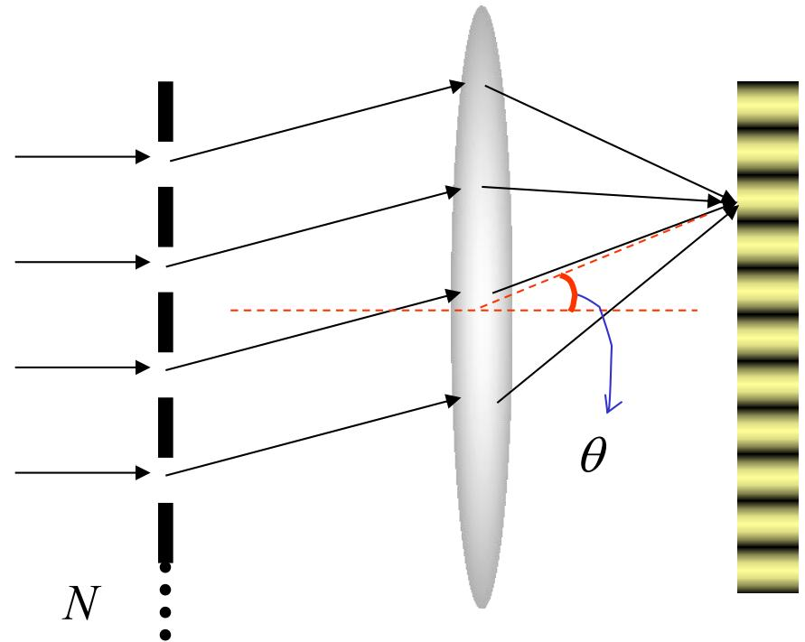
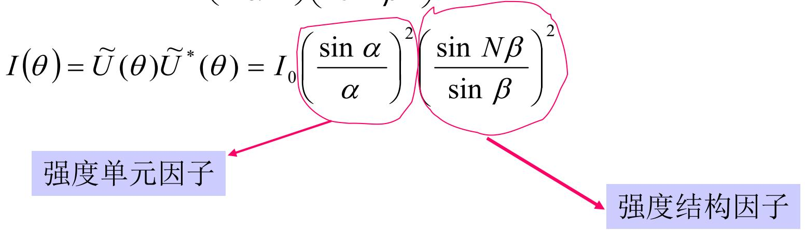
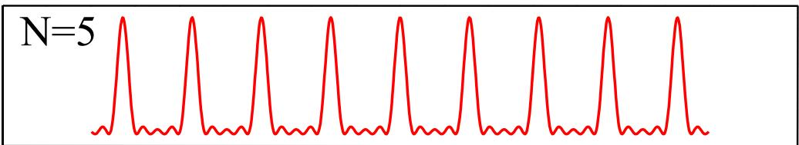
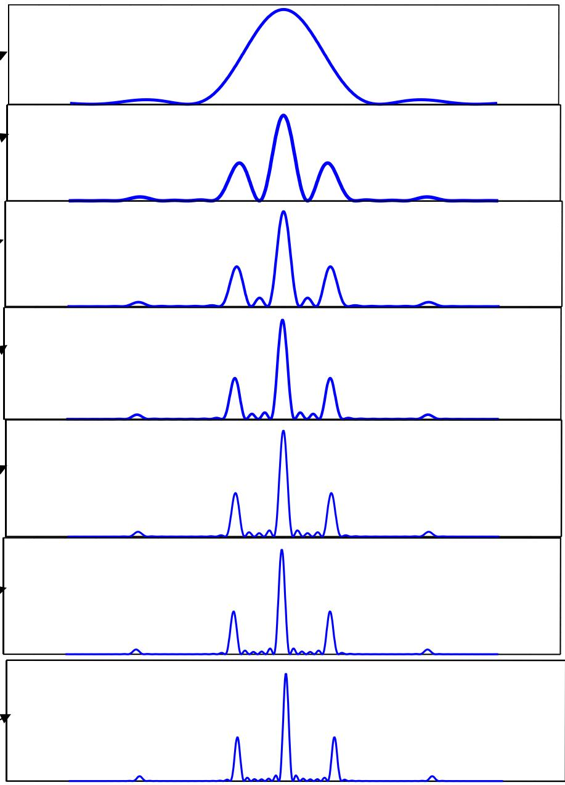
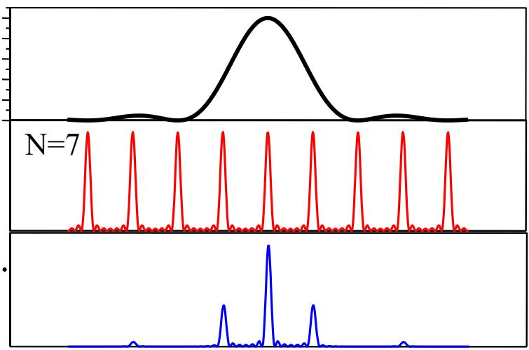

# 5.6.1 ==一维光栅==的结构参数与主极大条件

> **脉络**：[[5.5.1 位移-相移定理与全同结构衍射场|位移-相移定理]]说明：多个全同单元的远场衍射，可以写成“单元衍射场”乘以“位置相位因子和”。一维光栅就是大量等间距狭缝组成的全同结构。因此光栅衍射强度会分成两部分：单缝衍射给出宽包络，多缝干涉给出很细锐的主极大。

---

### 一、什么是一维光栅

**光栅**：凡是含有众多全同单元，并且排列规则、取向有序的周期结构，都可以称为光栅。

最简单的是==一维透射光栅==。它由许多互相平行的狭缝组成：

- 透光缝宽为 $a$；
- 挡光宽度为 $b$；
- 一个透光缝加一个挡光间隔构成一个周期；
- 光栅常数为：

$$
\boxed{d=a+b}
$$

常用参数还有：

$$
\boxed{n=\frac{1}{d}}
$$

其中 $n$ 是单位长度内的刻线数，也叫单元密度。例如 $600\ \text{线/mm}$、$1200\ \text{线/mm}$。

若光栅有效宽度为 $D$，则有效缝数为：

$$
\boxed{N=nD=\frac{D}{d}}
$$



这里的 $N$ 很重要。光栅的主峰越细锐，通常不是因为单个缝更窄，而是因为参与相干叠加的缝数很多。

---

### 二、相邻狭缝的相位差

正入射时，相邻狭缝间距为 $d$。在衍射角 $\theta$ 方向上，相邻狭缝发出的光到达远场的光程差为：

$$
\Delta l=d\sin\theta
$$

对应相位差为：

$$
\delta=\frac{2\pi}{\lambda}d\sin\theta
$$

教材常令：

$$
\boxed{\beta=\frac{\delta}{2}=\frac{\pi d\sin\theta}{\lambda}}
$$

这和[[5.5.1 位移-相移定理与全同结构衍射场#二、位移-相移定理的标准写法|位移-相移定理]]完全一致：每个狭缝相对前一个狭缝平移一个周期 $d$，于是远场中相邻贡献之间出现固定相位差。

---

### 三、光栅衍射场公式

单个狭缝的夫琅禾费衍射场为：

$$
\widetilde U_0(\theta)=\widetilde c\frac{\sin\alpha}{\alpha}
$$

其中：

$$
\boxed{\alpha=\frac{\pi a\sin\theta}{\lambda}}
$$

$N$ 个等间距狭缝的复振幅相加是等比数列：

$$
1+e^{i\delta}+e^{i2\delta}+\cdots+e^{i(N-1)\delta}
$$

求和后得到结构因子：

$$
\frac{1-e^{iN\delta}}{1-e^{i\delta}}
=e^{i(N-1)\beta}\frac{\sin N\beta}{\sin\beta}
$$

因此光栅总衍射场为：

$$
\boxed{
\widetilde U(\theta)
=\widetilde c e^{i(N-1)\beta}
\left(\frac{\sin\alpha}{\alpha}\right)
\left(\frac{\sin N\beta}{\sin\beta}\right)
}
$$

光强为：

$$
\boxed{
I(\theta)=I_0
\left(\frac{\sin\alpha}{\alpha}\right)^2
\left(\frac{\sin N\beta}{\sin\beta}\right)^2
}
$$



这两个因子的意义要分清：

- $\left(\dfrac{\sin\alpha}{\alpha}\right)^2$：==单元因子==，来自单个狭缝的衍射包络；
- $\left(\dfrac{\sin N\beta}{\sin\beta}\right)^2$：==结构因子==，来自 $N$ 个狭缝之间的相干叠加。

光栅图样的核心特点，就是细锐主峰被单缝宽包络调制。

---

### 四、主极大位置：光栅公式

主极大出现在所有狭缝贡献同相的位置。相邻狭缝相位差满足：

$$
\delta=2k\pi
$$

等价于：

$$
\beta=k\pi
$$

代入 $\beta=\frac{\pi d\sin\theta}{\lambda}$：

$$
\frac{\pi d\sin\theta_k}{\lambda}=k\pi
$$

得到：

$$
\boxed{d\sin\theta_k=k\lambda\qquad(k=0,\pm1,\pm2,\cdots)}
$$

这就是==光栅公式==。

在主极大位置，结构因子满足极限：

$$
\lim_{\beta\to k\pi}\left(\frac{\sin N\beta}{\sin\beta}\right)^2=N^2
$$

所以主极大强度为：

$$
\boxed{I(\theta_k)=N^2 I_0(\theta_k)}
$$

这里 $I_0(\theta_k)$ 仍受单缝包络影响。也就是说，多缝干涉把能量集中到满足光栅公式的离散方向，但每一级主峰到底有多亮，还要看单缝因子在该角度的取值。



---

### 五、主峰半角宽度

先把“半角宽度”这几个字说清楚。光栅主极大不是一条数学上无限细的线，而是一个很窄的亮峰。第 $k$ 级主峰的中心方向是 $\theta_k$，满足光栅公式：

$$
d\sin\theta_k=k\lambda
$$

这里的 $\theta_k$ 是==第 $k$ 级衍射光相对光栅法线，也就是相对零级方向的衍射角==。

==主峰半角宽度== $\Delta\theta_k$ 指的是：从第 $k$ 级主峰中心方向 $\theta_k$ 到它旁边第一个暗点方向的角距离。两个相邻第一暗点之间的角距离才是这个主峰的全角宽度，约为 $2\Delta\theta_k$。

```text
光强 I
  ^
  |                         第 k 级主峰
  |                            /\
  |                           /  \
  |                          /    \
  |_________________________/      \____________________> 衍射角 theta
                       theta_k-Delta theta_k
                              theta_k
                                      theta_k+Delta theta_k

半角宽度：从 theta_k 到任一侧第一个暗点的角距离
全角宽度：从左侧第一个暗点到右侧第一个暗点，约为 2 Delta theta_k
```

第 $k$ 级主峰两侧第一个暗点满足：

$$
d\sin(\theta_k\pm\Delta\theta_k)
=\left(k\pm\frac{1}{N}\right)\lambda
$$

对小偏移作近似：

$$
\sin(\theta_k\pm\Delta\theta_k)
\approx\sin\theta_k\pm\Delta\theta_k\cos\theta_k
$$

代入后，利用 $d\sin\theta_k=k\lambda$，得到：

$$
d\cos\theta_k\cdot\Delta\theta_k=\frac{\lambda}{N}
$$

所以第 $k$ 级主峰半角宽度为：

$$
\boxed{
\Delta\theta_k=\frac{\lambda}{Nd\cos\theta_k}
=\frac{\lambda}{D\cos\theta_k}
}
$$

这说明：

- 有效宽度 $D$ 越大，主峰越窄；
- 缝数 $N$ 越多，主峰越窄；
- 高级次处 $\cos\theta_k$ 较小，主峰角宽度会变大。

容易混淆的是：$\Delta\theta_k$ 不是第 $k$ 级主峰到第 $k+1$ 级主峰的角间距。相邻主峰间距大约满足：

$$
\delta\theta_{\text{级间}}\approx\frac{\lambda}{d\cos\theta_k}
$$

而主峰半角宽度是：

$$
\Delta\theta_k\approx\frac{1}{N}\delta\theta_{\text{级间}}
$$

所以光栅缝数越多，主峰只占相邻级次间隔中很窄的一小部分，谱线看起来就越细锐。

这和[[5.4.2 光学仪器分辨本领与瑞利判据|分辨本领]]中“孔径越大，衍射角宽度越小”的思想一致。

---

### 六、主峰之间的零点和次极大

两个相邻主峰之间，结构因子会产生多个零点和次极大。教材给出的结论是：

- 两个主峰之间有 $N-1$ 个零点；
- 两个主峰之间有 $N-2$ 个次极大；
- 随着 $N$ 增大，次极大相对于主极大的高度迅速下降。

因此实际光栅常常只看到离散、细锐、很亮的主峰，而中间的次极大很弱。



这与第四章的[[4.9.1 多光束振幅分割与透射反射强度公式|多光束干涉]]有相似之处：参与相干叠加的光束越多，满足同相条件的位置越突出，不满足同相条件的位置抵消越明显。

---

### 七、单元因子与缺级

光栅主极大由结构因子决定：

$$
d\sin\theta_k=k\lambda
$$

单个狭缝的暗纹由单元因子决定：

$$
a\sin\theta=k'\lambda\qquad(k'=\pm1,\pm2,\cdots)
$$

如果某个光栅主极大的方向，刚好也是单缝衍射的暗纹方向，那么这个主极大被单缝包络压到零，称为==缺级==。

令两者方向相同：

$$
\frac{k\lambda}{d}=\frac{k'\lambda}{a}
$$

得到缺级条件：

$$
\boxed{\frac{d}{a}=\frac{k}{k'}}
$$

也可以写成：

$$
\boxed{k=\frac{d}{a}k'}
$$

例如：

- 若 $d/a=2$，则 $k=2,4,6,\cdots$ 的级次缺失；
- 若 $d/a=3/2$，则 $k=3,6,9,\cdots$ 的级次缺失。



理解缺级时要抓住一句话：==结构因子决定主峰应该在哪里出现，单元因子决定这些位置是否真的有光强。==

---

### 八、例题中的数量关系

教材例题：一块一维光栅刻缝密度为 $600\ \text{线/mm}$，有效宽度为 $5\ \text{cm}$，入射光为氦氖激光，波长为 $633\ \text{nm}$。

光栅常数为：

$$
d=\frac{1}{600}\ \mathrm{mm}
$$

第一级主峰满足：

$$
\sin\theta_1=\frac{\lambda}{d}
$$

第二级主峰满足：

$$
\sin\theta_2=\frac{2\lambda}{d}
$$

教材结果为：

$$
\theta_1\approx22^\circ20'
$$

$$
\theta_2\approx49^\circ28'
$$

主峰半角宽度用：

$$
\Delta\theta_k=\frac{\lambda}{D\cos\theta_k}
$$

代入可得：

$$
\Delta\theta_1\approx1.37\times10^{-5}\ \mathrm{rad}
$$

$$
\Delta\theta_2\approx1.95\times10^{-5}\ \mathrm{rad}
$$

第二级半角宽度更大，是因为 $\theta_2$ 较大，$\cos\theta_2$ 较小。

---

### 九、本节需要记住的核心结论

> **结论一**：一维光栅强度公式为
> $$
> I(\theta)=I_0
> \left(\frac{\sin\alpha}{\alpha}\right)^2
> \left(\frac{\sin N\beta}{\sin\beta}\right)^2
> $$
> 其中
> $$
> \alpha=\frac{\pi a\sin\theta}{\lambda},
> \qquad
> \beta=\frac{\pi d\sin\theta}{\lambda}
> $$

> **结论二**：光栅主极大满足光栅公式
> $$
> d\sin\theta_k=k\lambda
> $$

> **结论三**：第 $k$ 级主峰半角宽度为
> $$
> \Delta\theta_k=\frac{\lambda}{Nd\cos\theta_k}=\frac{\lambda}{D\cos\theta_k}
> $$

> **结论四**：缺级发生在光栅主峰位置同时也是单缝暗纹位置时，条件为
> $$
> \frac{d}{a}=\frac{k}{k'}
> $$
