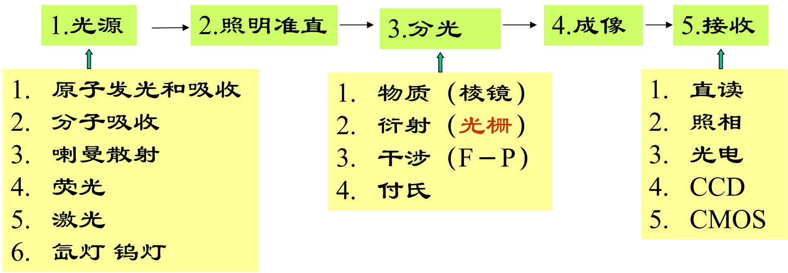
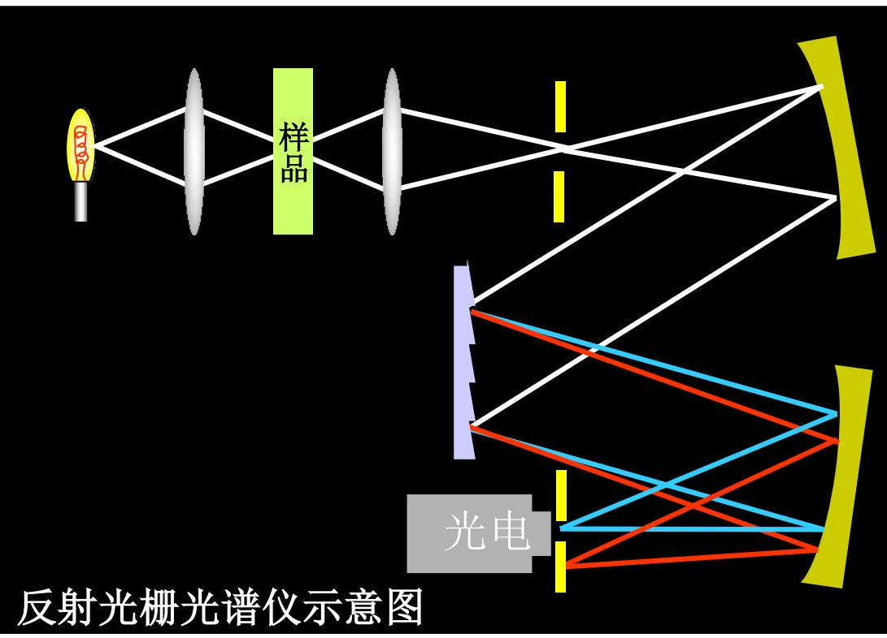
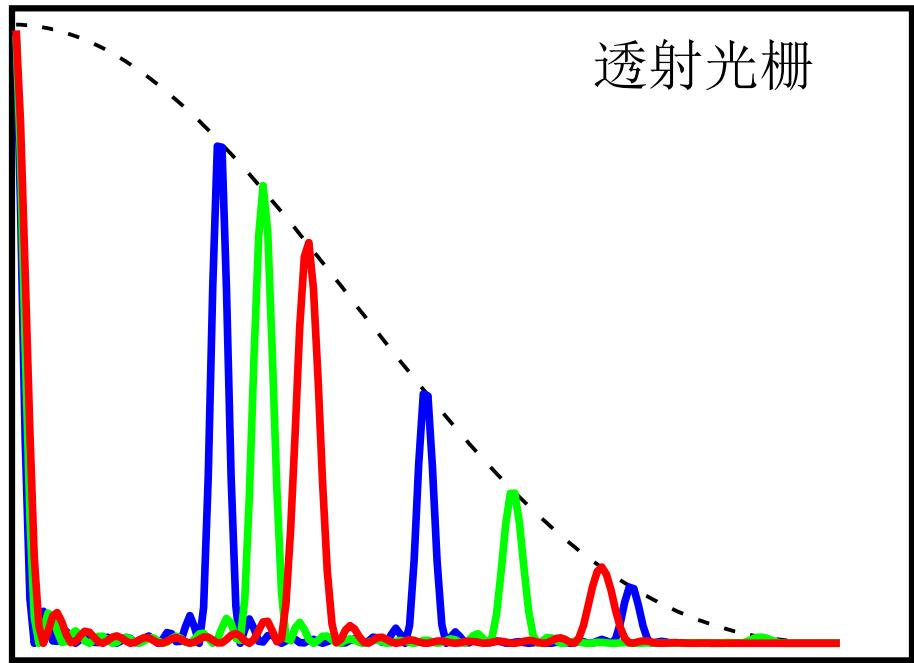

# 5.6.2 ==光栅光谱仪==、角色散率、线色散率和色分辨本领

> **脉络**：[[5.6.1 一维光栅的结构参数与主极大条件|上一节]]得到光栅公式
> $$
> d\sin\theta_k=k\lambda
> $$
> 它说明不同波长在同一级 $k\ne0$ 中会出现在不同角度。光栅光谱仪正是利用这个角度分离来把复合光分成光谱。本节要区分三个量：==角色散率==描述波长差变成角度差的能力；==线色散率==描述波长差变成像面距离差的能力；==色分辨本领==描述两个很近波长能否真正分开。

---

### 一、光谱仪的基本构成

光谱仪的任务是把不同波长的光分开，并记录每个波长对应的强度。教材把光谱仪分成五个基本环节：

1. **光源**：提供待分析的光，可能来自原子发射、分子吸收、荧光、激光等；
2. **照明准直**：把光整理成适合进入分光系统的光束；
3. **分光**：利用棱镜、光栅或干涉装置把不同波长分开；
4. **成像**：把不同波长的光聚焦到不同空间位置；
5. **接收**：用人眼、照相底片、光电探测器、CCD 或 CMOS 记录信号。

读出系统也会影响光谱仪性能：

- 直读：结构简单，但通道少；
- 摄谱：能同时记录多个波长，但强度测量精度有限；
- 光电：强度测量精度高，但单通道扫描效率低；
- CCD/CMOS：多通道、效率高，能同时记录较宽波段。

这和[[4.7.3 傅立叶变换光谱仪|傅立叶变换光谱仪]]形成对比：光栅光谱仪是在空间上分开不同波长；傅立叶变换光谱仪是不先分开波长，而是记录干涉图后用傅立叶变换恢复光谱。

---

### 二、光栅为什么能分光

光栅公式为：

$$
\boxed{d\sin\theta_k=k\lambda}
$$

对零级 $k=0$：

$$
d\sin\theta_0=0
$$

所以：

$$
\theta_0=0
$$

这说明所有波长的零级主峰都在同一方向，零级不分光。

对非零级 $k\ne0$：

$$
\sin\theta_k=\frac{k\lambda}{d}
$$

波长 $\lambda$ 不同，衍射角 $\theta_k$ 不同。因此同一级光谱中，不同波长会在空间上分开。

因此，光栅分光的核心是：同一级 $k$ 下，波长差 $\delta\lambda$ 造成角度差 $\delta\theta$。

---

### 三、角色散率 $D_\theta$

设波长为 $\lambda$ 和 $\lambda+\delta\lambda$ 的两束光，在第 $k$ 级主峰处的角位置分别为 $\theta_k$ 和 $\theta_k+\delta\theta$。定义角色散率：

$$
\boxed{D_\theta=\frac{\delta\theta}{\delta\lambda}}
$$

单位常写作：

$$
\mathrm{rad/nm}
\quad\text{或}\quad
^\circ/\mathrm{nm}
$$

从光栅公式出发：

$$
d\sin\theta_k=k\lambda
$$

两边微分：

$$
d\cos\theta_k\,d\theta=k\,d\lambda
$$

所以：

$$
\boxed{D_\theta=\frac{d\theta}{d\lambda}=\frac{k}{d\cos\theta_k}}
$$

这个式子说明：

- 级次 $k$ 越高，角色散率越大；
- 光栅常数 $d$ 越小，角色散率越大；
- 在相同 $k$ 和 $d$ 下，$\theta_k$ 越大，$\cos\theta_k$ 越小，角色散率越大；
- 角色散率与光栅总缝数 $N$ 没有直接关系。

教材例题：刻槽密度为 $800\ \text{线/mm}$，分析波长约 $600\ \mathrm{nm}$，求一级光谱角色散率。

光栅常数满足：

$$
\frac{1}{d}=800\ \text{线/mm}
$$

一级光谱中：

$$
\sin\theta_1=\frac{\lambda}{d}=600\ \mathrm{nm}\times800\ \mathrm{mm^{-1}}=0.48
$$

所以：

$$
D_\theta=\frac{1}{d\cos\theta_1}
=\frac{800\times10^{-6}}{\sqrt{1-0.48^2}}
\approx0.9\times10^{-3}\ \mathrm{rad/nm}
$$

换算为角度约为：

$$
D_\theta\approx5\times10^{-2}\ ^\circ/\mathrm{nm}
$$

---

### 四、线色散率 $D_l$

角色散率只说明角度分开多少，但接收器记录的是像面上的距离。若成像镜焦距为 $f$，小角度变化下像面线位移为：

$$
\delta l\approx f\delta\theta
$$

定义线色散率：

$$
\boxed{D_l=\frac{\delta l}{\delta\lambda}}
$$

所以：

$$
D_l=f\frac{\delta\theta}{\delta\lambda}=fD_\theta
$$

代入角色散率：

$$
\boxed{D_l=f\frac{k}{d\cos\theta_k}}
$$

这说明：

- 在同一光栅、同一级次、同一衍射角附近，焦距 $f$ 越长，线色散率越大；
- 线色散率大，表示相同波长差在探测面上分得更开；
- 但焦距变长会增大仪器体积，也可能增加像差和调节难度。

这里要区分：角色散率由光栅本身和级次决定；线色散率还受到成像系统焦距影响。

---

### 五、色分辨本领 $R$

角色散率和线色散率只说明“两条谱线分开了多少”。但能否看成两条谱线，还要看每条主峰自身有多宽。

第 $k$ 级光栅主峰的半角宽度为：

$$
\Delta\theta_k=\frac{\lambda}{Nd\cos\theta_k}
$$

两个波长相差 $\delta\lambda$ 的同级主峰角间隔为：

$$
\delta\theta_k=D_\theta\delta\lambda
=\frac{k}{d\cos\theta_k}\delta\lambda
$$

按照与[[5.4.2 光学仪器分辨本领与瑞利判据|瑞利判据]]类似的思想：

- 若 $\delta\theta_k>\Delta\theta_k$，可分辨；
- 若 $\delta\theta_k<\Delta\theta_k$，不可分辨；
- 若 $\delta\theta_k=\Delta\theta_k$，恰能分辨。

令恰能分辨时的最小波长差为 $\delta\lambda_m$：

$$
\frac{k}{d\cos\theta_k}\delta\lambda_m
=\frac{\lambda}{Nd\cos\theta_k}
$$

约去公共因子 $d\cos\theta_k$：

$$
\boxed{\delta\lambda_m=\frac{\lambda}{kN}}
$$

定义色分辨本领：

$$
\boxed{R=\frac{\lambda}{\delta\lambda_m}}
$$

得到：

$$
\boxed{R=kN}
$$

这个结论非常重要：

- 色分辨本领与级次 $k$ 成正比；
- 色分辨本领与有效总缝数 $N$ 成正比；
- 色分辨本领不是由焦距 $f$ 决定；
- 焦距可以把谱线在探测器上拉开，但如果光栅主峰本身太宽，两条谱线仍然不能真正分辨。

---

### 六、角色散率、线色散率、色分辨本领的区别

这三个量容易混淆，可以按下面理解：

| 名称 | 数学定义 | 主要决定因素 | 说明 |
| --- | --- | --- | --- |
| 角色散率 | $D_\theta=\delta\theta/\delta\lambda$ | $k,d,\theta_k$ | 波长差变成角度差的能力 |
| 线色散率 | $D_l=\delta l/\delta\lambda$ | $f,k,d,\theta_k$ | 波长差变成像面距离差的能力 |
| 色分辨本领 | $R=\lambda/\delta\lambda_m=kN$ | $k,N$ | 两条近邻谱线能否被分开 |

所以：

- 想让不同波长在角度上分得更开，主要提高 $k$ 或减小 $d$；
- 想让光谱在探测器上拉得更长，可以增大焦距 $f$；
- 想真正分辨更近的谱线，需要增大总缝数 $N$ 或使用更高级次 $k$。

---

### 七、例题：角分辨率和最小波长差

教材例题：光栅线密度为 $500\ \text{线/mm}$，有效尺度为 $30\ \mathrm{mm}$，求二级光谱在 $\lambda=500\ \mathrm{nm}$ 附近的角色散率和最小可分辨波长差。

先求二级衍射角：

$$
d\sin\theta_2=2\lambda
$$

因为：

$$
\frac{1}{d}=500\ \mathrm{mm^{-1}}
$$

所以：

$$
\sin\theta_2=2\lambda\cdot500\ \mathrm{mm^{-1}}
=2\times500\ \mathrm{nm}\times500\ \mathrm{mm^{-1}}
=0.5
$$

于是：

$$
D_\theta
=\frac{k}{d\cos\theta_k}
=\frac{2}{d\sqrt{1-\frac{1}{4}}}
\approx1.15\times10^{-4}\ \mathrm{rad/nm}
$$

有效缝数为：

$$
N=500\ \mathrm{mm^{-1}}\times30\ \mathrm{mm}=15000
$$

最小可分辨波长差为：

$$
\delta\lambda_m=\frac{\lambda}{kN}
=\frac{500\ \mathrm{nm}}{2\times15000}
\approx0.017\ \mathrm{nm}
$$

---

### 八、设计光栅光谱仪时主要考虑什么

教材最后给出一个工程化问题：如果有足够的光学元器件，怎样组建光栅光谱仪。可以从以下几方面考虑：

- **光栅常数 $d$**：必须满足目标波长能产生需要的衍射级次，一般要使 $d$ 大于被测波长的量级；
- **角色散率**：在允许范围内，减小 $d$、提高级次 $k$ 可以增大角色散；
- **成像焦距 $f$**：增大焦距可以提高线色散率，使相近波长在探测器上离得更远；
- **总刻线数 $N$**：增大有效宽度或线密度可以提高色分辨本领 $R=kN$；
- **探测系统**：CCD/CMOS 的像元大小、动态范围、噪声会影响实际可记录的谱线细节；
- **单缝包络与缺级**：单元因子会影响不同级次的强度分配，应避免重要谱线落在缺级位置。

这说明光谱仪性能不是单一参数决定的。角色散率大不一定色分辨本领高；线色散率大也不一定能分辨更近谱线。真正可用的光谱仪需要让光栅、成像系统、入射狭缝和接收器相互匹配。

---

### 九、本节需要记住的核心结论

> **结论一**：光栅分光来自光栅公式
> $$
> d\sin\theta_k=k\lambda
> $$
> 在非零级中，不同波长对应不同衍射角。

> **结论二**：角色散率为
> $$
> D_\theta=\frac{d\theta}{d\lambda}=\frac{k}{d\cos\theta_k}
> $$
> 它描述波长差转化为角度差的能力。

> **结论三**：线色散率为
> $$
> D_l=fD_\theta=f\frac{k}{d\cos\theta_k}
> $$
> 它描述波长差转化为像面距离差的能力。

> **结论四**：光栅色分辨本领为
> $$
> R=\frac{\lambda}{\delta\lambda_m}=kN
> $$
> 它由级次和有效总缝数决定。
