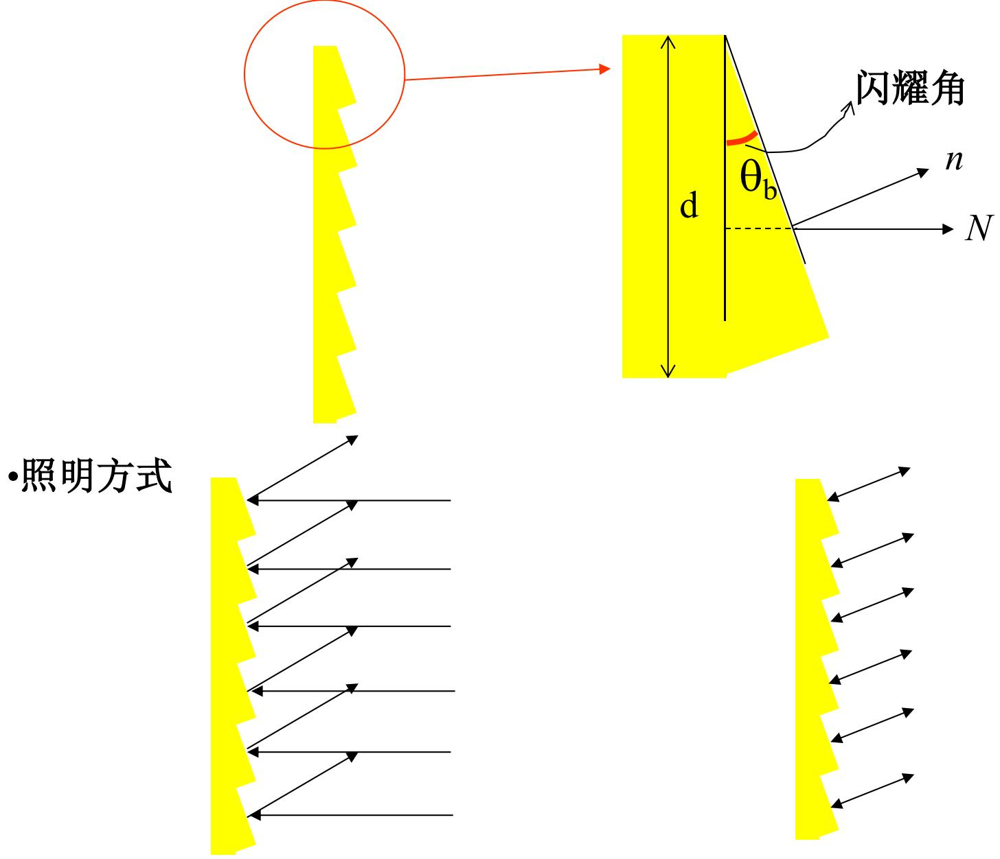
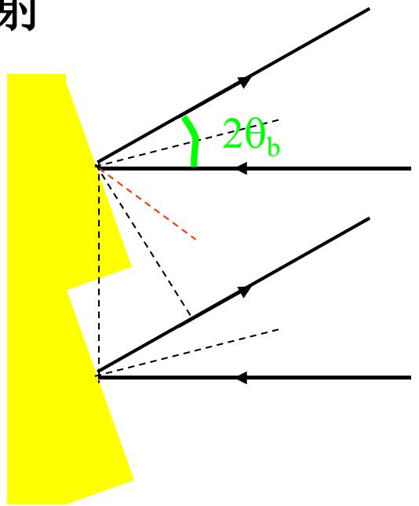
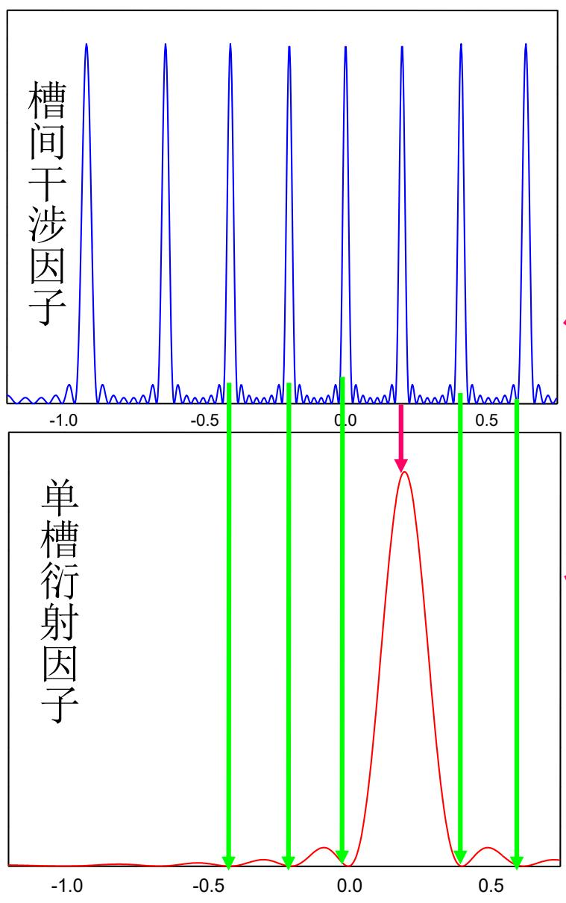
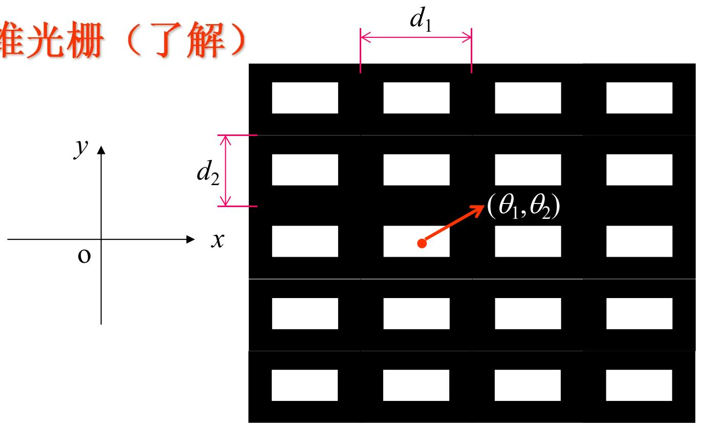
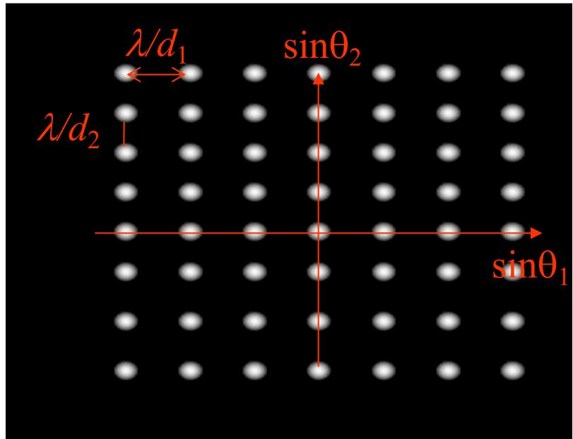
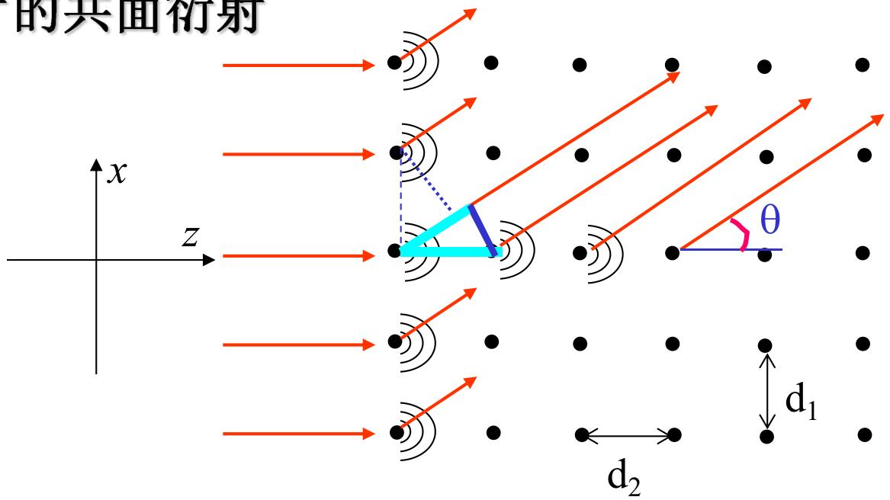

# 5.6.3 ==闪耀光栅==与二维光栅

> **脉络**：[[5.6.1 一维光栅的结构参数与主极大条件|一维光栅]]已经说明，多缝结构因子决定主峰位置，单缝单元因子决定能量包络。普通透射光栅有一个问题：很多光能分散到零级和正负多级中，其中真正用于光谱分析的通常只有一部分。==闪耀光栅==通过改变槽形，让单槽衍射包络的最大方向与某个非零级主峰重合，从而把能量集中到需要的级次。随后，二维光栅把一维周期推广到 $x$、$y$ 两个方向。

---

### 一、普通透射光栅的能量问题

普通透射光栅有几个明显缺点：

- 透射材料和缝结构会有吸收，光能会损失；
- 零级主峰对所有波长都在同一方向，不能分光；
- 零级主峰又常位于单缝衍射包络的最大值附近，因此占用很多光能；
- 实际光谱分析通常只使用某一侧某一级光谱，其余级次中的能量对该测量来说没有被利用。

这说明，普通透射光栅虽然能够分光，但能量利用率不一定高。闪耀光栅就是为了解决这个问题：让光能集中到指定的有用级次。

---

### 二、闪耀光栅的结构思想

闪耀光栅把每个槽做成带有倾斜面的反射结构。每个槽面像一个小反射面，反射方向由槽面的法线 $n$ 决定；整个光栅的周期方向由光栅面法线 $N$ 和周期 $d$ 决定。

这里要分清两个作用：

- **单槽衍射或反射方向**：由每个倾斜槽面决定，相当于单元因子的能量包络；
- **槽间干涉方向**：由相邻槽的周期 $d$ 决定，相当于结构因子的主峰位置。

闪耀光栅的设计目标是让这两个方向重合：单槽最强方向正好落在某一级槽间干涉主峰方向上。

---

### 三、沿光栅法线 $N$ 入射时的闪耀条件

教材先讨论沿 $N$ 方向入射的情况。此时单槽按几何光学反射的方向，对应单槽衍射包络的零级方向。由于槽面有闪耀角 $\theta_b$，这个方向相对入射方向偏转约为：

$$
2\theta_b
$$

在该方向上，相邻槽之间的光程差为：

$$
\Delta L=d\sin(2\theta_b)
$$

若希望波长 $\lambda_{1b}$ 在这个方向成为一级主峰，则：

$$
\boxed{d\sin(2\theta_b)=\lambda_{1b}}
$$

其中 $\lambda_{1b}$ 称为==一级闪耀波长==。

若希望波长 $\lambda_{2b}$ 在同一方向成为二级主峰，则：

$$
\boxed{d\sin(2\theta_b)=2\lambda_{2b}}
$$

一般地，第 $k$ 级闪耀波长满足：

$$
\boxed{d\sin(2\theta_b)=k\lambda_{kb}}
$$

这表示：某个波长在指定级次上，既满足槽间干涉主极大，又位于单槽包络强方向附近，因此该波长该级次的效率较高。

---

### 四、为什么闪耀光栅能提高有效光能

普通透射光栅中，单缝包络最大通常在零级方向；但零级方向不分光。闪耀光栅把单槽包络最大方向移到非零级方向，使非零级既能分光，又能获得较大能量。

教材还指出，当单槽宽度 $a$ 和光栅周期 $d$ 接近时，某些不需要的级次可能正好落在单槽衍射零点上而消失。这相当于利用[[5.6.1 一维光栅的结构参数与主极大条件#七、单元因子与缺级|缺级]]思想，让能量更集中地留在有用级次附近。

因此，闪耀光栅不是改变光栅主极大条件的基本形式，而是改变单元因子的能量分配，使某个级次更亮。

---

### 五、沿槽面法线 $n$ 入射的情况

教材还给出沿槽面法线 $n$ 入射的情况。此时槽间光程差为：

$$
\Delta L=2d\sin\theta_b
$$

一级闪耀波长满足：

$$
\boxed{2d\sin\theta_b=
\lambda_{1b}}
$$

二级闪耀波长满足：

$$
\boxed{2d\sin\theta_b=2\lambda_{2b}}
$$

这部分可以和上一种入射方式对照理解：入射方向不同，相邻槽的几何光程差表达式不同，所以闪耀波长公式也不同。

---

### 六、二维光栅的结构

二维光栅是在两个方向上都有周期排列的全同结构。设：

- $x$ 方向周期为 $d_1$；
- $y$ 方向周期为 $d_2$；
- $x$ 方向共有 $N_1$ 个单元；
- $y$ 方向共有 $N_2$ 个单元。

这可以看成[[5.5.1 位移-相移定理与全同结构衍射场|全同结构衍射场]]在两个方向上的推广。

---

### 七、二维光栅的相位因子

对第 $m$ 列单元，$x$ 方向位移带来相移：

$$
\delta_{xm}=m\delta_x
$$

其中：

$$
\delta_x=\frac{2\pi}{\lambda}d_1\sin\theta_1
$$

对第 $n$ 行单元，$y$ 方向位移带来相移：

$$
\delta_{yn}=n\delta_y
$$

其中：

$$
\delta_y=\frac{2\pi}{\lambda}d_2\sin\theta_2
$$

令：

$$
\beta_1=\frac{\delta_x}{2}=\frac{\pi d_1\sin\theta_1}{\lambda}
$$

$$
\beta_2=\frac{\delta_y}{2}=\frac{\pi d_2\sin\theta_2}{\lambda}
$$

---

### 八、二维光栅衍射场和光强

设单个结构单元的夫琅禾费衍射场为：

$$
\widetilde U_0(\theta_1,\theta_2)

$$
二维周期结构的总场为两个方向等比数列的乘积：

$$
\widetilde U(\theta_1,\theta_2)
=\widetilde U_0(\theta_1,\theta_2)
\sum_{n=0}^{N_2-1}e^{in\delta_y}
\sum_{m=0}^{N_1-1}e^{im\delta_x}
$$

化简为：
$$
$$
\boxed{
\widetilde U(\theta_1,\theta_2)
=\widetilde U_0(\theta_1,\theta_2)
 e^{i(N_1-1)\beta_1}e^{i(N_2-1)\beta_2}
\left(\frac{\sin N_1\beta_1}{\sin\beta_1}\right)
\left(\frac{\sin N_2\beta_2}{\sin\beta_2}\right)
}
$$

取模平方，整体相位因子消失，得到光强：

$$
\boxed{
I(\theta_1,\theta_2)
=\left|\widetilde U_0(\theta_1,\theta_2)\right|^2
\left(\frac{\sin N_1\beta_1}{\sin\beta_1}\right)^2
\left(\frac{\sin N_2\beta_2}{\sin\beta_2}\right)^2
}
$$

如果单元是矩形孔，单元因子还可以写成：

$$
\left|\widetilde U_0(\theta_1,\theta_2)\right|^2
=I_0
\left(\frac{\sin\alpha_1}{\alpha_1}\right)^2
\left(\frac{\sin\alpha_2}{\alpha_2}\right)^2
$$

其中：

$$
\alpha_1=\frac{\pi a\sin\theta_1}{\lambda},
\qquad
\alpha_2=\frac{\pi b\sin\theta_2}{\lambda}
$$

---

### 九、二维光栅主极大条件

二维光栅的结构因子主极大要求两个方向分别同相：

$$
\beta_1=k_1\pi,
\qquad
\beta_2=k_2\pi
$$

所以主极大方向满足：

$$
\boxed{
\begin{cases}
d_1\sin\theta_1=k_1\lambda \\
d_2\sin\theta_2=k_2\lambda
\end{cases}}
\qquad
k_1,k_2=0,\pm1,\pm2,\cdots
$$

这说明二维光栅的衍射主峰不是一排，而是在远场中形成二维点阵。两个方向的周期越小，对应方向的主峰间隔越大。

---

### 十、二维光栅主峰半角宽度

沿 $\theta_1$ 方向，第 $k$ 级主峰半角宽度为：

$$
\Delta\theta_{1k}=\frac{\lambda}{N_1d_1\cos\theta_{1k}}
=\frac{\lambda}{D_1\cos\theta_{1k}}
$$

沿 $\theta_2$ 方向，同理有：

$$
\Delta\theta_{2k}=\frac{\lambda}{N_2d_2\cos\theta_{2k}}
=\frac{\lambda}{D_2\cos\theta_{2k}}
$$

其中：

$$
D_1=N_1d_1,
\qquad
D_2=N_2d_2
$$

所以二维主峰在两个方向上的宽度分别由两个方向的有效尺度决定。

---

### 十一、二维晶片的共面衍射

教材还给出二维晶片共面衍射。它与普通二维透射光栅不同：周期点阵不只在横向 $x$ 上有间隔，还在传播方向 $z$ 上有间隔。

主极大条件变成：

$$
\boxed{
\begin{cases}
d_1\sin\theta=k_1\lambda \\
d_2-d_2\cos\theta=k_2\lambda
\end{cases}}
$$

其中：

$$
k_1,k_2=0,\pm1,\pm2,\cdots
$$

这表示同一个出射角 $\theta$ 必须同时满足两个方向的相位匹配条件。能同时满足的方向是离散的，因此晶体、晶面衍射会对结构周期非常敏感。这为后面学习[[第五章光波衍射预习TODO|X 射线衍射与布拉格公式]]做准备。

---

### 十二、本节需要记住的核心结论

> **结论一**：闪耀光栅通过倾斜槽面改变单槽衍射包络方向，使单槽强方向与某个非零级槽间干涉主峰重合，从而提高有用级次的效率。

> **结论二**：沿光栅法线 $N$ 入射时，一级闪耀波长满足
> $$
> d\sin(2\theta_b)=\lambda_{1b}
> $$
> 更一般地，
> $$
> d\sin(2\theta_b)=k\lambda_{kb}
> $$

> **结论三**：二维光栅光强为
> $$
> I(\theta_1,\theta_2)
> =\left|\widetilde U_0(\theta_1,\theta_2)\right|^2
> \left(\frac{\sin N_1\beta_1}{\sin\beta_1}\right)^2
> \left(\frac{\sin N_2\beta_2}{\sin\beta_2}\right)^2
> $$

> **结论四**：二维光栅主极大满足
> $$
> \begin{cases}
> d_1\sin\theta_1=k_1\lambda \\
> d_2\sin\theta_2=k_2\lambda
> \end{cases}
> $$
