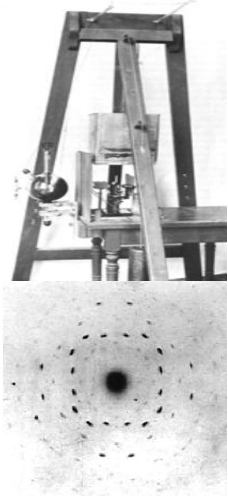
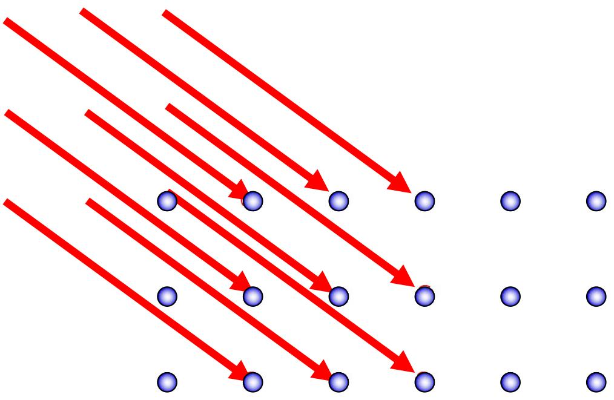
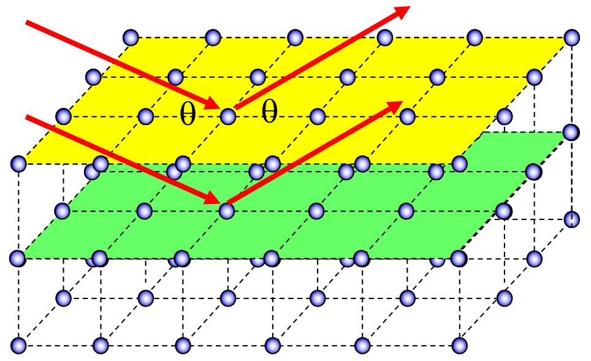
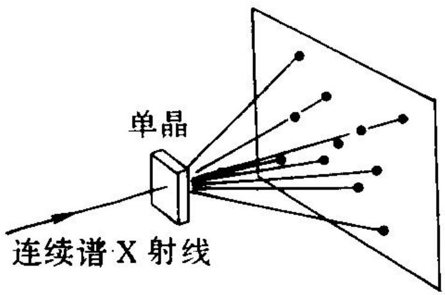
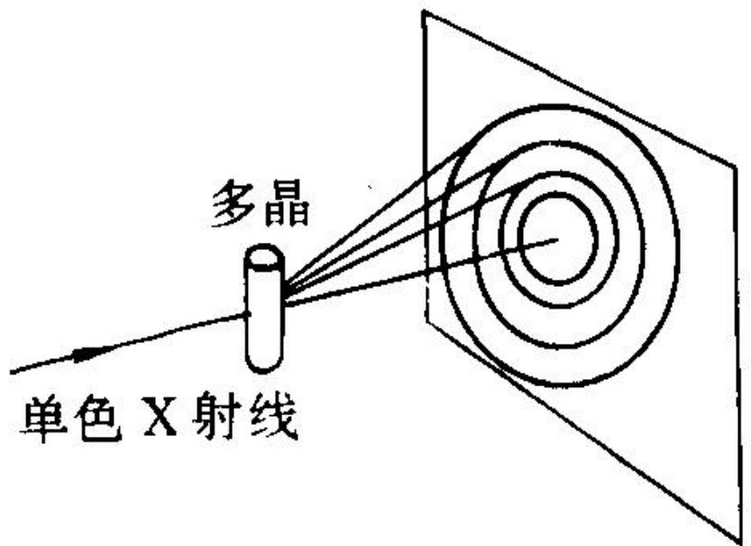

# 5.7.1 ==三维光栅==、X 射线衍射与布拉格公式

> **脉络**：从[[5.6.3 闪耀光栅与二维光栅（期末不考）|二维光栅]]继续推广，晶体可以看成三维周期点阵，也就是天然的==三维光栅==。普通可见光波长远大于晶格间距，难以被晶体点阵有效衍射；X 射线波长约为 $10^{-11}\sim10^{-8}\ \mathrm m$，与晶体中原子间距同数量级，因此可以发生明显衍射。X 射线晶体衍射的核心公式是==布拉格公式==：$2d\sin\theta=k\lambda$。

---

### 一、为什么晶体可以看成三维光栅

光栅的本质是周期结构。前面学过：

- 一维光栅：沿一个方向周期排列；
- 二维光栅：沿两个方向周期排列；
- 三维晶体：原子、离子或分子在三个方向上周期排列。

因此，晶体可以看成三维光栅。不同的是，晶体的周期尺度非常小，通常是原子间距量级。

X 射线的波长范围约为：

$$
10^{-11}\ \mathrm m\sim10^{-8}\ \mathrm m
$$

这与晶体中原子间距接近。所以 X 射线照射晶体时，晶体中大量规则排列的原子会产生相干散射，在某些方向形成明显衍射主极大。

这与[[5.1.1 光的衍射现象与限制展宽规律|结构尺寸与衍射角展宽]]的思想一致：要观察到结构导致的衍射，波长必须和结构尺度有合适的数量级关系。

---

### 二、X 射线衍射的意义

X 射线衍射的发现有两层重要意义：

- 证明 X 射线具有波动性，是波长很短的电磁波；
- 证明晶体内部确实存在规则空间点阵，为原子、离子按规则排列提供实验证据。

教材提到劳厄用 X 射线照射晶体后，在照相底片上得到有规则的斑点，称为==劳厄斑==。这些斑点不是直接看到原子，而是看到晶体周期结构对 X 射线相干散射后的远场结果。

这与本章开始讨论的 DNA X 射线衍射图样相同：衍射斑点包含结构周期、方向和对称性信息，而不是普通意义上的直接成像。

---

### 三、X 射线的产生和性质

教材列出 X 射线的两种常见产生机制：

1. **轫致辐射**：高能电子打到靶上后，在原子核电场作用下急剧减速，电子动能转化为电磁辐射，形成连续 X 射线谱；
2. **特征辐射**：高能电子把原子内层电子激发出来，外层电子跃迁填补空位时辐射 X 射线，形成不连续的特征谱线。

X 射线的主要性质是：

- 它是电磁波；
- 波长很短；
- 穿透能力强；
- 适合探测晶体、分子和材料内部的微观周期结构。

这和[[5.4.2 光学仪器分辨本领与瑞利判据#七、电子显微镜为什么分辨率更高|电子显微镜为什么分辨率更高]]的思想相通：要研究更小尺度结构，需要更短波长的探测波。

---

### 四、同一晶面内的相干增强

布拉格方法把晶体看成一组平行晶面。先考虑同一个晶面内不同原子散射的 X 射线。

教材给出同一晶面内干涉增强条件：

$$
l(\sin\theta-\sin\theta_1)=k\lambda
$$

这里 $l$ 表示晶面内不同散射点之间的距离。由于同一晶面内有许多不同的 $l$，要对所有 $l$ 都能增强，最稳定的条件是：

$$
\sin\theta_1=\sin\theta
$$

因此：

$$
\boxed{\theta_1=\theta}
$$

这就是反射定律形式：同一晶面内强散射方向满足入射角等于反射角。这里的“反射”不是普通镜面反射，而是许多原子散射波相干叠加后，在反射方向增强。

---

### 五、不同晶面之间的干涉增强

再考虑相邻平行晶面之间的散射。设晶面间距为 $d$，X 射线以掠射角 $\theta$ 入射。相邻两晶面按反射方向散射出的光之间有光程差：

$$
\delta=\overline{BC}+\overline{CD}
$$

几何关系给出：

$$
\boxed{\delta=2d\sin\theta}
$$

当相邻晶面散射波相干加强时，光程差必须为整数倍波长：

$$
\delta=k\lambda
$$

于是得到布拉格公式：

$$
\boxed{2d\sin\theta=k\lambda}
$$

其中：

- $d$：晶面间距；
- $\theta$：X 射线相对晶面的掠射角；
- $\lambda$：X 射线波长；
- $k$：干涉级次，$k=1,2,3,\cdots$。

> **结论**：布拉格公式给出晶体某一晶面族对 X 射线产生相干增强的条件。

---

### 六、布拉格公式和一维光栅公式的相同点与不同点

一维光栅公式是：

$$
d\sin\theta_k=k\lambda
$$

布拉格公式是：

$$
2d\sin\theta=k\lambda
$$

它们相同的地方是：都来自周期结构中相邻散射单元的光程差等于整数倍波长。

不同点主要有两点：

1. 一维光栅只有一个主要周期 $d$；晶体是三维点阵，有许多不同取向的晶面族，每一组晶面都有自己的晶面间距 $d$，因此会有一系列布拉格条件。
2. 一维光栅中，给定单色光后通常总能在某些方向看到衍射极大；晶体衍射中，如果晶体取向、晶面间距和波长固定，未必能满足某个布拉格条件，因此未必一定出现可见衍射斑。

所以，观察 X 射线衍射需要让 $d$、$\theta$、$\lambda$ 中至少有一个可变，才容易满足布拉格公式。

---

### 七、观察 X 射线衍射的两种方法

#### 1. 劳厄法

劳厄法使用连续 X 射线照射单晶。

此时：

- 晶体取向固定；
- 一系列晶面间距 $d$ 和角度 $\theta$ 固定；
- X 射线包含连续波长。

因此，总能在连续波长中找到某些 $\lambda$ 满足：

$$
2d\sin\theta=k\lambda
$$

于是底片上形成一组衍射斑点，称为劳厄图。

劳厄图上的斑点分布可以用来判断晶体取向和对称性。

#### 2. 德拜法

德拜法使用单色 X 射线照射多晶或旋转单晶。

此时：

- X 射线波长 $\lambda$ 固定；
- 多晶中有许多不同取向的小晶粒，或者单晶在旋转；
- 等效地提供了许多可能的晶面取向 $\theta$。

因此，总能有某些晶粒或某些时刻满足布拉格公式：

$$
2d\sin\theta=k\lambda
$$

底片上形成一组同心亮环，称为德拜环或德拜图。

---

### 八、从衍射图样反推晶体结构

布拉格公式可以改写为：

$$
d=\frac{k\lambda}{2\sin\theta}
$$

如果实验中已知 X 射线波长 $\lambda$，并测出衍射亮点或亮环对应的角度 $\theta$，就可以求出晶面间距 $d$。

不同晶面族给出不同的 $d$，大量衍射峰的位置和强度共同反映晶体的空间结构。因此 X 射线衍射可以用于：

- 测量晶格常数；
- 判断晶体结构类型；
- 分析材料相组成；
- 研究分子和晶体内部空间周期。

这也是为什么本章从简单狭缝、方孔、圆孔一直讲到光栅和晶体衍射：它们都遵循同一个基本逻辑，即周期结构把相位差转化为远场中可观测的强弱分布。

---

### 九、本节需要记住的核心结论

> **结论一**：晶体是三维周期结构，可以看成天然三维光栅；X 射线波长与晶格间距同量级，所以能产生晶体衍射。

> **结论二**：同一晶面内相干增强要求满足反射定律方向；不同晶面之间的增强由相邻晶面光程差决定。

> **结论三**：布拉格公式为
> $$
> 2d\sin\theta=k\lambda
> $$
> 它是 X 射线晶体衍射的核心判据。

> **结论四**：劳厄法用连续 X 射线照射单晶；德拜法用单色 X 射线照射多晶或旋转单晶。两者本质上都是让实验条件能够满足布拉格公式。
