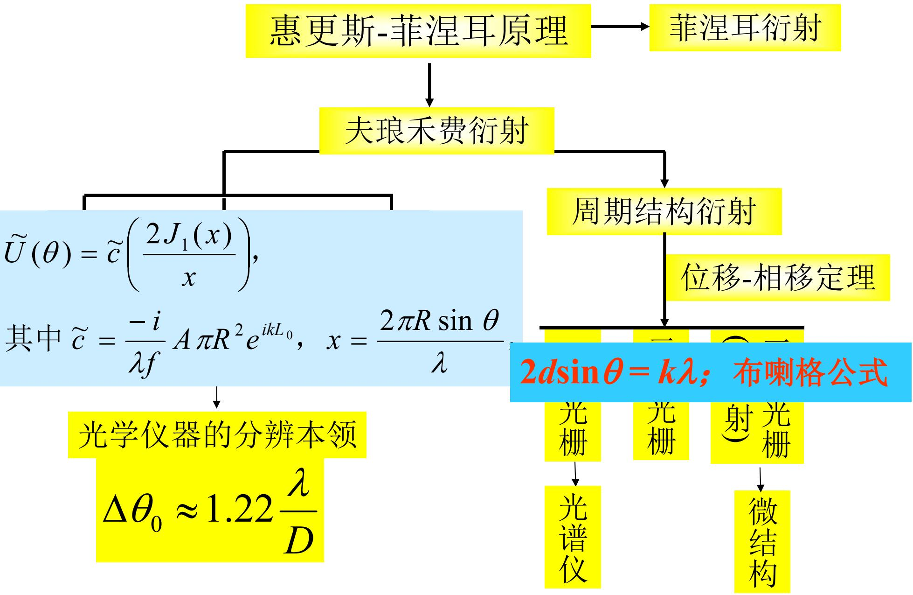

# 5.7.2 ==光的衍射小结==：三个理解层面

> **脉络**：第五章从[[5.1.1 光的衍射现象与限制展宽规律|衍射现象]]开始，先用[[5.1.2 惠更斯原理与惠更斯-菲涅耳原理（期末重点）|惠更斯-菲涅耳原理]]说明波阵面上每个点都能贡献次波，再用[[5.2.2 半波带方法与轴上明暗判断|半波带方法]]、[[5.3.1 夫琅禾费单缝衍射装置、振幅和强度公式|单缝衍射]]、[[5.4.1 方孔与圆孔夫琅禾费衍射|方孔和圆孔衍射]]、[[5.6.1 一维光栅的结构参数与主极大条件|光栅衍射]]和[[5.7.1 三维光栅、X 射线衍射与布拉格公式|X 射线晶体衍射]]把这个原理落实成具体图样和公式。本节是对整章的整理，重点是把“什么是衍射”分成三个逐步深入的理解层面。

---

### 一、本章总路线

教材最后给出的总览图把第五章分成几条主线：

可以按下面的顺序理解：

- **第一步：原理**。惠更斯-菲涅耳原理说明，衍射场来自受限制波阵面上许多面元的复振幅叠加。
- **第二步：近场衍射**。菲涅耳衍射中，观察屏离孔屏不够远，波面曲率不能忽略，常用半波带方法判断轴上明暗。
- **第三步：远场衍射**。夫琅禾费衍射中，观察方向可以用角度描述，孔径函数的不同形状会给出不同的角分布。
- **第四步：周期结构衍射**。光栅、二维光栅和晶体衍射的共同点是有规则周期，相邻单元之间的相位差决定主极大方向。
- **第五步：应用**。圆孔衍射限制光学仪器分辨本领；光栅用于光谱仪；X 射线晶体衍射用于研究微观结构。

这条路线说明：第五章不是许多零散图样的堆叠，而是在反复处理同一个问题：==波前被空间结构改变以后，后方光场怎样重新分布==。

---

### 二、第一层理解：衍射是一种偏离几何光学直线传播的现象

最表面的理解是现象层面：

> **结论一**：当光在传播过程中遇到障碍物、孔径、狭缝、边缘或其他空间结构时，光会偏离几何光学中直线传播的简单图像，这种现象称为==衍射==。

这里的重点不是说光完全不遵守直线传播，而是说几何光学的直线传播是一种近似。这个近似成立通常需要结构尺寸远大于波长。如果孔、缝、边缘或微结构的尺寸与波长比较接近，波动性就会明显表现出来。

最基本的数量级关系是：

$$
\Delta \theta \approx \frac{\lambda}{a}
$$

其中：

- $\Delta \theta$：衍射展开的角范围；
- $\lambda$：光波波长；
- $a$：限制光波的横向尺寸，例如狭缝宽度或孔径尺寸。

这个式子说明：

- $a$ 越小，衍射角展宽越明显；
- $\lambda$ 越大，在同一结构上越容易出现明显衍射；
- 如果 $a\gg\lambda$，衍射角很小，几何光学近似通常可用。

本章后面的许多公式都可以看作这个关系的具体化。例如：

$$
\sin\theta_1=\frac{\lambda}{a}
$$

是单缝第一暗纹条件；

$$
\Delta\theta_0\approx1.22\frac{\lambda}{D}
$$

是圆孔艾里斑第一暗环对应的角半径。它们的共同意义都是：==孔径越小，角分布越宽==。

---

### 三、第二层理解：衍射来自受限制波阵面的次波相干叠加

比现象层面更深入的是惠更斯-菲涅耳层面。

惠更斯原理说：波阵面上的每一点都可以看成发出次波的新波源。惠更斯-菲涅耳原理进一步指出：这些次波到达观察点后，要按相位进行复振幅叠加。

因此，衍射不是单纯的“光绕过障碍物”，而是下面这个过程：

1. 入射波到达孔径、屏边或结构表面；
2. 原来完整的波阵面被空间结构限制，只剩一部分波阵面能继续传播，或者振幅、相位被改变；
3. 剩余波阵面上的各个面元向观察点贡献次波；
4. 这些次波带着不同相位到达同一点；
5. 复振幅相加后得到该点的光场，再取模平方得到光强。

这个思想可写成衍射积分的形式：

$$
\tilde U(P)=\iint_S \tilde U(Q)K(\theta)\frac{e^{ikr}}{r}\,dS
$$

其中：

- $Q$：孔径或波阵面上的面元位置；
- $P$：观察点；
- $\tilde U(Q)$：面元处的复振幅；
- $K(\theta)$：倾斜因子，表示不同方向次波贡献不同；
- $e^{ikr}$：传播相位因子；
- $r$：面元到观察点的距离。

这个公式的核心不是要求每次都直接积分，而是提醒我们：==衍射计算的对象是复振幅，不是光强直接相加==。

所以在[[5.2.2 半波带方法与轴上明暗判断|半波带方法]]中，相邻半波带的贡献相位相差 $\pi$，会出现交替相消；在[[5.3.1 夫琅禾费单缝衍射装置、振幅和强度公式|单缝衍射]]中，不同缝元的相位连续变化，合成后得到 $\sin\alpha/\alpha$；在[[5.6.1 一维光栅的结构参数与主极大条件|光栅衍射]]中，不同缝之间的相位差若满足整数倍 $2\pi$，就会形成主极大。

---

### 四、第三层理解：衍射是振幅或相位分布改变后，后场光场重新分布

第三层是本章最统一的理解方式：

> **结论二**：当光在传播过程中，由于孔径、障碍物、透镜、光栅、晶体等原因，使波前上的振幅分布或相位分布发生改变，后方光场相对于自由传播光场发生明显变化，这就是衍射。

这一层理解更适合连接整章内容。因为衍射不只发生在“被挡住”的情况下，也可以发生在相位被调制、振幅被周期调制或结构周期排列的情况下。

例如：

- 单缝衍射：振幅只在宽度 $a$ 内非零，孔径边界改变了横向振幅分布；
- 方孔衍射：$x$、$y$ 两个方向同时有限宽，因此出现两个方向的衍射展开；
- 圆孔衍射：圆形孔径产生艾里斑，限制了光学仪器分辨本领；
- 波带片：人为让不同半波带透过或遮挡，改变振幅分布，使轴上某点增强；
- 闪耀光栅：用槽面结构改变每一级衍射中的能量分配；
- 晶体衍射：三维周期结构让 X 射线在满足布拉格条件的方向相干增强。

在这个层面，孔径或光栅可以看成一个对入射波的空间调制。设入射复振幅为 $\tilde U_0(x,y)$，孔径或结构的透过函数为 $t(x,y)$，则孔后波面可写成：

$$
\tilde U(x,y)=\tilde U_0(x,y)t(x,y)
$$

如果 $t(x,y)$ 只是一个简单矩形窗口，就得到单缝或方孔衍射；如果 $t(x,y)$ 是周期函数，就得到光栅衍射；如果结构在三维空间周期排列，就得到晶体衍射。

这说明：==衍射图样本质上记录了波前振幅和相位分布的空间信息==。

---

### 五、几类典型衍射问题的统一比较

| 类型 | 主要空间结构 | 主要判断对象 | 典型公式 | 物理意义 |
|---|---|---|---|---|
| 菲涅耳圆孔、圆屏衍射 | 有限孔径或遮挡，观察距离有限 | 轴上明暗和近场环纹 | $r_n\approx\sqrt{n\lambda b}$ | 半波带交替相消或相长决定轴上光强 |
| 单缝夫琅禾费衍射 | 宽度为 $a$ 的狭缝 | 暗纹、中央亮纹宽度 | $a\sin\theta=k\lambda$ | 缝宽越小，角展宽越大 |
| 圆孔夫琅禾费衍射 | 直径为 $D$ 的圆孔 | 艾里斑角半径 | $\Delta\theta_0\approx1.22\lambda/D$ | 光学仪器分辨本领受孔径限制 |
| 一维光栅 | 周期为 $d$ 的多缝 | 主极大方向、缺级、色散 | $d\sin\theta_k=k\lambda$ | 周期结构使某些方向相干增强 |
| 晶体 X 射线衍射 | 晶面间距为 $d$ 的三维点阵 | 晶面族增强条件 | $2d\sin\theta=k\lambda$ | 用衍射角反推晶体结构 |

这张表要注意两点：

- 单孔类问题主要看“有限尺寸导致角展宽”；
- 周期结构类问题主要看“相邻单元相位差满足增强条件”。

二者不是互相孤立的。实际光栅图样中，每条缝的单缝衍射给出包络，多缝周期叠加给出细锐主极大。也就是说，光栅图样同时包含单孔衍射和周期干涉两部分。

---

### 六、从第五章回看前面章节

第五章和前面内容的联系主要有三条：

#### 1. 与波前概念的联系

[[2.3.1 波前的概念与共轭波前|波前]]描述的是等相位面。衍射问题本质上研究：当波前被限制、遮挡或调制以后，新的光场如何形成。

如果波前保持完整、均匀、无限延伸，后场接近自由传播；如果波前只剩一小部分，或者相位分布被改变，后场就会出现明显衍射图样。

#### 2. 与干涉的联系

[[4.2.1 光强的定义与双光束叠加后的合成光强公式|干涉]]强调几束光之间的相位差。衍射强调连续波阵面上许多面元之间的相位差。

所以可以这样区分：

- 干涉：常从少数几束相干光开始分析；
- 衍射：常从连续分布的次波源或大量周期单元开始分析。

但两者的数学本质相同，都是复振幅相干叠加。区别主要在于参与叠加的光波数量和空间分布形式不同。

#### 3. 与光学仪器的联系

[[5.4.2 光学仪器分辨本领与瑞利判据|分辨本领]]说明，任何有限口径光学仪器都不能把点物成像为真正的几何点，而会形成艾里斑。因此两个很近的物点能否分开，不只取决于放大率，还取决于孔径、波长和衍射极限。

这一点在望远镜、显微镜、光谱仪和 X 射线衍射中都会出现：要看清更小的结构，通常需要更短的波长、更大的有效孔径或更高的周期结构分辨能力。

---

### 七、本章需要最终记住的核心结论

> **结论一**：衍射的现象层面是偏离几何光学直线传播；它在结构尺寸与波长可比时更明显。

> **结论二**：衍射的原理层面是受限制波阵面上大量次波的复振幅相干叠加。

> **结论三**：衍射的统一层面是振幅分布或相位分布被空间结构改变，导致后方光场重新分布。

> **结论四**：单孔衍射强调有限尺寸带来的角展宽；周期结构衍射强调相邻周期单元的相位匹配。

> **结论五**：光学仪器分辨本领、光栅光谱仪和 X 射线晶体衍射都是衍射理论的直接应用。