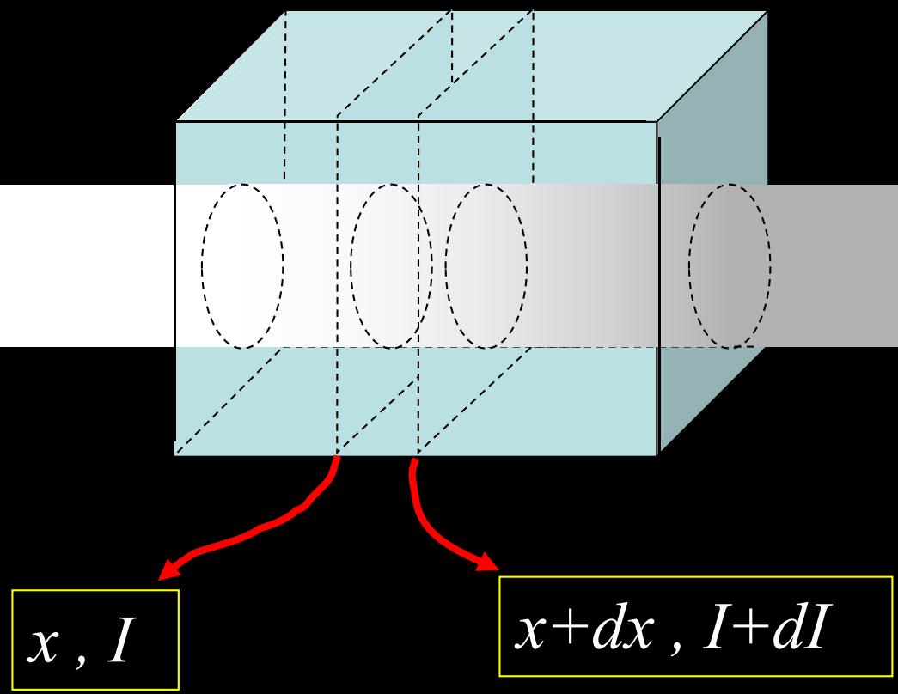
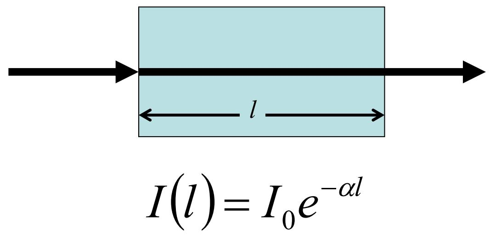
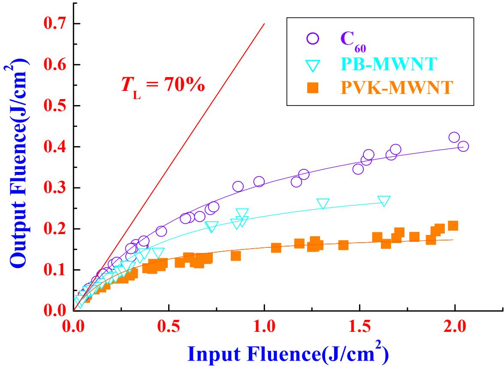

# 8.1.1 线性吸收规律与光限幅

> **脉络**：前面讨论反射、折射、干涉和偏振时，很多情况下默认介质不吸收光，光强变化主要来自分束、叠加或偏振投影。第八章开始讨论实际介质中的非理想传播。第一件事是==吸收==：光在介质中传播时，能量被介质吸收，光强随传播距离减小。

### 一、 吸收的微分描述

设一束光沿 $x$ 方向通过吸收介质。光强在位置 $x$ 处为 $I$，再经过一小段厚度 $dx$ 后，光强变为 $I+dI$。

吸收介质中，光强会减小，所以：

$$
dI<0
$$

教材给出的基本假设是：

$$
dI\propto -I\,dx
$$

这句话的意思是：

- 当前光强 $I$ 越大，同样厚度 $dx$ 中被吸收的能量越多；
- 经过的厚度 $dx$ 越大，被吸收的能量越多；
- 负号表示光强沿传播方向减小。

### 二、 吸收系数

引入比例系数 $\alpha$，得到：

$$
dI=-\alpha I\,dx
$$

也可以写成：

$$
\alpha=-\frac{dI}{I\,dx}
$$

其中 $\alpha$ 称为==吸收系数==。

从单位看，$\alpha dx$ 必须是无量纲量，因此若 $x$ 用 $\mathrm{m}$ 表示，$\alpha$ 的单位通常是 $\mathrm{m^{-1}}$。

吸收系数越大，说明同样厚度的介质吸收越强，光强下降越快。

### 三、 指数衰减规律

由：

$$
dI=-\alpha I\,dx
$$

两边分离变量：

$$
\frac{dI}{I}=-\alpha dx
$$

积分得到：

$$
\ln I=-\alpha x+C
$$

所以：

$$
I(x)=Ce^{-\alpha x}
$$

当 $x=0$ 时，入射光强为：

$$
I(0)=I_0
$$

代入得到 $C=I_0$，所以线性吸收规律为：

$$
I(x)=I_0e^{-\alpha x}
$$

如果介质厚度为 $l$，则出射光强为：

$$
I(l)=I_0e^{-\alpha l}
$$

这是一种指数衰减，而不是线性下降。也就是说，前一段吸收掉一部分后，后一段面对的是已经变小的光强，所以每一小段吸收的绝对量也随之变小。

### 四、 透过率的写法

常把透过率定义为：

$$
T=\frac{I(l)}{I_0}
$$

代入吸收规律：

$$
T=e^{-\alpha l}
$$

这说明透过率由两个量控制：

- 吸收系数 $\alpha$；
- 介质厚度 $l$。

若 $\alpha l$ 很小，则 $T$ 接近 1，介质较透明。若 $\alpha l$ 很大，则 $T$ 很小，介质吸收明显。

这和[[2.1.3 电磁波的能流与偏振|光强表示能流密度]]有关：光强下降就是通过截面的能流减少，减少的能量转入介质内部，例如变成热、激发或其他形式的能量。

### 五、 线性吸收中的“线性”

教材说明：在线性光学介质里，$\alpha$ 与光强无关。

这句话很重要。它不是说 $I(x)$ 是 $x$ 的线性函数，而是说吸收系数 $\alpha$ 不随入射光强改变。

在线性吸收中：

$$
\alpha=\text{常数}
$$

所以无论入射光强较大还是较小，只要仍在同一种线性范围内，光强随距离的相对衰减规律都是：

$$
I(x)=I_0e^{-\alpha x}
$$

换句话说，厚度相同的样品对强光和弱光给出的透过率相同。

### 六、 非线性吸收和光限幅

当光强很强时，光与物质相互作用中的非线性效应会明显表现出来。这时吸收系数可能与光强有关：

$$
\alpha=\alpha(I)
$$

这种情况下，强光和弱光通过同一材料时，透过率不再相同。

教材举例为==光限幅==。光限幅材料的目标是：

- 对弱光有较高透过率；
- 对强光有较强衰减能力。

也就是说，弱光通过时尽量不影响观察；强激光进入时，材料自动增加衰减，保护眼睛或探测器。

图中红色直线表示理想线性透过关系。如果材料始终线性透过，输入越强，输出也按固定比例变强。实际光限幅曲线在高输入区逐渐低于直线，说明输入继续增大时，输出增长被限制住。

### 七、 激光防护材料的理想性能

教材列出激光防护理想性能：

- 足够宽的防护带宽；
- 对弱辐射有足够高的线性透过率；
- 对强激光有足够高的衰减能力；
- 足够快的响应时间；
- 足够大的破坏阈值。

这些要求可以直接理解为：

1. 防护带宽要宽：不能只防一种很窄波长的激光。
2. 弱光透过率要高：平时观察不能太暗。
3. 强光衰减要强：遇到危险激光时要明显降低输出光强。
4. 响应要快：不能等激光已经造成损伤后才开始吸收。
5. 破坏阈值要大：材料本身不能先被强激光打坏。

### 八、 本节需要记住的结论

> **结论一**：线性吸收的微分规律为
> $$
> dI=-\alpha I\,dx.
> $$

> **结论二**：吸收系数
> $$
> \alpha=-\frac{dI}{I\,dx}
> $$
> 描述单位长度内光强的相对衰减程度，$\alpha$ 越大，吸收越强。

> **结论三**：线性吸收使光强按指数规律衰减：
> $$
> I(x)=I_0e^{-\alpha x},\qquad T=e^{-\alpha l}.
> $$

> **结论四**：光限幅属于强光下的非线性吸收现象。理想光限幅材料应让弱光较好通过，同时强烈衰减强激光。
