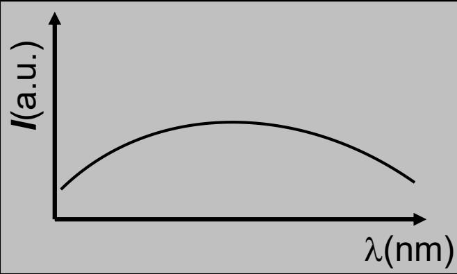
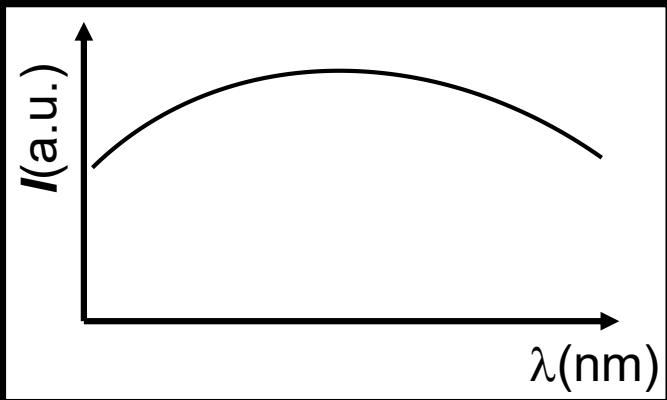
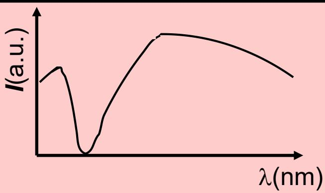
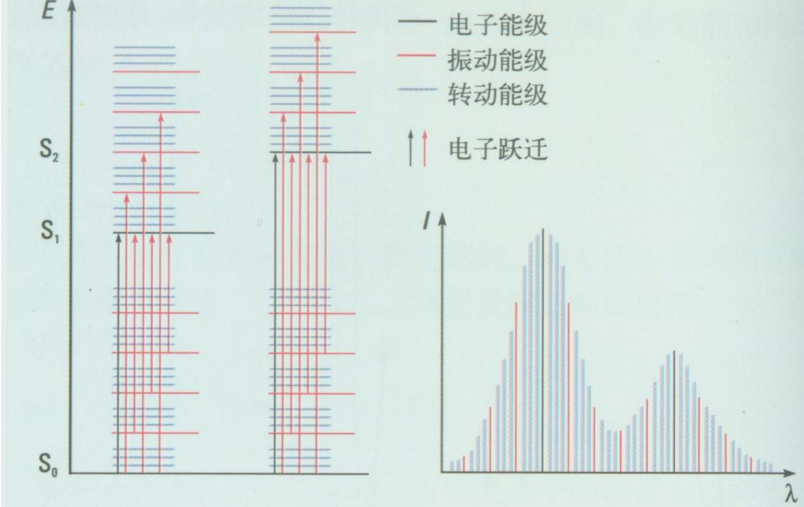
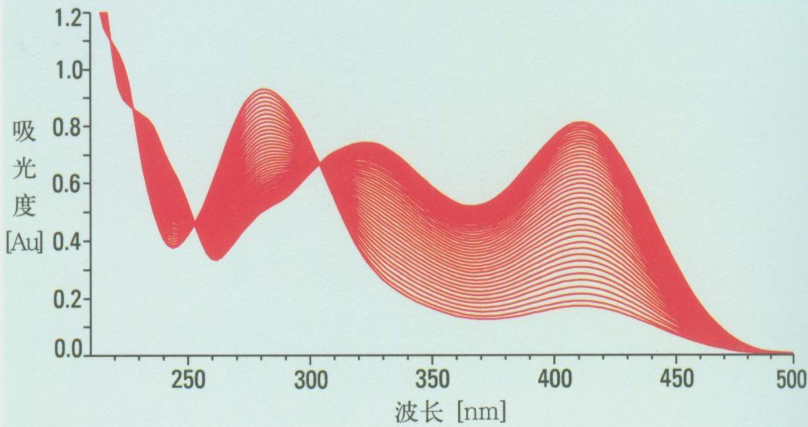

# 8.1.2 普遍吸收与选择吸收

> **脉络**：上一节 [[8.1.1 线性吸收规律与光限幅|线性吸收规律]] 主要讨论固定波长下光强随传播距离的衰减，即 $I=I_0e^{-\alpha l}$。本节进一步说明：实际介质的吸收系数 $\alpha$ 往往还和波长 $\lambda$ 有关。若不同波长被吸收的程度差不多，就是==普遍吸收==；若某些波长被特别强烈地吸收，就是==选择吸收==。

### 一、 从吸收系数看光谱变化

上一节的吸收公式可以写成：

$$
I(l)=I_0e^{-\alpha l}
$$

如果入射光不是单色光，而是包含很多波长，那么更准确的写法应当是：

$$
I_{\text{out}}(\lambda)=I_{\text{in}}(\lambda)e^{-\alpha(\lambda)l}
$$

这里：

- $I_{\text{in}}(\lambda)$ 表示入射光在波长 $\lambda$ 附近的光强；
- $I_{\text{out}}(\lambda)$ 表示通过介质后的出射光谱；
- $\alpha(\lambda)$ 表示该介质对波长 $\lambda$ 的吸收系数；
- $l$ 是介质厚度。

因此，本节讨论的核心不是“光强是否减小”，而是“不同波长的光强是否按同样比例减小”。

这和 [[4.8.2 非单色性对干涉场的影响|光源的谱线宽度和光谱结构]] 有联系：只要光源不是严格单色光，就可以把它看成许多波长成分的组合。吸收介质会分别作用在这些波长成分上，从而改变整个光谱的形状。

### 二、 普遍吸收

==普遍吸收==指介质对不同波长的光具有近似相同程度的吸收。也就是说，在某一波段内可以近似认为：

$$
\alpha(\lambda)\approx \alpha_0
$$

于是：

$$
I_{\text{out}}(\lambda)\approx I_{\text{in}}(\lambda)e^{-\alpha_0l}
$$

这里的 $e^{-\alpha_0l}$ 对所有波长都差不多相同，所以透过介质后，光谱整体降低，但光谱形状基本不变。

教材用下图表示入射光谱：

经过具有普遍吸收的介质后，曲线整体变低：

这类吸收的直观特点是：

1. 所有波长的光都被削弱；
2. 没有某一个很窄波段特别暗；
3. 光谱曲线主要表现为整体下降。

如果入射的是白光，普遍吸收主要改变亮度，而不显著改变颜色。因为各种可见光成分仍然按近似原来的比例存在。

### 三、 选择吸收

==选择吸收==指介质对某些波长的光吸收特别强，而对另一些波长吸收较弱。此时 $\alpha$ 不能再看成常数，而应写成：

$$
\alpha=\alpha(\lambda)
$$

若在某个波长 $\lambda_0$ 附近有很强吸收，则：

$$
\alpha(\lambda_0)\gg \alpha(\lambda)
$$

对应的透射光谱中，$\lambda_0$ 附近的光强会明显降低，形成吸收带或吸收峰。

教材先给出入射光谱：

经过选择吸收介质后，某些波段被明显削弱：

这类吸收的直观特点是：

1. 不是所有波长按同一比例减弱；
2. 特定波段会出现明显的暗带或凹陷；
3. 出射光的颜色可能改变。

例如白光通过某种有色溶液时，溶液可能强烈吸收蓝紫光，而让红光、黄光等成分较多通过。人眼看到的颜色不是被吸收的颜色，而是剩余透射光或反射光的合成结果。

这里可以和 [[7.2.1 偏振片、起偏器和检偏器|偏振片的选择吸收]] 作一个区分：偏振片的“选择”主要是按电场振动方向选择吸收；本节的选择吸收主要是按波长选择吸收。二者都属于光与介质相互作用导致的光强改变，但选择变量不同。

### 四、 分子能级是选择吸收的原因

选择吸收来自物质内部能级结构。分子不是可以吸收任意能量的连续系统，而是具有一系列离散能级。教材中把分子能级分为三类：

1. ==转动能级==；
2. ==振动能级==；
3. ==电子能级==。

分子通常处于较低能级。当它吸收一个光子后，可以从低能级跃迁到高能级。吸收条件近似写成：

$$
h\nu=E_m-E_n
$$

其中：

- $h$ 是普朗克常量；
- $\nu$ 是光的频率；
- $E_n$ 是跃迁前的能级；
- $E_m$ 是跃迁后的能级。

又因为：

$$
\nu=\frac{c}{\lambda}
$$

所以能级差也可以决定吸收光的波长位置。能级差越大，需要的光子频率越高，对应波长越短；能级差越小，需要的光子频率越低，对应波长越长。

教材的能级示意图如下：

从图中可以看出，吸收谱不是任意形状，而是和能级跃迁对应。不同物质的能级结构不同，因此吸收光谱也不同。这就是吸收光谱可以用来识别物质的原因。

### 五、 生色团、共轭结构与吸收峰

教材后面举了有机分子的吸收峰例子。这里需要先抓住两个量：

1. $\lambda_{\max}$：最大吸收波长，即吸收最强处对应的波长；
2. $\varepsilon_{\max}$：最大摩尔吸光系数，用来表示吸收强弱。

某些原子团或结构会在特定波段产生明显吸收，称为==生色团==。例如含有不饱和键、羰基、硝基等结构的分子，常常会在紫外或可见光区出现特征吸收。

教材提到 $\pi\rightarrow\pi^\ast$ 跃迁。这里的意思是：分子中的 $\pi$ 电子吸收光子后，从较低的 $\pi$ 轨道跃迁到较高的反键轨道 $\pi^\ast$。如果分子中存在共轭结构，电子离域范围变大，相关能级间隔会改变，因此吸收峰位置也会改变。

预习时先记住一个常用判断：

> 共轭体系增长或取代基改变时，吸收峰 $\lambda_{\max}$ 往往会发生移动。共轭越强，所需跃迁能量通常越小，吸收峰常向长波方向移动。

这里不需要把教材表格中的每个有机基团数值都背下来，更重要的是理解：分子结构改变会改变能级差，能级差改变会改变吸收波长。

### 六、 吸收光谱的用途

选择吸收使每种物质具有相对特征性的吸收光谱。因此，吸收光谱可以用于：

1. 判断样品中是否含有某些生色团；
2. 辅助分析分子结构；
3. 比较不同样品或反应过程中的结构变化；
4. 对物质进行定性或定量分析。

这与 [[4.7.3 傅立叶变换光谱仪|傅立叶变换光谱仪]] 和 [[5.6.2 光栅光谱仪的分光原理和色散本领|光栅光谱仪]] 的学习内容可以联系起来。光谱仪负责把不同波长分开并记录光强分布，而本节说明为什么某些波长的光强会因物质吸收而下降。

教材给出的磺内酯水解光谱图可以理解为：随着反应进行，样品在不同波长处的吸光度发生变化，因此可以用吸收光谱跟踪化学过程。

图中的横坐标是波长，纵坐标是吸光度。某些波长处吸光度变化明显，说明这些波长对应的跃迁与分子结构或反应状态有关。

### 七、 本节需要记住的结论

> **结论一**：普遍吸收表示不同波长的光被近似同等程度吸收，主要使光谱整体降低，光谱形状基本不变。

> **结论二**：选择吸收表示某些波长被特别强烈地吸收，透射光谱会在对应波段出现明显下降，介质颜色和吸收光谱都与此有关。

> **结论三**：选择吸收的根本原因是物质内部能级离散。只有满足 $h\nu=E_m-E_n$ 的光子，才容易被分子吸收并引起跃迁。

> **结论四**：吸收光谱能够提供分子结构信息，例如生色团、共轭体系和反应状态等，因此是物质鉴别和结构分析的重要手段。
