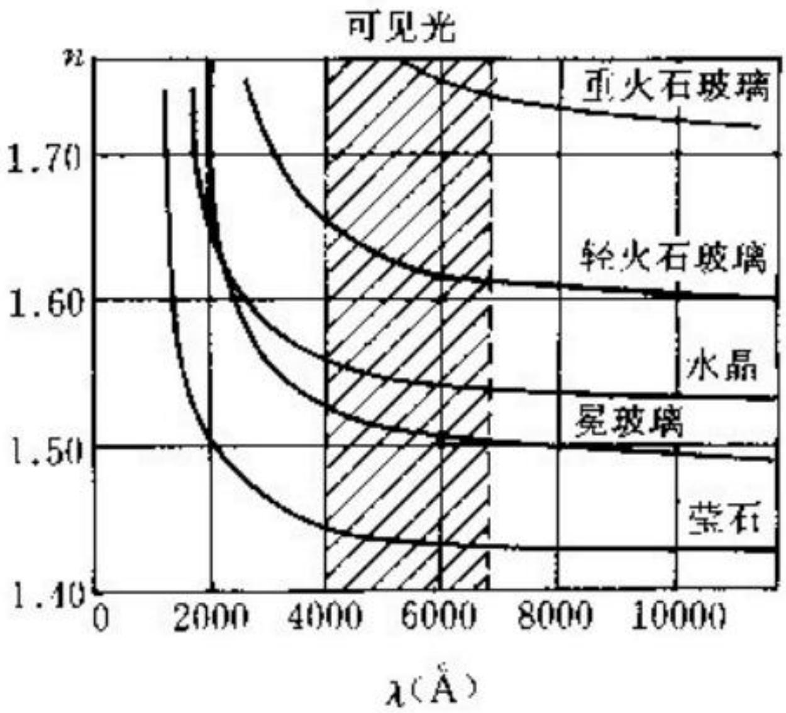
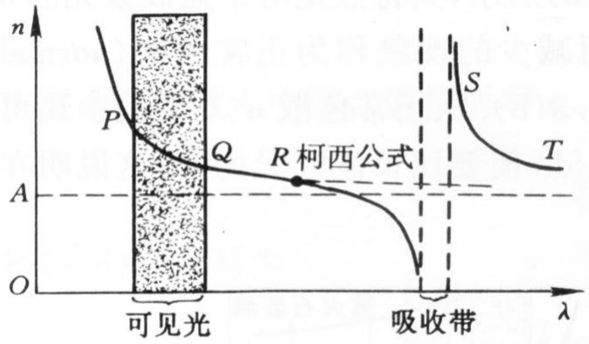
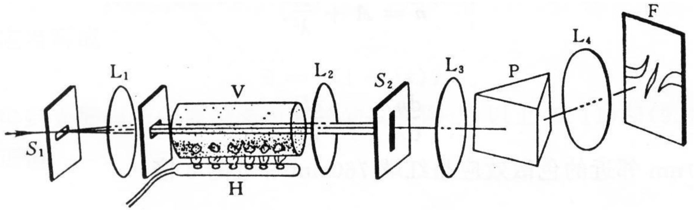
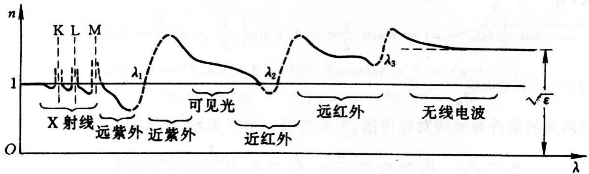

# 8.2.1 色散现象、正常色散与反常色散

> **脉络**：前面 `8.1` 讨论吸收，即光强随传播距离减小。本节开始讨论==色散==：光在介质中的传播速度或折射率随波长改变。吸收主要影响光强，色散主要影响相位传播速度和折射方向；但在吸收带附近，二者会明显联系起来。

### 一、 色散的定义

教材给出的定义是：

> 光在媒质中的传播速度或折射率随波长改变，称为色散。

因为介质中的相速度为：

$$
v=\frac{c}{n}
$$

所以说“速度随波长改变”和“折射率随波长改变”本质上是同一件事。若 $n$ 是波长 $\lambda$ 的函数，就可以写成：

$$
n=n(\lambda)
$$

于是不同波长的光在同一介质中有不同传播速度，也会在棱镜、透镜等元件中发生不同程度的折射。彩虹、棱镜分光、光谱仪分光都和这个现象有关。

这和 [[5.6.2 光栅光谱仪、角色散率、线色散率和色分辨本领|光栅光谱仪]] 中的“分光”需要区分：光栅分光来自不同波长满足不同衍射角条件，棱镜分光来自介质折射率随波长变化。二者都能把复合光分成光谱，但物理机制不同。

### 二、 正常色散

对许多透明介质，在远离强吸收带的波段中，折射率 $n$ 随波长 $\lambda$ 增大而减小：

$$
\lambda \uparrow \quad \Rightarrow \quad n \downarrow
$$

也就是：

$$
\frac{dn}{d\lambda}<0
$$

这称为==正常色散==。

教材给出的几种材料在可见光附近的色散曲线如下：

图中横坐标是波长，纵坐标是折射率。可以看到，在可见光范围内，随着波长从短波方向向长波方向增大，折射率整体下降。

按可见光粗略理解：

- 紫光波长较短，折射率通常较大；
- 红光波长较长，折射率通常较小；
- 因此棱镜中紫光偏折通常比红光大。

这也是普通棱镜能把白光展开成彩色光带的原因。

### 三、 柯西公式

法国数学家柯西给出了正常色散区的经验公式：

$$
n=A+\frac{B}{\lambda^2}+\frac{C}{\lambda^4}
$$

其中 $A,B,C$ 是与材料有关的常数。

在可见光波段内，很多材料的色散曲线可以用这个公式较好近似。如果考察的波长范围不太大，常常只保留前两项：

$$
n=A+\frac{B}{\lambda^2}
$$

对 $\lambda$ 求导：

$$
\frac{dn}{d\lambda}=-2\frac{B}{\lambda^3}
$$

若 $B>0$，则：

$$
\frac{dn}{d\lambda}<0
$$

这正是正常色散的数学表现。

同时，由于：

$$
\left|\frac{dn}{d\lambda}\right|=\frac{2B}{\lambda^3}
$$

波长越短，$|\frac{dn}{d\lambda}|$ 越大。因此教材说“紫段的色散效应比红段大”。这里的意思是：在短波段，同样的波长差会引起更明显的折射率差。

### 四、 反常色散

在介质对光有强烈吸收的波段附近，折射率随波长的变化可能与正常色散相反。教材称这种现象为==反常色散==。

正常色散在 $n-\lambda$ 图上的典型判据是：

$$
\frac{dn}{d\lambda}<0
$$

反常色散的典型判据是：

$$
\frac{dn}{d\lambda}>0
$$

也就是说，在某些吸收带附近，波长增大时折射率反而增大，或者色散曲线出现急剧弯折，不再符合简单的柯西公式。

教材的吸收带附近反常色散示意图如下：

图中可见光范围内的曲线较平滑，可以近似满足柯西公式。接近吸收带时，曲线开始明显偏离正常形式。在吸收带内部，透过光很弱，折射率数据也难以直接测量。越过吸收带之后，曲线又恢复到正常色散的形式，但对应的经验公式常数会改变。

这里可以和 [[8.1.2 普遍吸收与选择吸收|选择吸收]] 联系起来：反常色散常出现在吸收带附近，不是偶然现象。因为介质在这些频率附近与光的相互作用特别强，既强烈吸收光，也强烈改变相位传播。

### 五、 交叉棱镜法观察反常色散

教材提到伍德在 1904 年用交叉棱镜法显示钠蒸气在可见光波段的反常色散。

实验装置如下：

大致过程是：

1. 光从水平狭缝 $S_1$ 出来；
2. 经透镜 $L_1$ 变成平行光；
3. 通过装有钠蒸气的钢管 $V$；
4. 再经透镜 $L_2$ 聚焦到分光仪的竖直狭缝 $S_2$；
5. 后面的棱镜和透镜把不同波长在焦面上展开。

当钢管没有加热时，管内气体近似均匀，光线通过时不发生明显额外偏折，在分光仪上形成一条水平光谱带。

当钠被蒸发后，管内形成下部密度大、上部密度小的钠蒸气柱。这个蒸气柱等效于一个棱镜，使不同波长的光发生不同程度偏折。在钠的吸收线附近，色散异常强，焦面上的水平光谱带会被严重扭曲甚至割断。

实验现象的重点是：吸收线附近不是简单地“某些颜色变暗”，而是光谱带的空间位置也被明显改变。这说明吸收带附近的折射率变化很剧烈。

### 六、 一种物质的全域色散曲线

如果把观察范围从 X 射线、紫外、可见光、红外一直扩展到无线电波，可以得到更完整的全域色散曲线：

这张图说明：

1. 透明区域内，色散曲线相对平缓，常表现为正常色散；
2. 接近吸收线或吸收带时，折射率变化剧烈；
3. 每经过一个强吸收区域，正常色散曲线的参数会发生改变；
4. 不同波段的色散行为必须结合物质内部的本征频率理解。

这为后面的 [[8.2.2 经典色散理论与洛伦兹模型|经典色散理论]] 做准备。后面会把介质中的电子看成受迫振动系统，用共振解释吸收带和反常色散为什么同时出现。

### 七、 本节需要记住的结论

> **结论一**：色散指介质中光速或折射率随波长改变，即 $n=n(\lambda)$。

> **结论二**：透明区常见正常色散，表现为波长增大时折射率减小，通常有 $\frac{dn}{d\lambda}<0$。

> **结论三**：柯西公式
> $$
> n=A+\frac{B}{\lambda^2}+\frac{C}{\lambda^4}
> $$
> 是正常色散区的经验公式；短波段色散率通常更大。

> **结论四**：反常色散出现在强吸收带附近，典型表现为 $\frac{dn}{d\lambda}>0$ 或色散曲线急剧偏离正常形式。吸收和色散在这些波段不能分开理解。
