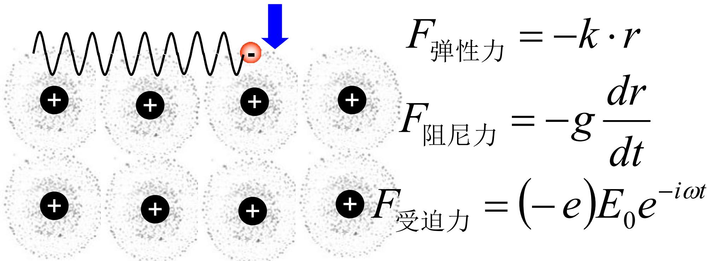
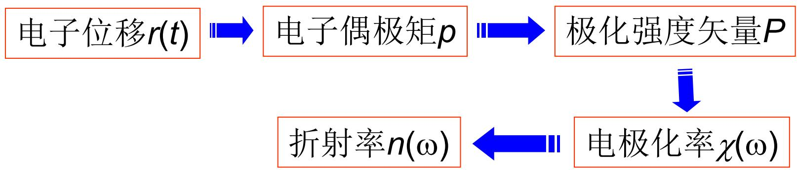
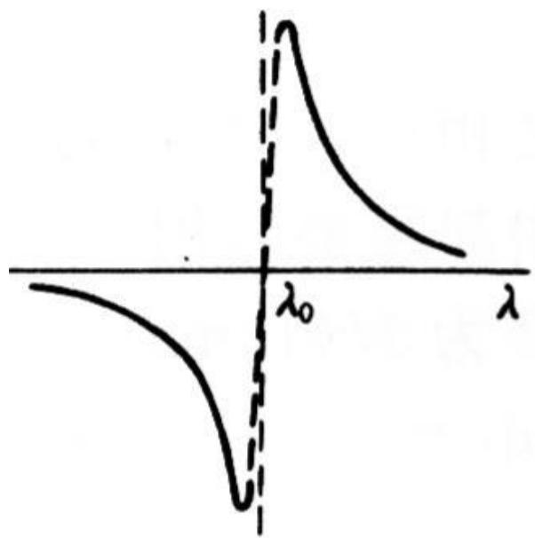
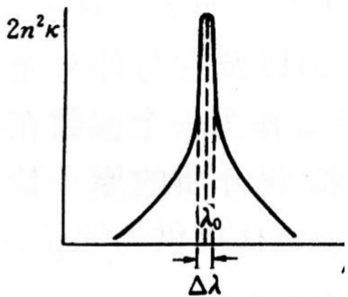

# 8.2.2 经典色散理论与洛伦兹模型

> **脉络**：[[8.2.1 色散现象、正常色散与反常色散|上一节]] 从现象上说明：透明区常见正常色散，吸收带附近会出现反常色散。本节用经典模型解释原因。核心思想是：介质中的束缚电子在光电场作用下做受迫振动，电子振动产生极化，极化决定电极化率 $\chi(\omega)$，进而决定折射率 $n(\omega)$ 和吸收。

### 一、 折射率和介电常数的关系

经典电磁理论中，介质中单色电磁波的传播速度为：

$$
v=\frac{1}{\sqrt{\varepsilon\varepsilon_0\mu\mu_0}}
=\frac{c}{\sqrt{\varepsilon\mu}}
$$

光学介质中通常有：

$$
\mu\approx 1
$$

所以：

$$
v\approx \frac{c}{\sqrt{\varepsilon}}
$$

而折射率定义为：

$$
n=\frac{c}{v}
$$

因此：

$$
n=\sqrt{\varepsilon}
$$

这里的 $\varepsilon$ 是相对介电常数。它不是孤立参数，而是来自介质在电场中的极化响应。

极化强度 $\vec{P}$ 与电场 $\vec{E}$ 的关系写成：

$$
\vec{P}(t)=\varepsilon_0\chi \vec{E}(t)
$$

并且：

$$
\varepsilon=1+\chi
$$

所以经典色散理论的任务可以说成：

> 求出介质对频率为 $\omega$ 的光电场的极化率 $\chi(\omega)$，再由 $\varepsilon(\omega)=1+\chi(\omega)$ 得到 $n(\omega)$。

### 二、 洛伦兹模型的物理图像

洛伦兹模型把介质中的束缚电子看成被原子核束缚的带电振子。入射光的电场推动电子运动，电子偏离平衡位置后又受到回复力，同时还受到阻尼。

教材图中把三种力列出来：

三种力分别是：

1. 弹性回复力：
   $$
   F_{\text{弹}}=-kr
   $$
2. 阻尼力：
   $$
   F_{\text{阻}}=-g\frac{dr}{dt}
   $$
3. 光电场受迫力：
   $$
   F_{\text{迫}}=(-e)E_0e^{-i\omega t}
   $$

这里 $r(t)$ 是电子相对于平衡位置的位移。负号 $-e$ 表示电子带负电。

因此电子的运动方程为：

$$
m\frac{d^2r}{dt^2}+g\frac{dr}{dt}+kr=(-e)E_0e^{-i\omega t}
$$

令：

$$
\gamma=\frac{g}{m},\qquad \omega_0^2=\frac{k}{m}
$$

就得到教材使用的形式：

$$
\frac{d^2r}{dt^2}+\gamma\frac{dr}{dt}+\omega_0^2r
=\frac{-e}{m}E_0e^{-i\omega t}
$$

其中：

- $\omega_0$ 是束缚电子的本征频率；
- $\gamma$ 是阻尼系数；
- $\omega$ 是入射光频率。

这个模型本质上就是阻尼受迫振动。共振附近响应最强，所以吸收和反常色散也最明显。

### 三、 从电子位移到折射率

教材给出的求解思路是：

即：

$$
r(t)\rightarrow p \rightarrow P \rightarrow \chi(\omega)\rightarrow n(\omega)
$$

逐步解释如下。

#### 1. 电子位移

对方程取与外场同频率的稳态复数解，可得：

$$
\tilde r(t)
=\frac{-e}{m}\frac{E_0e^{-i\omega t}}
{(\omega_0^2-\omega^2)-i\gamma\omega}
$$

分母决定了频率响应。当 $\omega$ 接近 $\omega_0$ 时，$\omega_0^2-\omega^2$ 变小，电子位移响应增强。

#### 2. 电子偶极矩

一个电子相对正电中心位移后形成电偶极矩：

$$
\tilde p=(-e)\tilde r
$$

代入上式：

$$
\tilde p
=\frac{e^2}{m}\frac{E_0e^{-i\omega t}}
{(\omega_0^2-\omega^2)-i\gamma\omega}
$$

#### 3. 极化强度

设单位体积中原子数密度为 $N$，每个原子有 $Z$ 个外层弱束缚电子参与响应，则单位体积内偶极矩总和为：

$$
\tilde P=NZ\tilde p
$$

所以：

$$
\tilde P
=\frac{NZe^2}{m}\frac{E_0e^{-i\omega t}}
{(\omega_0^2-\omega^2)-i\gamma\omega}
$$

另一方面，宏观电磁学中：

$$
\tilde P=\varepsilon_0\tilde\chi\tilde E
=\varepsilon_0\tilde\chi E_0e^{-i\omega t}
$$

比较两式，得到复电极化率：

$$
\tilde\chi(\omega)
=\frac{NZe^2}{\varepsilon_0m}
\frac{1}{(\omega_0^2-\omega^2)-i\gamma\omega}
$$

令：

$$
\omega_p^2\equiv \frac{NZe^2}{\varepsilon_0m}
$$

则：

$$
\tilde\chi(\omega)
=\omega_p^2
\frac{1}{(\omega_0^2-\omega^2)-i\gamma\omega}
$$

这里 $\omega_p$ 叫等离子体频率相关参数，反映单位体积内可响应电子的强弱。

### 四、 复折射率的表达式

由：

$$
\tilde n^2=\tilde\varepsilon=1+\tilde\chi
$$

可得：

$$
\tilde n^2
=1+\omega_p^2
\frac{1}{(\omega_0^2-\omega^2)-i\gamma\omega}
$$

把分母有理化：

$$
\frac{1}{(\omega_0^2-\omega^2)-i\gamma\omega}
=
\frac{(\omega_0^2-\omega^2)+i\gamma\omega}
{(\omega_0^2-\omega^2)^2+(\gamma\omega)^2}
$$

所以：

$$
\tilde n^2
=
\left[
1+\omega_p^2
\frac{\omega_0^2-\omega^2}
{(\omega_0^2-\omega^2)^2+(\gamma\omega)^2}
\right]
+i\left[
\omega_p^2
\frac{\gamma\omega}
{(\omega_0^2-\omega^2)^2+(\gamma\omega)^2}
\right]
$$

上式为了看清实部和虚部，还应明确 $\omega_p^2$ 乘在整个响应分式前。正确展开为：

$$
\tilde n^2
=
\left[
1+\omega_p^2
\frac{\omega_0^2-\omega^2}
{(\omega_0^2-\omega^2)^2+(\gamma\omega)^2}
\right]
+i\left[
\omega_p^2
\frac{\gamma\omega}
{(\omega_0^2-\omega^2)^2+(\gamma\omega)^2}
\right]
$$

这一行在 OCR 中容易把乘号结构弄乱。物理上要记住：实部来自与外场同相或反相的极化响应，虚部来自有相位滞后的耗散响应。

结合 [[8.1.3 复折射率与吸收系数|复折射率]]：

$$
\tilde n=n(1+i\kappa)
$$

则：

$$
\tilde n^2=n^2(1+i\kappa)^2
=n^2(1-\kappa^2)+i2n^2\kappa
$$

于是得到：

$$
\left\{
\begin{array}{l}
n^2(1-\kappa^2)
=1+\omega_p^2
\dfrac{\omega_0^2-\omega^2}
{(\omega_0^2-\omega^2)^2+(\gamma\omega)^2}
\\[6pt]
2n^2\kappa
=\omega_p^2
\dfrac{\gamma\omega}
{(\omega_0^2-\omega^2)^2+(\gamma\omega)^2}
\end{array}
\right.
$$

### 五、 低损耗近似和吸收峰

在弱阻尼、低损耗条件下：

$$
\kappa\ll 1
$$

所以：

$$
n^2(1-\kappa^2)\approx n^2
$$

这时复折射率的实部主要给出色散曲线，虚部相关量 $2n^2\kappa$ 给出吸收强弱。

教材给出单一本征频率附近的两张图：

可以这样理解：

1. 在 $\lambda_0$ 附近，电子受迫振动接近共振，吸收最强；
2. 吸收峰宽度与阻尼 $\gamma$ 有关，阻尼越强，峰越宽；
3. 在共振附近，折射率 $n$ 随波长剧烈变化，出现反常色散；
4. 远离共振波长时，吸收较弱，介质近似透明，色散曲线回到正常形式。

这解释了 [[8.2.1 色散现象、正常色散与反常色散|反常色散为什么常出现在吸收带附近]]。

### 六、 和柯西公式的联系

教材进一步说明：远离共振波长时，可以忽略阻尼项。此时如果 $\lambda\gg \lambda_0$，可以展开得到：

$$
n\approx A+\frac{B}{\lambda^2}+\cdots
$$

这正是上一节的柯西公式形式：

$$
n=A+\frac{B}{\lambda^2}+\frac{C}{\lambda^4}+\cdots
$$

因此柯西公式不是凭空出现的经验规律。它可以看成洛伦兹模型在透明区、远离共振频率时的近似结果。

但是当 $\lambda\ll \lambda_0$ 或接近共振区时，展开形式会改变，简单柯西公式不再适用。

### 七、 本节需要记住的结论

> **结论一**：经典色散理论把介质中的束缚电子看成阻尼受迫振子，光电场驱动电子振动，电子振动产生极化。

> **结论二**：求解链条是
> $$
> r(t)\rightarrow p\rightarrow P\rightarrow \chi(\omega)\rightarrow \varepsilon(\omega)\rightarrow n(\omega)
> $$
> 即从微观电子位移得到宏观折射率。

> **结论三**：复电极化率为
> $$
> \tilde\chi(\omega)
> =
> \omega_p^2
> \frac{1}{(\omega_0^2-\omega^2)-i\gamma\omega}
> $$
> 它的实部决定色散，虚部决定吸收。

> **结论四**：在共振频率附近，介质同时出现强吸收和反常色散；远离共振时，吸收弱，折射率变化可近似化为柯西公式。
