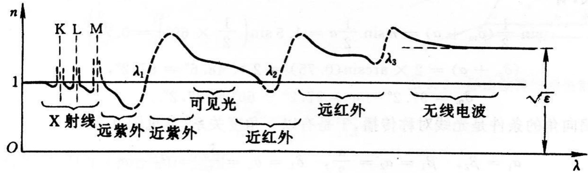
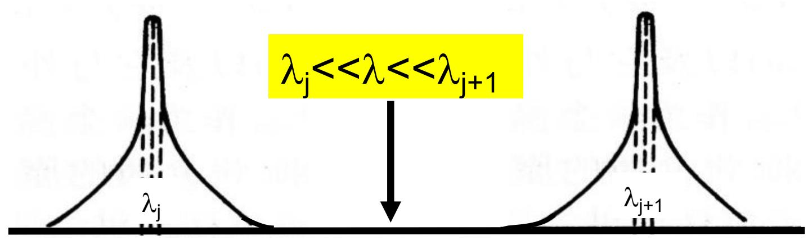
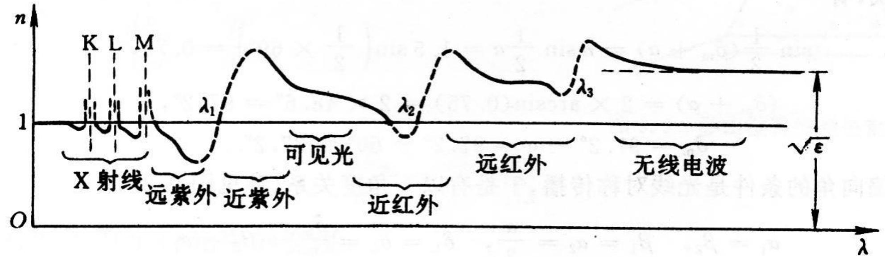

# 8.2.3 多本征频率的色散公式与吸收峰

> **脉络**：[[8.2.2 经典色散理论与洛伦兹模型|上一节]] 先讨论单一本征频率 $\omega_0$ 的束缚电子振子。实际介质内部不只有一种跃迁或一种本征振动频率，而是有多个本征频率。每个本征频率附近都会产生一个吸收带，并在吸收带附近引起反常色散。本节就是把单一振子的结果推广到多个振子。

### 一、 为什么要考虑多个本征频率

真实物质的原子、分子或固体结构中，电子、离子和分子振动可以有多个特征频率。若第 $j$ 类振子的本征频率为 $\omega_j$，对应共振波长为 $\lambda_j$，则：

$$
\omega_j=\frac{2\pi c}{\lambda_j}
$$

每个本征频率附近都会有较强的光与物质相互作用。因此一条完整的色散曲线往往不是一处异常，而是在不同波段多次出现吸收和反常色散。

教材用全域色散曲线表示这一点：

图中可以看到，从 X 射线、紫外、可见光到红外和无线电波，不同区域附近有不同的吸收结构。透明区中的色散曲线相对平缓，吸收线附近则变化剧烈。

### 二、 振子强度的含义

设每个原子一共有 $Z$ 个外层弱束缚电子参与光学响应。这些电子并不都属于同一个本征频率，而是按一定比例分配到不同本征态。

教材用 $f_j$ 表示第 $j$ 类本征振子的振子个数或振子强度。它们满足：

$$
\sum_j f_j=Z
$$

若单位体积内原子数密度为 $N$，则参与响应的电子总数密度为：

$$
N\sum_j f_j=NZ
$$

这里 $f_j$ 越大，表示第 $j$ 个共振对介质极化和吸收的贡献越强。

### 三、 多本征频率下的复介电常数

单一振子时，复电极化率有形式：

$$
\tilde\chi(\omega)
=\omega_p^2
\frac{1}{(\omega_0^2-\omega^2)-i\gamma\omega}
$$

多个本征频率时，把每个振子的贡献相加：

$$
\tilde\varepsilon
=1+\omega_p^2\sum_j\frac{f_j}{Z}
\frac{1}{(\omega_j^2-\omega^2)-i\gamma_j\omega}
$$

更清楚地写成乘法结构：

$$
\tilde\varepsilon
=1+\frac{\omega_p^2}{Z}
\sum_j
\frac{f_j}
{(\omega_j^2-\omega^2)-i\gamma_j\omega}
$$

其中：

- $\omega_j$ 是第 $j$ 个本征频率；
- $\gamma_j$ 是第 $j$ 个振子的阻尼常数；
- $f_j$ 表示该振子的强度；
- $\omega_p^2=\dfrac{NZe^2}{\varepsilon_0m}$。

把分母有理化后：

$$
\tilde\varepsilon
=
\left[
1+\frac{\omega_p^2}{Z}
\sum_j
\frac{f_j(\omega_j^2-\omega^2)}
{(\omega_j^2-\omega^2)^2+(\gamma_j\omega)^2}
\right]
+i
\left[
\frac{\omega_p^2}{Z}
\sum_j
\frac{f_j\gamma_j\omega}
{(\omega_j^2-\omega^2)^2+(\gamma_j\omega)^2}
\right]
$$

这里和上一节一样，实部决定折射率的色散，虚部决定吸收。每一项都像一个小的洛伦兹振子响应，所有振子的响应叠加起来形成完整介质的光学性质。

### 四、 低损耗近似下的 $n$ 和 $\kappa$

在弱阻尼、低损耗条件下：

$$
\kappa\ll 1
$$

由 [[8.1.3 复折射率与吸收系数|复折射率]]：

$$
\tilde n=n(1+i\kappa)
$$

并且：

$$
\tilde n^2\approx n^2+i2n^2\kappa
$$

所以可以把实部和虚部分开，得到：

$$
\left\{
\begin{array}{l}
n^2
=
1+\dfrac{\omega_p^2}{Z}
\displaystyle\sum_j
\dfrac{
f_j\lambda_j^2\lambda^2(\lambda^2-\lambda_j^2)
}{
(2\pi c)^2(\lambda^2-\lambda_j^2)^2
+\gamma_j^2\lambda_j^4\lambda^2
}
\\[8pt]
2n^2\kappa
=
\dfrac{\omega_p^2}{Z}\dfrac{1}{2\pi c}
\displaystyle\sum_j
\dfrac{
\gamma_j\lambda_j^4\lambda^3
}{
(2\pi c)^2(\lambda^2-\lambda_j^2)^2
+\gamma_j^2\lambda_j^4\lambda^2
}
\end{array}
\right.
$$

这两个式子不需要机械背诵每个因子。预习时抓住结构即可：

1. $n^2$ 的式子来自复介电常数的实部，描述色散曲线；
2. $2n^2\kappa$ 的式子来自虚部，描述吸收强弱；
3. 每个 $j$ 都对应一个共振波长 $\lambda_j$；
4. 在 $\lambda\approx\lambda_j$ 附近，对应项变化最剧烈。

教材再次给出全域色散曲线：

### 五、 远离吸收线的透明区

在远离吸收线的波段，介质近似透明，阻尼项 $\gamma_j$ 可以忽略。此时色散公式可化为：

$$
n^2=1+\sum_j\frac{a_j\lambda^2}{\lambda^2-\lambda_j^2}
$$

其中：

$$
a_j\equiv
\omega_p^2
\frac{f_j\lambda_j^2}{Z(2\pi c)^2}
$$

这个式子说明：透明区的折射率虽然没有强吸收，但仍然受所有吸收线的共同影响。只是因为离吸收线较远，表现为平滑变化。

这和 [[8.2.1 色散现象、正常色散与反常色散|柯西公式]] 的适用范围一致：柯西公式主要适用于远离吸收带的透明区域。

### 六、 两条吸收线之间的情况

若入射光波段处于两条吸收线之间：

$$
\lambda_j\ll \lambda \ll \lambda_{j+1}
$$

这一段通常是透明区域，吸收较弱。教材用下图表示两条吸收峰之间的透明窗口：

在这个区域内，折射率可以近似写成：

$$
n(\lambda)\approx A+\frac{B}{\lambda^2}+\cdots
$$

也就是柯西公式形式。

教材对应的全域色散曲线如下：

这说明柯西公式中的常数 $A,B,\cdots$ 不是普适常数，而是由附近吸收线的位置和强度决定。换一个透明窗口，这些常数也会变化。

### 七、 超高频极短波段

若入射光波长远小于所有吸收线：

$$
\lambda\ll\lambda_1
$$

则教材给出近似：

$$
n^2
=1+\sum_j\frac{a_j\lambda^2}{\lambda^2-\lambda_j^2}
\approx
1-\sum_j a_j\left(\frac{\lambda}{\lambda_j}\right)^2
<1
$$

当：

$$
\lambda\rightarrow 0
$$

有：

$$
n\rightarrow 1
$$

教材图中在极短波区域，折射率接近 1：

这说明在频率极高、波长极短的极限下，束缚电子来不及跟随外电场振动，介质的极化响应变弱，折射率趋近于真空中的值。

### 八、 本节需要记住的结论

> **结论一**：实际介质有多个本征频率，每个本征频率附近都会产生吸收峰，并引起对应的反常色散。

> **结论二**：多本征频率模型本质上是多个洛伦兹振子的线性叠加。振子强度 $f_j$ 表示第 $j$ 个共振对整体极化响应的贡献。

> **结论三**：透明区远离吸收线，可以忽略阻尼项，色散公式可近似化为柯西公式形式：
> $$
> n(\lambda)\approx A+\frac{B}{\lambda^2}+\cdots
> $$

> **结论四**：柯西公式中的常数由附近吸收线的位置和强度决定，因此不同透明波段对应的常数一般不同。

> **结论五**：在极短波极限下，电子难以跟随外场响应，介质折射率趋近于 $1$。
