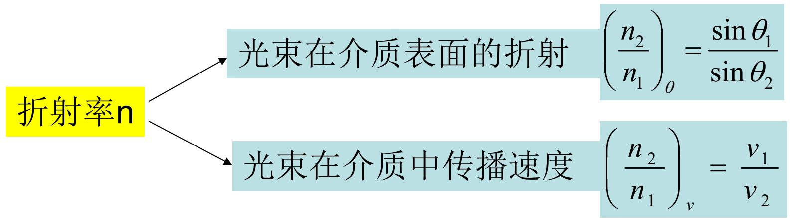
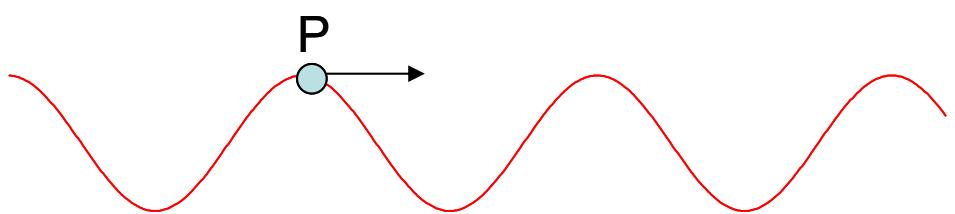
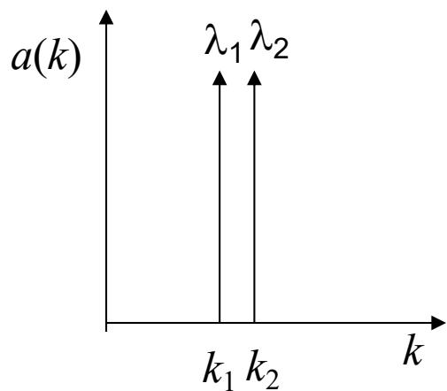
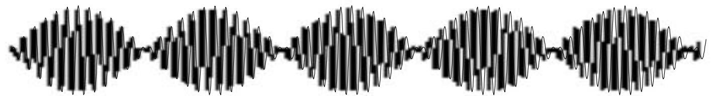
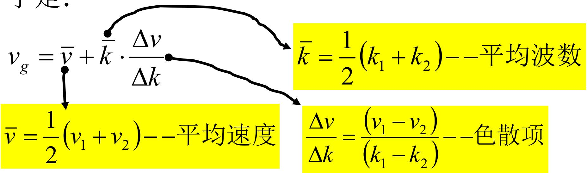

# 8.3.1 波拍、波包与群速度

> **脉络**：前面讨论 [[8.2.1 色散现象、正常色散与反常色散|色散]] 时，已经知道不同波长在介质中有不同折射率和相速度。本节进一步说明：实际光束往往不是严格单色波，而是由多个频率很接近的波叠加而成。这种叠加会形成==波拍==或==波包==。波包整体传播的速度叫==群速度==。

### 一、 为什么要引入群速度

教材用迈克耳孙测量二硫化碳 $\mathrm{CS_2}$ 折射率的历史问题引入群速度。

折射率 $n$ 通常可以从折射定律测出：

$$
\frac{n_2}{n_1}=\frac{\sin\theta_1}{\sin\theta_2}
$$

也可以从光在介质中的传播速度测出：

$$
n=\frac{c}{v}
$$

如果光是严格单色光，这两个方法给出的速度概念没有区别。但实际钠黄光含有两条很接近的谱线，它不是单一频率波。此时折射实验主要反映各谱线的折射率，而速度实验测到的是能量或波包传播的速度，这就需要引入群速度。

教材图中把这个问题概括为：

### 二、 单色波的相速度

平面单色波可以写成：

$$
\tilde U(x,t)=Ae^{i(kx-\omega t)}
$$

或取实部写成：

$$
U(x,t)=A\cos(kx-\omega t)
$$

波上某一点的运动状态由相位决定：

$$
\varphi=kx-\omega t
$$

如果同一个相位状态从 $(x_0,t_0)$ 传播到 $(x_0+dx,t_0+dt)$，则相位相等：

$$
k(x_0+dx)-\omega(t_0+dt)=kx_0-\omega t_0
$$

整理得：

$$
kdx-\omega dt=0
$$

所以：

$$
v_p=\frac{dx}{dt}=\frac{\omega}{k}
$$

这就是==相速度==。它表示某一个固定相位点的传播速度，例如波峰、波谷或图中某一点 $P$ 的移动速度。

对于理想单色波，波在空间中无限延伸，没有明确的“前端”和“后端”，所以只谈相速度就够了。但实际信号和能量传输通常需要有限长度的波列，这就要看包络的传播。

### 三、 两个接近频率叠加形成波拍

考虑最简单的非单色波：由两个频率很接近、振幅相同的简谐波叠加。

$$
U_1(x,t)=A\cos(\omega_1t-k_1x)
$$

$$
U_2(x,t)=A\cos(\omega_2t-k_2x)
$$

合成波为：

$$
U(x,t)=U_1+U_2
$$

利用三角恒等式：

$$
\cos a+\cos b
=2\cos\frac{a-b}{2}\cos\frac{a+b}{2}
$$

可得：

$$
U(x,t)
=2A\cos\left(\frac{\Delta\omega}{2}t-\frac{\Delta k}{2}x\right)
\cos\left(\bar\omega t-\bar kx\right)
$$

其中：

$$
\Delta\omega=\omega_1-\omega_2,\qquad
\Delta k=k_1-k_2
$$

$$
\bar\omega=\frac{\omega_1+\omega_2}{2},\qquad
\bar k=\frac{k_1+k_2}{2}
$$

这个式子有两个部分：

1. 高频因子 $\cos(\bar\omega t-\bar kx)$：描述内部快速振荡；
2. 低频因子 $\cos\left(\frac{\Delta\omega}{2}t-\frac{\Delta k}{2}x\right)$：描述振幅包络。

教材用两条很近的谱线表示这种情况：

叠加后的空间图像就是波拍：

图中可以看到：内部有快速振荡，外面有缓慢变化的包络。探测器通常不能跟踪光场每一次光频振荡，而是对能量流或强度包络更敏感。

这和 [[4.8.2 非单色性对干涉场的影响|非单色性产生拍频和衬比度变化]] 是同一类数学结构：接近频率的叠加会产生慢变化包络。

### 四、 群速度的定义

波拍的包络由低频因子决定：

$$
\cos\left(\frac{\Delta\omega}{2}t-\frac{\Delta k}{2}x\right)
$$

令包络相位保持不变：

$$
\frac{\Delta\omega}{2}t-\frac{\Delta k}{2}x=\text{常数}
$$

两边微分：

$$
\frac{\Delta\omega}{2}dt-\frac{\Delta k}{2}dx=0
$$

所以包络传播速度为：

$$
v_g=\frac{dx}{dt}=\frac{\Delta\omega}{\Delta k}
$$

这就是==群速度==。当两个频率非常接近时，极限形式为：

$$
v_g=\frac{d\omega}{dk}
$$

教材图中还写成：

$$
v_g=\bar v+\bar k\frac{\Delta v}{\Delta k}
$$

其中：

$$
\bar k=\frac{1}{2}(k_1+k_2)
$$

这个形式说明：群速度不一定等于两个相速度的平均值，还受到色散项 $\dfrac{\Delta v}{\Delta k}$ 的影响。

### 五、 相速度和群速度的区别

两条谱线各自的相速度为：

$$
v_1=\frac{\omega_1}{k_1}=\frac{c}{n(\lambda_1)}
$$

$$
v_2=\frac{\omega_2}{k_2}=\frac{c}{n(\lambda_2)}
$$

在无色散介质中：

$$
n(\lambda_1)=n(\lambda_2)
$$

因此：

$$
v_1=v_2,\qquad v_g=v_p
$$

在色散介质中：

$$
n(\lambda_1)\ne n(\lambda_2)
$$

因此不同频率成分的相速度不同，包络传播速度也会与相速度不同。

可以概括为：

1. ==相速度== $v_p=\omega/k$：固定相位点的传播速度；
2. ==群速度== $v_g=d\omega/dk$：波包包络或能量流的传播速度；
3. 无色散时二者相等；
4. 有色散时二者一般不相等。

教材给出的结论是：

- 正常色散中，通常 $v_g<v_p$；
- 无色散中，$v_g=v_p$；
- 反常色散中，可能出现 $v_g>v_p$。

这里的比较要结合具体频段理解。群速度描述包络传播，不等同于某个单色相位点的速度。

### 六、 迈克耳孙实验的解释

钠黄光包含两条很接近的谱线：

$$
\lambda_1=589.0\ \mathrm{nm}
$$

$$
\lambda_2=589.6\ \mathrm{nm}
$$

在二硫化碳 $\mathrm{CS_2}$ 中，这两条谱线的折射率稍有不同。

折射法主要看光束方向，因此测到的是与两条谱线折射率有关的平均折射率，教材给出约：

$$
\bar n=1.64
$$

速度法测的是光束能流或波拍包络传播速度，即群速度。教材给出：

$$
\frac{v_g}{c}=\frac{1}{1.758}
$$

也就是：

$$
v_g\approx 1.71\times 10^8\ \mathrm{m/s}
$$

而平均相速度约为：

$$
\bar v\approx \frac{c}{\bar n}
=1.83\times 10^8\ \mathrm{m/s}
$$

这说明两条谱线的相速度相差很小，但由于群速度包含色散项，群速度可以明显低于平均相速度。

### 七、 本节需要记住的结论

> **结论一**：单色波的速度通常指相速度：
> $$
> v_p=\frac{\omega}{k}
> $$
> 它描述固定相位点的传播。

> **结论二**：两个接近频率的波叠加会形成波拍，波场可看成“快速振荡”乘以“慢变化包络”。

> **结论三**：波拍包络的传播速度是群速度：
> $$
> v_g=\frac{\Delta\omega}{\Delta k}
> $$
> 当频率连续分布且范围很窄时：
> $$
> v_g=\frac{d\omega}{dk}
> $$

> **结论四**：在色散介质中，相速度和群速度一般不同。实际能量流或信号包络通常与群速度联系更直接。
