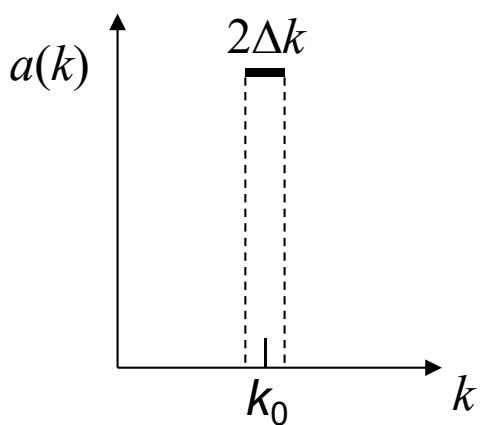
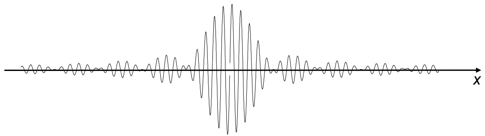
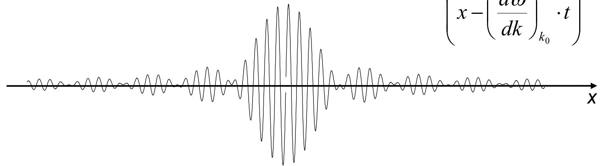
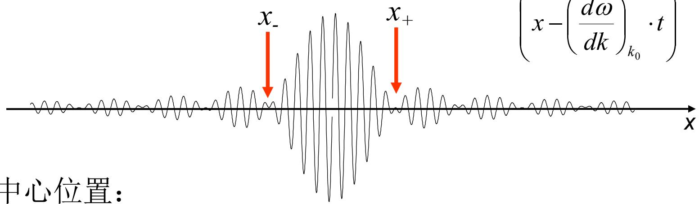

# 8.3.2 波包群速度和宽度

> **脉络**：[[8.3.1 波拍、波包与群速度|上一节]] 用两个接近频率的波说明了波拍和群速度。本节把两个频率推广为一小段连续的波数分布。准单色光不是一个无限长单色波，而是由中心波数 $k_0$ 附近的一组波叠加形成的有限波包。

### 一、 准单色光的波数分布

准单色光的意思是：光不是严格只有一个波数 $k_0$，但主要集中在 $k_0$ 附近很窄的范围内。

教材取一个最简单的方垒型谱密度函数：

$$
a(k)=
\left\{
\begin{array}{ll}
a_0, & |k-k_0|\le \Delta k\\
0, & |k-k_0|>\Delta k
\end{array}
\right.
$$

并且：

$$
\Delta k\ll k_0
$$

图像如下：

这里 $2\Delta k$ 是整个谱宽，$\Delta k$ 是半宽。谱越窄，说明光越接近理想单色光。

这和 [[4.8.2 非单色性对干涉场的影响|准单色线宽]] 是同一个思想：谱线宽度不为零，说明光场由一小段频率或波数范围共同组成。

### 二、 用积分表示总波场

波数在 $k$ 到 $k+dk$ 之间的谱元贡献元振幅：

$$
dA=a(k)dk
$$

对应的元波函数为：

$$
d\tilde U=a(k)e^{i(kx-\omega t)}dk
$$

所有谱元叠加后：

$$
\tilde U(x,t)=\int_0^\infty a(k)e^{i(kx-\omega t)}dk
$$

对方垒型谱：

$$
\tilde U(x,t)
=\int_{k_0-\Delta k}^{k_0+\Delta k}
a_0e^{i(kx-\omega t)}dk
$$

这一步的意义很重要：波包不是单个波，而是一组波数成分相干叠加的结果。它和 [[4.7.3 傅立叶变换光谱仪|傅立叶变换光谱仪]] 的思想相通：空间或时间形状与谱分布之间有傅立叶对应关系。

### 三、 对 $\omega(k)$ 做一阶展开

在色散介质中：

$$
\omega=\omega(k)
$$

而且一般不是简单线性关系。由于准单色光只集中在 $k_0$ 附近，可以在 $k_0$ 附近展开：

$$
\omega(k)=\omega(k_0)
+\left(\frac{d\omega}{dk}\right)_{k_0}(k-k_0)
+\frac{1}{2}\left(\frac{d^2\omega}{dk^2}\right)_{k_0}(k-k_0)^2+\cdots
$$

本节先只保留一阶项：

$$
\omega(k)\approx \omega_0+
\left(\frac{d\omega}{dk}\right)_{k_0}K
$$

其中：

$$
K=k-k_0,\qquad \omega_0=\omega(k_0)
$$

令：

$$
v_g=\left(\frac{d\omega}{dk}\right)_{k_0}
$$

则：

$$
\omega(k)\approx \omega_0+v_gK
$$

### 四、 方垒谱对应的波包形式

把：

$$
k=k_0+K
$$

代入积分：

$$
\tilde U(x,t)
=\int_{-\Delta k}^{\Delta k}
a_0
e^{i[(k_0+K)x-(\omega_0+v_gK)t]}dK
$$

整理指数：

$$
\tilde U(x,t)
=e^{i(k_0x-\omega_0t)}
\int_{-\Delta k}^{\Delta k}
a_0e^{iK(x-v_gt)}dK
$$

积分结果为：

$$
\tilde U(x,t)
=2a_0
\frac{\sin[(x-v_gt)\Delta k]}{x-v_gt}
e^{i(k_0x-\omega_0t)}
$$

这个式子可以分成两部分：

1. 包络因子：
   $$
   2a_0\frac{\sin[(x-v_gt)\Delta k]}{x-v_gt}
   $$
2. 载波因子：
   $$
   e^{i(k_0x-\omega_0t)}
   $$

图中显示了这种由方垒谱形成的波包：

载波是内部快速振荡，包络决定整个波包的形状和位置。

### 五、 波包中心的群速度

波包包络主要由变量：

$$
x-v_gt
$$

决定。若保持包络形状上的同一点不变，有：

$$
x-v_gt=(x+dx)-v_g(t+dt)
$$

于是：

$$
dx=v_gdt
$$

所以：

$$
v_g=\frac{dx}{dt}
=\left(\frac{d\omega}{dk}\right)_{k_0}
$$

教材图中标出了波包中心随时间移动：

这说明上一节的：

$$
v_g=\frac{\Delta\omega}{\Delta k}
$$

在连续谱极限下变为：

$$
v_g=\frac{d\omega}{dk}
$$

### 六、 波包宽度

波包中心位置由包络最大值给出。令：

$$
(x_0-v_gt)\Delta k=0
$$

则：

$$
x_0=v_gt
$$

这就是波包中心。

波包主瓣的两个第一个零点满足：

$$
(x_\pm-v_gt)\Delta k=\pm\pi
$$

所以：

$$
x_+-x_-=\frac{2\pi}{\Delta k}
$$

教材把波包宽度写成：

$$
\Delta x=\frac{2\pi}{\Delta k}
$$

于是：

$$
\Delta x\cdot \Delta k\approx 2\pi
$$

图中红色箭头标出了主瓣两侧的零点：

这个关系说明：

1. 谱宽 $\Delta k$ 越小，波包空间宽度 $\Delta x$ 越大；
2. 谱宽 $\Delta k$ 越大，波包空间宽度 $\Delta x$ 越小；
3. 理想单色波 $\Delta k\to 0$ 时，波包长度趋于无限大。

这和 [[4.8.1 相干时间与相干长度|相干长度与谱线宽度反比]] 是同一物理关系。谱线越窄，波列越长；谱线越宽，波列越短。

### 七、 与时间宽度的关系

若把波包空间宽度换成持续时间，可用：

$$
\Delta x\approx v_g\tau_0
$$

又因为：

$$
\Delta \omega\approx v_g\Delta k
$$

由：

$$
\Delta x\Delta k\approx 2\pi
$$

可以得到数量级关系：

$$
\Delta\omega\cdot \tau_0\approx 2\pi
$$

若使用普通频率 $\nu$ 而不是角频率 $\omega$，因为 $\omega=2\pi\nu$，则：

$$
\Delta\nu\cdot \tau_0\approx 1
$$

教材写成：

$$
\Delta\nu\cdot \tau_0\approx 1
$$

它和第四章的时间相干性反比律完全一致。

### 八、 本节需要记住的结论

> **结论一**：准单色波可以看成中心波数 $k_0$ 附近一小段波数成分的叠加。

> **结论二**：在只保留 $\omega(k)$ 一阶展开时，波包不变形地以群速度传播：
> $$
> v_g=\left(\frac{d\omega}{dk}\right)_{k_0}
> $$

> **结论三**：方垒型波数谱对应 sinc 型空间波包。谱宽和波包宽度满足反比关系：
> $$
> \Delta x\Delta k\approx 2\pi
> $$

> **结论四**：用时间宽度表示时：
> $$
> \Delta\nu\cdot \tau_0\approx 1
> $$
> 这说明谱线越窄，波包持续时间越长。
