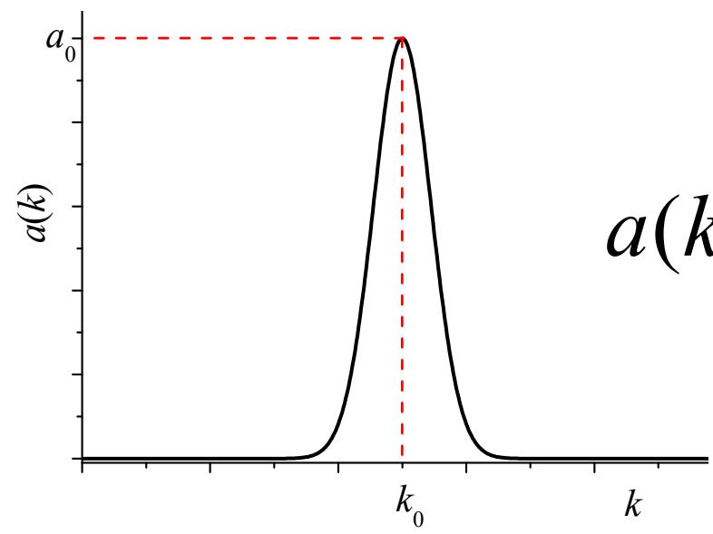
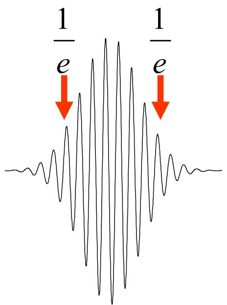
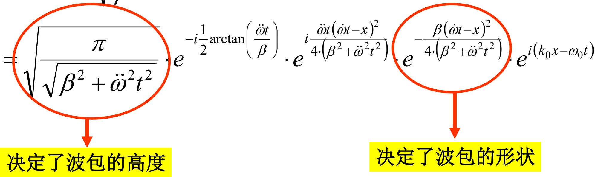
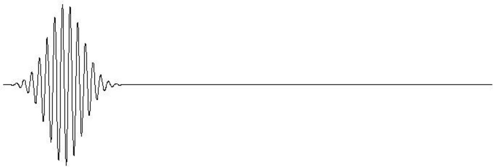
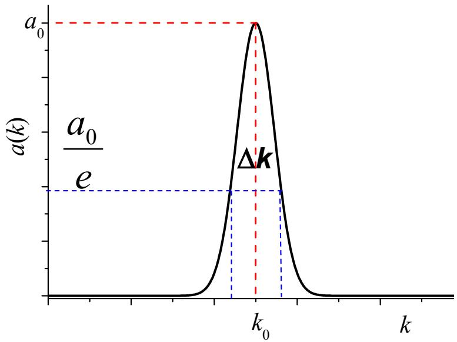

# 8.3.3 波包展宽与寿命

> **脉络**：[[8.3.2 波包群速度和宽度|上一节]] 只保留 $\omega(k)$ 的一阶展开，得到波包以群速度平移，而且宽度不随时间变。本节保留二阶项。二阶项反映群速度随波数改变，不同谱成分的群速度不同，于是波包在传播中会逐渐展宽。

### 一、 从一阶展开到二阶展开

准单色波包集中在 $k_0$ 附近，令：

$$
K=k-k_0
$$

对色散关系 $\omega(k)$ 展开：

$$
\omega(k)=\omega(k_0)
+\left(\frac{d\omega}{dk}\right)_{k_0}K
+\frac{1}{2}\left(\frac{d^2\omega}{dk^2}\right)_{k_0}K^2+\cdots
$$

教材简写为：

$$
\omega(k)=\omega_0+\dot\omega K+\ddot\omega K^2
$$

其中应理解为：

$$
\dot\omega=\left(\frac{d\omega}{dk}\right)_{k_0}
$$

$$
\ddot\omega=\frac{1}{2}\left(\frac{d^2\omega}{dk^2}\right)_{k_0}
$$

这里：

- $\dot\omega$ 是一阶项，决定波包中心的传播速度；
- $\ddot\omega$ 是二阶项，决定波包是否展宽。

若 $\ddot\omega=0$，说明 $\omega(k)$ 在这一小段内近似线性，不同 $k$ 成分具有相同群速度，波包不会展宽。若 $\ddot\omega\ne0$，不同 $k$ 成分的群速度不同，波包会展宽。

### 二、 高斯型准单色光谱

本节不再用方垒型谱，而用高斯型谱：

$$
a(k)=a_0e^{-\beta(k-k_0)^2}
=a_0e^{-\beta K^2}
$$

教材图如下：

高斯谱的好处是积分后仍然得到高斯型波包，便于看清宽度如何随时间改变。

总波场写成：

$$
\tilde U(x,t)
=\int_0^\infty a_0e^{-\beta K^2}
e^{i(kx-\omega t)}dk
$$

代入：

$$
k=k_0+K
$$

以及：

$$
\omega=\omega_0+\dot\omega K+\ddot\omega K^2
$$

得到：

$$
\tilde U(x,t)
=a_0e^{i(k_0x-\omega_0t)}
\int e^{-(\beta+i\ddot\omega t)K^2}
e^{iK(x-\dot\omega t)}dK
$$

教材中把积分下限近似从 $-k_0$ 延伸到 $-\infty$，上限为 $+\infty$。这在 $\Delta k\ll k_0$ 的准单色条件下可以接受，因为主要贡献来自 $K=0$ 附近。

### 三、 忽略二阶项时：波包不展宽

若：

$$
\ddot\omega\approx 0
$$

则积分结果近似为：

$$
\tilde U(x,t)
\approx
\sqrt{\frac{\pi}{\beta}}
e^{-\frac{(\dot\omega t-x)^2}{4\beta}}
e^{i(k_0x-\omega_0t)}
$$

包络部分是：

$$
e^{-\frac{(x-\dot\omega t)^2}{4\beta}}
$$

它的中心满足：

$$
x_0=\dot\omega t
$$

所以：

$$
v_g=\frac{dx_0}{dt}=\dot\omega
=\left(\frac{d\omega}{dk}\right)_{k_0}
$$

教材用 $1/e$ 位置定义宽度。令：

$$
(x_\pm-\dot\omega t)^2=4\beta
$$

则：

$$
\Delta x=x_+-x_-=4\sqrt{\beta}
$$

此时 $\Delta x$ 不含 $t$，所以波包只是整体平移，不发生展宽。

### 四、 保留二阶项时：波包展宽

若：

$$
\ddot\omega\ne0
$$

则波场为：

$$
\tilde U(x,t)
=
\sqrt{\frac{\pi}{\beta+i\ddot\omega t}}
e^{-\frac{(\dot\omega t-x)^2}{4(\beta+i\ddot\omega t)}}
e^{i(k_0x-\omega_0t)}
$$

这里的复数分母会同时改变相位和包络形状。若只看包络高度和形状，可得到教材写出的形式：

$$
\tilde P(x,t)
=
\sqrt{\frac{\pi}{\sqrt{\beta^2+\ddot\omega^2t^2}}}
e^{
-\frac{\beta(\dot\omega t-x)^2}
{4(\beta^2+\ddot\omega^2t^2)}
}
$$

教材图把决定高度和形状的因子圈出：

中心位置仍满足：

$$
x_0=\dot\omega t
$$

所以中心仍以群速度：

$$
v_g=\dot\omega
$$

传播。

但是宽度变为：

$$
\beta(x_\pm-\dot\omega t)^2
=4(\beta^2+\ddot\omega^2t^2)
$$

所以：

$$
\Delta x(t)
=x_+-x_-
=\frac{4}{\sqrt{\beta}}
\sqrt{\beta^2+\ddot\omega^2t^2}
$$

当 $t=0$ 时：

$$
\Delta x_0=4\sqrt{\beta}
$$

当 $t$ 增大时：

$$
\sqrt{\beta^2+\ddot\omega^2t^2}
$$

也增大，因此波包逐渐变宽。

**物理意义**：二阶色散项表示群速度本身依赖于 $k$。波包内部不同 $k$ 成分走得快慢不同，叠加后包络就被拉开。由于总能量没有凭空增加，波包变宽时峰值也会降低。

### 五、 波包寿命

教材把==波包寿命==定义为：从 $t=0$ 开始，到波包宽度变为原来 3 倍所需要的时间。

宽度为：

$$
\Delta x(t)
=\frac{4}{\sqrt{\beta}}
\sqrt{\beta^2+\ddot\omega^2t^2}
$$

初始宽度为：

$$
\Delta x_0=4\sqrt{\beta}
$$

设寿命为 $\tau$，则：

$$
\Delta x_\tau
=\frac{4}{\sqrt{\beta}}
\sqrt{\beta^2+\ddot\omega^2\tau^2}
$$

按定义：

$$
\frac{\Delta x_\tau}{\Delta x_0}=3
$$

所以：

$$
\sqrt{1+\frac{\ddot\omega^2\tau^2}{\beta^2}}=3
$$

严格解为：

$$
\tau=\frac{\sqrt{8}\beta}{|\ddot\omega|}
$$

教材取数量级近似：

$$
\tau\approx \frac{3\beta}{|\ddot\omega|}
$$

再由高斯谱宽关系：

$$
\Delta k=\frac{2}{\sqrt{\beta}}
$$

得到：

$$
\beta=\frac{4}{\Delta k^2}
$$

因此波包寿命数量级可写成：

$$
\tau\sim \frac{1}{|\ddot\omega|(\Delta k)^2}
$$

教材图中用 $a_0/e$ 定义高斯谱的宽度：

### 六、 本节需要记住的结论

> **结论一**：一阶色散项 $\dot\omega$ 决定波包中心传播速度：
> $$
> v_g=\dot\omega=\left(\frac{d\omega}{dk}\right)_{k_0}
> $$

> **结论二**：二阶色散项 $\ddot\omega$ 决定波包是否展宽。若 $\ddot\omega=0$，波包宽度不变；若 $\ddot\omega\ne0$，波包随时间展宽。

> **结论三**：高斯波包在二阶色散下的宽度为：
> $$
> \Delta x(t)=\frac{4}{\sqrt{\beta}}\sqrt{\beta^2+\ddot\omega^2t^2}
> $$

> **结论四**：波包寿命可以用展宽到原来若干倍的时间估计。谱宽 $\Delta k$ 越大，二阶色散越强，波包寿命越短。
