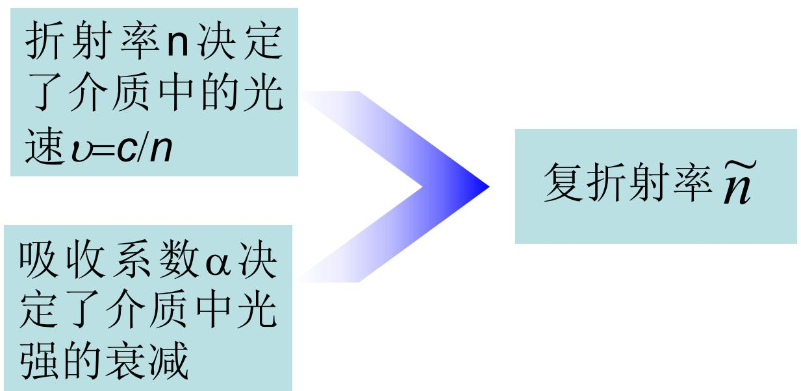
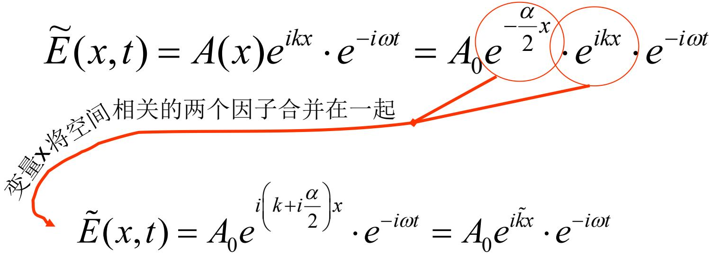

# 8.1.3 复折射率与吸收系数

> **脉络**：前两节已经知道，吸收介质中光强按 [[8.1.1 线性吸收规律与光限幅|指数规律]] 衰减，并且吸收系数还可能随波长变化，形成 [[8.1.2 普遍吸收与选择吸收|选择吸收]]。本节把吸收写进波函数本身：介质不再只用实数折射率 $n$ 描述，而要用==复折射率== $\tilde n$ 描述。

### 一、 为什么需要复折射率

在无吸收透明介质中，折射率 $n$ 主要决定光在介质中的传播速度：

$$
v=\frac{c}{n}
$$

它也决定波矢大小：

$$
k=\frac{\omega}{v}=\frac{\omega}{c/n}=\frac{\omega}{c}n
$$

如果介质没有吸收，沿 $x$ 方向传播的平面波可以写成：

$$
\tilde E(x,t)=A_0e^{-i(\omega t-kx)}
=A_0e^{ikx}e^{-i\omega t}
$$

这里 $A_0$ 是常数，说明波在传播时振幅不随 $x$ 衰减。

但是吸收介质中还要描述另一件事：光强随传播距离减小。教材把这两种作用合在一起：

也就是说：

- 实部负责描述相位传播和光速；
- 虚部负责描述振幅衰减和吸收。

这和第二章的 [[2.1.3 电磁波的能流与偏振|光强表示平均能流密度]] 有直接联系：吸收不是只改变数学形式，而是表示电磁能流在介质中逐渐转移给物质。

### 二、 光强衰减与振幅衰减

线性吸收规律为：

$$
I(x)=I_0e^{-\alpha x}
$$

这里 $\alpha$ 是吸收系数，单位通常是 $\text{m}^{-1}$。$\alpha$ 越大，同样距离内光强下降越快。

在常用复振幅表示中，光强和振幅平方成正比。教材这里采用简化写法：

$$
I(x)=A^2(x)
$$

因此：

$$
A(x)=A_0e^{-\frac{\alpha}{2}x}
$$

这里容易出错：光强指数里是 $-\alpha x$，振幅指数里是 $-\frac{\alpha}{2}x$。原因是光强与振幅平方成正比：

$$
\left(A_0e^{-\frac{\alpha}{2}x}\right)^2
=A_0^2e^{-\alpha x}
$$

所以吸收介质中的电场可以写成：

$$
\tilde E(x,t)=A_0e^{-\frac{\alpha}{2}x}e^{ikx}e^{-i\omega t}
$$

这个式子中有两个与空间 $x$ 有关的因子：

1. $e^{ikx}$：描述相位随位置改变；
2. $e^{-\frac{\alpha}{2}x}$：描述振幅随位置衰减。

教材图中把这两个空间因子合并在一起：

### 三、 复波矢

为了把上式写得更像普通平面波，可以把空间部分合并：

$$
e^{-\frac{\alpha}{2}x}e^{ikx}
=e^{ikx-\frac{\alpha}{2}x}
=e^{i\left(k+i\frac{\alpha}{2}\right)x}
$$

于是定义==复波矢==：

$$
\tilde k=k+i\frac{\alpha}{2}
$$

吸收介质中的波函数就可以写成：

$$
\tilde E(x,t)=A_0e^{i\tilde kx}e^{-i\omega t}
$$

这个写法形式上和无吸收介质的平面波一样，只是把实波矢 $k$ 换成了复波矢 $\tilde k$。

需要注意符号约定：这里教材使用的是 $e^{i\tilde kx}e^{-i\omega t}$。在这个约定下，若 $\tilde k=k+i\alpha/2$，则：

$$
e^{i\tilde kx}=e^{i(k+i\alpha/2)x}
=e^{ikx}e^{-\alpha x/2}
$$

正好得到随 $x$ 衰减的振幅。

### 四、 由复波矢得到复折射率

在无吸收介质中：

$$
k=\frac{\omega}{c}n
$$

吸收介质中把 $k$ 推广为 $\tilde k$，于是写成：

$$
\tilde k=\frac{\omega}{c}\tilde n
$$

由教材给出的复波矢：

$$
\tilde k=k+i\frac{\alpha}{2}
$$

又因为：

$$
k=\frac{\omega}{c}n
$$

所以：

$$
\tilde k
=\frac{\omega}{c}n+i\frac{\alpha}{2}
=\frac{\omega}{c}\left(n+i\frac{c\alpha}{2\omega}\right)
$$

因此复折射率为：

$$
\tilde n=n+i\frac{c\alpha}{2\omega}
$$

教材还把它写成：

$$
\tilde n=n(1+i\kappa)
$$

其中：

$$
\kappa=\frac{c\alpha}{2n\omega}
$$

这里 $\kappa$ 常称为==衰减系数==或消光相关参数。它是一个无量纲量，用来描述复折射率虚部相对于实部的大小。

### 五、 实部和虚部的物理意义

复折射率可以写成：

$$
\tilde n=n+i n\kappa
$$

其中：

- $n$ 是复折射率的实部，主要决定相位速度、波长和光程；
- $n\kappa$ 是复折射率的虚部，主要决定振幅衰减；
- $\alpha$ 是光强吸收系数，直接出现在 $I(x)=I_0e^{-\alpha x}$ 中；
- $\kappa$ 是把吸收写入复折射率后得到的无量纲参数。

它们之间的关系可以写成：

$$
\alpha=\frac{2n\omega}{c}\kappa
$$

如果用真空波长 $\lambda_0$ 表示，因为：

$$
\omega=\frac{2\pi c}{\lambda_0}
$$

所以：

$$
\alpha=\frac{4\pi n\kappa}{\lambda_0}
$$

这说明：同一个吸收现象可以从两个角度描述。

1. 从强度衰减角度，用 $\alpha$ 描述；
2. 从波传播角度，用复折射率虚部或 $\kappa$ 描述。

### 六、 与前面内容的联系

在 [[1.2 光程的物理意义与相位差|光程和相位差]] 中，折射率 $n$ 主要用来计算相位积累：

$$
\Delta \varphi=\frac{2\pi}{\lambda_0}nl
$$

在本节以后，如果介质有吸收，折射率不再只是实数。实部仍然控制相位积累，虚部则控制振幅衰减。

这也解释了为什么在 [[3.2.1 菲涅耳公式与复振幅反射率（不需要背复杂的四个但是布鲁斯特角要背）|菲涅耳公式]] 或薄膜问题中，若材料有明显吸收，不能简单只用一个实数折射率处理。吸收会改变透射、反射以及膜内传播时的振幅。

### 七、 本节需要记住的结论

> **结论一**：吸收介质中，光学性质需要同时描述相位传播和强度衰减，因此引入复波矢 $\tilde k$ 和复折射率 $\tilde n$。

> **结论二**：光强满足 $I(x)=I_0e^{-\alpha x}$ 时，振幅满足 $A(x)=A_0e^{-\alpha x/2}$。这里的 $1/2$ 来自光强与振幅平方成正比。

> **结论三**：在教材采用的符号约定下，
> $$
> \tilde k=k+i\frac{\alpha}{2}
> $$
> 使得 $e^{i\tilde kx}=e^{ikx}e^{-\alpha x/2}$，正好表示传播中振幅衰减。

> **结论四**：复折射率可以写成
> $$
> \tilde n=n+i\frac{c\alpha}{2\omega}=n(1+i\kappa)
> $$
> 实部 $n$ 描述相位传播，虚部描述介质吸收。
