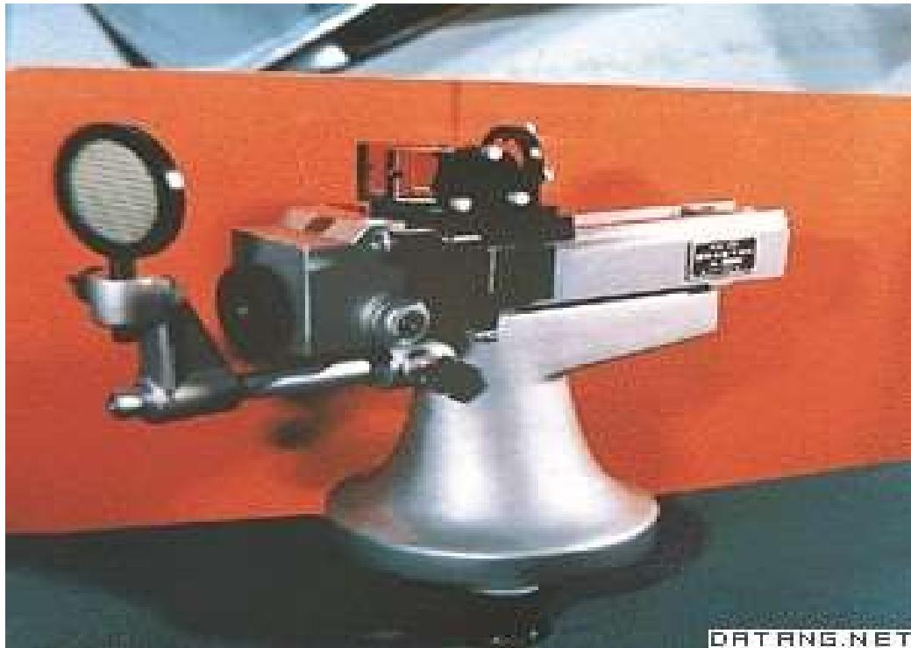
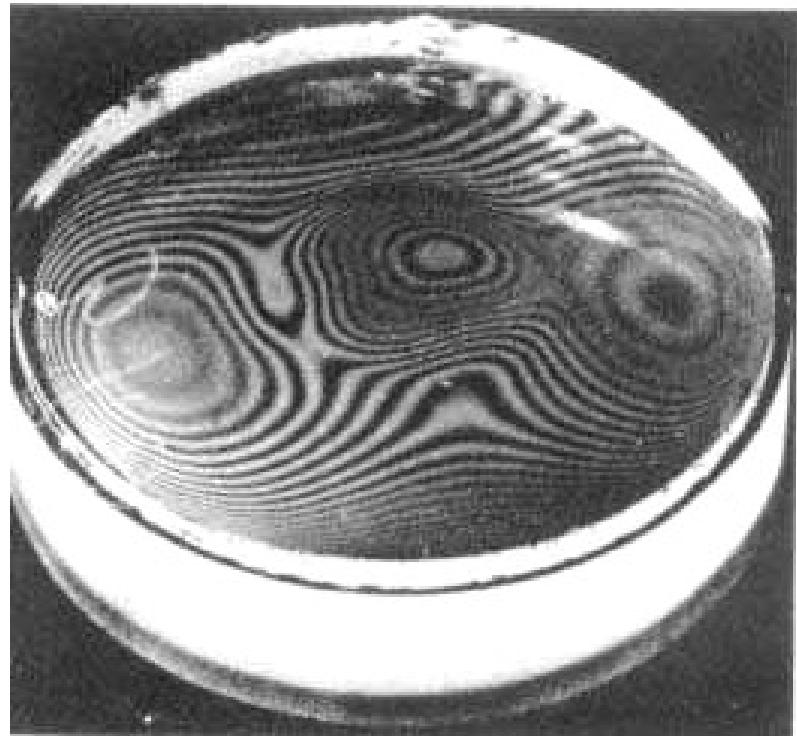

# 4.1.1 ==干涉==现象的历史背景与基本概念

### 一、 光的干涉现象是如何被认识的

19世纪初，光的微粒说仍占主流地位。1800年，英国物理学家托马斯·杨（Thomas Young）首次提出了对微粒说的若干反驳论据，并在分析水波、声波叠加现象的基础上，首次将"==干涉==" 这一术语引入到光学领域。

1801年，杨氏通过**双缝实验**，在观察屏上得到了明暗相间的条纹，证明了光具有波动性，并在此基础上：
- 提出了**波长**的概念
- 完成了对7种颜色光的波长的首次测定
- 用干涉原理解释了白光照射薄膜时呈现彩色的原因

这些工作使杨氏成为光的波动说的奠基人之一，在科学史上具有重要地位。

### 二、 什么是光的干涉

光的干涉是指：两列（或多列）光波在空间某区域相互叠加时，叠加区域内各点的光强分布不再是各束光单独存在时光强的简单相加，而是出现了==有稳定空间分布的光强强弱交替图样==，即**干涉条纹**。

其核心物理量是叠加区域内各点的**相位差** $\delta(P)$。相位差在空间中的分布决定了哪些点的光强加强、哪些点的光强减弱，进而形成干涉条纹图样。

### 三、 干涉现象的应用价值

以干涉原理为基础的**干涉计量术**是精密测量领域的重要手段。依靠光的干涉，可以实现：
- 精密测量微小长度（亚微米量级）
- 检验光学元件面形的加工精度
- 测量介质折射率
- 测量微小角度和振动

> **本章的逻辑脉络**：本章将依次讨论—
> 1. 光波叠加产生干涉的条件（[[4.2.1 光强的定义与双光束叠加后的合成光强公式]]、[[4.2.2 相干叠加的三个条件及其原因分析]]）
> 2. 用普通光源获得相干光的两种方法及其代表性装置（[[4.1.2 获得相干光的两种基本途径]]）
> 3. 描述干涉条纹可见程度的衬比度（[[4.2.3 干涉场的衬比度]]）
> 4. 光源的空间范围和时间范围对干涉条纹质量的限制（[[4.3.4 光源宽度对衬比度的影响与极限宽度]]、[[4.4.1 空间相干性的概念与反比律]]）
