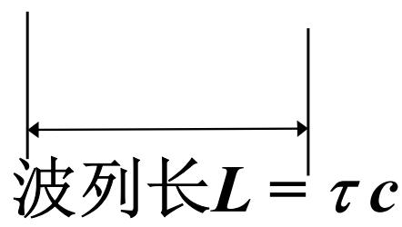
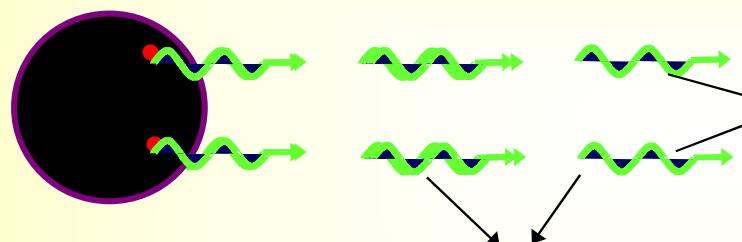
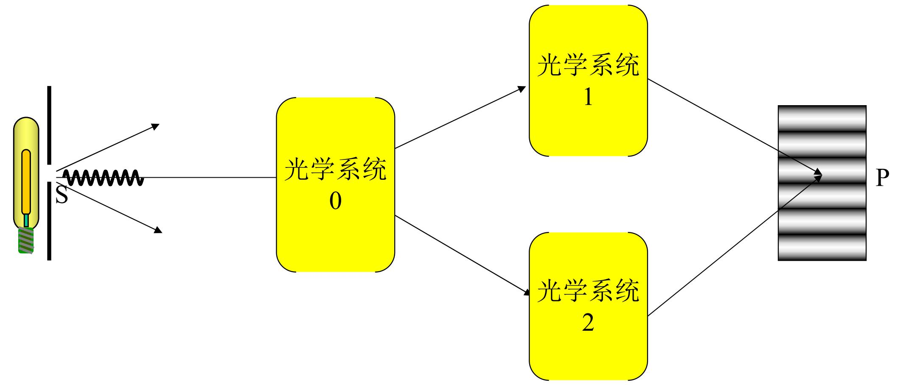
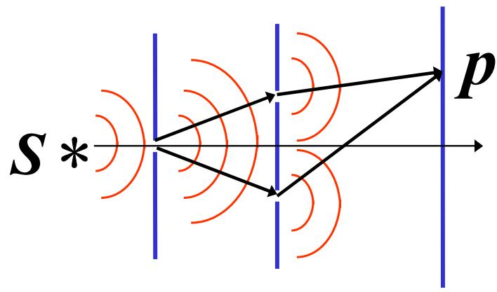
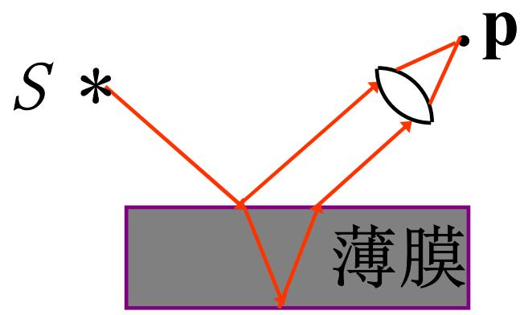

# 4.1.2 获得==相干光==的两种基本途径

### 一、 普通光源为何不能直接产生干涉

普通光源（如钠灯、白炽灯）的发光机制是**自发辐射**：光源中大量原子各自独立地从高能级跃迁回低能级，每次跃迁发出一段持续时间约为 $10^{-8}$ s 的有限长度**波列**。

这一发光过程有两个关键特征：
- **间歇性**：每个原子不会连续发光，而是一段波列发完之后停顿，再发下一段
- **随机性**：不同原子（或同一原子先后）两次发光的初始相位 $\varphi_0(t)$ 是随机的、互不关联的

两束来自独立光源的光波叠加时，它们各自的初始相位 $\varphi_{10}(t)$ 和 $\varphi_{20}(t)$ 随时间随机跳变，导致两束光的相位差 $\delta(P) = \frac{2\pi}{\lambda}[L_{S_0 1 P} - L_{S_0 2 P}] + [\varphi_{10}(t) - \varphi_{20}(t)]$ 无法稳定，在一个探测时间内对时间平均后 $\langle\cos\delta(P)\rangle = 0$，干涉项消失。

> **结论**：两个独立的普通光源，无论是来自不同原子，还是来自同一原子先后两次发出的波列，都不能直接成为相干光源，不能产生稳定干涉条纹。

### 二、 解决方案：用同一次发出的光分成两束

唯一能使相位差稳定的做法是：将来自**同一光源上同一个发光原子同一次发出的波列**分成两部分，让这两部分沿不同路径传播之后再汇合。

由于这两部分光本质上来自同一段波列，它们之间的初始相位差 $[\varphi_{10}(t) - \varphi_{20}(t)]$ 始终为零（或是一个固定常数），相位差仅由两条路径的光程差决定，即：

$$\delta(P) = \frac{2\pi}{\lambda}[L_{S_0 1 P} - L_{S_0 2 P}]$$

这个量不随时间变化，因此可以产生稳定的干涉条纹。

### 三、 分波前干涉

==分波前干涉==（也称分波面法）的原理是：从同一个初级波面的**不同空间区域**取出次级波，作为两个相干子波源，使它们产生的光波在空间中叠加。

典型代表：
- **杨氏双孔/双缝干涉**（[[4.3.1 杨氏实验装置与光程差的近轴推导|4.3 杨氏干涉实验]]）
- 菲涅耳双面镜
- 菲涅耳双棱镜
- 洛埃德镜（[[4.3.5 其他分波前干涉装置]]）

特点：两束相干光的来源是波面上**不同横向位置**的两个次级源，因此干涉条纹是否清晰，与光源的**横向尺度**（空间相干性）密切相关。

### 四、 分振幅干涉

==分振幅干涉==（也称分振幅法）的原理是：让一束光投射到透明薄膜（或半透半反分束器）上，通过光在上下两个界面的**反射和透射**，将同一束入射光的振幅（即能量）分成两个部分，再令这两部分相互叠加。

典型代表：
- 薄膜干涉（等倾、等厚）（4.6）
- 牛顿环（4.6）
- 迈克耳孙干涉仪（4.7）

特点：两束相干光来自**同一空间位置**的反射，因此空间相干性要求较宽松，更方便使用扩展光源照明。两束光之间的光程差由薄膜厚度和折射率决定，在很多情况下与反射时的[[3.3.1 反射光的相移突变与半波损失|半波损失]]密切相关。

> **两种方法的核心区别**：
> - **分波前法**：在空间上分开同一波面的不同区域
> - **分振幅法**：在同一空间位置利用界面的部分反射和部分透射，将光能分开
