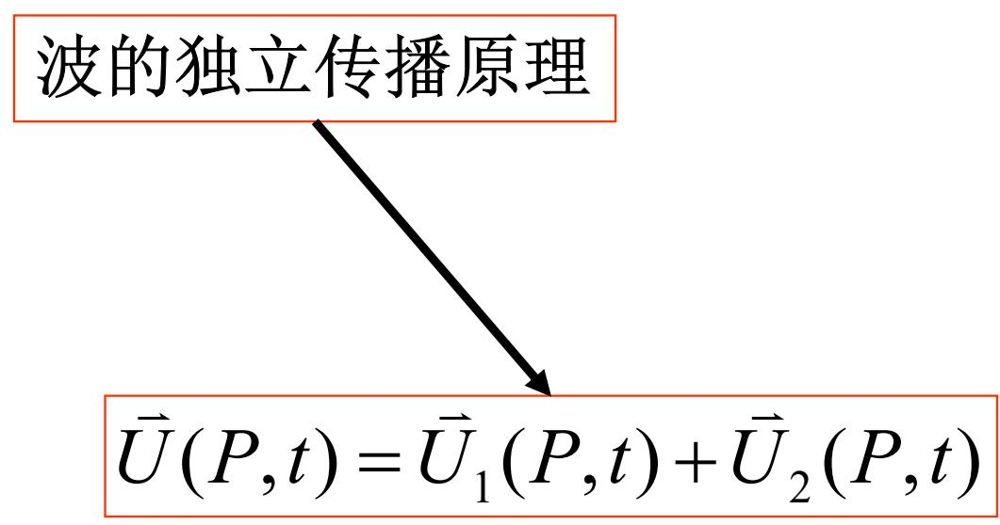
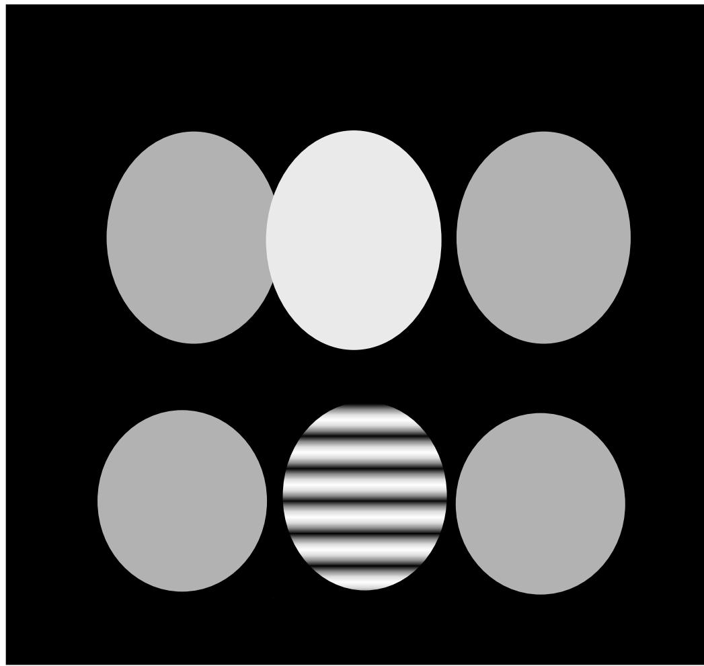

# 4.2.1 ==光强==的定义与双光束叠加后的合成光强公式

### 一、 光强， 平均能流密度值，的定义

在波动光学中，描述光波在空间某点 $P$ 处强弱的物理量是**光强**（Intensity），其定义为该点处**瞬时光强（电磁能流密度的模）对时间的平均值**：

$$I = \langle |U(t)|^2 \rangle = \frac{1}{\Delta t}\int_0^{\Delta t} |U(t)|^2 \, dt$$

- $U(t)$ 为光场在 $P$ 点的标量复振幅（考虑横波性时用 $\vec{U}$）
  ==重要：本章中提及的U大多是带有方向的，U矢量沿着k的方向，这和第二章有所不同==
- $\Delta t$ 为探测器的响应时间，远大于光波周期 $T$；对简谐波可取积分区间为一个周期

对于频率为 $\omega$ 的简谐光波 $U(P,t) = A\cos(\omega t - \phi(P))$，可直接计算得：

$$I = \frac{1}{T}\int_0^T A^2\cos^2(\omega t - \phi(P))\,dt = \frac{1}{2}A^2$$

即光强正比于振幅的平方：$I \propto A^2$==。这是之前已有的结论==

### 二、 两束光叠加后的合成光强

设两列相同频率的光波 $\vec{U}_1(P,t)$ 和 $\vec{U}_2(P,t)$ 在空间某点 $P$ 同时到达，==在通常介质和光强下==，根据**波叠加原理**，合场为：

$$\vec{U}(P,t) = \vec{U}_1(P,t) + \vec{U}_2(P,t)$$

合成后的==光强==为：

$$I(P) = \langle |\vec{U}_1 + \vec{U}_2|^2 \rangle = \langle |\vec{U}_1|^2 \rangle + \langle |\vec{U}_2|^2 \rangle + 2\langle \vec{U}_1 \cdot \vec{U}_2 \rangle$$

$$\boxed{I(P) = I_1(P) + I_2(P) + \underbrace{2\langle \vec{U}_1 \cdot \vec{U}_2 \rangle}_{\Delta I(P)}}$$

其中 $\Delta I(P) = 2\langle \vec{U}_1 \cdot \vec{U}_2 \rangle$ 称为**干涉项**。

### 三、 干涉项的物理意义

干涉项 $\Delta I(P)$ 是决定是否出现干涉现象的关键：

- 若 $\Delta I(P) \equiv 0$：合成光强等于两束光光强之和，即 $I(P) = I_1(P) + I_2(P)$，这种情况称为**非相干叠加**，空间中光强分布均匀，不出现干涉条纹
- 若 $\Delta I(P) \neq 0$：合成光强不等于两束光光强之和，不同位置 $P$ 处干涉项的正负和大小不同，导致光强在空间中呈现出分布不均匀的图样，即**相干叠加**，出现干涉条纹

当两束光相位差稳定（见[[4.2.2 相干叠加的三个条件及其原因分析]]）时，时间平均可移入相位差内：

$$\Delta I(P) = 2\sqrt{I_1 I_2}\langle\cos\delta(P)\rangle = 2\sqrt{I_1 I_2}\cos\delta(P)$$

完整的干涉强度公式为：

$$\boxed{I(P) = I_1(P) + I_2(P) + 2\sqrt{I_1 I_2}\cos\delta(P)}$$

- $\delta(P) = \varphi_1(P) - \varphi_2(P)$：两束光在 $P$ 点的相位差
- $\cos\delta(P)$ 决定了干涉条纹在空间中的分布规律：
  - 当 $\delta = 2k\pi$（$k$ 为整数）时，$\cos\delta = 1$，光强取极大值 $I_M = I_1 + I_2 + 2\sqrt{I_1 I_2}$，为==亮条纹==
  - 当 $\delta = (2k+1)\pi$ 时，$\cos\delta = -1$，光强取极小值 $I_m = I_1 + I_2 - 2\sqrt{I_1 I_2}$，为==暗条纹==

### 四、 波叠加原理的适用范围

波叠加原理在通常介质和通常光强条件下成立。在极高光强（如强脉冲激光）照射**非线性光学介质**时，叠加原理不再成立——这是非线性光学效应（例如光限幅效应，可用于激光防护， 原理是，使激光经过特殊材料，相互作用，使得透射强度下降。这种材质限制光强的最大值 ，小于阈值不起效果）的物理基础。

> **结论**：判断两列波叠加时是否产生干涉，关键是看干涉项 $\Delta I(P)$ 是否为零。干涉项不为零，即意味着两束光在叠加区域的不同位置产生了有规律的光强强弱分布（==干涉条纹==）。至于 $\Delta I(P)$ 何时为零、何时不为零，则由[[4.2.2 相干叠加的三个条件及其原因分析]]来决定。
