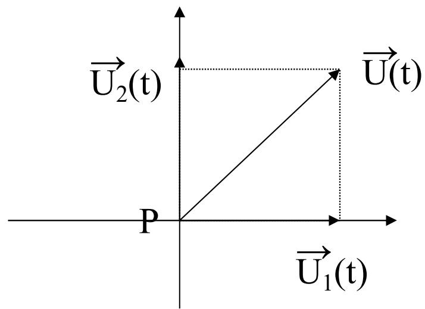
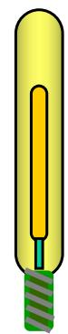
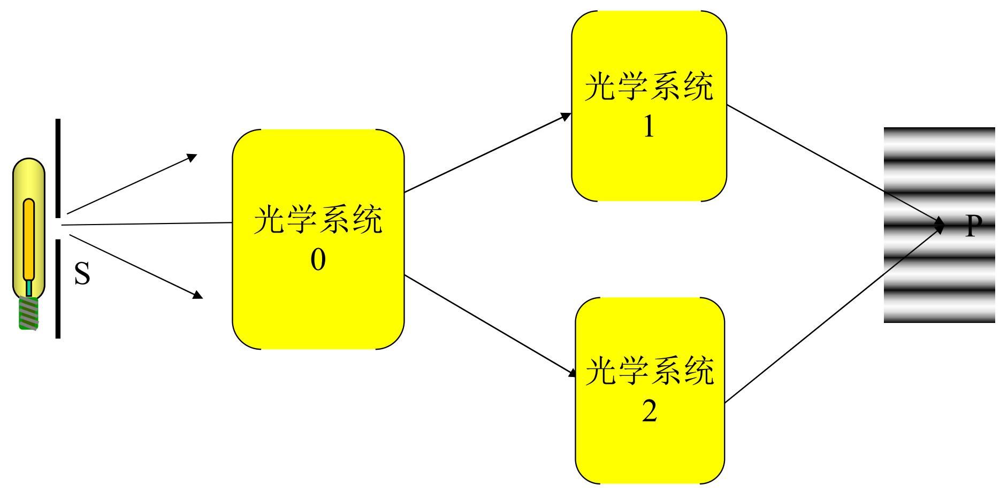

# 4.2.2 ==相干叠加==的三个条件及其原因分析

### 概述

干涉项 $\Delta I(P) = 2\langle\vec{U}_1 \cdot \vec{U}_2\rangle$ 不为零，是产生干涉（相干叠加）的必要条件。下面分析使干涉项为零的三类情况，得出相干叠加的三个条件。

### 一、 条件一：两列波的==振动方向==须有平行分量（针对矢量波），==不能完==全垂直

光波是电磁横波，其扰动量 $\vec{U}$ 是矢量。干涉项包含点积 $\vec{U}_1 \cdot \vec{U}_2$。

当两列波的振动方向完全正交（$\vec{U}_1 \perp \vec{U}_2$）时：

$$\vec{U}_1 \cdot \vec{U}_2 = 0$$

此时无论何时取时间平均，结果始终为零：

$$\Delta I(P) = 2\langle\vec{U}_1 \cdot \vec{U}_2\rangle = 0$$

合成光强退化为非相干叠加 $I(P) = I_1(P) + I_2(P)$。

> **条件一的意义**：参与叠加的两束光，其==电场矢量==的振动方向上须有平行分量（不能完全正交）。本条件针对的是光波的**横波矢量性**。在傍轴条件下（两束光的夹角 $\alpha < 20°$），可以近似地按**标量波**处理，不需要精确考虑偏振方向。

### 二、 条件二：两列波的==频率==必须相同

设两束光的频率分别为 $\omega_1$ 和 $\omega_2$，对应振幅 $A_1$ 和 $A_2$，相位初始值 $\varphi_1(P)$ 和 $\varphi_2(P)$：

$$U_1(P,t) = A_1\cos(\omega_1 t - \varphi_1(P)), \quad U_2(P,t) = A_2\cos(\omega_2 t - \varphi_2(P))$$

求干涉项：

$$\Delta I(P) = 2\langle U_1 U_2\rangle = A_1 A_2\langle\cos[(\omega_1+\omega_2)t - (\varphi_1+\varphi_2)]\rangle + A_1 A_2\langle\cos[(\omega_1-\omega_2)t - (\varphi_1-\varphi_2)]\rangle$$

- 第一项：频率 $\omega_1+\omega_2$ 远大于零，时间平均为零
- 第二项：
  - 若 $\omega_1 \neq \omega_2$，差频 $|\omega_1-\omega_2|$ 对光波而言仍是极高频率（$\sim 10^{14}$ Hz量级），远超探测器响应时间的倒数，对时间平均后依然为零
  - 若 ==$\omega_1 = \omega_2$，差频项变为 $A_1 A_2\cos(\varphi_1-\varphi_2)$，与时间无关==，时间平均不为零

> **条件二的意义**：两束光的频率必须相同（即波长相同），才能使干涉项经过时间平均后不消失。本条件针对任何波（不限于横波）均成立。

![[Pasted image 20260516205311.png]]
### 三、 条件三：两列波的==相位差==必须稳定（针对光波最苛刻，普通比如水波等宏观波还行）

在满足条件一和二的基础上，设两束光具有相同频率 $\omega$，干涉项变为：

$$\Delta I(P) = 2\sqrt{I_1 I_2}\langle\cos\delta(P,t)\rangle$$

其中相位差 $\delta(P,t) = \varphi_1(P,t) - \varphi_2(P,t)$，包含来自两个发光原子各自初始相位 $\varphi_{10}(t)$ 和 $\varphi_{20}(t)$ 的随机贡献。

若相位差随时间作随机快速跳变，则 $\langle\cos\delta(P,t)\rangle = 0$，干涉项再次消失。

只有当 $\delta(P,t) = \delta(P) =$ 常数（即相位差不随时间变化）时，时间平均可以移出：

$$\Delta I(P) = 2\sqrt{I_1 I_2}\cos\delta(P) \neq 0$$

此时才出现稳定的干涉条纹。

#### 普通光源满足条件三的难点

普通光源（自发辐射光）中，每个波列的持续时间约为 $\tau_c \sim 10^{-8}$ s。两个独立的发光原子随机地、间歇地各自辐射，其初始相位 $\varphi_{10}(t)$、$\varphi_{20}(t)$ 在约 $10^{-8}$ s 内就跳变一次。探测器的响应时间（$\sim 10^{-1}\sim 10^{-3}$ s）远大于波列持续时间，因此对时间平均后 $\langle\cos\delta\rangle = 0$。

#### 相位差的两分量结构（核心公式）

相位差 $\delta(P)$ 可以明确地分解为两个独立的贡献：

$$\delta(P) = \underbrace{\frac{2\pi}{\lambda}\left[L_{S_11P} - L_{S_22P}\right]}_{\text{①几何光程差项，由空间位置决定，稳定}} + \underbrace{[\varphi_{10}(t) - \varphi_{20}(t)]}_{\text{②两束光各自初始相位之差，随机}}$$

- **①几何项**：由两列光波各自从发光点到 $P$ 点的几何光程差决定，是 $P$ 点空间位置的确定函数，不随时间改变。
- **②随机项**：由两束光各自的初始相位之差 $\varphi_{10}(t) - \varphi_{20}(t)$ 决定，直接反映了光源的发光机制。

**对于两个独立光源（不同原子，或同一原子先后两次发光）：**

$\varphi_{10}(t)$ 和 $\varphi_{20}(t)$ 各自独立地做随机跳变，互不关联，所以 $\varphi_{10}(t) - \varphi_{20}(t)$ 也在做随机跳变。这使得总相位差 $\delta(P, t)$ 尽管有一个固定的几何部分，却不断被随机项扰动。在探测器的积分时间内，对所有可能的随机相位差取平均，结果是：

$$\langle\cos\delta(P,t)\rangle = 0$$

干涉项消失，不出现干涉条纹。这就是上面分析的"发光的间歇性和随机性"的数学表现。

![[Pasted image 20260415110830.jpg]]

#### 解决方案：让 φ₁₀(t) - φ₂₀(t) 恒为零

把来自**同一原子同一次发光**的波列分成两部分，这两部分光的初始相位都来自同一次发光事件，因此：

$$\varphi_{10}(t) = \varphi_{20}(t)$$

代入相位差公式，随机项恰好消失：

$$\delta(P) = \frac{2\pi}{\lambda}\left[L_{S01P} - L_{S02P}\right] + \underbrace{[\varphi_{10}(t) - \varphi_{10}(t)]}_{= 0} = \frac{2\pi}{\lambda}\left[L_{S01P} - L_{S02P}\right]$$

相位差 $\delta(P)$ 变为纯粹的几何量，与时间无关。此时时间平均可以移出余弦，稳定干涉条纹出现：

$$I(P) = I_1(P) + I_2(P) + 2\sqrt{I_1 I_2}\cos\delta(P)$$

其中 $\delta(P)$ 完全由几何光程差决定。这正是[[4.1.2 获得相干光的两种基本途径（要记住）]]中分波前法和分振幅法的物理本质。

### 四、 三个条件的针对性总结

| 条件 | 针对的问题 | 失败时的后果 |
|---|---|---|
| 振动方向有平行分量 | 光波的横波矢量性 | 点积为零，干涉项消失 |
| 频率相同 | 任何波都适用 | 差频项时间平均为零 |
| 相位差稳定 | 光波的随机发光特性 | 余弦的时间平均为零 |

> **稳定干涉的最终公式**：满足以上三个条件时：
> $$I(P) = I_1(P) + I_2(P) + 2\sqrt{I_1 I_2}\cos\delta(P)$$
> 其中 $\delta(P)$ 是由几何光程差决定的稳定相位差，$\cos\delta(P)$ 确定了干涉条纹在空间中的分布。
