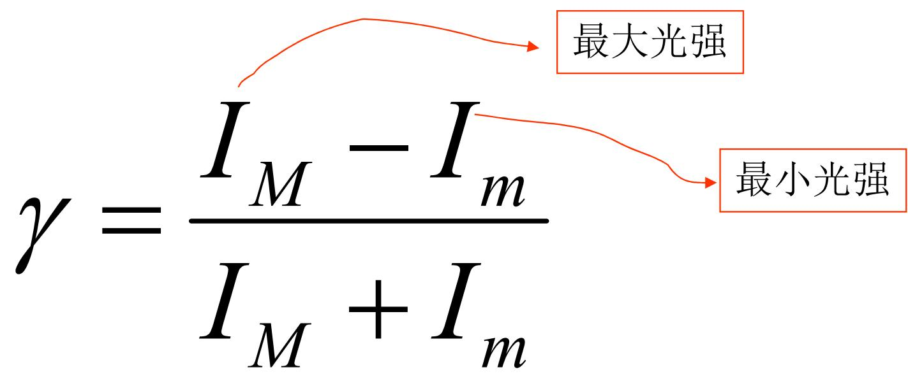
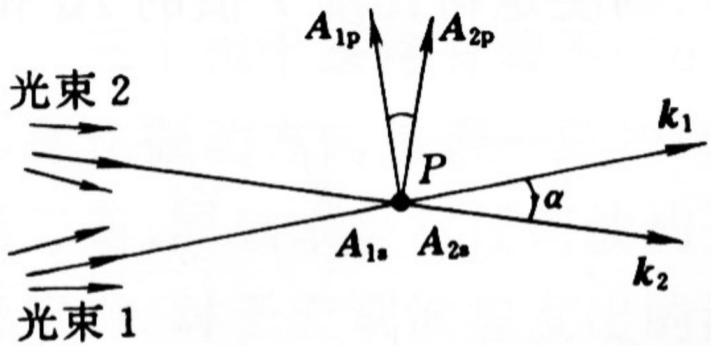

# 4.2.3 干涉场的==衬比度==（可见度）

### 一、 衬比度的定义

干涉场中，各处光强大小不一，有极大值 $I_M$（亮条纹）和极小值 $I_m$（暗条纹）。为了定量描述干涉条纹明暗对比的程度，引入**衬比度**（也称**可见度**，Visibility），记作 $\gamma$：

$$\boxed{\gamma = \frac{I_M - I_m}{I_M + I_m}}$$

- $\gamma = 1$：$I_m = 0$，暗条纹处完全为黑，明暗对比最强，条纹清晰度最高
- $\gamma = 0$：$I_M = I_m$，各处光强相同，条纹消失，无法观测到干涉
- $0 < \gamma < 1$：介于以上两种情形之间，条纹部分可见

干涉场光强分布可以用衬比度改写为统一形式：

$$I(P) = I_0\bigl(1 + \gamma\cos\delta(P)\bigr), \quad I_0 = I_1 + I_2$$

### 二、 衬比度与两束光==振幅比==的关系

在满足相干叠加三个条件的基础上，将双光束干涉强度公式取极值：

$$I_M = I_1 + I_2 + 2\sqrt{I_1 I_2}, \quad I_m = I_1 + I_2 - 2\sqrt{I_1 I_2}$$

代入衬比度定义：

$$\gamma = \frac{2\sqrt{I_1 I_2}}{I_1 + I_2}$$

利用 $I \propto A^2$，令振幅比 $m = A_1/A_2$，则：
==重要式子==
$$\gamma = \frac{2\sqrt{I_1 I_2}}{I_1 + I_2} = \frac{2 \cdot \frac{A_1}{A_2}}{1 + \left(\frac{A_1}{A_2}\right)^2} = \frac{2m}{1+m^2}$$

数值举例：
- $m = A_1/A_2 = 1$ → $\gamma = 1$（两束光等振幅，衬比度最高）
- $m = 3$ → $\gamma = 0.6$
- $m = 10$ → $\gamma = 0.2$

> **结论一**：参与相干叠加的两束光振幅越接近相等（振幅比越接近1），衬比度越高。当两束光振幅严格相等时，$\gamma = 1$，此时 $I_m = 0$，即暗条纹处光强为零。

### 三、 衬比度与两束光==传播方向夹角==的关系（自然偏振光情形）（考试重点，“给个具体数值就考”）

在傍轴近似之外，当两束自然偏振光的传播方向之间存在夹角 $\alpha$ 时，需要考虑 p 分量和 s 分量分别干涉的情况。

设两束等光强自然偏振光（$I_1 = I_2 = I$），各分解为 s 和 p 两个分量，每个分量的光强均为 $I/2$。

**s 分量的干涉**（两束光的 s 分量振动方向始终平行，因为S光是那个垂直于纸面 （入射面）的光）： 
$$I_{Ms} = 2I, \quad I_{ms} = 0$$

**p 分量的干涉**（两束光的 p 分量振动方向夹角为 $\alpha$）：
$$I_{Mp} = I(1+\cos\alpha), \quad I_{mp} = I(1-\cos\alpha)$$

综合 s 和 p 两部分：
$$I_M = I_{Ms} + I_{Mp} = I(3+\cos\alpha), \quad I_m = I_{ms} + I_{mp} = I(1-\cos\alpha)$$

代入衬比度定义：

$$\boxed{\gamma = \frac{I_M - I_m}{I_M + I_m} = \frac{1+\cos\alpha}{2}}$$

数值举例：
- $\alpha = 0°$ → $\gamma = 1$
- $\alpha = 10°$ → $\gamma \approx 0.99$
- $\alpha = 20°$ → $\gamma \approx 0.97$
- $\alpha = 30°$ → $\gamma \approx 0.93$
- $\alpha = 60°$ → $\gamma \approx 0.75$

> **结论二**：两束自然偏振光的传播方向夹角越大，衬比度越低。在傍轴情况（$\alpha < 20°$）下，$\gamma$ 与1相差极小，可以将自然光干涉近似当作标量干涉处理，不必考虑偏振效应带来的衬比度损失。

### 四、 两个补充条件小结

在满足相干叠加三个基本条件（[[4.2.2 相干叠加的三个条件及其原因分析]]）的前提下，为获得较高衬比度，需额外注意：

1. **振幅尽量相等**：使两束相干光的振幅之比接近 1
2. **传播方向夹角不宜过大**：在实际傍轴光学装置中，满足 $\alpha < 20°$ 时衬比度损失可忽略
