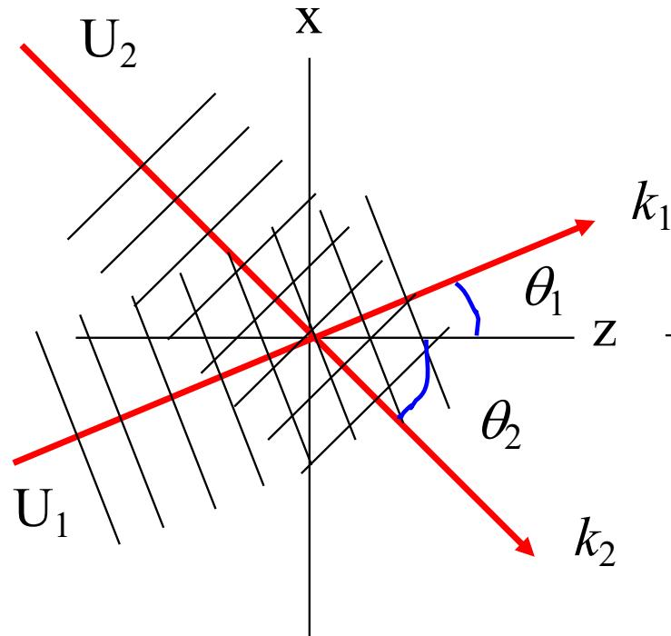
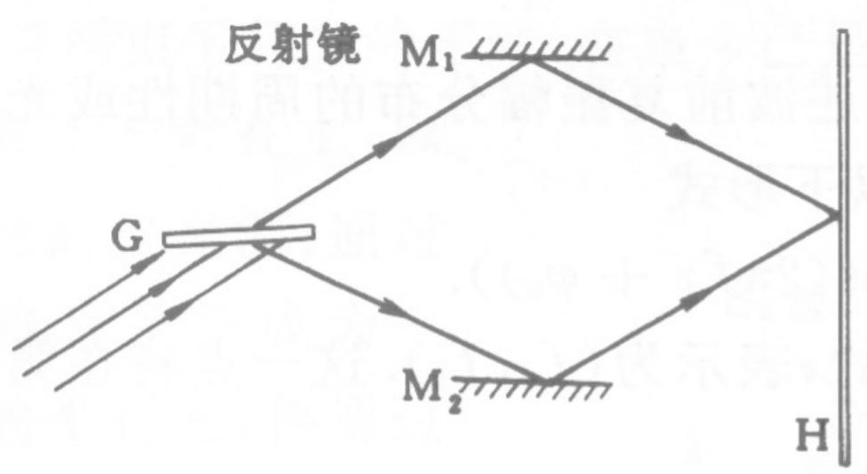
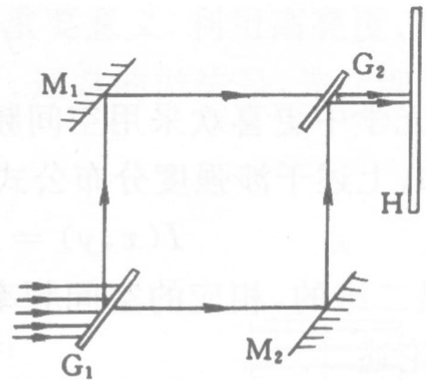

# 4.2.4 两==平行平面波==的叠加与干涉条纹空间频率

### 一、 平行平面波（平面光波）的波前函数

#### 从沿 z 轴传播的平面波出发

最简单的情况是一列光沿 $z$ 轴正方向传播的平面波。它在任意位置 $(x,y,z)$ 处的复振幅（瞬时振幅的复数表示）是：

$$\widetilde{U}(x,y,z) = A e^{ikz}$$

- $A$ 是振幅，是一个正实数，在整个空间中到处相等（这就是"平面波"这个名字的来源：整个波阵面是完全均匀的平面）
- $k = \frac{2\pi}{\lambda}$ 是**波数**，单位是 rad/m，表示每米长度上光波的相位变化量
- $e^{ikz}$ 表示沿 $z$ 方向每前进一段距离 $z$，相位就增加 $kz$

在观察平面 $z = 0$ 处，$e^{ikz} = e^{ik \cdot 0} = e^0 = 1$，所以：

$$\widetilde{U}(x,y)\big|_{z=0} = A$$

这说明：沿 $z$ 轴正方向传播的平面波，打在 $z=0$ 的观察屏上，各处的复振幅都是同一个常数 $A$，没有任何 $x$ 方向的变化。

#### 如果平面波是斜着传播的呢？

现在考虑光不是沿 $z$ 轴，而是与 $z$ 轴成角度 $\theta$ 斜着传播（在 $x$-$z$ 平面内）。这时，光的传播方向（即**波矢** $\vec{k}$）就不再纯粹指向 $z$ 方向了，它有两个分量：

$$\vec{k} = k_x \hat{x} + k_z \hat{z}$$

其中：
- $k_x = k\sin\theta$（沿 $x$ 方向的分量，即光向"斜"的方向走的那部分）
- $k_z = k\cos\theta$（沿 $z$ 方向的分量，即光向"前"走的那部分）
- 注意：两者的平方和等于 $k^2$，即 $k_x^2 + k_z^2 = k^2\cos^2\theta + k^2\sin^2\theta = k^2$（这是勾股定理）

斜传播的平面波在空间中某点 $(x, z)$ 处的复振幅，就把 $z$ 换成"光走过的路程在各方向上的投影的总和"：

$$\widetilde{U}(x,z) = A e^{i(k_x x + k_z z)} = A e^{i(k\sin\theta \cdot x + k\cos\theta \cdot z)}$$

**在观察平面 $z = 0$ 处**，令 $z=0$，$e^{ik\cos\theta \cdot 0} = 1$，得到：

$$\boxed{\widetilde{U}(x)\big|_{z=0} = A e^{i k\sin\theta \cdot x}}$$

此事在 [[2.3.1 波前的概念与共轭波前#^cde1f7|2.3.1]] 亦有记载

这一步是全节最重要的基础。它的含义是：**斜入射的平面波打在观察屏上，在屏上不同的 $x$ 位置，相位是不一样的**——$x$ 越大（越偏向斜入射的那一侧），相位越大。而正是这种"相位随位置的变化"，使得两列斜入射的平面波叠加时，不同 $x$ 位置的相位差不同，从而产生亮暗交替的干涉条纹。

### 二、 两列平面波叠加后的光强分布

#### 2.1 写出两列波在观察屏上的复振幅

设两列平面波，第一列以角度 $\theta_1$ 斜向右上方传播，第二列以角度 $\theta_2$ 斜向右下方传播，两者在观察平面 $z=0$ 上叠加：

根据第一节推导的结论，两列波在观察屏上的复振幅分别为：

$$\widetilde{U}_1(x) = A_1 e^{i(k\sin\theta_1 \cdot x - \varphi_{10})}$$

$$\widetilde{U}_2(x) = A_2 e^{i(-k\sin\theta_2 \cdot x - \varphi_{20})}$$

这里要注意符号的来历：
- $\widetilde{U}_1$ 向右上方斜入射，$x$ 方向的分量 $k_x = +k\sin\theta_1$（正的，因为向右偏）
- $\widetilde{U}_2$ 向右下方斜入射，但它的 $x$ 方向是相反的，$k_x = -k\sin\theta_2$（负的）。其实就是，与x轴的夹角为 90° + θ2，取个 cos，再来个奇变偶不变
- $\varphi_{10}$、$\varphi_{20}$ 是两列波各自的初始相位（常数）

#### 2.2 合成复振幅

两列波叠加，复振幅直接相加：

$$\widetilde{U}(x) = \widetilde{U}_1(x) + \widetilde{U}_2(x)$$

#### 2.3 由复振幅求光强（关键步骤，逐行展开）

光强的定义是复振幅乘以它的共轭：

$$I = \widetilde{U} \cdot \widetilde{U}^* = \left(\widetilde{U}_1 + \widetilde{U}_2\right)\left(\widetilde{U}_1 + \widetilde{U}_2\right)^*$$

把括号展开（就像代数中的 $(a+b)(a+b) = a^2 + 2ab + b^2$，只不过这里 $a$ 和 $b$ 是复数，所以用共轭代替"取平方"）：

$$I = \widetilde{U}_1\widetilde{U}_1^* + \widetilde{U}_2\widetilde{U}_2^* + \widetilde{U}_1\widetilde{U}_2^* + \widetilde{U}_1^*\widetilde{U}_2$$

逐项计算：

**第一项** $\widetilde{U}_1\widetilde{U}_1^*$：

$$\widetilde{U}_1\widetilde{U}_1^* = A_1 e^{i(\cdots)} \cdot A_1 e^{-i(\cdots)} = A_1^2 \cdot e^0 = A_1^2 = I_1$$

（任何复数乘以自己的共轭，虚部全部消掉，结果就是振幅的平方）

**第二项** $\widetilde{U}_2\widetilde{U}_2^* = A_2^2 = I_2$（同理）

**第三项** $\widetilde{U}_1\widetilde{U}_2^*$：

先写出 $\widetilde{U}_2^*$（把 $\widetilde{U}_2$ 中的 $i$ 全部换成 $-i$）：

$$\widetilde{U}_2^* = A_2 e^{-i(-k\sin\theta_2 \cdot x - \varphi_{20})} = A_2 e^{i(k\sin\theta_2 \cdot x + \varphi_{20})}$$

相乘：

$$\widetilde{U}_1\widetilde{U}_2^* = A_1 e^{i(k\sin\theta_1 \cdot x - \varphi_{10})} \cdot A_2 e^{i(k\sin\theta_2 \cdot x + \varphi_{20})}$$

指数部分相加（$e^a \cdot e^b = e^{a+b}$）：

$$= A_1 A_2 \, e^{i\left[(k\sin\theta_1 + k\sin\theta_2) x + (\varphi_{20} - \varphi_{10})\right]}$$

$$= A_1 A_2 \, e^{i\left[k(\sin\theta_1 + \sin\theta_2) x - (\varphi_{10} - \varphi_{20})\right]}$$

**第四项** $\widetilde{U}_1^*\widetilde{U}_2$：是第三项的共轭（即 $i$ 全部换成 $-i$）：

$$\widetilde{U}_1^*\widetilde{U}_2 = A_1 A_2 \, e^{-i\left[k(\sin\theta_1 + \sin\theta_2) x - (\varphi_{10} - \varphi_{20})\right]}$$

**第三项加第四项**（利用欧拉公式 $e^{i\phi} + e^{-i\phi} = 2\cos\phi$）：

$$\widetilde{U}_1\widetilde{U}_2^* + \widetilde{U}_1^*\widetilde{U}_2 = 2A_1 A_2 \cos\!\left[k(\sin\theta_1+\sin\theta_2)x - (\varphi_{10}-\varphi_{20})\right]$$

#### 2.4 汇总得到光强公式

把四项合在一起：

$$\boxed{I(x) = I_1 + I_2 + 2\sqrt{I_1 I_2}\cos\!\left[k(\sin\theta_1+\sin\theta_2)x - (\varphi_{10}-\varphi_{20})\right]}$$

其中定义**相位差** $\delta(x)$：

$$\delta(x) = k(\sin\theta_1+\sin\theta_2)x - (\varphi_{10}-\varphi_{20})$$

注意 $(\varphi_{10}-\varphi_{20})$ 是一个与 $x$ 无关的常数，它只是把整个条纹图样在 $x$ 方向平移一段距离，不影响条纹的间距和密度。因此可以忽略（令其为 0 化简讨论）：

$$I(x) = I_1 + I_2 + 2\sqrt{I_1 I_2}\cos\!\left[k(\sin\theta_1+\sin\theta_2)x\right]$$

这告诉我们：干涉场的光强只沿 $x$ 方向变化，是 $x$ 的余弦函数。在垂直于入射面的 $y$ 方向上，光强完全均匀，所以**条纹是沿 $y$ 方向延伸的等间距平行直线条纹**。

### 三、 条纹间距与==空间频率==

#### 3.1 从光强公式提取条纹间距

光强公式中的余弦项 $\cos\!\left[k(\sin\theta_1+\sin\theta_2)x\right]$ 决定了条纹的分布。

当余弦取最大值 $+1$ 时，对应**亮条纹**；取最小值 $-1$ 时，对应**暗条纹**。

相邻两个**亮条纹**之间，余弦内部的相位正好变化了 $2\pi$（余弦函数的一个完整周期是 $2\pi$）。设相邻亮条纹的 $x$ 坐标相差 $\Delta x$，则：

$$k(\sin\theta_1+\sin\theta_2)\cdot(x + \Delta x) - k(\sin\theta_1+\sin\theta_2)\cdot x = 2\pi$$

两式相减，左边只剩：

$$k(\sin\theta_1+\sin\theta_2)\cdot\Delta x = 2\pi$$

把 $k = \frac{2\pi}{\lambda}$ 代入左边：

$$\frac{2\pi}{\lambda} \cdot (\sin\theta_1+\sin\theta_2) \cdot \Delta x = 2\pi$$

两边同除以 $2\pi$：

$$\frac{(\sin\theta_1+\sin\theta_2) \cdot \Delta x}{\lambda} = 1$$

解出 $\Delta x$：（背诵）

$$\boxed{\Delta x = \frac{\lambda}{\sin\theta_1 + \sin\theta_2}}$$

#### 3.2 引入空间频率

**空间频率** $f$ 的定义是：每毫米（或每米）内有多少根条纹，即条纹间距的倒数：

$$\boxed{f = \frac{1}{\Delta x} = \frac{\sin\theta_1 + \sin\theta_2}{\lambda}}$$

干涉场强度分布用空间频率改写（令 $I_0 = I_1+I_2$，$\phi_0 = \varphi_{10}-\varphi_{20}$）：

$$I(x) = I_0\bigl(1 + \gamma\cos(2\pi f x - \phi_0)\bigr)$$

这里 $2\pi f x = k(\sin\theta_1+\sin\theta_2)x$，公式完全等价，写成 $2\pi f$ 的形式是为了凸显"空间频率"这个概念。

### 四、 两种典型光路获得空间==高频==和==低频==

实际实验中，如何用光学装置产生两列以特定夹角相交的平面波？教材给出了两种有代表性的干涉仪结构：

#### 获得高空间频率（密条纹）——菱形光路

光从左方入射，经过分光板 $G$ 分成两束：
- 一束向右上方偏折，被反射镜 $M_1$ 向右反射
- 另一束向右下方偏折，被反射镜 $M_2$ 向右反射

两束光以**较大夹角**（$\theta_1 + \theta_2$ 较大）在屏 $H$ 上汇合。根据公式 $\Delta x = \lambda / (\sin\theta_1 + \sin\theta_2)$，夹角大 → 分母大 → 条纹间距 $\Delta x$ 小 → ==高空间频率，条纹密集==。

调节两路反射镜的角度，可以控制夹角大小，从而控制条纹的密度。

#### 获得低空间频率（稀条纹）——矩形马赫-曾得尔光路

这就是**马赫-曾得尔干涉仪**的基本结构：
- 入射平行光在分光板 $G_1$ 处被分成两束，分别向上和向右传播
- 两束光各经过一面反射镜（$M_1$ 和 $M_2$）折转
- 最终在第二个分光板 $G_2$ 处合束，以**极小夹角**（接近平行）射向观察屏 $H$

两束光出射方向几乎平行 → 夹角极小 → 分母极小 → 条纹间距 $\Delta x$ 大 → ==低空间频率，条纹稀疏==。

通过微调 $G_2$ 的角度，可以精确控制两束光的夹角，从而获得任意低频条纹。

> **对比总结**：菱形光路使两束光大角交叉 → 高频密条纹；马赫-曾得尔光路使两束光近似平行出射 → 低频稀条纹。

### 五、 夹角与空间频率的关系及例题

从公式 $f = \frac{\sin\theta_1+\sin\theta_2}{\lambda}$ 直接可以看出：

- 分子越大（两列波夹角越大），$f$ 越大，条纹越密
- 分子越小（两列波夹角越小），$f$ 越小，条纹越稀

==大夹角对应高空间频率（密条纹），小夹角对应低空间频率（稀条纹）==

在**傍轴条件**（$\theta_1, \theta_2$ 均很小，一般小于 $5°\sim10°$）下，$\sin\theta \approx \theta$（弧度），近似得到：

$$f \approx \frac{\theta_1 + \theta_2}{\lambda}$$

#### 例题 1：大夹角——高空间频率

**题目**：一束斜向上 45° 的平面光波和一束斜向下 30° 的平面光波在观察面上干涉，求条纹间距和空间频率。已知 $\lambda = 633\text{ nm}$。

**解**：直接代入条纹间距公式：

$$\Delta x = \frac{\lambda}{\sin\theta_1 + \sin\theta_2} = \frac{633\text{ nm}}{\sin 45° + \sin 30°}$$

分别求出 $\sin$ 值：
- $\sin 45° = \dfrac{\sqrt{2}}{2} \approx 0.707$
- $\sin 30° = 0.5$（精确值）

$$\Delta x = \frac{633\text{ nm}}{0.707 + 0.5} = \frac{633\text{ nm}}{1.207} \approx 524\text{ nm} \approx 0.53\text{ μm}$$

对应空间频率：

$$f = \frac{1}{\Delta x} = \frac{1}{0.53\text{ μm}} \approx 1896\text{ mm}^{-1}$$

**结论**：每毫米约 1896 根条纹，是极高的空间频率，接近可见光极限。这对应菱形光路中两束光大角交叉的情形。

#### 例题 2：小夹角——低空间频率

**题目**：想获得空间频率 $f = 20\text{ mm}^{-1}$ 的干涉条纹（即每毫米 20 根条纹），求两束平行光之间的夹角。已知 $\lambda = 633\text{ nm}$。

**解**：傍轴条件下 $\sin\theta \approx \theta$，设两束光夹角为 $\Delta\theta = \theta_1 + \theta_2$（总夹角），代入空间频率公式：

$$f \approx \frac{\theta_1 + \theta_2}{\lambda} = \frac{\Delta\theta}{\lambda}$$

解出 $\Delta\theta$：

$$\Delta\theta \approx f\lambda = 20\text{ mm}^{-1} \times 633\text{ nm}$$

注意单位统一：$633\text{ nm} = 633 \times 10^{-6}\text{ mm}$，所以：

$$\Delta\theta \approx 20 \times 633 \times 10^{-6}\text{ mm}^{-1}\cdot\text{mm} = 0.01266\text{ rad}$$

换算成角分（$1\text{ rad} = 3438'$）：

$$\Delta\theta \approx 0.01266 \times 3438' \approx 43.5' \approx 45'$$

**结论**：两束光只需不到 1 度（约 45 角分）的夹角即可获得每毫米 20 根条纹。这对应马赫-曾得尔光路中两束光近乎平行出射的情形。

### 六、 波前函数方法的优势

与逐点计算光程差的方法相比，用波前函数处理干涉，可以**直接代入复振幅的表达式，利用乘以共轭的方法一步得到光强分布**，计算过程更加紧凑。在分析更复杂的多光束或球面波干涉时（见杨氏球面波分析，[[4.3.1 杨氏实验装置与光程差的近轴推导]]），这一方法同样适用。

> **结论**：两列平面光波叠加产生等间距的平行直条纹，条纹间距 $\Delta x = \frac{\lambda}{\sin\theta_1+\sin\theta_2}$，空间频率 $f = \frac{\sin\theta_1+\sin\theta_2}{\lambda}$。==大夹角对应高空间频率（密条纹），小夹角对应低空间频率（稀条纹）==。
