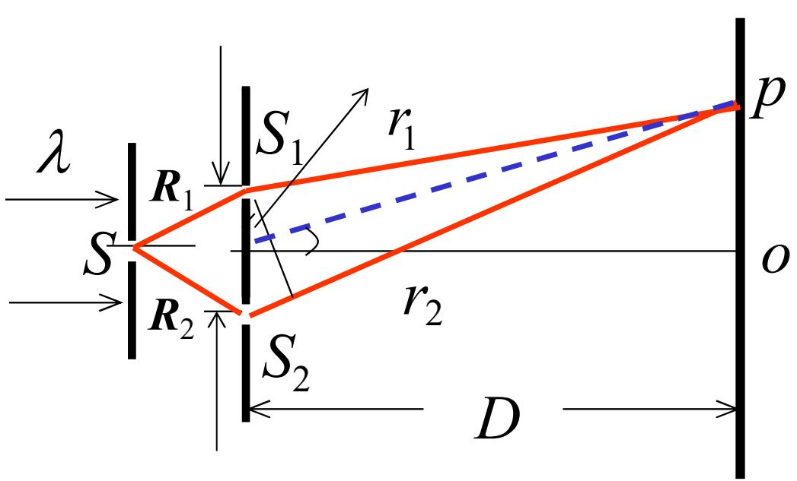
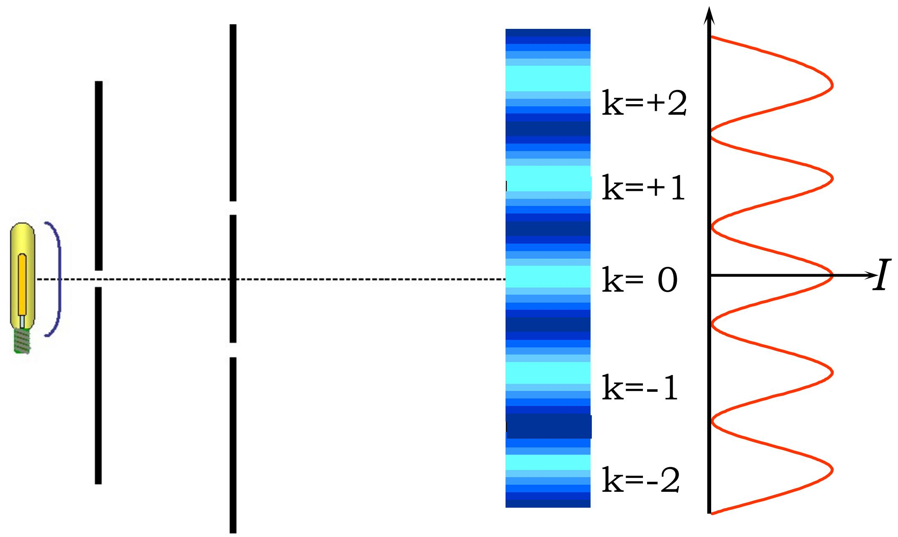
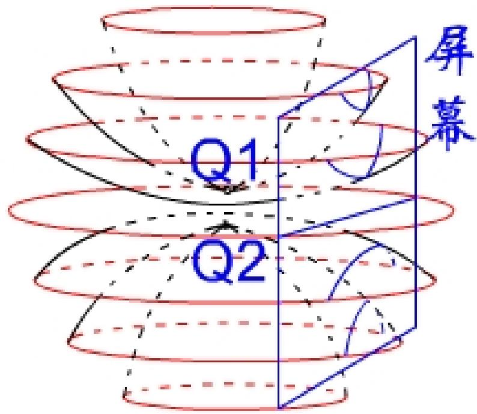

# 4.3.1 杨氏实验装置与光程差的==近轴推导==

### 一、 实验装置描述

杨氏双孔（双缝）干涉实验的装置由以下几部分组成：
- **初级光源** $S$：单色点光源（或单缝光源），位于衍射屏左侧距离 $R$ 处
- **衍射屏**：开有两个小孔或两条平行缝 $S_1$ 和 $S_2$，两者相距 $d$，关于轴线对称排列
- **观察屏**：位于衍射屏右侧距离 $D$ 处，$D \gg d$

光从 $S$ 出发，经过 $S_1$ 和 $S_2$ 衍射后，成为两个次级球面波源。由于 $S_1$、$S_2$ 均来自同一原子同一次发出的波列（通过 $S$ 分波前），它们是相干光源，满足[[4.2.2 相干叠加的三个条件及其原因分析]]中相位差稳定的条件。

两次级球面波在观察屏上叠加，产生干涉条纹。

### 二、 方法一：光程差的几何推导（近轴近似）

设观察屏上某点 $P$ 的坐标为 $x$（沿垂直于轴线方向），$P$ 到 $S_1$ 的距离为 $r_1$，到 $S_2$ 的距离为 $r_2$：

$$r_1 = \sqrt{D^2 + \left(x - \frac{d}{2}\right)^2}, \quad r_2 = \sqrt{D^2 + \left(x + \frac{d}{2}\right)^2}$$

光程差：

$$\Delta L = r_2 - r_1 = \sqrt{D^2 + \left(x+\frac{d}{2}\right)^2} - \sqrt{D^2 + \left(x-\frac{d}{2}\right)^2}$$

在近轴（傍轴）条件 $d, x \ll D$ 下，对根号进行近似展开：

$$r_{1,2} \approx D\sqrt{1 + \left(\frac{x \mp \frac{d}{2}}{D}\right)^2} \approx D + \frac{\left(x \mp \frac{d}{2}\right)^2}{2D}$$

相减，取差值：

$$\Delta L = r_2 - r_1 \approx \frac{xd}{D}$$

对称装置下（$S$ 距 $S_1$、$S_2$ 等距，即 $R_1 = R_2$），$S$ 到 $S_1$ 和 $S$ 到 $S_2$ 的路程差为零，总光程仅由 $S_1 \to P$ 和 $S_2 \to P$ 的路程差决定。

**近轴条件下的光程差（对称装置）**：

$$\boxed{\Delta L = r_2 - r_1 \approx \frac{d}{D} x}$$

对应相位差：

$$\delta(P) = \frac{2\pi}{\lambda} \cdot \frac{d}{D} x$$
再由δ=2kπ，即可拿下高中公式 Δx=Dλ/d

### 三、 方法二：用波前函数方法推导（复振幅叠加）

$S_1$、$S_2$ 分别是坐标为 $(d/2, 0)$ 和 $(-d/2, 0)$ 的点光源，在距离 $D$ 处的观察屏上，其球面波波前函数具有傍轴形式（第二章内容）：

$$\widetilde{U}_{1,2}(x,y) = A e^{ik\frac{x^2+y^2}{2D}} \cdot e^{-ik\frac{x \cdot (\pm d/2)}{D}}$$

叠加后计算光强： 

![[Drawing 2026-04-22 11.06.11.excalidraw]]

$$\begin{aligned}
I(x,y) &= (\widetilde{U}_1 + \widetilde{U}_2)(\widetilde{U}_1+\widetilde{U}_2)^* \\
&= 2A^2 + 2A^2\cos\left[k\frac{d}{D}x\right] \\
&= 2I_0\left[1 + \cos\left(\frac{2\pi d}{\lambda D}x\right)\right]
\end{aligned}$$

结果与几何光程差推导一致：相位差 $\delta = \frac{2\pi d}{\lambda D}x$，这与近轴几何推导所得完全相同。

波前函数方法的优势在于：不需要逐步计算几何光程差，直接用复振幅相乘共轭即可得到严格的傍轴干涉强度分布。

### 四、 干涉条纹的形状

在三维空间中，满足 $r_2 - r_1 = \text{常数}$ 的点的轨迹是以 $S_1$、$S_2$ 为焦点的**旋转双曲面**。观察屏（平面）与这组双曲面族的截线为一组**双曲线**，在近轴条件下退化为近似等间距的==竖直平行直条纹==。

