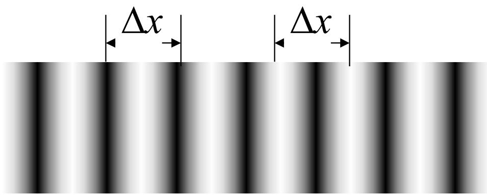
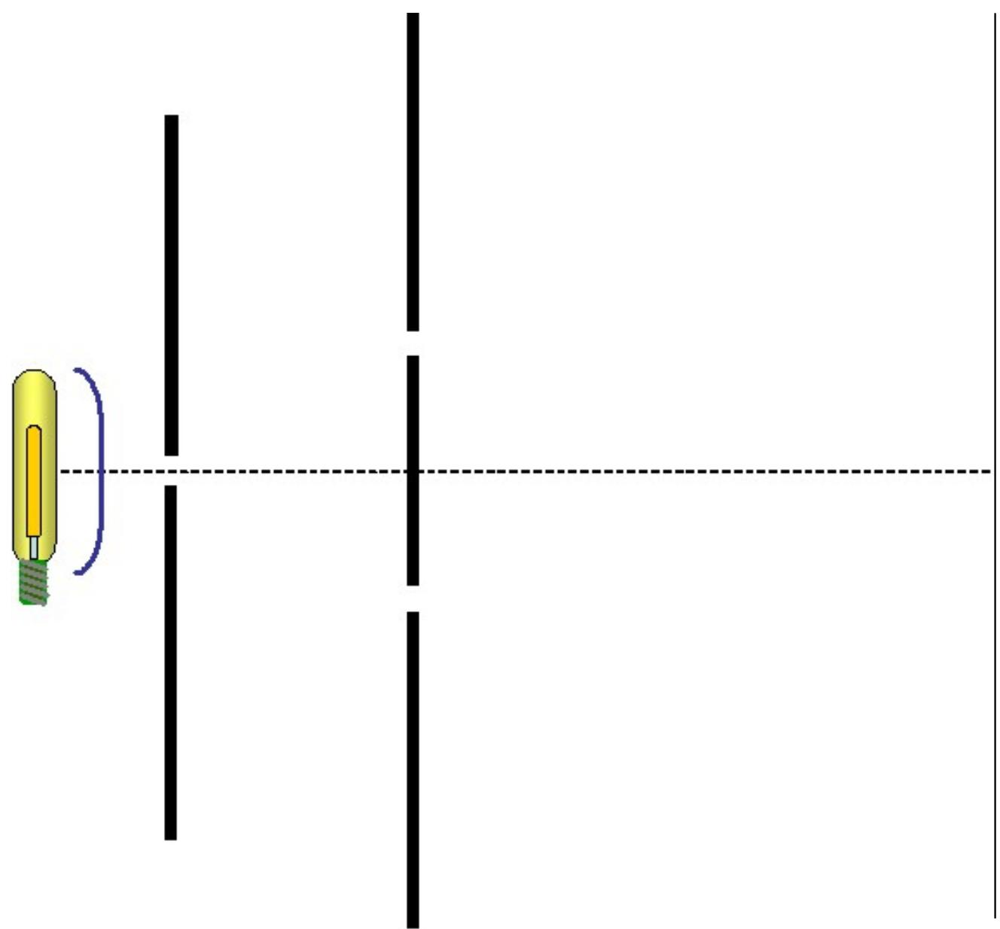

# 4.3.2 条纹==位置==、==间距==公式与等光强强度分布

### 一、 亮条纹与暗条纹的位置

由[[4.3.1 杨氏实验装置与光程差的近轴推导]]，近轴对称装置下的相位差为：

$$\delta(x) = \frac{2\pi}{\lambda}\cdot\frac{d}{D} x$$

代入干涉加强/减弱的条件：

**亮条纹**（$\delta = 2k\pi$，$k = 0, \pm1, \pm2, \ldots$）：

$$\frac{2\pi d}{\lambda D} x = 2k\pi \quad \Rightarrow \quad x_k = \frac{D}{d} k\lambda$$

- $k = 0$ 对应**中央亮条纹（零级条纹）**，位于 $x = 0$，即轴线上
- $k = \pm1, \pm2, \ldots$ 对应**高级亮条纹**，关于中心轴对称分布

**暗条纹**（$\delta = (2k+1)\pi$，$k = 0, \pm1, \pm2, \ldots$）：

$$\frac{2\pi d}{\lambda D} x = (2k+1)\pi \quad \Rightarrow \quad x_k = \frac{D}{d}\left(k+\frac{1}{2}\right)\lambda$$

### 二、 ==条纹间距==公式

相邻两条亮条纹（或暗条纹）的间距，即从 $k$ 级到 $k+1$ 级之间的距离：

$$\Delta x = x_{k+1} - x_k = \frac{D}{d}(k+1)\lambda - \frac{D}{d}k\lambda$$

$$\boxed{\Delta x = \frac{D}{d}\lambda}$$

条纹间距 $\Delta x$ 与条纹级次 $k$ 无关，即**等间距分布**，且：
- $D$ 越大（屏幕越远），条纹间距越大
- $d$ 越大（双孔间距越大），条纹间距越小
- $\lambda$ 越大（波长越长），条纹间距越大

**典型例题**：双孔间距 $d = 0.233$ mm，屏幕距离 $D = 100$ cm，测得条纹间距 $\Delta x = 2.53$ mm，求光波波长：

$$\lambda = \frac{d}{D}\Delta x = \frac{0.233\text{ mm}}{1000\text{ mm}} \times 2.53\text{ mm} = 589\text{ nm}$$

### 三、 等光强条件下的光强分布

当两孔光强相同（$I_1 = I_2 = I_0$）时，代入双光束干涉公式：

$$I(x) = I_0 + I_0 + 2\sqrt{I_0 \cdot I_0}\cos\delta = 2I_0(1 + \cos\delta)$$

利用半角公式 $1 + \cos\delta = 2\cos^2(\delta/2)$：

$$\boxed{I(x) = 4I_0\cos^2\!\left(\frac{\delta}{2}\right) = 4I_0\cos^2\!\left(\frac{\pi d}{\lambda D}x\right)}$$

此时：
- 亮条纹处：$I_M = 4I_0$，是单束光单独存在时光强的**4倍**
- 暗条纹处：$I_m = 0$
- 衬比度：$\gamma = \frac{4I_0 - 0}{4I_0 + 0} = 1$

这表明：等振幅相干叠加时，衬比度达到最大值 1，亮处光强是单束光的 4 倍，暗处光强为零。这并不违反能量守恒——干涉只是使能量在空间上重新分配，总光能量不变（因亮处集中的能量来自暗处减少的能量）。

### 四、 杨氏干涉实验的实验意义

杨氏双缝干涉实验的意义不止于测量波长：

1. **证实了光的波动性**：利用分波前法在普通光源下实现了稳定干涉，推翻了光的微粒说
2. **证实了次波的相干性**：说明同一波面上不同部分发出的次级波（惠更斯子波）之间是相干的，这一结论为后来的衍射理论提供了思想基础
3. **杨氏双孔模型的普遍性**：各种分波前干涉装置（菲涅耳双面镜、双棱镜等）均可归结为等效的杨氏双孔干涉模型，用同一套公式处理
4. **空间相干性的实验检验**：通过改变双孔间距测量衬比度变化，可以定量表征光场的空间相干性（[[4.4.1 空间相干性的概念与反比律]]）

> **结论（条纹间距公式）**：
> $$\Delta x = \frac{D}{d}\lambda$$
> - $D$：双孔到观察屏的距离
> - $d$：两孔间距
> - $\lambda$：光波波长
