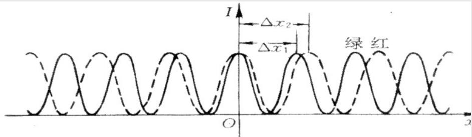
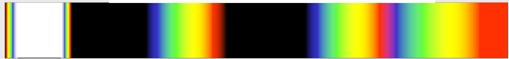
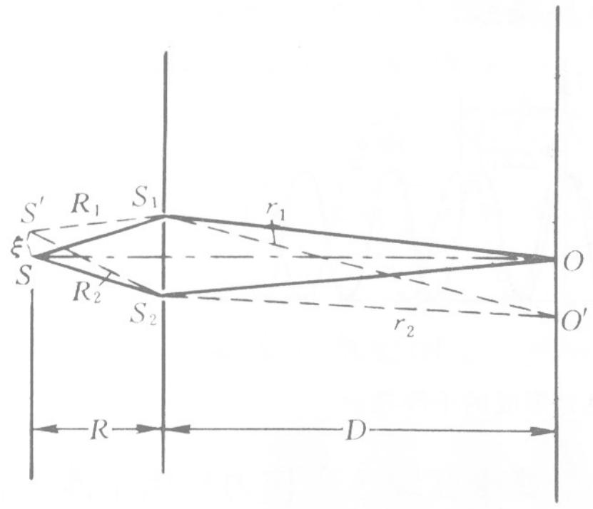

# 4.3.3 ==白光照明==与==光源横向位移==对条纹的影响

### 一、 白光照明下的干涉条纹

单色光照明时，杨氏干涉产生等间距的亮暗条纹。用白光（多种波长的非相干叠加）照明时，不同波长的光各自独立地产生干涉条纹，最终叠加在一起。

根据条纹间距公式 $\Delta x = \frac{D}{d}\lambda$：
- 波长越长（红光，$\lambda \approx 700\text{ nm}$），条纹间距越大
- 波长越短（紫光，$\lambda \approx 400\text{ nm}$），条纹间距越小

**零级亮条纹的位置**：零级满足光程差为零，即 $\Delta L = 0$。这与波长无关——所有波长的零级亮纹都位于同一位置 $x = 0$，叠加后形成**白色的零级亮条纹**。

**高级条纹的颜色**：偏离中心后，各色条纹因间距不同而逐渐错开，形成==彩色条纹带==。靠近中心的低级次处，各色条纹重叠程度越来越小，颜色越来越鲜艳；随着级次升高，不同波长的亮暗条纹开始互相重合，导致条纹对比度下降，最终在某一级次之后无法分辨条纹。

**例题（条纹消失的起始级次分析）**

蓝绿光的波长范围 $\Delta\lambda = 100\text{ nm}$，中心波长 $\lambda = 490\text{ nm}$。
- 长波端：$\lambda_1 = \lambda + \frac{1}{2}\Delta\lambda = 540\text{ nm}$
- 短波端：$\lambda_2 = \lambda - \frac{1}{2}\Delta\lambda = 440\text{ nm}$

当长波的第 $k$ 级亮条纹与短波的第 $k+1$ 级亮条纹位置重合时，亮暗交叠，此时条纹无法分辨：

$$k\frac{D}{d}\lambda_1 = (k+1)\frac{D}{d}\lambda_2$$

$$k(\lambda + \tfrac{1}{2}\Delta\lambda) = (k+1)(\lambda - \tfrac{1}{2}\Delta\lambda)$$

$$k\Delta\lambda = \lambda - \frac{\Delta\lambda}{2}$$

$$k = \frac{\lambda - \frac{\Delta\lambda}{2}}{\Delta\lambda} = \frac{490 - 50}{100} = 4.4$$

从第 4 级起，条纹开始难以辨认。

### 二、 光源==横向位移==对干涉条纹的影响

设初级光源 $S$ 在垂直于光轴方向上偏移量为 $\xi$（由轴线向某一侧移动）。

在近轴条件下，$S$ 到 $S_1$、$S_2$ 的路程差分别为：

$$R_1 = \sqrt{R^2 + (\xi - d/2)^2} \approx R + \frac{(\xi-d/2)^2}{2R}, \quad R_2 = \sqrt{R^2 + (\xi+d/2)^2} \approx R + \frac{(\xi+d/2)^2}{2R}$$

总相位差（包含 $S \to S_1 \to P$ 和 $S \to S_2 \to P$ 两段路程）：

$$\delta \approx \frac{2\pi}{\lambda}\left(\frac{d}{R}\xi + \frac{d}{D}x\right)$$

**对干涉条纹的影响分析：**

#### 1. 零级亮条纹的位移

令 $\delta = 0$，求零级亮条纹位置 $x_0$：

$$\frac{d}{R}\xi + \frac{d}{D}x_0 = 0 \quad \Rightarrow \quad x_0 = -\frac{D}{R}\xi$$

零级亮条纹沿**光源偏移方向的相反方向**，移动了 $\frac{D}{R}\xi$。
- 光源向上移动 $\xi$，零级亮条纹向下移动 $\frac{D}{R}\xi$

#### 2. 条纹间距不变

相邻两条亮条纹之间 $\delta$ 变化 $2\pi$，对应 $x$ 的变化量：

$$\Delta x = x_{k+1} - x_k = \frac{D}{d}\lambda$$

与 $\xi$ 无关，条纹间距不受光源位移影响，**只有零级条纹位置平移，整体间距不变**。

#### 3. 干涉强度分布（$I_1 = I_2 = I_0$）

$$I = 4I_0\cos^2\!\left(\frac{\pi d}{\lambda D}\left(x + \frac{D}{R}\xi\right)\right)$$

整个干涉图样整体平移了 $-\frac{D}{R}\xi$，条纹明暗分布的形状不变。

> **结论**：光源的横向位移只改变条纹的位置（零级亮纹位置随光源位移方向相反地移动），不改变条纹间距。这一性质在[[4.3.4 光源宽度对衬比度的影响与极限宽度]]中被用于分析扩展光源对衬比度的影响。
