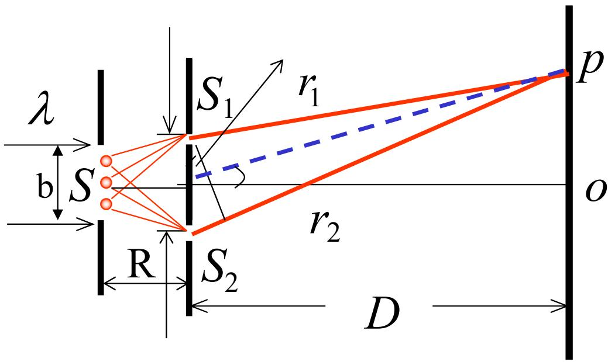
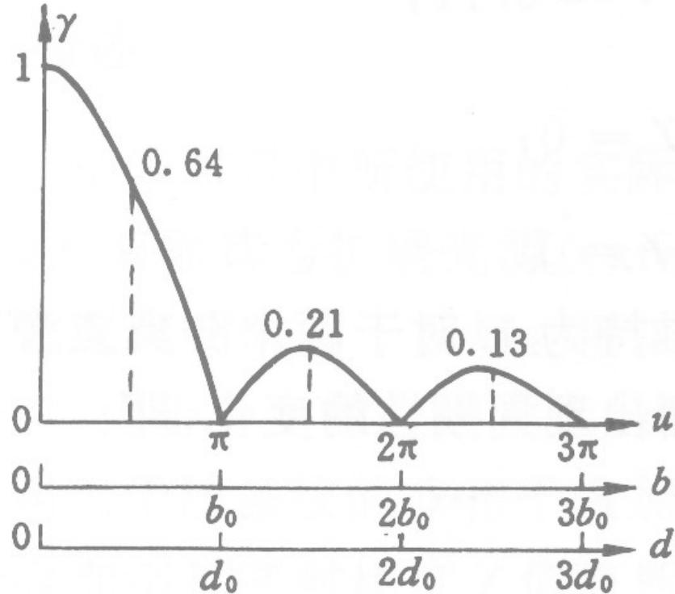
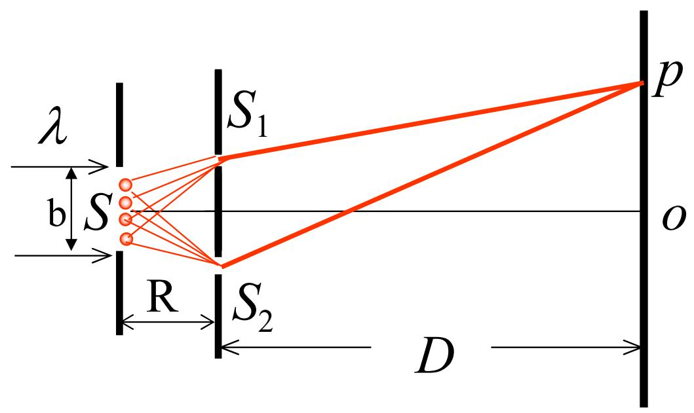
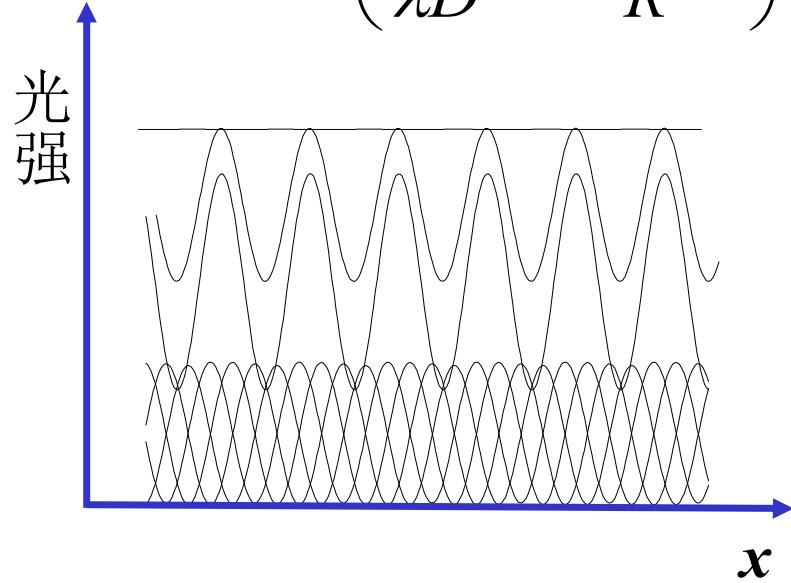

# 4.3.4 ==光源宽度==对衬比度的影响与极限宽度

### 一、 问题的提出：扩展光源与衬比度的关系

在实际光学实验中，光源不可能是理想的点光源，而是具有一定横向宽度的**扩展光源**（线光源或面光源）。扩展光源可以看作由大量非相干的点光源组成，每个点光源独立地在观察屏上产生一套干涉条纹，最终总光强是所有点光源各自产生的干涉条纹**非相干叠加**的结果。

由[[4.3.3 白光照明与光源横向位移对条纹的影响]]知：光源的横向偏移会使干涉条纹整体平移，但间距不变。当不同位置的点光源产生的条纹相互错开时，亮暗条纹相互填充，衬比度下降。

### 二、 定量推导：宽度为 $b$ 的均匀线光源

设线光源均匀、非相干，总宽度为 $b$，线光源平面距双孔屏距离为 $R$。取光源上位置为 $\xi$ 的微元 $d\xi$，它对应的光强贡献为 $dI_1 = dI_2 = \frac{I_0}{b}d\xi$，产生的干涉强度分布为：

$$dI(x) = 4\frac{I_0}{b}d\xi\cos^2\!\left(\frac{\pi d}{\lambda D}\left(x + \frac{D}{R}\xi\right)\right)$$

对整个光源积分（$\xi$ 从 $-b/2$ 到 $b/2$）：

$$I(x) = \int_{-b/2}^{b/2} 4\frac{I_0}{b}\cos^2\!\left(\frac{\pi d}{\lambda D}\left(x+\frac{D}{R}\xi\right)\right)d\xi$$

利用 $\cos^2\theta = \frac{1+\cos2\theta}{2}$ 展开并积分，结果为：

$$I(x) = 2I_0\left(1 + \frac{\sin u}{u}\cdot\cos\!\left(\frac{2\pi d}{\lambda D}x\right)\right)$$

其中令 $u = \frac{\pi db}{\lambda R}$。

### 三、 衬比度与光源宽度的关系

从上述结果可以直接读出衬比度：

$$\boxed{\gamma = \left|\frac{\sin u}{u}\right| = \left|\operatorname{sinc}(u)\right|, \quad u = \frac{\pi db}{\lambda R}}$$

分析此函数的行为：
- $u \to 0$（光源宽度趋于零的点光源极限）：$\gamma \to 1$，衬比度最高
- $u$ 增大（光源宽度 $b$ 增大，或双孔间距 $d$ 增大，或光源与双孔距离 $R$ 减小）：$\gamma$ 下降
- $u = \pi$（即 $\frac{db}{\lambda R} = 1$）时：$\gamma = 0$，条纹消失，第一次衬比度降为零

### 四、 ==（考试重点）光源极限宽度== $b_0$

==衬比度第一次降为零的光源宽度==，称为**光源的极限宽度**（或临界宽度）$b_0$：

$$\frac{\pi d b_0}{\lambda R} = \pi \quad \Rightarrow \quad \boxed{b_0 = \frac{\lambda R}{d}}$$

- $b < b_0$：可以观测到干涉条纹（$\gamma > 0$）
- $b = b_0$：条纹恰好消失（$\gamma = 0$）
- $b > b_0$：$|\operatorname{sinc}(u)|$ 有可能再次不为零，但条纹对比度已经很低

**对应地**，在光源宽度 $b$ 确定的情况下，能观察到干涉条纹的双孔极限间距 $d_0$：

$$\frac{\pi b d_0}{\lambda R} = \pi \quad \Rightarrow \quad \boxed{d_0 = \frac{\lambda R}{b}}$$

### 五、 直观理解：光源极限宽度的几何意义

极限宽度公式 $b_0 = \frac{\lambda R}{d}$ 可等价改写为：

$$d \cdot \frac{b_0}{R} = \lambda$$

其中 $\frac{b_0}{R}$ 是光源对双孔中心所张开的孔径角（弧度），记作 $\Delta\beta$：

$$d \cdot \Delta\beta \approx \lambda$$

这表明：当光源宽度产生的孔径角 $\Delta\beta$ 使得光源边缘点产生的干涉条纹与中心点产生的条纹错开**恰好半个条纹间距**时，整个扩展光源产生的条纹亮暗完全叠合，衬比度降为零。

如图所示，扩展光源中的每一个点光源（光源宽度b内不同位置的点）都通过S₁、S₂向观察屏辐射两束球面波，产生一套余弦分布的干涉条纹。由于不同位置的点光源对S₁、S₂的方向略有不同，它们产生的条纹在x方向上彼此错开一定的量。下图展示了当光源较宽时，各点光源产生的条纹（上方多条锯齿曲线）叠加后总光强趋于均匀（下方平坦曲线）的结果：

直观来说：当光源宽度恰好等于 $b_0$ 时，位于光源最边缘的点光源产生的条纹比中心点光源的条纹恰好错开了半个条纹间距，亮暗刚好对调，加上中间所有点光源产生的各种偏移条纹，总叠加效果使衬比度降为零。

**例题一**：$R = 40\text{ cm}$，$d = 1\text{ mm}$，$\lambda = 600\text{ nm}$，求极限宽度：

$$b_0 = \frac{\lambda R}{d} = \frac{600\times10^{-9}\times0.4}{1\times10^{-3}} = 0.24\text{ mm}$$

**例题二（太阳为光源）**：用太阳（光的有效波长 $\lambda = 550\text{ nm}$，日地距离 $R = 1.5\times10^8\text{ km}$）作杨氏干涉实验，当双缝间距增大到 $d_0 = 59\text{ mm}$ 时干涉条纹消失。由极限宽度公式反推太阳直径：

$$b_0 = \frac{\lambda R}{d_0} = \frac{550\times10^{-9}\times1.5\times10^{11}}{59\times10^{-3}} \approx 1.4\times10^6\text{ km}$$

太阳对地球的视角：$\varphi = \frac{b_0}{R} \approx 0.0093\text{ rad}$，与实际测量值相符。

> **结论**：扩展光源的横向宽度 $b$ 对衬比度有决定性影响。使用普通光源做干涉实验时，光源的横向宽度须满足 $b \leq b_0 = \frac{\lambda R}{d}$，才能获得清晰的干涉条纹。光源越宽，要求双孔间距越小。这一结论直接引出了光场**空间相干性**的概念（[[4.4.1 空间相干性的概念与反比律]]）。
