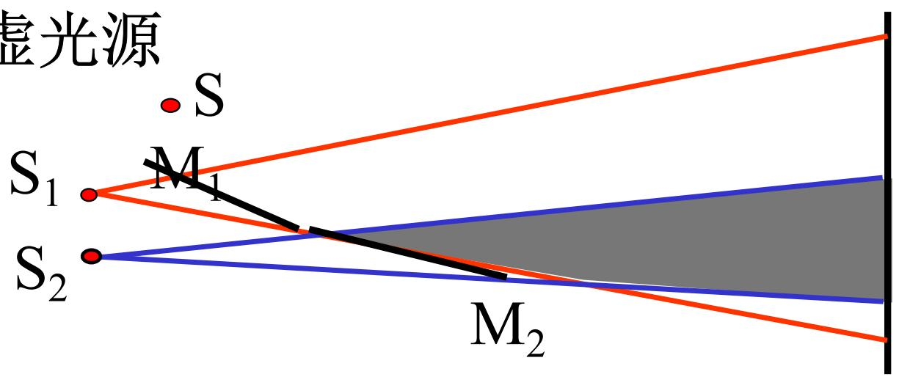
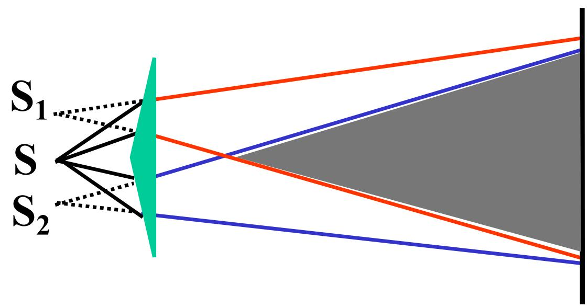
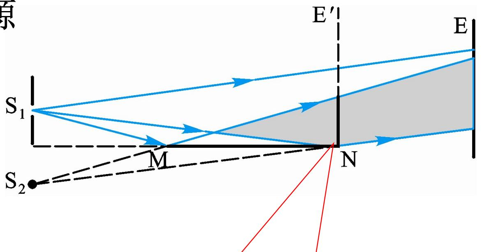

# 4.3.5 其他==分波前干涉==装置

### 一、 概述：分波前干涉的统一模型

所有的分波前干涉装置，无论结构如何，其基本思路都是：将同一波面上来自同一波列的光分成两部分，使这两部分成为**两个等效的相干点光源**（实际或虚拟），然后让它们发出的球面波在空间中叠加。因此，以下各装置都可以**归结为等效的杨氏双孔干涉模型**，用同一套条纹间距公式 $\Delta x = \frac{D}{d}\lambda$ 处理，只是等效参数 $d$（两相干源间距）和 $D$（相干源到观察屏距离）的具体值需要根据各装置的几何关系计算。

### 二、 ==菲涅耳双面镜==

**装置结构**：
- 初级光源 $S$：实际点光源
- 两块平面反射镜 $M_1, M_2$，夹角非常小（约几度），关于轴线对称排列
- $S$ 分别在 $M_1$ 和 $M_2$ 中各形成一个**虚像** $S_1, S_2$
- 两个虚像 $S_1, S_2$ 成为一对相干的"等效光源"
- 阴影区（两面镜的重叠反射区）出现干涉条纹

**等效参数**：
- 等效双孔间距 $d$ = $S_1, S_2$ 之间的间距（通过几何关系和反射镜夹角计算）
- 等效屏幕距离 $D$ = 相干虚像到观察屏的距离

### 三、 ==菲涅耳双棱镜==

**装置结构**：
- 初级光源 $S$：实际点光源
- 双棱镜（两个底面相对的三棱镜拼合而成）将 $S$ 发出的球面波折射分成两部分，等效产生两个**虚像** $S_1, S_2$
- 两虚像作为相干点光源，在重叠区产生干涉

**特点**：条纹形状、间距的分析与菲涅耳双面镜方法相同，均转化为等效杨氏双孔问题。

### 四、 ==洛埃德镜==实验

**装置结构**：
- 初级光源 $S_1$：实际点光源，位于平面反射镜 $MN$ 上方不远处
- 平面镜 $MN$ 使 $S_1$ 在镜面下方形成一个**虚像** $S_2$
- $S_1$（实光源）和 $S_2$（虚像）构成一对相干源
- 二者发出的光在镜面上方的重叠区（阴影区）发生干涉

**光程差公式**（考虑半波损失）：
$$\delta = r_2 - r_1 + \frac{\lambda}{2}$$

由于光从 $S_1$ 发出后经**平面镜斜入射（掠射）反射**到达 $P$，存在[[3.3.1 反射光的相移突变与半波损失|半波损失]]，即反射后额外引入 $\pi$ 的相位突变，等效于增加了 $\frac{\lambda}{2}$ 的附加光程差。

**接触点处的暗条纹问题**：

当 $S_1$ 和 $S_2$ 关于镜面对称时，在镜面的接触位置 $P_0$，两束光的几何光程差 $r_2 - r_1 = 0$，但由于反射光存在半波损失，总相位差为 $\pi$，满足相消干涉的条件：

$$\delta = 0 + \frac{\lambda}{2} = \frac{\lambda}{2} \neq 0$$

因此，镜面接触点处出现的是**暗条纹**，而非亮条纹。这与没有半波损失的情况（接触点是亮条纹）形成对比，是洛埃德镜实验的一个重要物理结论，**直接验证了光在反射时存在半波损失**。

### 五、 三种装置的比较

| 装置名称 | 相干源类型 | 与杨氏双孔的关系 | 是否有半波损失 |
|---|---|---|---|
| 菲涅耳双面镜 | 两个虚像（反射） | 完全等效，代入等效参数即可 | 无（两者均为虚像，路径对称） |
| 菲涅耳双棱镜 | 两个虚像（折射） | 完全等效，代入等效参数即可 | 无 |
| 洛埃德镜 | 一实一虚（一次掠射反射） | 等效，但需额外加 $\frac{\lambda}{2}$ | 有（反射光掠射，必有相移） |

> **结论**：分波前干涉的各种典型装置，其条纹分布规律均可通过杨氏双孔公式 $\Delta x = \frac{D}{d}\lambda$ 来计算，区别仅在于等效波源间距 $d$ 和等效距离 $D$ 的计算方式，以及是否需要在光程差中附加 $\frac{\lambda}{2}$ 的半波损失项（对洛埃德镜而言需要）。
