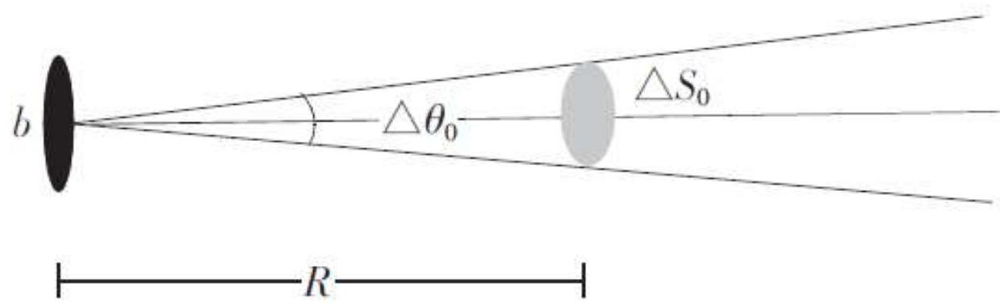
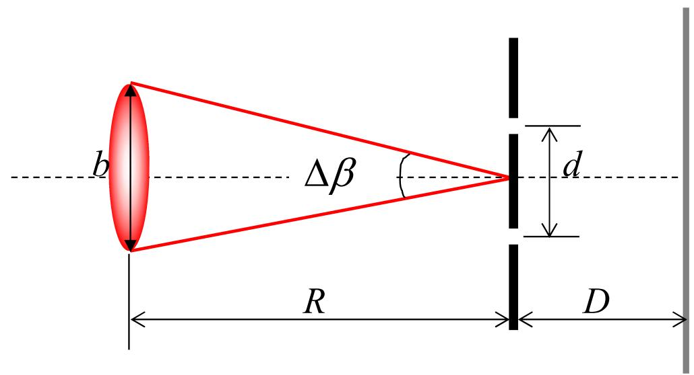

# 4.4.2 ==相干面积==与太阳光空间相干性举例

### 一、 相干面积的定义

在[[4.4.1 空间相干性的概念与反比律公式]]中，反比律 $d_0 \cdot \Delta\beta \approx \lambda$ 给出了在光场横截面内，两点之间形成有效相干的最大允许间距 $d_0$。

将这个一维的极限间距推广到二维，就定义了**相干面积** $\Delta S_0$：在距光源 $R$ 处的横截面内，两点相互之间距离不超过 $d_0$ 的区域面积。对于圆形光源（圆盘光源，角直径 $\Delta\theta_0'$），相干面积约为：

$$\boxed{\Delta S_0 \approx \frac{\pi}{4}(R \cdot \Delta\theta_0)^2 \approx \left(\frac{R\lambda}{b}\right)^2}$$

- $R$：从光源到观察横截面的距离
- $b$：光源的线度（直径）
- $\lambda$：光波波长

相干面积 $\Delta S_0$ 的物理意义：在该面积范围内，任意两点之间的光扰动都存在一定程度的相关性；在该面积之外，两点之间基本上是非相干的。

### 二、 太阳光在地球表面上的相干面积

**已知条件**：
- 太阳光有效波长 $\lambda \approx 550\text{ nm}$
- 太阳对地面观测者所张的角直径 $\Delta\theta_0' \approx 30' = \frac{30}{60} \times \frac{\pi}{180} \approx 8.7\times10^{-3}\text{ rad}$，近似取 $\Delta\theta_0' \approx 10^{-2}\text{ rad}$
（这傻逼题目里面的 θ 应该是 β才对）
由反比律 $d_0 \cdot \Delta\theta_0' \approx \lambda$：

$$d_0 \approx \frac{\lambda}{\Delta\theta_0'} = \frac{550\text{ nm}}{10^{-2}} = 55\text{ μm}$$

对应的相干面积（圆形）：

$$\Delta S_0 \approx d_0^2 \approx (55\text{ μm})^2 = 3\times10^{-3}\text{ mm}^2$$

**这个结果的含义**：
- 在地球表面，任意两点之间的距离若超过约 $55\text{ μm}$（约为一根发丝的直径），它们在太阳광照射下就近似于非相干
- 若使用太阳광做杨氏双孔干涉实验，双孔间距必须小于约 $30\text{ μm}$，才能观察到 $\gamma \approx 0.5$ 的干涉条纹
- 太阳光在地面上的相干面积极小（约 $3\times10^{-3}\text{ mm}^2$），这就是为什么日常生活中不会直接看到太阳光的干涉现象

### 三、 相干长度与相干面积的对比

空间相干性反比律定量地说明了：
- 光源（或扩展光源）的角直径越小，空间相干性越好，对应的相干面积越大
- 角直径越大，空间相干性越差，相干面积越小

| 光源类型      | 角直径 $\Delta\beta$            | 相干直径 $d_0$（$\lambda=550\text{ nm}$） |
| --------- | ---------------------------- | ----------------------------------- |
| 太阳        | $\approx 10^{-2}$ rad        | $\approx 55\text{ μm}$              |
| 月亮        | $\approx 10^{-2}$ rad        | $\approx 55\text{ μm}$（与太阳相近）       |
| 恒星（如参宿四）  | $\approx 2\times10^{-7}$ rad | $\approx 3\text{ m}$（需数米间距的双孔）      |
| 激光（经扩束准直） | 极小                           | 远大于普通光源                             |

> **结论**：相干面积 $\Delta S_0 \approx \left(\frac{R\lambda}{b}\right)^2$ 是描述扩展光源照明下光场横截面内空间相干范围的物理量。太阳光在地面上的相干直径仅约为 $55\text{ μm}$，相干面积约为 $3\times10^{-3}\text{ mm}^2$，这解释了为何普通阳光照明下不能产生可见干涉条纹。遥远恒星的相干面积可达平方米量级，这正是迈克耳孙星体干涉仪（[[4.4.3 迈克耳孙星体干涉仪]]）得以工作的物理基础。
