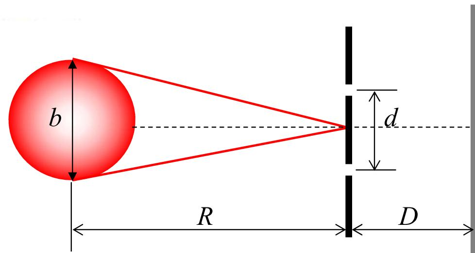
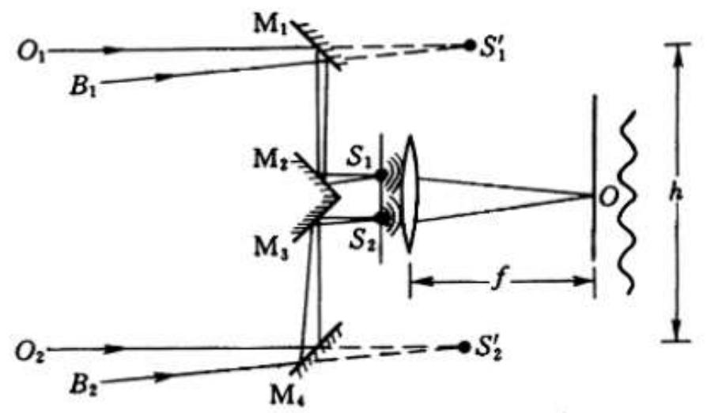
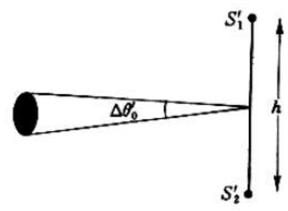
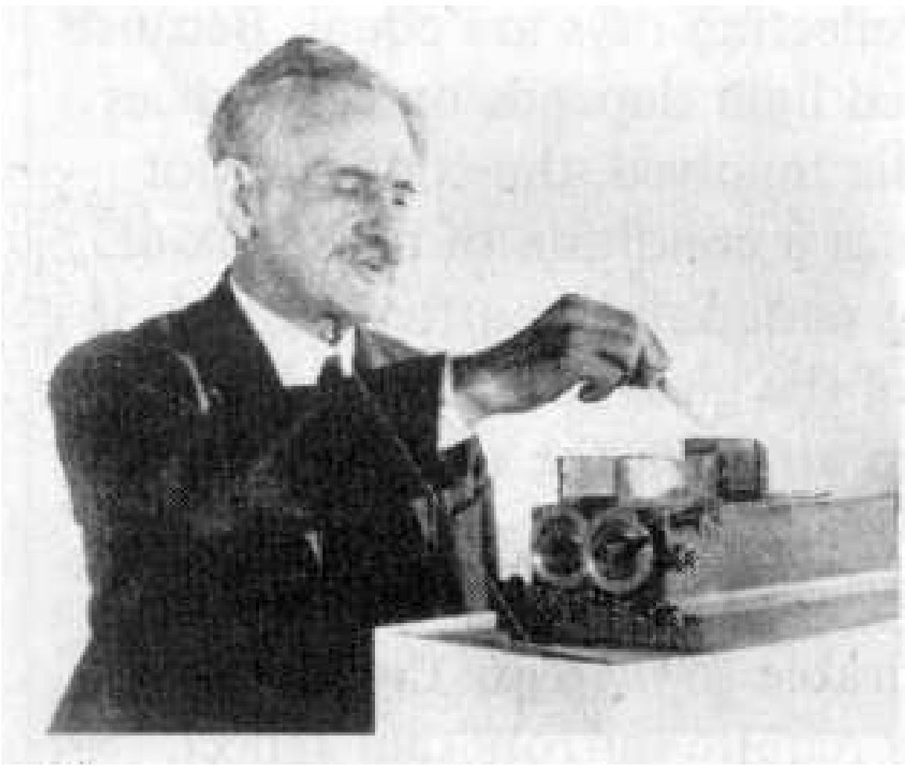

# 4.4.3 ==迈克耳孙星体干涉仪==

### 一、 测量遥远星体角直径的本质困难

由空间相干性反比律 $d_0 = \frac{\lambda}{\Delta\beta}$ 知，通过测量杨氏双孔干涉衬比度 $\gamma$ 降为零时的双孔间距 $d_0$，可以反推光源的角直径 $\Delta\beta = \frac{\lambda}{d_0}$。这是一种用干涉方法测量光源角直径的原理。

然而对于遥远恒星（如猎户座 $\alpha$ 星，参宿四），其角直径极小：

$$\Delta\beta \approx 2\times10^{-7}\text{ rad}$$

对应的 $d_0 = \frac{\lambda}{\Delta\beta} = \frac{550\times10^{-9}}{2\times10^{-7}} \approx 2.75\text{ m}$

理论上，只有当双孔间距增大到约 **3 m** 时，衬比度才会降为零。

**面临的矛盾**：此时双孔间距 $d \sim \text{m}$ 量级，对应的条纹间距 $\Delta x = \frac{D\lambda}{d}$ 极小（远小于微米量级），远超过人眼和普通探测器的空间分辨极限，条纹**无法被分辨**。直接用大间距双孔做杨氏干涉测角直径，在技术上无法实现。

### 二、 迈克耳孙星体干涉仪的解决方案

美国物理学家阿尔伯特·迈克耳孙（A.A. Michelson）设计了星体干涉仪，巧妙地将上述矛盾分离：

**装置结构**：在大型望远镜镜筒口外，安装一组可移动的外侧平面反射镜（$M_1, M_3$ 在外侧，$M_2, M_4$ 在内侧紧靠望远镜双孔 $H_1, H_2$），允许外侧镜距 $h_0$ 远大于内侧双孔间距 $d$。

**工作原理**：
- 来自遥远星体的星光，经外侧镜 $M_1, M_3$ 分别反射后，再经内侧镜 $M_2, M_4$ 转折，分别通过双孔 $H_1, H_2$ 进入望远镜，最终在焦平面上产生干涉条纹
- 决定相干程度（衬比度变化）的等效采样间距是**外侧镜间距** $h_0$（可调节到数米量级）
- 决定焦平面上条纹间距的是**内侧双孔间距** $d$（固定为几毫米量级，使条纹间距在可分辨范围内）

$$\Delta x_{\text{条纹}} = \frac{D\lambda}{d} \sim \text{可观测量级}$$

$$\gamma \text{ 取决于 } h_0, \quad \gamma = 0 \text{ 时 } h_0 = d_0 = \frac{\lambda}{\Delta\beta}$$

**操作方法**：逐渐增大外侧镜间距 $h_0$，同时在焦平面上观测干涉条纹的衬比度。条纹**间距始终可分辨**（由固定的内侧孔距 $d$ 决定），而衬比度随 $h_0$ 增大逐渐下降，直到条纹消失，记录此时的 $h_0 = d_0$，即求得星体角直径：

$$\Delta\beta = \frac{\lambda}{d_0}$$

### 三、 实际测量结果

1920年，迈克耳孙和皮斯（Pease）用 2.5 m 反射望远镜上改装的星体干涉仪，测量了参宿四（$\alpha$ Orionis），得到：

- 条纹消失时外侧镜间距 $d_0 = 3.07\text{ m}$
- 估算角直径 $\Delta\beta = \frac{550\times10^{-9}}{3.07} \approx 1.79\times10^{-7}\text{ rad}$，约合 37 毫角秒

这是人类历史上首次精确测定太阳以外恒星视角直径的实验，验证了空间相干性反比律的正确性。

### 四、 星体干涉仪的科学意义

1. **技术创新**：将"高精度测角需要大间距双孔"的需求，与"干涉条纹可分辨需要小间距双孔"的需求完全**解耦**，各自独立满足。这是光学仪器设计上的创新思维。

2. **方法论意义**：其本质是**空间相干性的主动探测**：通过改变双孔等效间距，系统地探查光场横截面内不同位置对之间的相关程度。

3. **现代干涉天文学的先驱**：星体干涉仪是现代射电干涉阵列（Very Large Baseline Interferometry，超长基线干涉，VLBI）和光学干涉天文台（如 VLTI）的先驱，后者将多个间距数百米至公里的望远镜组合，进一步提高了角分辨率。

> **结论**：迈克耳孙星体干涉仪通过将外侧镜间距（决定采样相干性）与内侧孔距（决定条纹可见间距）分离，解决了"大间距采样导致条纹太密无法分辨"的矛盾。当外镜间距 $h_0 = d_0$ 时衬比度降为零，由此反推星体角直径 $\Delta\beta = \frac{\lambda}{d_0}$。这一仪器将空间相干性反比律从理论工具转化为实际的精密天文测量手段。
