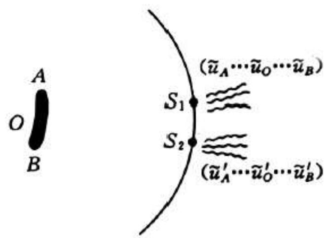
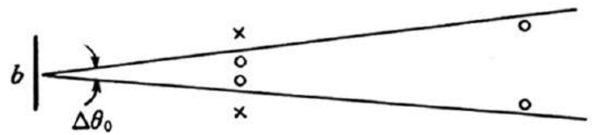
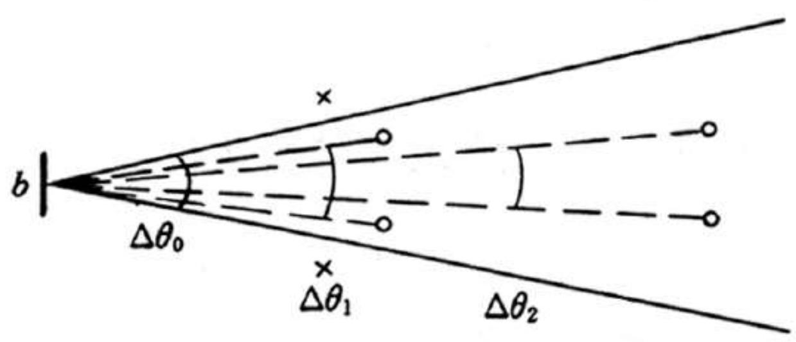

# 4.4.1 ==空间相干性==的概念与反比律公式

### 一、 问题的提出：扩展光源照明下的横向相关性

在[[4.3.4 光源宽度对衬比度的影响与极限宽度]]中，我们分析了扩展光源对杨氏干涉衬比度的影响，得到极限宽度 $b_0 = \frac{\lambda R}{d}$。这个结果可以从另一个更基本的角度来理解：扩展光源照明时，空间中不同横向位置的两个点，它们上面的光扰动并不是无关联的——来自同一光源元发出的光，在这两个位置处留下相关的成分。

**空间相干性的研究对象**是：在扩展光源照明的光场中，空间横向平面内两个点 $S_1$、$S_2$ 处的光扰动之间的相关程度。

**用什么来度量相关程度**：在 $S_1, S_2$ 处各放一个小孔，进行杨氏双孔干涉实验，观察屏上干涉条纹的衬比度 $\gamma$ 的大小，就作为 $(S_1, S_2)$ 两点之间相干程度的量度。

- $\gamma = 1$：完全相干
- $\gamma = 0$：完全非相干
- $0 < \gamma < 1$：部分相干

### 二、 扩展光源照明下两点 $S_1, S_2$ 的内部相关结构

设宽度为 $b$ 的扩展非相干光源，其中每个面元 $O$ 在 $S_1, S_2$ 两处各产生光扰动 $u_O$ 和 $u_O'$。
- $u_O$ 和 $u_O'$ 来自同一面元 $O$，**相互相干**（相位差稳定）
- $u_O$ 和 $u_{O'}$（不同面元）之间**相互非相干**（相位随机）

$S_1$ 处的总扰动是所有面元贡献的叠加，$S_2$ 处同理。因此 $(S_1, S_2)$ 两点之间的关系既非完全相干，也非完全非相干——是**部分相干**。

![[../../../教材和PPT/images/2134d317e3ac4d5e3c12f5dd14d7db53c39d6e6b2aa20f47dd4e81082de25cce.jpg]]

### 三、 ==空间相干性反比律==

直接利用极限宽度的结论 $d_0 = \frac{\lambda R}{b}$（$b$ 给定时能观测到干涉条纹的最大双孔间距），引入==相干孔径角==：（背诵）

$$\Delta\theta_0 = \frac{d_0}{R} = \frac{\lambda}{b \cdot (R/R)} = \frac{\lambda}{b}$$

注意 $\frac{b}{R}$ 是光源对双孔连线中点所张的角度（光源的角直径 $\Delta\beta$），所以有：

$$\boxed{d_0 \cdot \Delta\beta \approx \lambda}$$

或等价地（引入相干孔径角 $\Delta\theta_0$）：

$$\boxed{b \cdot \Delta\theta_0 \approx \lambda}$$

这就是**空间相干性反比律**，其物理含义是：
- 光源的线度 $b$ 和相干孔径角 $\Delta\theta_0$ 成反比，乘积约等于一个波长 $\lambda$
- 光源越大（$b$ 越大），相干孔径角越小，能形成相干光的双孔允许间距越小
- 光源越小（趋近点光源），相干孔径角趋于整个半空间，空间相干性趋于完全相干

### 四、 对空间相干性的几何图像理解

设 $(S_1, S_2)$ 两点之间的间距为 $d$，它们对光源中心所张的角为 $\Delta\theta = d/R$：

$$\gamma\!\left(\frac{\Delta\theta}{\Delta\theta_0}\right) = \left|\frac{\sin\!\left(\pi\frac{\Delta\theta}{\Delta\theta_0}\right)}{\pi\frac{\Delta\theta}{\Delta\theta_0}}\right|$$

几何图像上，以 $\Delta\theta_0$ 为半径在光场横截面内画出一个"相干区域"：
- 若 $\Delta\theta < \Delta\theta_0$（即 $d < d_0$）：$(S_1, S_2)$ 落在相干区域内，$\gamma > 0$，部分相干
- 若 $\Delta\theta > \Delta\theta_0$（即 $d > d_0$）：$(S_1, S_2)$ 落在相干区域外，$\gamma \approx 0$，非相干
- 双孔落在相干区域内越深（$d$ 越小），$\gamma$ 值越高，相干性越好

> **结论（反比律）**：空间相干性反比律 $d_0 \cdot \Delta\beta \approx \lambda$ 定量描述了扩展光源照明下，光场横截面内两点相干程度与光源角直径、两点间距之间的关系。这是光场的固有统计特性，取决于光源的线度和光波波长，与具体干涉实验的装置无关。
