# 4.6.1 ==薄膜干涉==的光程差公式与半波损失

### 一、 ==分振幅干涉==的基本思路

[[4.3.5 其他分波前干涉装置|分波前干涉]]将同一波前上不同空间位置的子波作为相干光源。而**分振幅干涉**则不同：它是将同一束光投射到一个半透明界面（薄膜）上，利用界面对光的**部分反射和部分透射**，把入射光的振幅分成两束（反射光和透射光），这两束光来自同一原始波列，因此满足相干条件，彼此可以发生干涉。

典型的分振幅干涉现象：肥皂泡的彩色、雨水路面上油膜的彩色、镀膜镜片表面的颜色，都是薄膜干涉的结果。

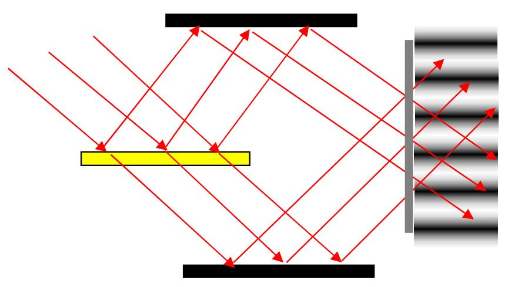

### 二、 ==定域干涉==与非定域干涉

干涉条纹的出现位置与光源的性质有关：

- **点光源照明**：薄膜上、下表面反射的两束相干光，相当于来自点光源S在两个反射镜中各自形成的虚像 $S_1'$、$S_2'$，本质上是两个相干点光源产生的干涉。这类干涉在空间任意位置都能观察到，条纹**不定域**（非定域干涉）。

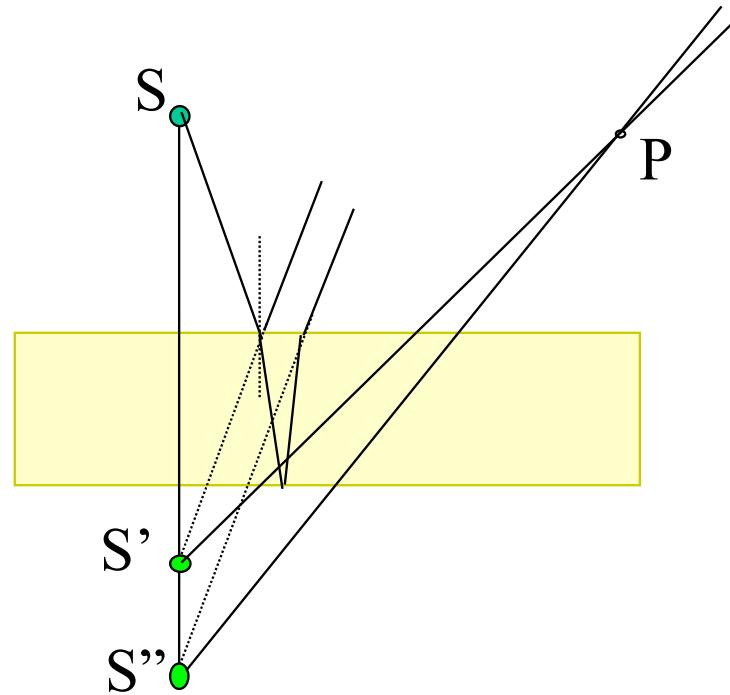

- **扩展光源照明**：从扩展光源上不同位置发出的光，在薄膜的上下界面产生的两束反射光，只有以相同入射角入射的光的两束反射光才能彼此有稳定的相位关系（空间相干性条件 $b \cdot \beta < \lambda$ 要求发散角 $\beta$ 足够小）。由于扩展光源各点相互非相干，两束反射光只能在特定的空间区域叠加并形成可见条纹，条纹**定域**在薄膜附近（等厚干涉）或无穷远处（等倾干涉）。

$$b \cdot \beta < \lambda \qquad \text{即} \qquad \beta < \frac{\lambda}{b}$$

其中 $b$ 是扩展光源宽度，$\beta$ 是光源对薄膜上观察点的张角。满足此条件的光才有足够空间相干性，才能形成可见的定域干涉条纹。

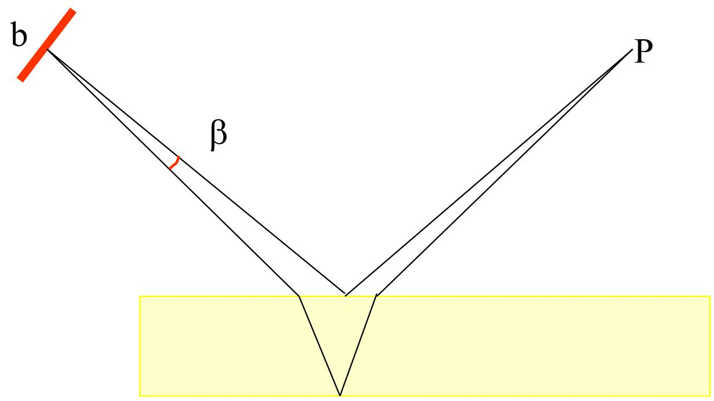

用扩展光源照明**平行平面薄膜**时，同一入射角的光（从扩展光源的不同位置出发，但以相同角度射向薄膜）在薄膜上下界面反射后，平行出射，汇聚于透镜焦平面上的同一点，形成同一级干涉条纹。幕上同一条干涉条纹由同一倾角的入射光形成，故称为**等倾条纹**，条纹定域在无穷远处（需用透镜聚焦观察）。

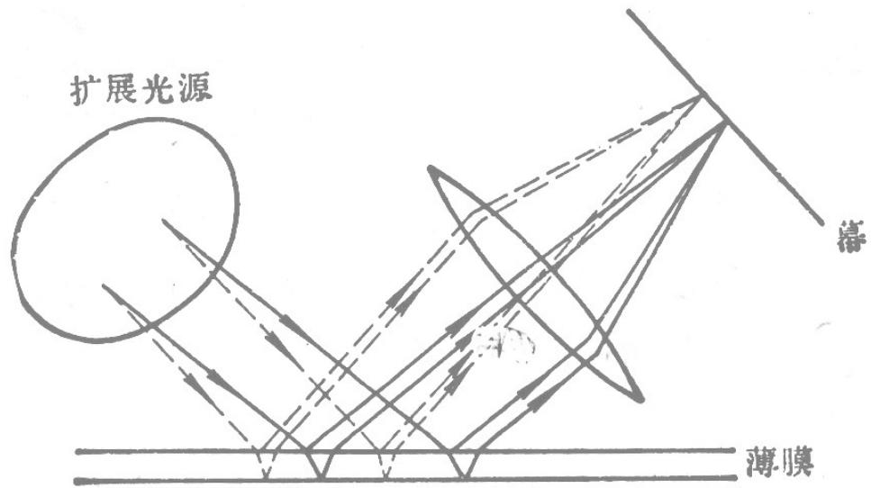

用扩展光源照明**楔形薄膜**（等厚膜）时，光以近似垂直的角度入射，光程差主要由局部膜厚 $d$ 决定，干涉条纹定域在薄膜附近。两束相干光的交汇区域在楔形膜的表面附近，条纹称为**等厚条纹**。

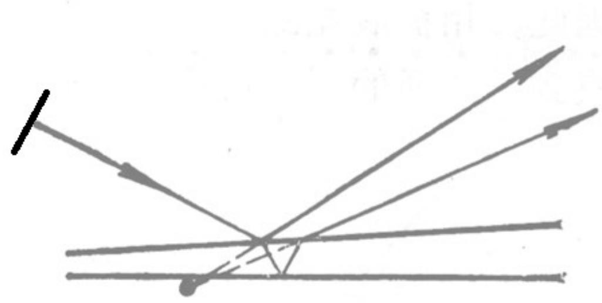

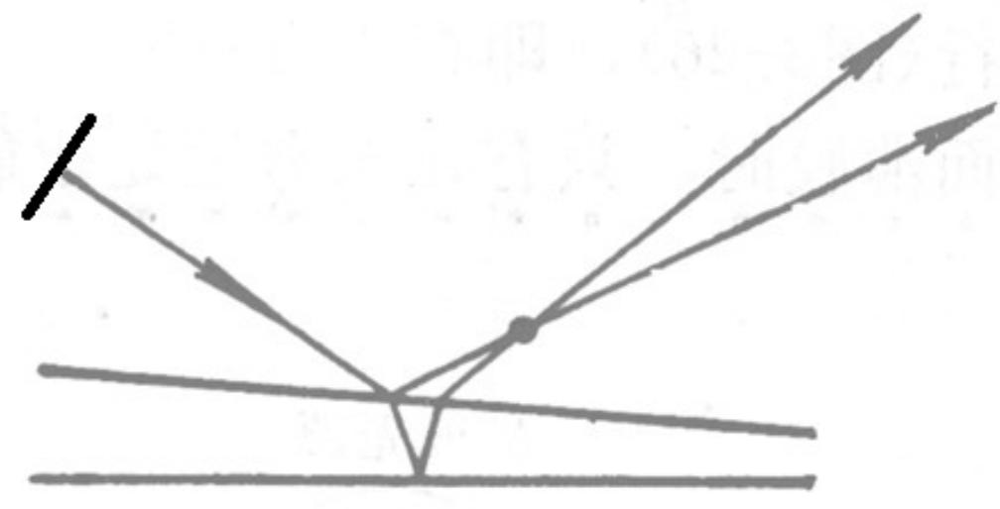

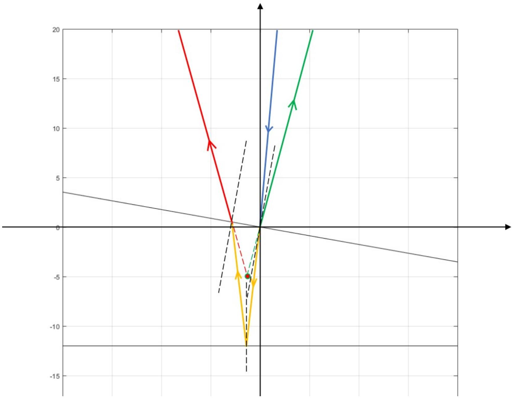

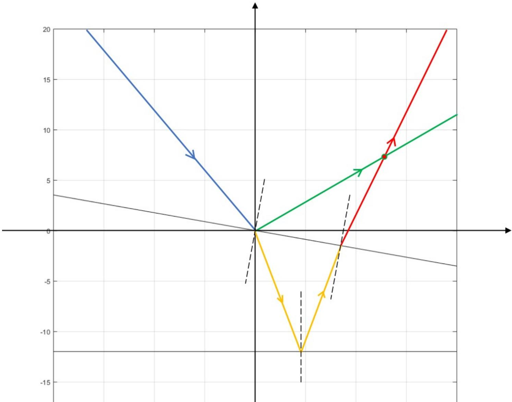

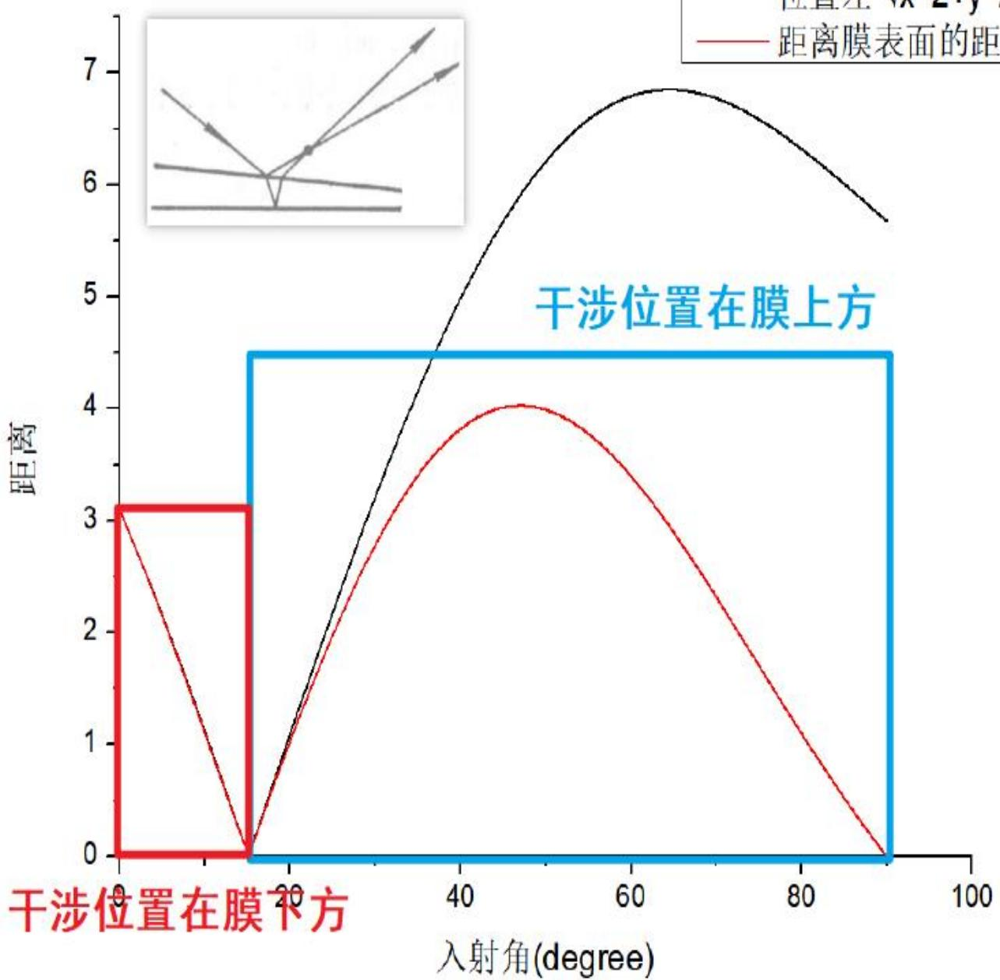

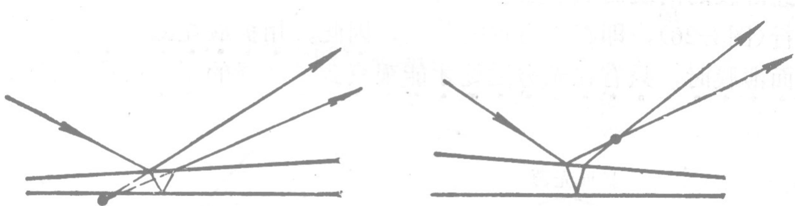

> **结论**：点光源照明薄膜产生==非定域干涉==，干涉条纹存在于薄膜上方整个空间；扩展光源照明薄膜产生==定域干涉==，条纹仅存在于特定区域——平行膜对应等倾条纹（定域于无穷远/透镜焦面）；楔形膜对应等厚条纹（定域于薄膜表面附近）。楔角越大，定域区域越靠近薄膜；楔角过大时两束反射光完全分开，干涉条纹消失。

### 三、 ==光程差公式==的推导

考虑光束以入射角 $\theta$ 射入折射率为 $n_2$、厚度为 $d$、倾角（楔角）为 $\alpha$ 的薄膜（薄膜上方介质折射率为 $n_1$，下方为 $n_3$），如图：

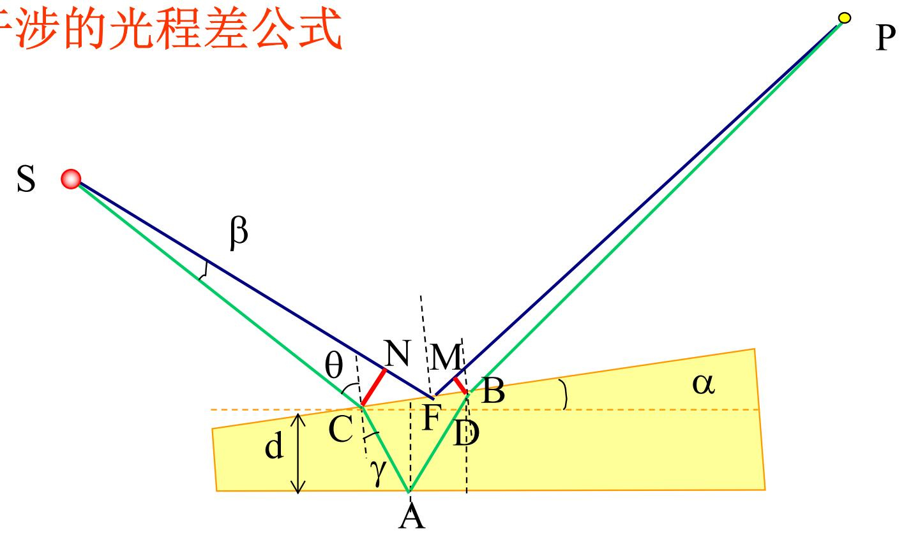

光在上界面 $N$ 处反射形成光束1，折射进入薄膜后在下界面 $A$ 处反射，再在上界面 $B$ 处透出形成光束2。光束1和光束2相交于远处的 $P$ 点，产生干涉。

**精确的光程差表达式**为（推导过程需考虑几何路径 $AC$、$AB$、$FN$、$FM$）：

$$\Delta = 2n_2 \frac{d}{\cos(\gamma+\alpha)} + 2d\tan(\alpha+\gamma)\left(\cos\alpha + \sin\alpha\tan(2\alpha+\gamma)\right)\left[\frac{n_2\sin\alpha}{\cos(\gamma+\alpha)} - \sin(\beta+\theta)\right]$$

其中 $\gamma$ 是光在薄膜内的折射角，满足 $n_1\sin\theta = n_2\sin\gamma$。

**当楔角 $\alpha$ 很小**（薄膜接近平行平面板）时，上式中括号内各项接近零，简化为：

$$\boxed{\Delta_0 = 2n_2 d\cos\gamma}$$

这是薄膜干涉光程差的核心公式，表示光在薄膜内走过的"几何路程 $2d/\cos\gamma$"乘以折射率 $n_2$，即薄膜内的光路长度。

### 四、 ==半波损失==（相位突变问题）

光在界面反射时，有时会发生额外的 $\pi$ 相位突变，等效于光程差增加（或减少）$\lambda/2$，这称为**半波损失**。

#### 1. 正入射时的规律

- $n_1 < n_2$（从光疏介质射向光密介质）：反射时有相位突变，有半波损失
- $n_1 > n_2$（从光密介质射向光疏介质）：反射时无相位突变，无半波损失

#### 2. 斜入射时（入射角小于布儒斯特角）的规律

关注的是薄膜上界面（$n_1 \to n_2$）和下界面（$n_2 \to n_3$）两次反射之间的**相位差**：

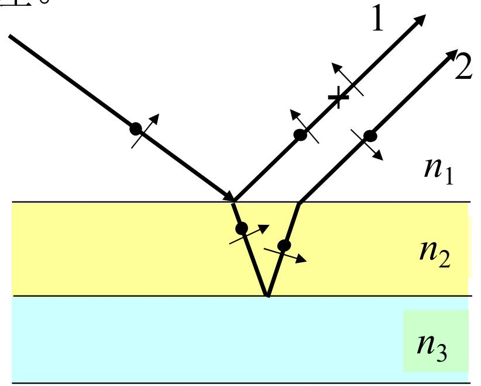

**情况一**：$n_1 > n_2 < n_3$ 或 $n_1 < n_2 > n_3$（薄膜折射率在两侧介质之间，即"最高"或"最低"）：
- 上下两次反射中，恰好有**一次**发生相位突变，两束光之间有 $\pi$ 的附加相位差
- 实际光程差：$\Delta L_{12} = \Delta L_0 \pm \dfrac{\lambda}{2}$

**情况二**：$n_1 > n_2 > n_3$ 或 $n_1 < n_2 < n_3$（折射率单调排列）：
- 两次反射要么都发生相位突变，要么都不发生，**相位突变相互抵消**
- 实际光程差：$\Delta L_{12} = \Delta L_0$

#### 3. 最常用情形：空气-薄膜-空气（$n_1 = n_3 = 1 < n_2$）

上界面 $n_1 < n_2$，有半波损失；下界面 $n_2 > n_3$，无半波损失 → 属于情况一，有附加 $\lambda/2$：

$$\boxed{\Delta = 2n_2 d\cos\gamma + \frac{\lambda}{2}}$$

这是我们在等倾干涉和等厚干涉中最常用的光程差公式。

> **结论**：分振幅薄膜干涉的光程差由两部分组成：一是光在薄膜内两次来回的几何光程 $2n_2 d\cos\gamma$；二是由半波损失引入的附加光程 $\pm\lambda/2$。半波损失是否出现，取决于薄膜两侧的折射率大小关系：若折射率在界面两侧高低不同（即薄膜折射率处于最高或最低），则两次反射中有一次产生相位突变，附加 $\lambda/2$；若折射率单调排列，则两次突变互相抵消，无附加项。
