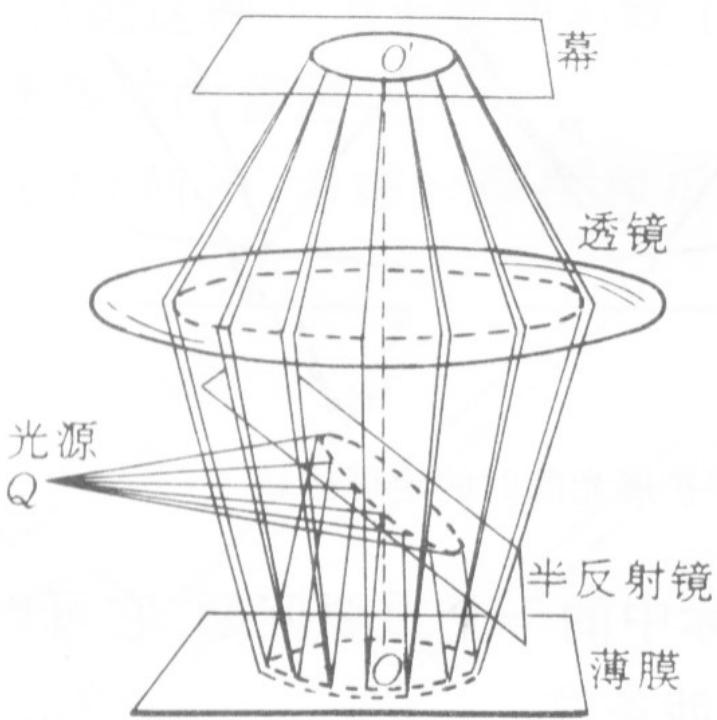
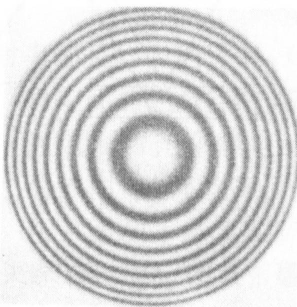
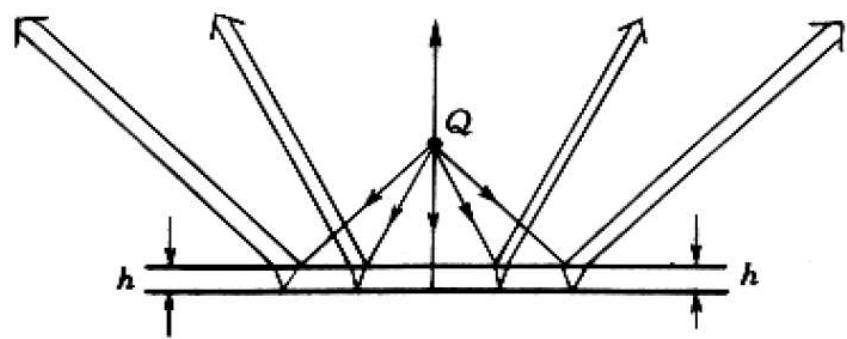
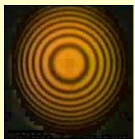
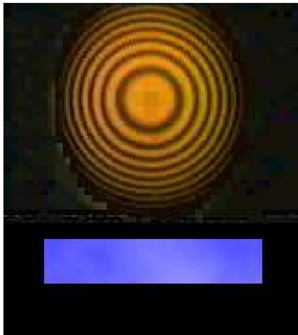
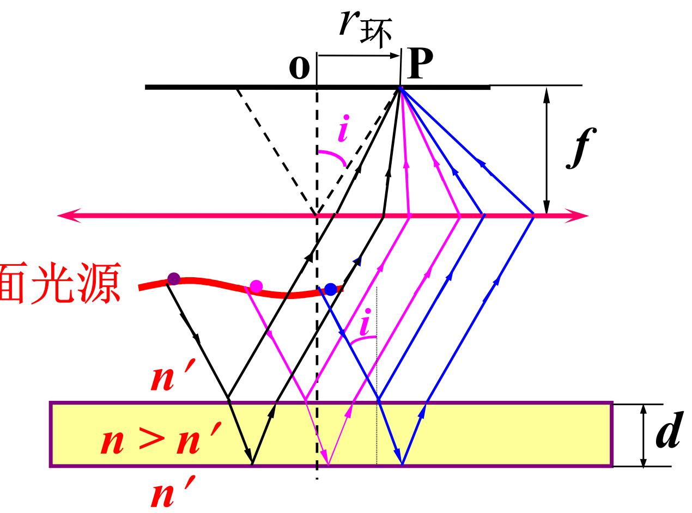
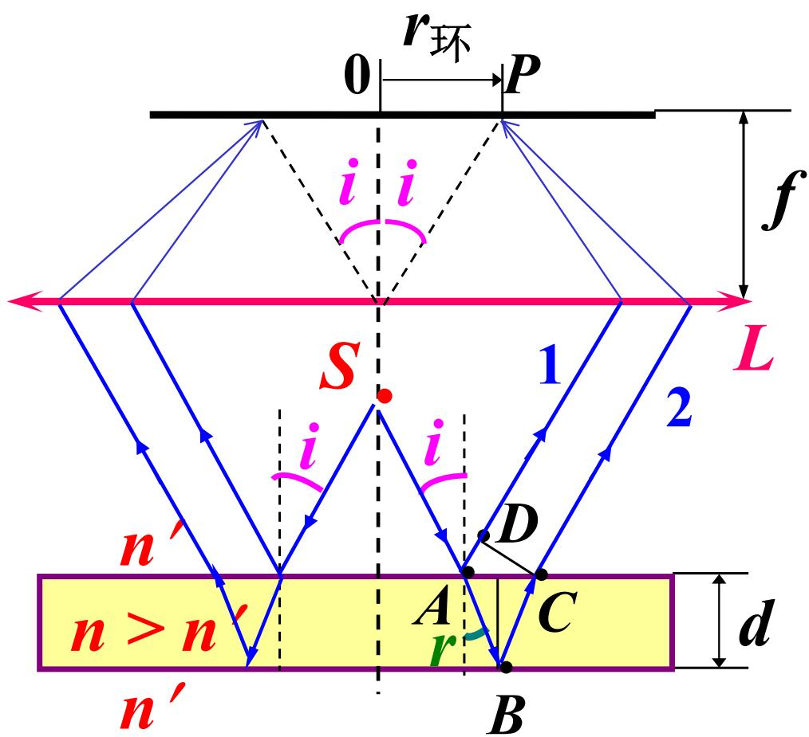
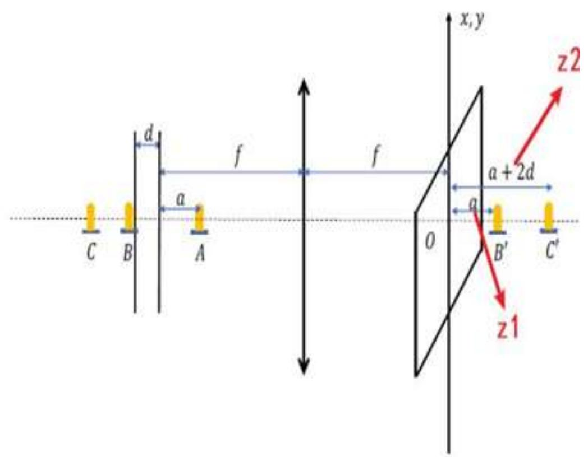

# 4.6.2 ==等倾干涉==：观察方法与条纹特征

### 一、 等倾干涉的产生条件

在[[4.6.1 薄膜干涉的光程差公式与半波损失]]中，光程差公式（对于折射率均匀、厚度均匀的薄膜）为：

$$\Delta = 2nd\cos\gamma + \frac{\lambda}{2}$$

若薄膜的折射率 $n$ 和厚度 $d$ 都**均匀不变**，则光程差 $\Delta$ 只由折射角 $\gamma$ 决定，而 $\gamma$ 由入射角 $i$ 唯一确定（折射定律 $n_1\sin i = n\sin\gamma$）。

因此：**入射角相同的所有光线，在薄膜上下界面反射后产生的光程差完全相同**，将呈现相同的干涉状态（同亮或同暗）。这种干涉条纹，按照"等倾角"分布，称为==等倾干涉==。

### 二、 等倾干涉的观察方法

为了同时观察到所有倾角对应的干涉条纹，需要**扩展光源**（而非点光源，以提供各个方向的入射光），并用**会聚透镜**将同一倾角的所有反射光汇聚到焦平面上的同一点。

如图所示，扩展光源发出的光，以各种角度入射在平行薄膜上，经上下界面分别反射的两束光，相同倾角的光被透镜汇聚到焦平面上同一圆环上。这就是说：

- 每个倾角 $i$ 对应焦平面上的一个**圆环**（因为以同一角度入射的光，在三维空间中构成一个以光轴为旋转轴的锥面，该锥面在焦平面上交成圆环）
- 整个焦平面上出现一系列**同心亮暗圆环**

### 三、 等倾干涉的光程差公式推导

对于平行平面薄膜（折射率 $n$，厚度 $d$，上方介质折射率 $n' = 1$），光以入射角 $i$ 入射，折射角 $r$ 满足 $\sin i = n\sin r$：

光束在薄膜内沿 $AB$、$BC$ 两段传播，其中 $AB = BC = \frac{d}{\cos r}$；由 $A$ 向 $B$ 作法线，光束从 $A$ 到参考面 $D$ 的距离为 $AD = AC\sin i = 2d\tan r\sin i$：

$$\Delta_0 = n\left(\overline{AB}+\overline{BC}\right) - n'\overline{AD} = \frac{2nd}{\cos r} - 2d\tan r\sin i = \frac{2nd}{\cos r}\left(1 - \sin^2 r\right) = 2nd\cos r$$

加入半波损失修正（空气-薄膜-空气结构，折射率满足 $n' < n$，有一次相位突变）：

$$\boxed{\Delta = 2nd\cos r + \frac{\lambda}{2}}$$

### 四、 ==等倾干涉条纹的特征==

#### 1. 条纹形状：同心圆环

所有倾角相同的光对应同一个光程差，在焦平面上汇聚为同一个圆环。因此等倾干涉条纹是**一系列同心等倾圆环**（而非等间距的平行直条纹）。

亮纹条件：$\Delta = 2nd\cos r + \frac{\lambda}{2} = k\lambda$

暗纹条件：$\Delta = 2nd\cos r + \frac{\lambda}{2} = \left(k+\frac{1}{2}\right)\lambda$

#### 2. 条纹级次的分布：中心级次高

亮纹条件：$\Delta = k\lambda$，即 $2nd\cos r + \frac{\lambda}{2} = k\lambda$。

- 在中心处，入射角 $i = 0$，折射角 $r = 0$，$\cos r = 1$，光程差最大 $\Delta_{\max} = 2nd + \frac{\lambda}{2}$，对应的级次 $k$ 最大
- 越向外沿，入射角越大，折射角也越大，$\cos r$ 减小，光程差减小，级次降低

因此：**等倾干涉圆环中心的级次高，外沿的级次低**（与牛顿环相反）。

#### 3. 相邻条纹之间的角度间距

对光程差公式 $\Delta = 2nd\cos r + \frac{\lambda}{2}$ 取微分，相邻亮纹之间 $\delta\Delta = \lambda$，即 $\delta(2nd\cos r) = -\lambda$：

$$-2nd\sin r\,\delta r = \lambda \quad \Rightarrow \quad \delta r = -\frac{\lambda}{2nd\sin r}$$

由此可知：
- 在 $r = 0$（中心）处，$\sin r \to 0$，分母趋于零，相邻条纹之间的 $\delta r$ 趋于无穷大 → **中心附近条纹间距较大（稀疏）**
- 在 $r$ 较大（外沿）处，$\sin r$ 较大，$\delta r$ 较小 → **外沿条纹间距较小（密集）**

#### 4. 薄膜厚度变化时的条纹变化

由 $\Delta = 2nd\cos r + \frac{\lambda}{2}$ 可知：

- 薄膜厚度 $d$ **增大**时：光程差整体增大，中心处（$r=0$）的干涉级次增大，相当于"新的圆环从中心产生，旧圆环向外推移"，称为条纹**外冒**，中心处明暗交替
- 薄膜厚度 $d$ **减小**时：光程差整体减小，中心处级次减小，圆环向内收缩消失，称为条纹**内缩**，中心处明暗交替

这一现象可以用来精确监测薄膜厚度的微小变化（例如蒸镀过程中的膜厚控制）。

### 五、 扩展光源照明的优点

从扩展光源上不同位置发出的光，只要倾角 $i$ 相同，它们在均匀薄膜上的光程差相同，经透镜汇聚后都落在焦平面上同一个干涉圆环上（**非相干叠加**，使亮环更亮、暗环更暗），明暗对比比单点光源照明更清晰，有利于实验观察。

> **结论**：等倾干涉是折射率和厚度均匀的薄膜在扩展光源（加会聚透镜）照明下产生的干涉现象，条纹为同心等倾圆环，中心级次高且条纹稀疏，外沿级次低且条纹密集。薄膜厚度增大时，条纹从中心向外扩展（外冒）；减小时向内收缩。

---

### 六、 利用==波前函数法==讨论等倾干涉

波前函数法是从点光源 $S$ 出发，追踪光在薄膜中的传播，将薄膜上下界面的反射光等效为来自两个虚点源的球面波，再分析两球面波在透镜焦平面上的干涉情况，从而得到等倾干涉圆环的位置和强度。

在波前函数法的分析框架下，薄膜干涉等效于两个相干虚点源（分别在薄膜上、下界面的"镜像"位置）发出的球面波叠加。如图所示，设薄膜厚度为 $d$，两个虚点源之间相距 $2d$（在光轴方向上），通过透镜后在焦平面上产生干涉条纹，圆环半径 $r_{\text{环}}$ 与入射角 $i$ 的关系为 $r_{\text{环}} = f\tan i$：

