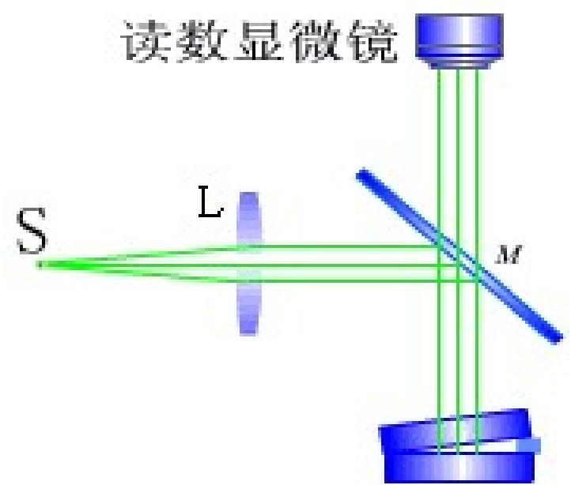
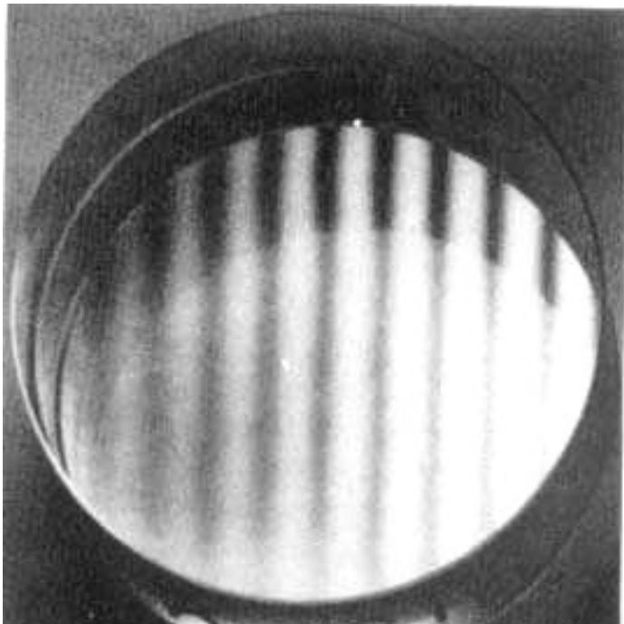
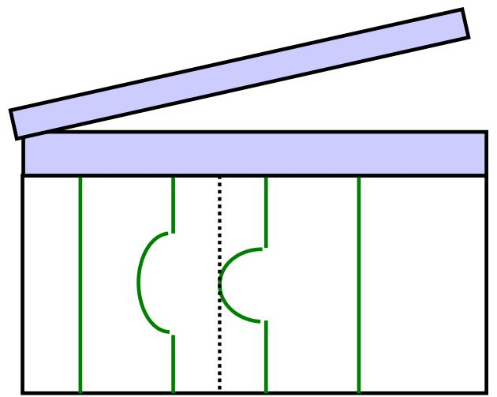
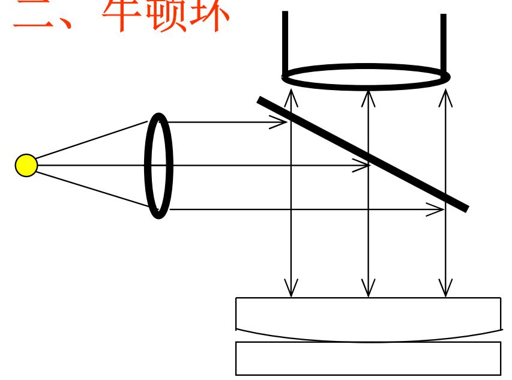
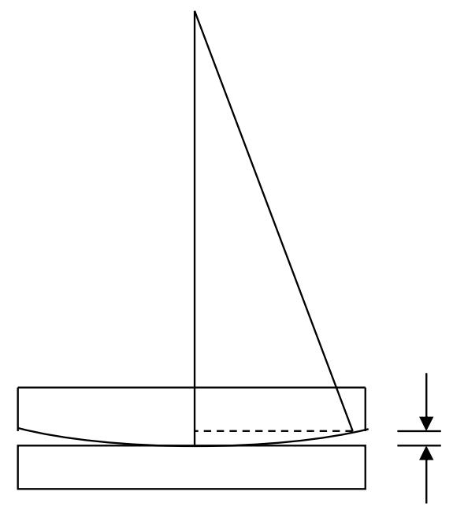
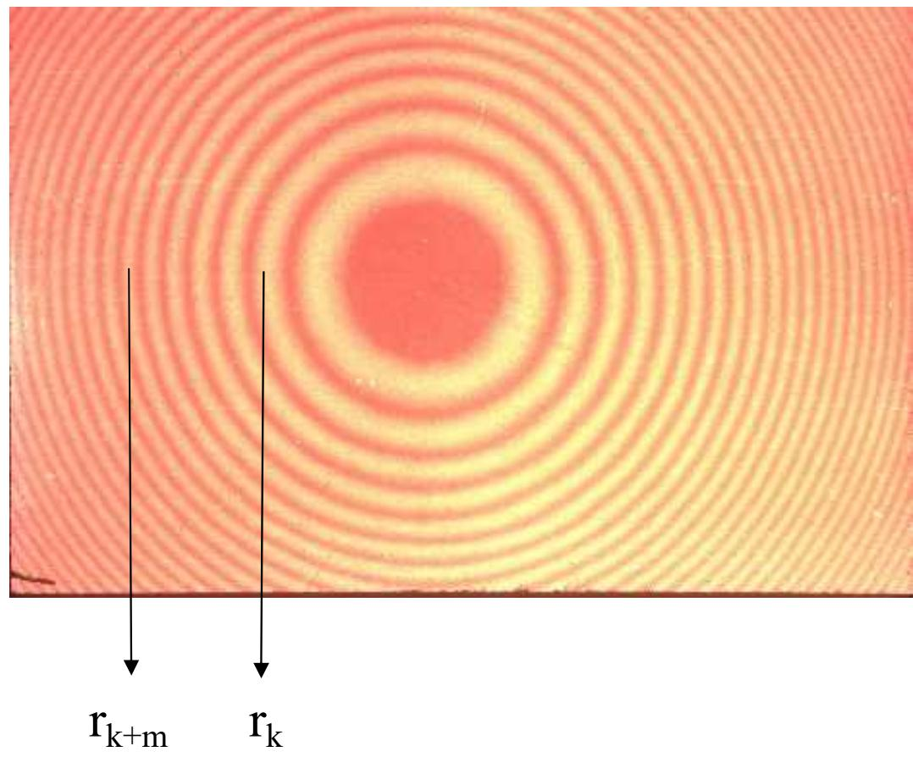
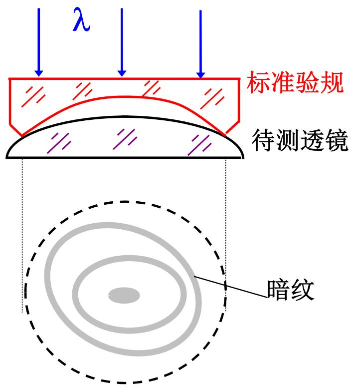
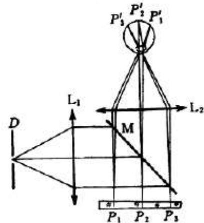
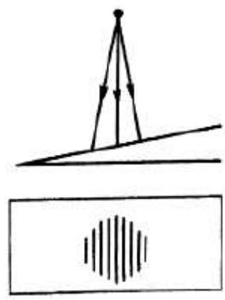

# 4.6.3 ==等厚干涉==：楔形膜与牛顿环

### 一、 等厚干涉的基本概念

在[[4.6.1 薄膜干涉的光程差公式与半波损失]]中，光程差公式为 $\Delta = 2nd\cos\gamma + \frac{\lambda}{2}$。

若照明光为**准平行光**（或垂直入射），则折射角 $\gamma \approx 0$，$\cos\gamma \approx 1$，光程差简化为：

$$\Delta = 2nd + \frac{\lambda}{2}$$

此时光程差只由薄膜局部厚度 $d$ 决定。**薄膜厚度相同的地方，光程差相同，干涉状态相同**，同一条干涉条纹就落在膜的等厚线上，这类干涉称为==等厚干涉==，条纹称为**等厚条纹**。

等厚干涉条纹定域在薄膜附近（薄膜表面），需要用读数显微镜观察。

---

### 二、 ==楔形膜==的等厚干涉

#### 1. 条纹形状与亮暗条件

楔形膜的厚度沿一个方向线性变化（楔角 $\alpha$ 很小）。垂直照射时：

$$\Delta = 2nd + \frac{\lambda}{2}$$

亮条纹：$\Delta = k\lambda$，即 $2nd + \frac{\lambda}{2} = k\lambda$，$d = \frac{(2k-1)\lambda}{4n}$

暗条纹：$\Delta = (k+\frac{1}{2})\lambda$，即 $2nd + \frac{\lambda}{2} = (k+\frac{1}{2})\lambda$，$d = \frac{k\lambda}{2n}$

在楔形薄膜的**棱边**处（$d = 0$），光程差 $\Delta = \frac{\lambda}{2}$，满足暗纹条件，所以**棱边处为暗纹**（第0级暗纹）。

#### 2. 相邻条纹之间的厚度差与条纹间距

相邻两条亮纹（或暗纹）对应的膜厚差：

$$\Delta d = d_{k+1} - d_k = \frac{\lambda}{2n}$$

由楔形膜几何关系（楔角 $\alpha$ 很小时），膜厚为 $d = l\cdot\alpha$（$l$ 是从棱边量起的距离），相邻条纹间的距离 $\Delta l$（条纹间距）：

$$\Delta l = \frac{\Delta d}{\alpha} = \frac{\lambda}{2n\alpha}$$

- 楔角 $\alpha$ 越小，条纹间距 $\Delta l$ 越大（条纹越稀疏）
- 楔角 $\alpha$ 越大，条纹间距 $\Delta l$ 越小（条纹越密集）
- 若待测膜层内有微小凸起或凹陷，条纹会在该处发生弯曲（向棱边方向弯曲表示凹陷，反之为凸起）

#### 3. 典型例题

**例1**（测量钢球直径）（重点掌握）：波长 $\lambda = 589.3\text{ nm}$ 的钠黄光垂直照射长 $L = 20\text{ mm}$ 的空气劈尖（$n=1$），测得条纹间距 $\Delta l = 1.18\times10^{-4}\text{ m}$。求钢球直径 $d$。

由条纹间距公式：
$$\alpha = \frac{\lambda}{2n\Delta l} = \frac{589.3\times10^{-9}}{2\times1\times1.18\times10^{-4}} \approx 2.5\times10^{-3}\text{ rad}$$

钢球直径（即劈尖末端厚度）：
$$d = L\alpha = 20\times10^{-3} \times 2.5\times10^{-3} = 5\times10^{-5}\text{ m} = 50\text{ μm}$$

**例2**（测量 $\text{SiO}_2$ 薄膜厚度）：将 $\text{SiO}_2$（$n=1.46$）膜一端削为劈尖，用 $\lambda = 546.1\text{ nm}$ 绿光垂直照射，观察到 7 条暗纹（从第0条算起共7条）。注意下基底 Si 的折射率 $n_{Si} = 3.42 > n_{SiO_2}$，两界面都有相位突变，互相抵消，无附加 $\lambda/2$（此情况光程差为 $\Delta = 2nd$），或者用实际观察到的暗纹条数推算：劈尖棱边处（$d=0$）为第0条暗纹，第6条暗纹（共 6 个间隔）对应厚度 $D = 6\Delta d = 6\times\frac{\lambda}{2n}$；但中途还有半个间隔的额外修正，实际按教材 $D = 6.5\times\frac{\lambda}{2n}$（与实验装置具体情况有关）：

$$D = 6.5 \times \frac{\lambda}{2n} = 6.5 \times \frac{546.1\times10^{-9}}{2\times1.46} \approx 1\text{ μm}$$

**例3**（检测工件表面光洁度）：用波长 $\lambda = 550\text{ nm}$ 的光垂直照射工件上的空气劈尖，一般区域条纹间距 $\Delta l = 2.34\text{ mm}$，某处条纹弯曲最大畸变量 $a = 1.86\text{ mm}$。缺陷深度（高度）$h$ 满足 $\frac{a}{\Delta l} = \frac{h}{\Delta d}$，即：

$$h = \frac{a}{\Delta l}\times\Delta d = \frac{a}{\Delta l}\times\frac{\lambda}{2} = \frac{1.86\times550\times10^{-6}}{2\times2.34} \approx 0.219\text{ μm}$$

---

### 三、 ==牛顿环==

#### 1. 装置与薄膜形状

将一块曲率半径 $R$ 很大的平凸透镜，凸面向下放在一块平面玻璃板上，在接触点处形成一层楔形空气薄膜。从中心接触点向外，空气层厚度 $h$ 随距接触点的距离 $r$ 增大而增大：

$$h = R - \sqrt{R^2 - r^2} = R\left[1-\sqrt{1-\left(\frac{r}{R}\right)^2}\right] \xrightarrow{r \ll R} h \approx \frac{r^2}{2R}$$

光程差（空气薄膜，$n=1$，有半波损失）：

$$\Delta = 2h + \frac{\lambda}{2} = \frac{r^2}{R} + \frac{\lambda}{2}$$

#### 2. 亮暗环半径公式

**暗环**条件（$\Delta = (k+\frac{1}{2})\lambda$，$k=0,1,2,\ldots$）：

$$\frac{r^2}{R} + \frac{\lambda}{2} = \left(k+\frac{1}{2}\right)\lambda \Rightarrow r^2 = kR\lambda$$

$$\boxed{r_k^{\text{暗}} = \sqrt{kR\lambda}}$$

**亮环**条件（$\Delta = k\lambda$，$k=1,2,3,\ldots$）：

$$\frac{r^2}{R} + \frac{\lambda}{2} = k\lambda \Rightarrow r^2 = \left(k-\frac{1}{2}\right)R\lambda$$

$$\boxed{r_k^{\text{亮}} = \sqrt{\left(k-\frac{1}{2}\right)R\lambda}}$$

- 在**中心接触点**（$r = 0$，$h = 0$），光程差 $\Delta = \frac{\lambda}{2}$，满足暗纹条件，中心为**暗斑**
- 暗环级次越高（$k$ 越大），半径 $r_k = \sqrt{kR\lambda}$ 增大，但相邻暗环之间的间距 $r_{k+1} - r_k = \sqrt{R\lambda}(\sqrt{k+1}-\sqrt{k})$ 随 $k$ 增大而减小，说明**外沿条纹越来越密集**

#### 3. 利用牛顿环测量透镜曲率半径

直接测量单个环的半径会有误差（中心接触点不一定是点接触，可能存在微小变形）。实际操作中，测量第 $k$ 环和第 $k+m$ 环的暗环半径之差：

$$r_{k+m}^2 - r_k^2 = (k+m)R\lambda - kR\lambda = mR\lambda$$

解得曲率半径：

$$\boxed{R = \frac{r_{k+m}^2 - r_k^2}{m\lambda}}$$

这种"跨越 $m$ 个条纹取差"的方法，消除了中心处可能存在的系统误差，是精密测量中常用的处理技术。

> **结论**：等厚干涉通过平行光（$\gamma \approx 0$）照射厚度不均匀的薄膜，在膜面上产生与等厚线重合的干涉条纹。楔形膜产生等间距平行直条纹，相邻条纹间厚度差 $\Delta d = \lambda/(2n)$；牛顿环产生同心圆环，中心为暗斑（因半波损失），暗环半径 $r_k = \sqrt{kR\lambda}$。条纹弯曲可以揭示薄膜表面的微小起伏，精度可达约 $100\text{ nm}$。

---

### 四、 ==检验透镜球面质量==

牛顿环不仅用于测量透镜曲率半径，还可以用于检验透镜球面的加工质量。将被测透镜的球面向下，放在已知曲率半径的**标准验规**（标准凸球面或凹球面）上，如图：

- 若待测透镜的球面半径**等于**标准验规的曲率半径，则两球面完全吻合，接触面处无空气间隙，看不到干涉条纹。
- 若待测透镜曲率与标准验规**不完全一致**，接触区形成楔形空气层，出现牛顿环状干涉条纹（图中所示"暗纹"同心圆）。
- 条纹的**均匀程度**反映了球面的加工精度：若条纹均匀对称，说明球面圆度好；若条纹不均匀或不成规则圆形，说明球面有局部偏差（凸起或凹陷）。

这种方法属于**非接触式精密检测**，精度可达几十纳米量级，是光学加工中常用的质量检测手段。

---

### 五、 ==薄膜表面条纹偏离等厚线==——精密测量等厚条纹的应用

等厚条纹可用于**精密测量**微小长度量、微小角度以及相关物理量，精度约 $\Delta \sim 100\text{ nm}$。

当薄膜上某处出现微小凸起或凹陷时，该处的等厚条纹会偏离直线，形成弯曲的条纹图案。利用条纹的偏移量 $a$ 和相邻条纹间距 $\Delta l$ 的比值，就可以计算出该缺陷的高度（或深度）$h$：

$$\frac{a}{\Delta l} = \frac{h}{\Delta d} = \frac{h}{\lambda / 2n}$$

精密观测等厚条纹的装置如图：

当薄膜表面存在缺陷时，条纹从直线偏离，在缺陷处弯曲：

> **结论**：等厚干涉条纹是薄膜表面三维形貌的"地形图"，每一条等厚线就相当于地图上的一条等高线，相邻两条等厚线之间的高度差恰好等于 $\lambda/(2n)$。通过精密测量条纹偏离直线的幅度，可以检测出深度仅为几十纳米的微小表面缺陷，这一原理被广泛应用于精密光学元件检测、集成电路薄膜质量控制等工程领域。
