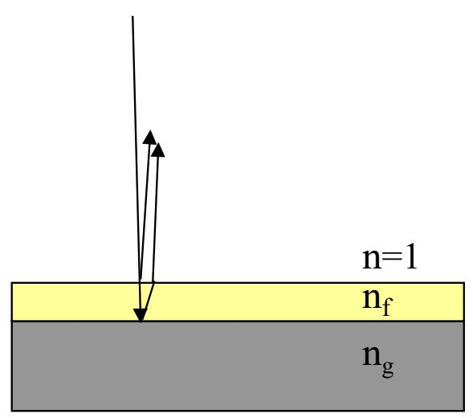
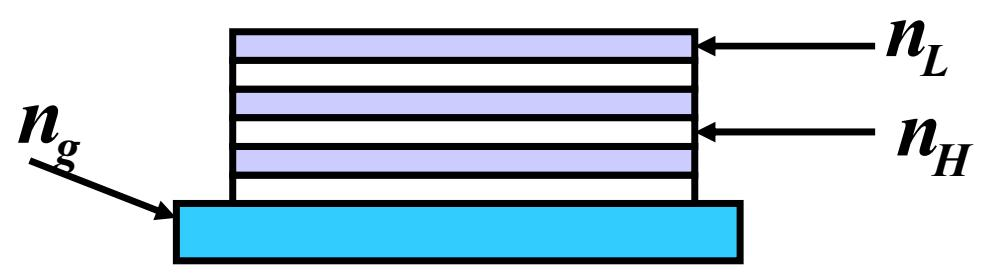
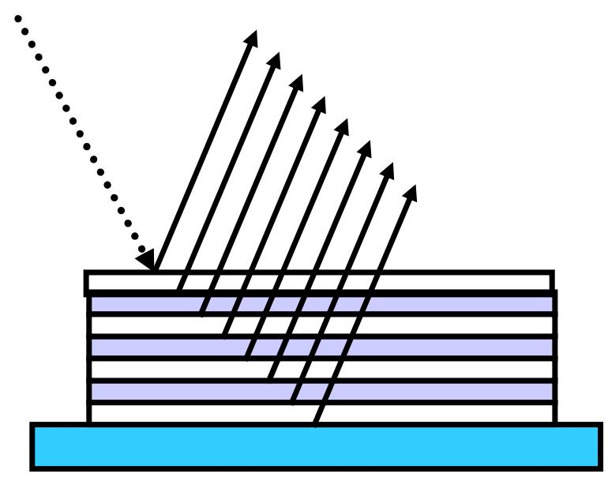

# 4.6.4 ==增透膜==与==增反膜==

### 一、 问题的背景：光学界面上的反射损失

光在空气（$n_1 = 1$）和玻璃（$n_g = 1.52$）界面上垂直入射时，由菲涅耳公式，界面反射光强占入射光强的比例（单界面光强反射率）为：

$$R = \left(\frac{n_g - 1}{n_g + 1}\right)^2 = \left(\frac{0.52}{2.52}\right)^2 \approx 4.25\% \approx 5\%$$

对于单个透镜，透射光强约为 $1 - R \approx 95\%$，看似损失不大。但在包含多个透镜的光学仪器中，反射损失会累积：

- 照相机（6块透镜，12个界面）：透射光强 $\approx 0.95^{12} \approx 0.55$（损失约45%）
- 潜望镜（20块透镜，40个界面）：透射光强 $\approx 0.95^{40} \approx 0.13$（损失约87%）

多次反射不仅降低透射光强，还会在像面上形成杂散光（"鬼像"），严重影响成像质量。因此需要**增透（减反）膜**来减少反射损失。

### 二、 ==增透膜==

#### 1. 增透的原理

在玻璃表面镀一层折射率为 $n_f$、厚度为 $d$ 的薄膜（空气折射率 $n_1 = 1$，玻璃折射率 $n_g$，且 $1 < n_f < n_g$），如图：

光在薄膜**上界面**（$n_1 \to n_f$）反射：$n_1 < n_f$，有半波损失

光在薄膜**下界面**（$n_f \to n_g$）反射：$n_f < n_g$，也有半波损失

两次反射的相位突变相互抵消（属于 $n_1 < n_f < n_g$ 的单调排列，无附加 $\lambda/2$），光程差仅为几何路径之差：

$$\Delta = 2n_f d$$

**增透条件**（两束反射光相消干涉，反射光强最小）：

$$\Delta = 2n_f d = \frac{\lambda}{2}, \frac{3\lambda}{2}, \ldots = \frac{(2k-1)\lambda}{2}$$

取最薄膜（$k=1$）：

$$\boxed{d = \frac{\lambda}{4n_f}}$$

这说明增透膜的光学厚度 $n_f d$ 等于四分之一波长。

#### 2. 振幅条件（实现完全增透）

仅满足光程差为 $\lambda/2$ 只能使两束反射光在相位上相反，但要使反射光**完全消除**（两束反射光相消干涉后总反射强度为零），还需要两束反射光的**振幅相等**。

由菲涅耳公式，上下界面各自反射的振幅分别与 $\frac{n_f - n_1}{n_f + n_1}$ 和 $\frac{n_g - n_f}{n_g + n_f}$ 成正比，要两者相等，需要：

$$\frac{n_f - 1}{n_f + 1} = \frac{n_g - n_f}{n_g + n_f}$$

解得：$n_f^2 = n_1 \cdot n_g = n_g$，即：

$$\boxed{n_f = \sqrt{n_g}}$$

对于玻璃 $n_g = 1.52$，理想增透膜折射率 $n_f = \sqrt{1.52} \approx 1.23$。

但目前自然界中**找不到折射率为 1.23 的介质**，实际上常用 $\text{MgF}_2$（氟化镁，折射率 $n = 1.38$）作为增透膜材料，虽然不能完全消除反射，但可以大幅降低反射率。

#### 3. 增透膜的设计参数

设计增透膜时，针对人眼最敏感的波长（约 $\lambda = 550\text{ nm}$）：

$$d = \frac{\lambda}{4n_f} = \frac{550\text{ nm}}{4\times1.38} \approx 100\text{ nm}$$

这就是为什么镀膜光学元件表面通常呈现淡紫色（因为 $550\text{ nm}$ 绿色反射最弱，而边缘的蓝色和红色反射较强，混合呈现淡紫色）。

### 三、 ==增反膜==

有些场合需要使光学界面的反射率尽可能高（如激光器的反射镜、高反射率分束镜等），这就需要**增反膜**（高反射膜）。

#### 1. 单层增反膜的原理

与增透膜相反，要使两束反射光**相长干涉**，需要光程差满足：

$$\Delta = 2n_f d = k\lambda$$

取最薄膜（$k=1$）：$d = \frac{\lambda}{2n_f}$，光学厚度为 $\lambda/2$。

但是单层 $\lambda/2$ 膜的增反效果很有限，因为 $\lambda/2$ 的光程差使两束反射光同相叠加，但振幅大小仍受材料折射率的限制。

#### 2. 多层增反膜

要达到很高的反射率，需要采用**多层交替薄膜**。常见做法是把折射率较低的材料（如 $\text{MgF}_2$，$n_L$）和折射率较高的材料（如 $\text{ZnS}$，$n_H$）交替蒸镀在玻璃基底（折射率 $n_g$）上，形成多层高低折射率交替结构，如图：

各层折射率满足：

$$n < n_L < n_H, \quad n_H > n_g$$

在这种结构中，每一个界面处的反射光都和相邻界面的反射光满足相长干涉条件（每层厚度取 $\lambda/4n$，使相邻界面反射光程差为 $\lambda/2$，加上半波损失的相位互补，每层反射光同相叠加），所有层的反射光**同相相加**，总反射率随层数增加而显著提高。

图中反射膜为 7 层。若镀 13 层，反射光的百分比可达 **99%** 以上。

> **结论**：增透膜利用两束反射光的==相消干涉==使界面反射趋近于零；增反膜利用==相长干涉==使界面反射最大。二者本质都是用薄膜干涉来控制反射光能量。实际应用中，增透膜选材料折射率尽量接近 $\sqrt{n_g}$（如 $\text{MgF}_2$，$n=1.38$），增反膜则用多层交替结构（如 $\text{MgF}_2/\text{ZnS}$），层数越多反射率越高，13层可达99%。

要获得较高的反射率，需要采用**多层交替镀膜**，交替蒸镀低折射率材料 $n_L$ 和高折射率材料 $n_H$，满足：

$$n < n_L < n_H \quad \text{且} \quad n_H > n_g$$

每层膜的光学厚度为 $\lambda/4$，每相邻两层界面处的反射光相位差为 $\pi$（通过精心设计使所有反射光同相叠加）。

- 镀 7 层交替膜：反射率约 $80\sim90\%$
- 镀 13 层：反射率约 $99\%$
- 常用材料：$\text{MgF}_2$（$n_L = 1.38$）与 $\text{ZnS}$（$n_H = 2.35$）交替蒸镀

> **结论**：增透膜和增反膜都是利用薄膜干涉原理设计的功能性镀层。增透膜要求光学厚度 $n_f d = \lambda/4$，使上下界面反射光相消干涉；理想增透膜折射率为 $n_f = \sqrt{n_g}$，实际常用 $\text{MgF}_2$（$n=1.38$）。增反膜需要多层 $\lambda/4$ 交替结构使所有反射光相长叠加，多层膜可以将反射率提高到 $99\%$ 以上。
