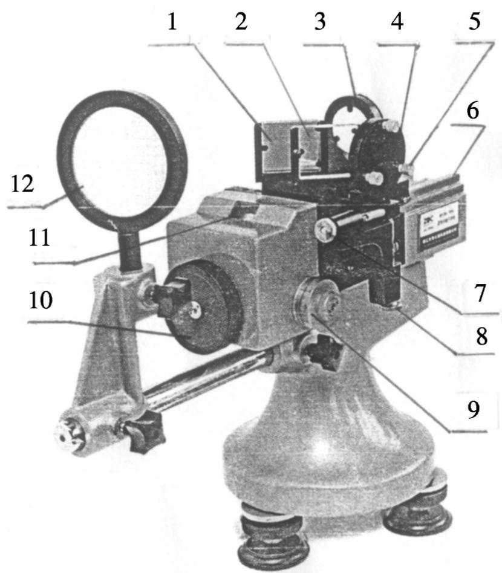
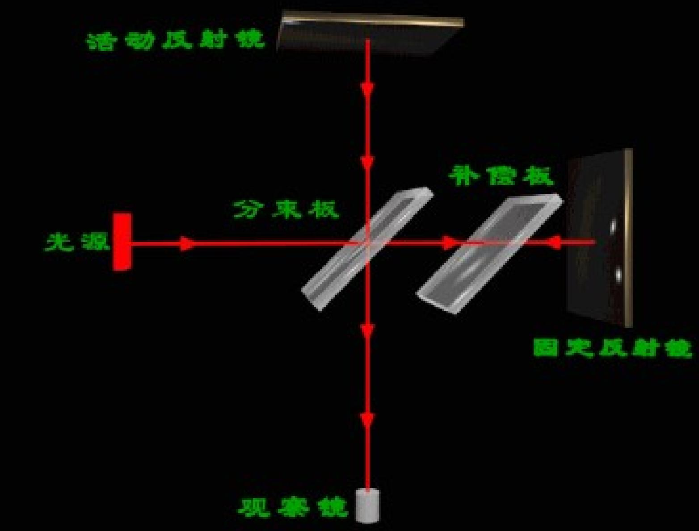
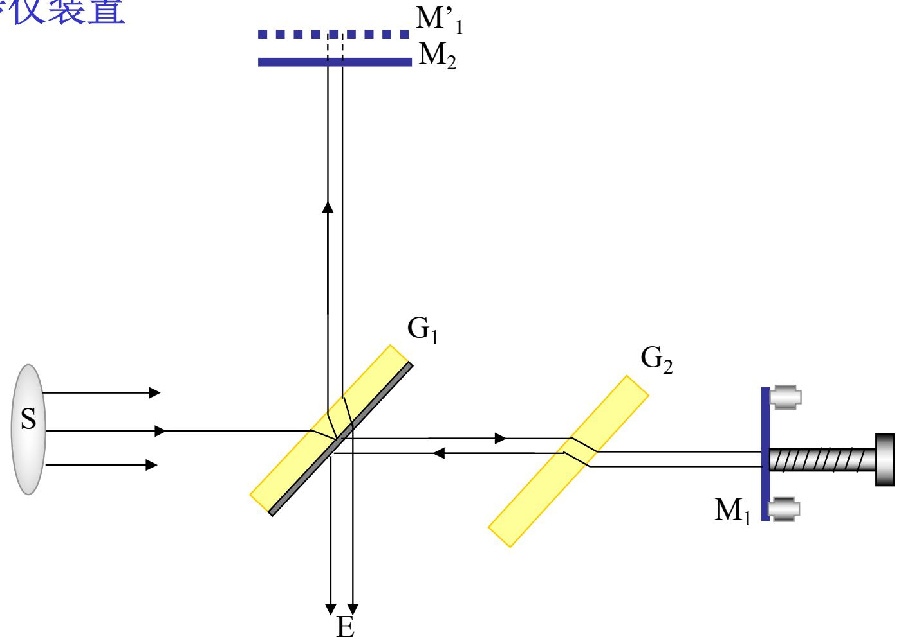
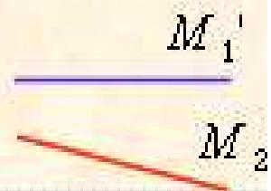
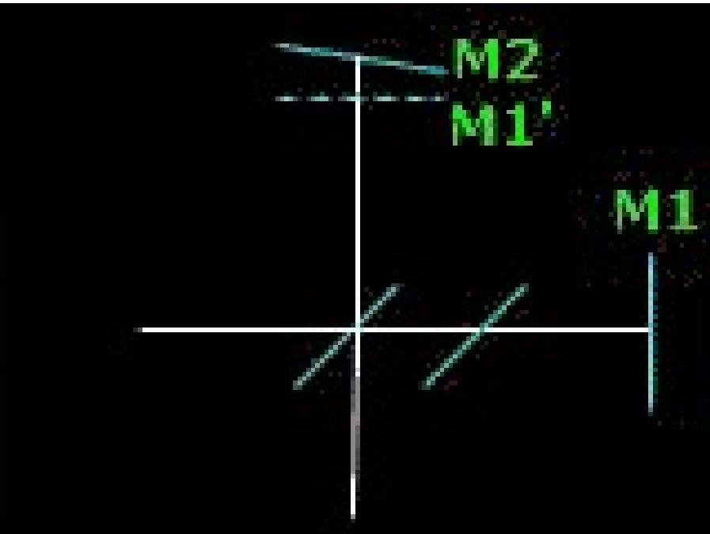
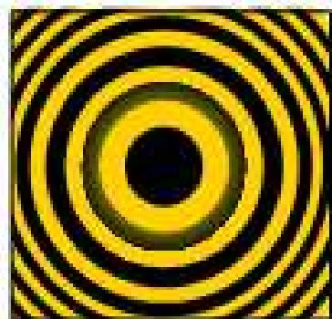
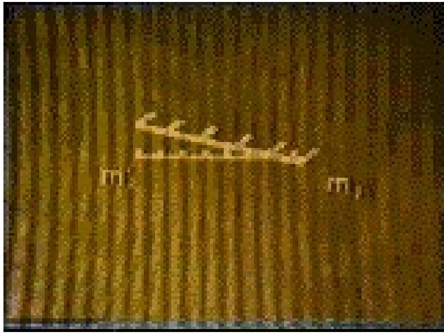

# 4.7.1 ==迈克耳孙干涉仪==装置与工作原理

### 一、 仪器概览

迈克耳孙干涉仪是一种分振幅型干涉仪，由美国物理学家阿尔伯特·迈克耳孙（A.A. Michelson）设计，用于精密测量光程差的微小变化。其主要应用包括：精密测长、光谱线宽度测量、傅立叶变换光谱分析等。

### 二、 装置结构与光路

仪器由以下核心光学元件组成：

- **$M_1$**：可动平面反射镜，由导轨和微调机构控制，可沿光轴方向精密平移
- **$M_2$**：固定平面反射镜，位置固定，通过调节螺丝可微调倾斜角度
- **$G_1$**（分束器/分光板）：厚度和折射率均匀的玻璃板，背面镀有半透半反银膜，以45°角放置在光路中
- **$G_2$**（补偿板）：与 $G_1$ 完全相同的玻璃板，但无银膜，以相同角度平行放置在 $G_1$ 旁

### 三、 工作原理
｜
**分光过程**：光源 $S$ 发出的光射到分束器 $G_1$ 上，$G_1$ 背面的半透半反银膜将入射光分成两束：
- 光束1：在银膜上**透射**，射向可动镜 $M_1$
- 光束2：在银膜上**反射**（方向转90°），射向固定镜 $M_2$

**反射与合束**：两束光分别被 $M_1$ 和 $M_2$ 反射回来，再次经过 $G_1$：
- 光束1反射回来后在银膜上**反射**，射向观察点 $E$
- 光束2反射回来后在银膜上**透射**，射向观察点 $E$

两束光在 $E$ 处相遇，由于来自同一原始光源、走过了不同长度的光路，二者之间存在光程差，从而发生干涉，在 $E$ 处形成干涉条纹。

**补偿板的作用**：光束1在整个过程中只穿过 $G_1$ 玻璃一次（去时透射，返回时反射，未再穿过），而光束2在往返两段路程中都穿过了 $G_1$ 的玻璃（去时反射，返回时透射，共穿过玻璃 3 次）。为了补偿这个不对称性（因为玻璃中的传播速度慢于空气），在光束1的光路中额外插入与 $G_1$ 完全相同（但无银膜）的补偿板 $G_2$，使两束光在玻璃中的光程完全相同，从而消除由玻璃材料引入的额外光程差。这样，两束光的光程差就完全由 $M_1$ 和 $M_2$（及其虚像）的位置决定。

### 四、 等效的"虚拟薄膜"模型

$G_1$ 在光束2的路径中作为一面镜子，因此，从光束1的方向看，$G_1$ 将 $M_2$ 成像为一个虚镜 $M_2'$（$M_2$ 关于 $G_1$ 银膜面的对称像）。

等效地，迈克耳孙干涉仪产生的干涉**等价于** $M_1$ 和 $M_2'$ 之间的**等效空气薄膜**（或气隙）产生的干涉：

- 若 $M_1 \parallel M_2'$（两镜精确平行），气隙厚度均匀，产生**等倾干涉**（点光源照射时为等倾圆环）

- 若 $M_1$ 与 $M_2'$ 有微小夹角，气隙厚度线性变化，形成**楔形气隙**，产生**等厚干涉**（平行直条纹）

### 五、 两束光的光程差

设 $M_1$ 与 $G_1$ 的距离为 $l_1$，$M_2$ 与 $G_1$ 的距离为 $l_2$（经 $G_2$ 补偿后，两束光在玻璃中光程已抵消），则等效气隙厚度 $d = l_1 - l_2$（两臂长之差），两束光的光程差为：

$$\Delta L = 2(l_1 - l_2) = 2d$$

（对于准直光正入射时）

当 $M_1$ 沿轴方向平移距离 $l$ 时，光程差变化 $\delta(\Delta L) = 2l$，导致干涉场中的亮暗条纹移动。每移动 $M_1$ 一段距离使光程差变化 $\lambda$，即平移 $l = \lambda/2$ 时，观察到一个条纹的明暗变化（一个"计数"）。

> **结论**：迈克耳孙干涉仪通过分束器 $G_1$ 将光分成两路，分别由 $M_1$（可动）和 $M_2$（固定）反射，再合束干涉。补偿板 $G_2$ 消除了两束光在玻璃中的非对称光程差。等效地，干涉由 $M_1$ 和 $M_2$ 在 $G_1$ 中的虚像 $M_2'$ 之间的气隙产生。改变 $M_1$ 的位置，就改变了两路光程差，从而改变干涉条纹。
